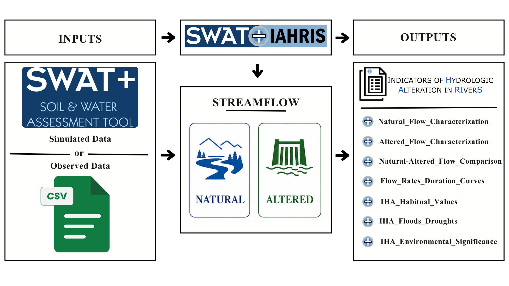
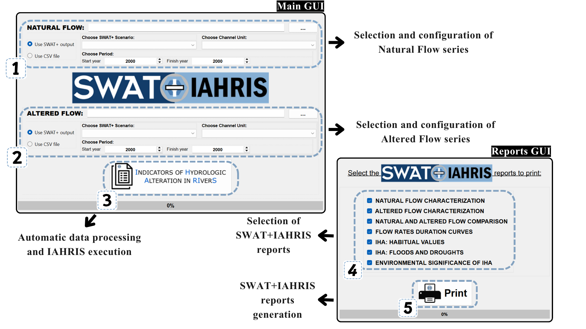

<h1 align="center">
   
  
   
</h1>

<h4 align="center">
  SWAT+IAHRIS links SWAT+ daily streamflow outputs with IAHRIS to automatically generate reports on indicators of hydrologic alteration.
</h4>

# SWAT+IAHRIS

SWAT+IAHRIS is a standalone, open-source software tool designed to automatically couple daily streamflow outputs from SWAT+ with the IAHRIS framework for assessing hydrologic alteration in river systems. The tool has been integrated into the SWAT+ environment since version 3.1 of SWAT+ Editor, providing a direct connection between SWAT+ simulations and IAHRIS-based diagnostic analyses. It helps users generate consistent, reproducible hydrologic alteration reports.

The tool allows users to select daily simulated streamflow series from any channel generated within a SWAT+ model. These series can be extracted from different scenarios or time windows and assigned as either the natural flow regime or the altered flow regime, depending on the objective of the analysis. This makes it possible to compare baseline and impacted scenarios, regulated and unregulated conditions, or different future climate periods within the same modelling workflow.

SWAT+IAHRIS also supports observed streamflow data supplied through CSV files, allowing measured records to be used together with, or instead of, simulated SWAT+ outputs.

## Overview

Watch this video for an introduction to SWAT+IAHRIS and how it can be used to assess hydrologic alteration in rivers from SWAT+ outputs:

  

## Main capabilities

- Supports natural and altered flow series from SWAT+ scenarios or external CSV files.
- Allows scenario, channel, and analysis-period selection for both flow regimes.
- Formats daily streamflow data according to IAHRIS input requirements.
- Runs IAHRIS in the background and organizes the generated outputs.
- Produces structured Excel reports for post-processing, visualization, and reporting.
- Reduces transcription and formatting errors in IAHRIS workflows.

## Workflow

**Fig. 1. Conceptual workflow of SWAT+IAHRIS.**

Internally, SWAT+IAHRIS extracts the required daily flow data from SWAT+ output files, converts them to the IAHRIS input format, and launches IAHRIS automatically. After IAHRIS completes the evaluation, SWAT+IAHRIS organizes the results into thematic Excel reports.

**Fig. 2. Main steps to generate IAHRIS reports with SWAT+IAHRIS.**

The main graphical interface is organized around the two flow conditions required by IAHRIS: **Natural Flow** and **Altered Flow**. Each block lets the user define the source of the corresponding daily discharge series, either by selecting outputs from a SWAT+ simulation or by importing an external CSV file. This design makes it possible to compare flow series from different SWAT+ scenarios, channels, and time windows, and to combine simulated and observed datasets within the same IAHRIS assessment.

## Input data

SWAT+IAHRIS can use two input sources for each flow regime:

- **SWAT+ output:** select a SWAT+ `Scenarios` folder from a completed SWAT+ Editor simulation with daily channel outputs activated. Then select the scenario, channel unit, start year, and finish year. Daily streamflow is read from `Results/swatplus_output.sqlite`, using the `channel_sd_day` table and the `flo_out` field.
- **CSV file:** provide an external daily streamflow series with two columns named `Date` and `Flow`. Records must be continuous, gap-free, ordered chronologically, and contain no negative flow values. The `Date` column should use forward slash separators in `mm/dd/yyyy` format, and the `Flow` column should contain numerical discharge values using a dot as the decimal separator.

Selected series can be assigned as either Natural Flow or Altered Flow according to the analysis objective. Both the natural and altered analysis periods must cover at least 15 consecutive years. SWAT+IAHRIS checks the required CSV structure, daily frequency, missing values, and negative values before processing.

## Steps to follow

1. Run the SWAT+ model in SWAT+ Editor and activate daily channel outputs, or prepare the external daily CSV files.
2. Open SWAT+IAHRIS and select the SWAT+ project `Scenarios` folder or the external files to be used.
3. Define the Natural Flow and Altered Flow series by choosing their data source: SWAT+ output or CSV file.
4. For SWAT+ outputs, select the corresponding scenario, channel unit, start year, and finish year.
5. For CSV files, load the external daily streamflow file and specify the analysis period.
6. Generate the IAHRIS assessment. SWAT+IAHRIS extracts the selected daily discharge series, verifies their temporal structure, formats them according to IAHRIS requirements, and runs IAHRIS automatically.
7. Use the report window to export the thematic Excel reports for interpretation and documentation.

## Output reports

SWAT+IAHRIS exports the IAHRIS results in `.xlsx` format. The progress bar reports the status of the process while the assessment is running. Once all input data have been processed, SWAT+IAHRIS filters and organizes the IAHRIS workbook into seven thematic report categories:

| Category | Output workbook |
| --- | --- |
| Natural flow characterization | `SWATPlus-IAHRIS_Natural_Flow_Characterization.xlsx` |
| Altered flow characterization | `SWATPlus-IAHRIS_Altered_Flow_Characterization.xlsx` |
| Natural-altered flow comparison | `SWATPlus-IAHRIS_Natural-Altered_Flow_Comparison.xlsx` |
| Flow-duration curves | `SWATPlus-IAHRIS_Flow_Rates_Duration_Curves.xlsx` |
| Hydrologic alteration indicators: habitual values | `SWATPlus-IAHRIS_IHA_Habitual_Values.xlsx` |
| Hydrologic alteration indicators: floods and droughts | `SWATPlus-IAHRIS_IHA_Floods_Droughts.xlsx` |
| Environmental significance of hydrologic alteration | `SWATPlus-IAHRIS_IHA_Environmental_Significance.xlsx` |

## Hydrological parameters (P)

The IAHRIS methodological reference defines 19 parameters (`P1` to `P19`) for characterizing the flow regime.

**Table 1. Hydrological parameters calculated by IAHRIS.**

| Aspect | Hydrological parameter | Description |
| --- | --- | --- |
| Habitual flow values | P1 | Magnitude of monthly and annual flow contributions |
| Habitual flow values | P2 | Extreme variability |
| Habitual flow values | P3 | Seasonality of maximum and minimum flows |
| Habitual flow values | P4 | Habitual variability |
| Floods | P5 | Magnitude of maximum floods |
| Floods | P6 | Magnitude of the channel-forming discharge |
| Floods | P7 | Magnitude of the connectivity discharge |
| Floods | P8 | Magnitude of habitual floods |
| Floods | P9 | Variability of maximum floods |
| Floods | P10 | Variability of habitual floods |
| Floods | P11 | Duration of floods |
| Floods | P12 | Seasonality of floods: one value for each month |
| Droughts | P13 | Magnitude of extreme droughts |
| Droughts | P14 | Magnitude of habitual droughts |
| Droughts | P15 | Variability of extreme droughts |
| Droughts | P16 | Variability of habitual droughts |
| Droughts | P17 | Duration of droughts |
| Droughts | P18 | Number of days with zero flow: one value for each month |
| Droughts | P19 | Seasonality of droughts: one value for each month |

## Hydrological alteration indicators (IAH)

IAHRIS calculates hydrological alteration indicators by comparing altered and natural flow-regime parameters. For coetaneous series with at least 15 common years, IAHRIS uses `IAH1` to `IAH21`. For non-coetaneous analyses, IAHRIS also defines additional habitual-flow indicators for magnitude and variability.

**Table 2. Hydrological alteration indicators calculated by IAHRIS.**

| Aspect | Attribute | Indicator | Denomination |
| --- | --- | --- | --- |
| Habitual flow values | Magnitude | IAH1 | Magnitude of annual flow contributions |
| Habitual flow values | Magnitude | IAH2 | Magnitude of monthly flow contributions |
| Habitual flow values | Magnitude | M3* | Magnitude of monthly flow contributions: one value for each month |
| Habitual flow values | Variability | V1* | Variability of annual flow contributions |
| Habitual flow values | Variability | V2* | Variability of monthly flow contributions |
| Habitual flow values | Variability | V3* | Variability of monthly flow contributions: one value for each month |
| Habitual flow values | Variability | IAH3 | Habitual variability |
| Habitual flow values | Variability | IAH4 | Extreme variability |
| Habitual flow values | Seasonality | IAH5 | Seasonality of maximum flows |
| Habitual flow values | Seasonality | IAH6 | Seasonality of minimum flows |
| Floods | Magnitude and frequency | IAH7 | Magnitude of maximum floods |
| Floods | Magnitude and frequency | IAH8 | Magnitude of the channel-forming discharge |
| Floods | Magnitude and frequency | IAH9 | Magnitude of the connectivity discharge |
| Floods | Magnitude and frequency | IAH10 | Magnitude of habitual floods |
| Floods | Variability | IAH11 | Variability of maximum floods |
| Floods | Variability | IAH12 | Variability of habitual floods |
| Floods | Duration | IAH13 | Duration of floods |
| Floods | Seasonality | IAH14 | Seasonality of floods: one value for each month |
| Droughts | Magnitude and frequency | IAH15 | Magnitude of extreme droughts |
| Droughts | Magnitude and frequency | IAH16 | Magnitude of habitual droughts |
| Droughts | Variability | IAH17 | Variability of extreme droughts |
| Droughts | Variability | IAH18 | Variability of habitual droughts |
| Droughts | Duration | IAH19 | Duration of droughts |
| Droughts | Duration | IAH20 | Number of days with zero flow: one value for each month |
| Droughts | Seasonality | IAH21 | Seasonality of droughts: one value for each month |

`M3*`, `V1*`, `V2*`, and `V3*` correspond to additional indicators used for non-coetaneous habitual-flow analyses in the IAHRIS methodological reference.

## Report interpretation

To support interpretation of the generated Excel reports, the project also provides the [SWAT+IAHRIS Report Analyst](https://chatgpt.com/g/g-6a25485109dc8191ab3fb5c17c83484b-swat-iahris-report-analyst), a specialized assistant for reviewing SWAT+IAHRIS outputs. It can help compare natural and altered flow regimes, identify hydrologic alteration patterns, interpret IAHRIS indicators, and generate scientific insights from the report workbooks. Any questions about hydrological parameters (P), hydrologic alteration indicators (IAH), or report interpretation can be addressed with the SWAT+IAHRIS Report Analyst.

## License

SWAT+IAHRIS is distributed under the GNU General Public License v3.0 or later. See [LICENSE](LICENSE) for details.
