**A                                         RÉGIMEN NATURAL DE CAUDALES Y ECOSISTEMA FLUVIAL**

<strong>A.1.</strong> <strong><u>CONCEPTOS BÁSICOS_</u></strong>

El régimen natural de caudales de un río (<strong>RNC</strong>) es el resultado de la integración de todos los factores, procesos y sinergias de su cuenca: clima, topografía, geología, suelos, vegetación, tamaño y forma de la cuenca, tipología de la red de drenaje, usos del suelo, etc. (Baker <em>et al.</em>, 2004).

Algunos de los factores citados anteriormente se caracterizan por su estabilidad en el tiempo, tal es el caso de la geología. Los usos del suelo, por el contrario, pueden experimentar cambios espectaculares en períodos muy breves, consecuencia de incendios, deforestaciones, o urbanizaciones del terreno. Indudablemente estos cambios afectarán al régimen hidrológico, alterando las pautas de infiltración y escorrentía en la cuenca y traduciéndose en modificaciones en los caudales de avenida, en los tiempos de concentración, etc.

En este trabajo, entendemos como **RNC** el que de forma natural circularía por el cauce, aceptando la complejidad y variabilidad de todos los factores implicados, en contraposición a otros regímenes, a los que podemos denominar alterados, obtenidos al modificar el régimen natural mediante una regulación y/o detracción directa de caudales desde el cauce.

Conviene matizar también el significado de ecosistema fluvial, o empleando un término más sencillo, el significado de **río.** Al hablar de un río, nos estamos refiriendo a todos los componentes, funciones y procesos existentes tanto en el cauce como en la zona riparia, la llanura de inundación y el acuífero asociado.

Estos cuatro ámbitos, cauce, ribera, llanura y acuífero forman un sistema abierto y dinámico, estable en el tiempo, con flujos de materia y energía bidireccionales según tres ejes principales: longitudinal – a lo largo del cauce-, transversal – conectando cauce, ribera y llanura - y vertical – relacionando el cauce con el freático-.

La vinculación entre estos ámbitos y el régimen de caudales es estrechísima, y hoy en día existe un acuerdo casi general dentro de la comunidad científica en afirmar que el <strong>RNC</strong> es el principal agente organizador del ecosistema fluvial: las avenidas extraordinarias y ordinarias, las sequías normales, las sequías extremas y los valores habituales del <strong>RNC</strong>, todos ellos, con sus propias pautas de estacionalidad, duración y variabilidad inter e intranual, se aúnan, se imbrican para dar forma al <em>paisaje fluvial.</em>

Cada uno de los rasgos de este <em>paisaje</em>, por ejemplo, la anchura del cauce, el tamaño y forma del sedimento, el predominio de macrófitas en un recodo, la riqueza en odonatos de un rápido, las aves que nidifican en un soto, o las truchas que acuden a frezar a un enclave determinado, pueden estar más fuertemente condicionados por un aspecto concreto del <strong>RNC</strong>, pero es la conjunción de todos ellos, la que conforma el río y modela su biocenosis.

Es tal la complejidad de las interacciones entre el **RNC** y el ecosistema fluvial que su estudio debe ser realizado a diferentes escalas espaciales y temporales (Bunn y Arthington, 2002).

Las ideas que se presentan a continuación sólo pretenden asomar al lector a la increíble ventana de este entramado:

**LA IMPORTANCIA DE LA DINÁMICA MORFOLÓGICA**

La morfología de un río representa la respuesta del mismo a las entradas de masa -caudal líquido y caudal sólido- y energía -definida por la pendiente del valle sobre el que discurre el cauce-, Fernández Yuste (2003).

El río va ajustando esta energía con la forma en planta, dibujando curvas y meandros, o conformando una sucesión de saltos y pozas en la búsqueda continua de un equilibrio entre la pendiente disponible y el caudal líquido y sólido a transportar.

Las curvas de un río no son formas caprichosas. Responden a una finalidad muy concreta: con el meandreo el río consigue que la pendiente real que encuentra el flujo sea inferior a la del valle. Las formas rectas, trenzadas y anastomosadas de nuestros ríos son también respuestas en la búsqueda continua de ese equilibrio.

Múltiples variables morfológicas como la anchura del cauce, la superficie mojada, el espacio medio entre rápidos y remansos, la granulometría de los materiales transportados y de los que conforman el lecho, pueden expresarse en función de los caudales circulantes tal y como lo recogen las ecuaciones clásicas de morfología fluvial (Knighton, 1998).

Si bien esta morfología y su dinámica son en sentido estricto la parte abiótica del sistema fluvial, su papel en la definición y conformación de los componentes bióticos es incuestionable pues marca las pautas cuantitativas y cualitativas de su biotopo.

De todos los componentes del **RNC** son los caudales máximos o avenidas los que poseen una mayor significación geomorfológica.

Las avenidas son críticas en la conformación y estabilidad del cauce, manteniendo su morfología en un equilibrio dinámico, tanto en sección como en planta. Los caudales máximos garantizan la conectividad en sentido transversal con la llanura de inundación posibilitando un flujo bidireccional no sólo de agua, también de organismos, sedimentos, propágulos y nutrientes, estimulando la creación y rejuvenecimiento de canales y pozas laterales, la formación de barras, etc. La magnitud, variabilidad y duración de las avenidas tiene implicaciones en la granulometría de los materiales transportados y sedimentados a lo largo del corredor fluvial, en la remoción del lecho y en el mantenimiento de las transferencias con el freático.

En la mayoría de los casos, la alteración del **RNC** por la regulación de caudales supone la reducción en la magnitud y frecuencia de las avenidas y un cambio en su estacionalidad.

La construcción de la presa Gen Canyon (Colorado, EE. UU.) en 1963 ha privado de avenidas estacionales a cerca de 430 km de río, entre los cuales se incluye el Parque Nacional del Gran Cañón, pasando de caudales pico de 2400 m3/s por deshielo a tan sólo 500 m3/s, a lo que hay que unir la retención en la presa de casi el 95% de los sedimentos transportados (Collier <em>et al</em>., 1997). Esta alteración del régimen hidrológico y sedimentológico ocasionó la reducción en la proporción de zonas de aguas someras y bajas velocidades necesarias para los peces en su fase juvenil. También la reducción en los caudales punta propició la expansión de la vegetación riparia en zonas sometidas con anterioridad a fuertes erosiones, estrechándose el cauce y aumentando progresivamente la expansión de especies foráneas (<em>Tamarix sp</em>.). Tras la implementación en 1996 de un régimen de avenidas (un 35% de la avenida natural de primavera) se constató un incremento en el tamaño de las barras y zonas de arena con los consiguientes efectos secundarios en la fauna y la vegetación.

La regulación del río Danubio mediante dos grandes presas (Pinay *et al*., 2002) ha originado graves problemas de estabilización del cauce, acentuándose los procesos erosivos hasta 1000 km aguas abajo, desestabilizándose el régimen sedimentológico del cual dependía la dinámica del delta que a raíz de ello sufre un continuo proceso de erosión por las corrientes del Mar Negro.

**LA IMPORTANCIA DE LA DIVERSIDAD DE HÁBITATS**

En un río diversidad hidráulica es sinónimo de biodiversidad.

Los diferentes hábitats existentes (Richter y Richter, 2000), han sido creados por un amplio abanico de caudales. De este modo, la diversidad inter e intranual del **RNC** garantiza la diversidad biótica, su dinamismo y permanencia.

Así las avenidas de pequeña magnitud son fundamentales para: asegurar los procesos de limpieza y revitalización del sustrato; mantener unas adecuadas condiciones en el medio hiporreico; asegurar su diversidad granulométrica; y posibilitar la secuencia rápido-remanso en el eje fluvial.

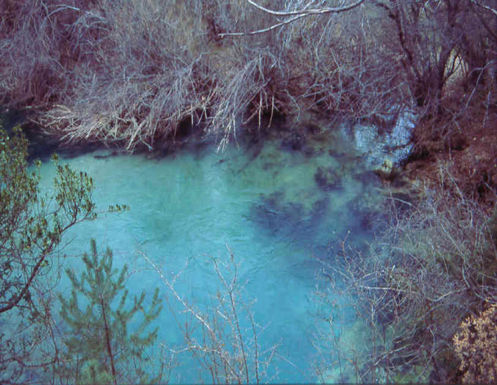

También son importantes los caudales extraordinarios con recurrencia de décadas o periodos superiores, los cuales pueden arrancar árboles y transportar grandes restos vegetales, que una vez depositados en el cauce contribuyen a mantener la diversidad hidráulica y a la creación de hábitats cruciales para muchas especies (Gippel, 1995).

Los valores mínimos del **RNC** también juegan un papel decisivo a nivel de microhábitat en tanto que pueden afectar a la potencialidad del medio hiporreico, a sus condiciones hidráulicas y a la calidad del agua. Estos caudales mínimos pueden llegar a limitar la transitabilidad longitudinal en el río y propiciar condiciones críticas a las que sólo las especies nativas están adaptadas. De esto modo, los valores más extremos del RNC funcionan como barrera frente a la intromisión de especies más eurióicas.

Las relaciones entre granulometría, flujo y biota son múltiples. La velocidad del agua en la proximidad del lecho, los esfuerzos cortantes, la turbulencia y la estabilidad son los factores de mayor trascendencia desde el punto de vista biológico, condicionando la abundancia y diversidad del bentos y de la ictiofauna dependiente (Sedimentation Comittee, 1992). Aunque los requerimientos varían con la edad y especie, las características granulométricas son cruciales para los peces en fases tan críticas como la freza y el alevinaje.

La regulación por embalses puede alterar la dinámica natural de transición en el lecho del cauce, afectando a la distribución relativa de un hábitat frente a otro, a su estabilidad o a las características del medio hiporreico, fundamentalmente por sedimentación o colmatación de los huecos intersticiales. En otras ocasiones, la regulación del régimen produce un acorazamiento por falta de caudales de envergadura suficiente para movilizar los elementos más gruesos. La consecuencia final es la afección al eslabón primario en la cadena trófica de un río, el bentos, que ve reducido su hábitat disponible.

Steinbacher (2003) ha estudiado los efectos de la alteración del régimen de caudales sobre la heterogeneidad del hábitat: en general la regulación inducida por una presa supone una pérdida de variabilidad que se traduce en el declive de muchas especies acuáticas y riparias.

En Willamette River (EE. UU.) el bosque ripario vio reducida su extensión de 250 a 64 km en unos 100 años. Esta alteración fue crítica para el funcionamiento del río, pues la vegetación regulaba la erosión y la sedimentación, la entrada de nutrientes, la calidad del agua y la productividad del ecosistema. La pérdida del bosque ripario supuso la pérdida de hábitat para muchas especies existentes en la zona y la pérdida de biodiversidad para el río.

**LA IMPORTANCIA DE LA SINCRONÍA CON LOS CICLOS VITALES**

Muchos procesos vitales se producen como respuesta a unas condiciones ambientales de sincronía entre temperatura, duración del día y condiciones hidrológicas, de modo que una alteración en el régimen que rompa dicha armonía puede impactar negativamente sobre la biota.

Respecto a ciertas avenidas es crucial el momento del año en que se producen, pues actúan como llamada para la reproducción de muchas especies: Bunn y Arthigton (2002) recogen como en amplias llanuras de inundación, muchas especies acuáticas, desde macroinvertebrados, zooplancton, fitoplancton y peces, son "avisadas" por los caudales extraordinarios, emergiendo desde sus estadios de reposo en respuesta a este aumento en la cota de lámina de agua.

Poff *et al*. (1997) constatan como en Arizona la alteración en la estacionalidad de los caudales, desde primavera a verano, época donde en tramos regulados se requieren mayores detracciones para riego, ha supuesto que los caudales punta tengan lugar después de la germinación y no antes (como sucedía en régimen natural), perjudicando la regeneración de la especie nativa *Populus fremontii* y favoreciendo a aquellas exóticas como *Tamarix sp.,* con requerimientos menos específicos.

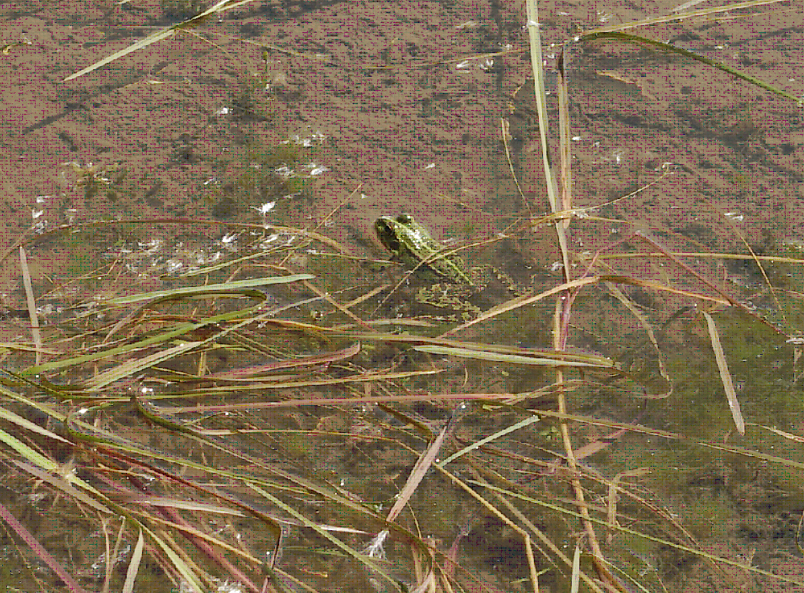

La duración de las inundaciones también es crítica pues determina cómo y durante cuanto tiempo está garantizada la conectividad longitudinal y transversal. Según la duración de estos eventos, los peces pueden acceder a lugares de cría y retornar al cauce principal o quedar aislados en pequeñas pozas. El aislamiento en enclaves desconectados del curso principal puede suponer tasas altas de mortalidad, pues las características físico-químicas del agua se deterioran, los recursos alimenticios escasean y la presión de los predadores se incrementa.

Son conocidas las diferentes tolerancias de muchas especies vegetales a la duración de las inundaciones (stress por anoxia, Kozlowski, 1984) y de las comunidades de macroinvertebrados y peces a la duración de la sequía (Poff *et al*., 1997). Richter y Richter (2000) establecen para el río Yampa (EE. UU.) relaciones entre duración y magnitud de las inundaciones para que no se produzcan cambios sustanciales en la dinámica del bosque ripario. Pinay *et al.*, (2002) constatan las relaciones existentes entre la duración, magnitud y frecuencia de las avenidas y sequías y el ciclo del nitrógeno, dado que los procesos implicados son muy sensibles al nivel de oxido-reducción existente en el suelo.

Strange *et al.* (1999) recoge como en South Platte River (EEUU), las avenidas promueven la dispersión de las semillas de *Populus deltoides*, las cuales son viables durante un corto período de tiempo requiriendo unas condiciones de humedad adecuadas en el suelo, no tolerando la cubierta y necesitando alcanzar un crecimiento radical lo suficientemente profundo para garantizar su supervivencia cuando el nivel freático descienda. Tras la regulación del tramo y la consiguiente afección al régimen de avenidas se observó la proliferación de especies introducidas como *Eleagnus angustifolia*, más tolerante a la sombra. Además, su diseminación se produce durante el verano y las semillas mantienen su capacidad germinativa durante meses en un amplio rango de condiciones de humedad y cubierta. También se hace constar la expansión de *Tamarix spp*., poseedoras de un sistema radical potente que las hace menos vulnerables frente al descenso del freático debido a la regulación.

Los efectos en cascada son difíciles de predecir y esta alteración del bosque ripario afectó indirectamente a las comunidades que lo habitaban: en South Platte River (EEUU) se constató la pérdida de al menos cuatro especies autóctonas de aves por hibridación con congéneres exóticos. Las causas pueden ser múltiples y estrechamente relacionadas: pérdida de lugares adecuados para la nidificación, desaparición de ciertas especies de insectos que constituían el alimento principal, etc.

Las tasas de crecida y defluencia de los caudales circulantes deben también guardar sincronía con la capacidad de respuesta de los organismos. Arthington (2002) señala hasta un 14% de pérdida de biomasa en la comunidad béntica por bruscos incrementos de caudal.

En Haweai River (Nueva Zelanda) Jowett (2000) señala como bruscas detracciones de caudal produjeron un detrimento del 40-90% en la abundancia de todos los grupos taxonómicos de macroinvertebrados, excepto en *Mollusca* que experimentó un crecimiento de hasta el 30%.

Un apartado especial merece la alteración que se produce como consecuencia de la regulación de caudales en el régimen de temperaturas y nutrientes y sus efectos en la biología de muchas especies. Esta situación es claramente perceptible aguas abajo de grandes presas con nivel de descarga bajo el hipolimnion, o donde el retorno de aguas de riego o residuales, ricas en nutrientes, favorecen a unas especies en detrimento de otras (Strange *et al*., 1999; Pinay *et al*., 2002).

**LA IMPORTANCIA DE LA COMPETENCIA NO EXCLUYENTE**

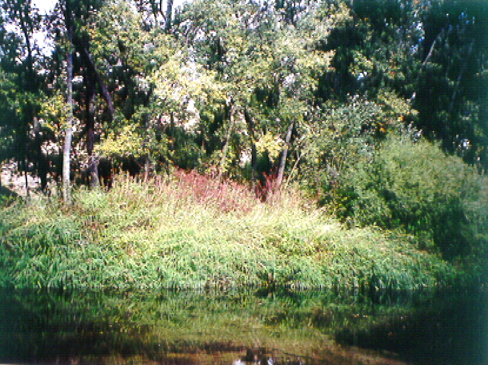

Es un hecho que las especies autóctonas evolucionan en respuesta a las características del **RNC**. Por consiguiente, en aquellos tramos con regímenes alterados es fácil que se produzca un desplazamiento de las especies autóctonas por otras menos exigentes o restrictivas.

Cobo (2000) fundamenta la estabilidad de los ríos en su complejidad física y biológica. Si esta complejidad se rompe o empobrece, el sistema se hace cada vez más inestable y alteraciones que antes eran fácilmente amortiguadas pueden vencer ahora la capacidad de homeostasis del ecosistema produciendo daños irreversibles.

Naiman *et al*. (2002) ofrece datos alarmantes en Mobile River (EE. UU.) donde 16 especies de moluscos nativos están prácticamente extinguidas como consecuencia de la regulación.

<strong>A.2.</strong> <strong><u>EL PARADIGMA DEL RÉGIMEN DE CAUDALES</u></strong>

El nivel de conocimiento actual permite por tanto concluir que el régimen de caudales es el elemento vertebrador de los ecosistemas fluviales, estructurando tanto el medio acuático como el ripario, modelando sus condiciones ambientales y posibilitando la variedad de hábitats y el dinamismo en sus interacciones (Poff *et al*., 1997; Strange *et al.,* 1999; Arthington, 2002; Bunn y Arthington, 2002; Naiman *et al.,* 2002; Nilsson y Svedmark, 2002):

- El régimen natural de caudales es el principal agente **estructurador del hábitat físico**, el cual a su vez condiciona la riqueza y diversidad en especies.
- Las alteraciones en el régimen natural de caudales pueden suponer la **alteración en los ciclos de vida** de numerosas especies.
- El mantenimiento de la **conectividad longitudinal y transversal** es fundamental para garantizar la dinámica poblacional y la supervivencia del ecosistema.
- La alteración del régimen natural favorece la **intromisión** y el éxito en el establecimiento de **especies exóticas.**

Poff <em>et al</em>. (1997) en el denominado <strong>paradigma del régimen natural de caudales</strong> sintetiza brillantemente estas ideas:

<em><strong>"el rango completo de variación intra e interanual del régimen hidrológico con sus características asociadas de estacionalidad, duración, frecuencia y tasa de cambio, son críticas para sustentar la biodiversidad natural y la integridad de los ecosistemas acuáticos"</strong></em> <strong>(Figura nº1):</strong>

**Figura nº 1.-** Paradigma del Régimen Natural de caudales (basado en Bunn y Arthington, 2002)

**Figura nº 1.-** Paradigma del régimen natural de caudales (basado en Bunn y Arthington, 2002)

**CONECTIVIDAD LATERAL Y LONGITUDINAL**

**BIODIVERSIDAD**

**ACCESO A LA BANDA RIPARIA Y LLANURA DE INUNDACIÓN**

**AVENIDAS EXTRAORDINARIAS**

**Dispersión de semillas,**

**propágulos y organismos acuáticos**

**ESTACIONALIDAD**

**VARIABILIDAD**

**CAUDALES BASE**

**SEQUÍAS**

**CICLOS VITALES**

**COMPOSICIÓN ESTRUCTURA**

**DINÁMICA MORFOLÓGICA**

**SUCESIÓN ALOGÉNICA**

**DIVERSIDAD DE HIDROHÁBITATS**

No obstante, aunque el papel de la hidrología en la generación de biodiversidad es conocido y aceptado, su aplicación en los programas de restauración es aún muy restringida.

En zonas húmedas, Fredrickson (1997) presenta diversas propuestas para gestionar los recursos hídricos en coordinación con la vegetación y fauna silvestre siempre teniendo en cuenta aspectos como la estacionalidad, magnitud y duración de las avenidas.

Poff *et al.* (1997) citan múltiples ejemplos donde la restauración de alguno de los componentes del régimen natural ha ayudado a mejorar tanto los procesos físicos como biológicos del ecosistema:

En el río Oldman (Canadá), la restauración de caudales máximos con defluencias que imitan las naturales ha favorecido la recuperación de la banda riparia (Rood *et al*., 1995)

En el río Ranoke (EE. UU.) la amortiguación de las oscilaciones de caudal producidas por las hidroeléctricas ha incrementado la presencia de juveniles de especies nativas (Rulifson y Manooch, 1993)

En el río Pekos (EE. UU.) la simulación de avenidas de corta duración a raíz de las tormentas de verano ha beneficiado las tasas reproductivas de las especies autóctonas (Robertson, 1997)

En el río Grande (EE. UU.) la restauración de avenidas de gran magnitud que acceden a la llanura de inundación mejoró el ciclo del nitrógeno y la transferencia de nutrientes (Molles *et al*., 1995)

Por consiguiente, el éxito en la conservación de la biodiversidad y funcionalidad de nuestros ríos depende de la capacidad de proteger o restaurar los principales aspectos del <strong>RNC</strong> (Arthington, 1997; Poff <em>et al</em>., 1997; Richter <em>et al</em>., 1998) y de conocer como las variables hidrológicas e hidráulicas interactúan con los procesos biológicos controlando la composición en especies y la funcionalidad de los distintos componentes del ecosistema.

Hoy en día el principal desafío científico-administrativo es buscar unos protocolos de manejo y gestión del agua que respeten, dentro de unos niveles, los rangos de variabilidad del <strong>RNC</strong> en lo que Poff <em>et al.</em> (1997) definen como <strong>una diversidad predecible</strong>.

<strong>A.3.</strong>   <strong><u>LA ALTERACIÓN DEL RNC COMO INDICADOR DEL ESTADO DEL ECOSISTEMA FLUVIAL</u></strong>

En el año 2000 se publicó la Directiva Marco de Aguas (**DMA**) Directiva 2000/60/CE, de 23 de octubre de 2000. Esta Directiva ha supuesto una revolución conceptual respecto a los criterios clásicos de gestión de los recursos hídricos, al plantear como objetivo prioritario la salvaguarda del buen estado ecológico de los ecosistemas vinculados a ellos. Para este fin se hace necesario disponer de protocolos que permitan calificar de manera objetiva, ajustada y eficiente el estado ecológico de ríos, lagos y humedales.

Aceptada la hipótesis del paradigma del régimen de caudales, es inmediato concluir que cualquier intento de analizar el estado de los ecosistemas fluviales debe pasar inexcusablemente por un conocimiento detallado de la alteración del RNC.

La DMA exige, para caracterizar el estado de los ríos, utilizar criterios biológicos, químicos, morfológicos e **hidrológicos**. Se hace necesario por tanto disponer de una herramienta que permita conocer cómo es el régimen natural (condición de referencia) y a partir de este conocimiento evaluar la distorsión que en términos hidrológicos genera cualquier otro régimen distinto a este.

La **Figura nº2** ilustra con claridad esta necesidad, este objetivo.

En dicha figura se representa el hidrograma del río Green (EE. UU.) entre los años 1930-2000. La construcción de una presa en 1963 alteró por completo las pautas de su régimen natural que presentaba unas características propias, muy definidas, en lo que respecta a avenidas y sequías. El carácter más distintivo era la alternancia de un período seco más o menos extremo (de octubre a mayo) con un período húmedo asociado a avenidas de considerable magnitud durante el resto del año.

**Figura nº 2.-** Hidrograma correspondiente al río Green (USA) en el período 1930-2000 (tomada de Lytle y Poff, 2004)

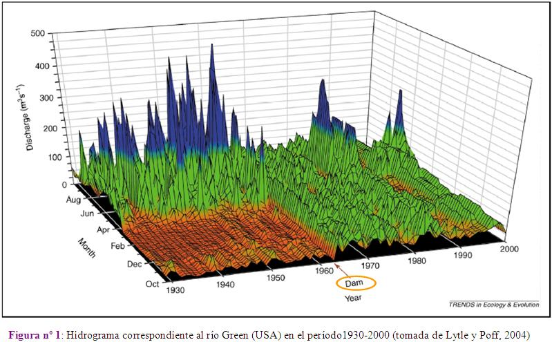

La construcción de la presa alteró por completo las pautas observadas, tanto para avenidas como para sequías, induciendo un nuevo régimen que ni en estacionalidad, magnitud ni frecuencia, guardaba ninguna similitud con el natural. Grandes presas como la de la figura existen más de 45000 a nivel mundial (Gupta, 1998), de las cuáles unas 1200 se encuentran en España (Magdaleno, 2005), donde la acusada mediterraneidad de su régimen de precipitaciones motiva la necesidad de regular los recursos hídricos como garantía de diversos usos y actividades.

Si como se ha comentado, todos los componentes, funciones y procesos del ecosistema fluvial están determinados por las características del régimen natural, ¿que alteraciones sobre el ecosistema se producirán como consecuencia de la puesta en servicio de una presa?  Esta pregunta, ambiciosa en esencia, puede ser desglosada en las siguientes cuestiones parciales:

**¿Cómo podemos evaluar en términos hidrológicos la alteración inducida por el nuevo régimen de caudales?**

**¿Cuál es la sensibilidad del ecosistema frente a estas alteraciones?**

**¿Es posible establecer relaciones entre el agente causante y el efecto?**

**¿Son consistentes estas relaciones?**

**¿Pueden estas relaciones ayudar a predecir cambios en el ecosistema bajo distintas hipótesis de regulación de caudales?**

Ni en España ni en el resto de Europa se dispone de un procedimiento que permita hacer una valoración objetiva de la alteración producida por el aprovechamiento de los recursos hídricos de la red fluvial, y los índices habitualmente utilizados en EE. UU. (Richter *et al*.,1996; 1997; 1998) no contemplan sin embargo las peculiaridades del régimen mediterráneo.

Aceptado el paradigma del régimen de caudales, es coherente evaluar los efectos ambientales que se producen en tramos regulados, valorando la alteración que ha tenido lugar sobre el régimen natural de caudales y/o la que se produciría al considerar diferentes escenarios de usos y gestión de los recursos hídricos.

Con estos antecedentes, y con el fin de establecer una metodología de caracterización del régimen de caudales y de evaluación de la alteración inducida respecto al régimen natural por cualquier otro régimen circulante, se presenta este trabajo, cuyos objetivos parciales se resumen en:

- Seleccionar los **aspecto**s del régimen de caudales con mayor significación ambiental.
- Seleccionar los **parámetros** y variables que permitan caracterizar estos aspectos.
- Definir un conjunto de <strong>índices</strong> que comparen los valores de los parámetros entre las distintas situaciones: régimen natural <em>versus</em> régimen alterado y régimen natural <em>versus</em> los regímenes correspondientes a los distintos escenarios que sirvan para llegar a definir el régimen ambiental propuesto.
- Deducir las implicaciones ambientales de las alteraciones evaluadas

**B                 CARACTERIZACIÓN DEL RÉGIMEN DE CAUDALES**

<strong><u>B.1 ASPECTOS DEL RÉGIMEN CON MAYOR SIGNIFICACIÓN AMBIENTAL</u></strong>

Cada sistema fluvial, y más concretamente cada tramo de río, posee un régimen de caudales propio responsable de sus rasgos, que mantiene su hábitat físico, su diversidad biológica y sus procesos ecológicos.

A la hora de determinar los aspectos de este régimen que poseen mayor significación ambiental, la comunidad científica ofrece también una opinión generalizada en la selección de la magnitud, frecuencia, estacionalidad, duración y tasas de cambio del régimen natural como los aspectos más significativos (Arthington, 1997; Poff *et al*., 1997; Richter *et al*., 1998;)

- **Magnitud:** ya que determina la **disponibilidad** general de agua en el ecosistema.

- **Frecuencia** con la que un evento se produce en un intervalo de tiempo dado: indicativa de la variabilidad en el régimen de caudales y condicionante de la dinámica geomorfológica y ecológica y por ende de la **diversidad.**
- **Duración** o intervalo de tiempo asociado con unas determinadas condiciones de flujo: en situaciones extremas, avenidas y sequías; la duración está íntimamente ligada a los **umbrales de resiliencia** de las diferentes especies.
- **Estacionalidad:** o regularidad con la que ese evento acontece en una época determinada del año. Es un aspecto vinculado estrechamente y en **sincronía** con los ciclos de vida de las especies (fluviales, de estuarios y marinas).
- **Tasas de cambio:** referente a la rapidez con la que se producen los cambios de unas magnitudes a otras, afectando a la **capacidad de respuesta** de la biota.

Estos cinco componentes permiten caracterizar el régimen natural y evaluar en base a ellos la distorsión que cualquier otro régimen distinto del natural producirá en el ecosistema.

Las definiciones anteriormente expuestas nos permiten intuir la trascendencia ambiental del régimen de caudales. Así entendido, una alteración en la magnitud de los caudales circulantes supondrá una alteración en la disponibilidad de hábitat para los organismos dependientes de ese régimen, y una alteración en la estacionalidad de ciertos eventos inducirá un desajuste con los procesos biológicos dependientes. Conocer el régimen de caudales en los aspectos de magnitud, frecuencia, duración, estacionalidad y tasa de cambio es conocer sus posibilidades respecto a disponibilidad de hábitat, diversidad, capacidad de resiliencia y de respuesta y sincronía con los ciclos vitales (**Figura nº3**):

**ECOSISTEMA FLUVIAL**

**Disponibilidad**

**Diversidad**

**Resiliencia**

**Sincronía**

**Capacidad de respuesta**

**RÉGIMEN DE CAUDALES**

**Magnitud**

**Frecuencia**

**Duración**

**Estacionalidad**

**Tasa de cambio**

**Figura nº 3.-** Aspectos hidrológicos del régimen de caudales y su correspondencia en términos ambientales

En esta caracterización del régimen de caudales debe prestarse un interés preferente a los eventos extraordinarios, avenidas y sequías, por ser componentes con una importancia estratégica en el mantenimiento y dinámica del ecosistema.

Es por ello, que el proceso de caracterización del régimen natural de caudales se ha realizado en dos vías paralelas:

- atendiendo a los **valores medios o habituales** como determinantes de la disponibilidad general de agua en el ecosistema.
- atendiendo a los **valores extremos** de dicho régimen: máximos -avenidas- y mínimos –sequías- al representar las condiciones ambientalmente más críticas.

A su vez, cada uno de estos componentes debe ser analizado en aquellos aspectos ambientalmente significativos.

La caracterización de los valores habituales se realizará en dos marcos temporales, (año y mes) y cuando la disponibilidad de datos lo permita, podrá llevarse a cabo la caracterización diaria o a intervalos horarios.

La **Tabla nº1** recoge los aspectos que serán objeto de evaluación para cada uno de los componentes citados.

**COMPONENTE DEL RÉGIMEN NATURAL**

**ASPECTO**

**VALORES HABITUALES**

Valores anuales

- Magnitud

Valores diarios o a intervalos horarios

- Variabilidad

**VALORES EXTREMOS**

Valores máximos

- Magnitud y frecuencia

Valores mínimos

y mensuales

- Variabilidad
- Fluctuaciones diarias

(avenidas)

- Variabilidad

(sequías)

- Estacionalidad
- Duración
- Tasas de crecida y defluencia

**Tabla nº 1.-** Componentes del régimen de caudales y principales aspectos con significación ambiental

<strong><u>B.2 CARACTERIZACIÓN DE LA VARIABILIDAD INTERANUAL</u></strong>

**¿DÓNDE CONSULTAR ESTOS RESULTADOS EN UN ESTUDIO CON IAHRIS?**

Informe nº1 para Régimen natural

Informe nº1a y b para Régimen alterado

Con el objeto de evitar que la variabilidad interanual (característica climática muy acusada en nuestro ámbito mediterráneo) quede enmascarada al trabajar con valores medios calculados sobre la globalidad de los años disponibles, se propone realizar una discriminación previa de los años en base a su aportación anual en tres tipos, denominados "año húmedo", "año medio" y "año seco". Con ello se consigue una caracterización del régimen en lo que respecta a su variabilidad interanual.

El proceso a seguir en esta discriminación se apoya en un estudio de cuartiles (o percentiles de no excedencia) de la serie de aportaciones anuales:

**ESTIMACIÓN DE PERCENTILES DE NO EXCEDENCIA PARA LAS APORTACIONES ANUALES**

<strong>Variable:</strong> 	aportación anual en hm3

**Datos:** 		serie de valores correspondientes a las aportaciones anuales de los **N** años disponibles

**Estimador:**	Percentil de excedencia del suceso que ocupa la posición i (probabilidad de que la variable tome un valor mayor o igual a i) obtenida por la expresión de Weibull= i/(N+1)

Donde:

**i**=	posición que ocupa ese valor en la serie ordenada de mayor a menor, con i=1,2…N

**N** = 	número total de datos en la serie

Para establecer los umbrales de aportación que permitan discriminar los años "húmedos" y los años "secos" se consideran las aportaciones correspondientes a los percentiles de excedencia del 25% y 75%

**CRITERIO PARA LA ASIGNACIÓN DEL "TIPO" DE AÑO**

- Un año será considerado **HÚMEDO** si su aportación es mayor o igual a la aportación correspondiente al tercer cuartil -Q3- de la serie de aportaciones anuales (percentil de excedencia del 25%)
- Un año será considerado **SECO** si su aportación es menor o igual a la aportación correspondiente al primer cuartil -Q1- de la serie de aportaciones anuales (percentil de excedencia del 75%)
- Un año será considerado **MEDIO** si su aportación está comprendida entre las aportaciones correspondientes a los cuartiles Q1 y Q3 (percentiles de excedencia del 75% y 25%)

De este modo aceptando la muestra como representativa del comportamiento de la variable "aportaciones anuales", en cualquier otra muestra los años "medios" aparecerán, como promedio, en el 50% de los casos, mientras que los "húmedos" y "secos" tendrán una presencia media del 25% respectivamente.

Establecidos estos umbrales y trabajando con una serie de **N** años cada año según su aportación anual podrá adscribirse a un tipo determinado.

Este proceso de caracterización de la variabilidad interanual se realiza de modo independiente para el régimen natural (informe nº1) y el régimen alterado (informe nº1a). La aplicación ofrece además de los valores de los cuartiles Q1 y Q3 otros estadísticos descriptivos: mínimo, media, mediana (Q2 o P50%), máximo, rango intercuartílico, coeficiente de variación y coeficiente de asimetría.

<strong><u>B.3 CARACTERIZACIÓN DE LA VARIABILIDAD INTRANUAL</u></strong>

**¿DÓNDE CONSULTAR ESTOS RESULTADOS EN UN ESTUDIO CON IAHRIS?**

Informe nº2x para Régimen natural

Informe nº3x para Régimen alterado

El objetivo de la caracterización de la variabilidad intranual es obtener valores representativos de las aportaciones mensuales para cada régimen, natural y alterado

En primer lugar, cabe preguntarse si la segregación realizada en el epígrafe anterior por "tipo de año" en base a la aportación anual discrimina bien las aportaciones mensuales o si, por el contrario, para un mes determinado no se observan diferencias significativas en las magnitudes representativas (p.e. mediana) correspondientes a los tres tipos de año considerados. Esta última situación es muy posible que se presente; pongamos, por ejemplo, en el mes de agosto. En general la aportación de ese mes respecto a la anual será poco significativa, por lo que prácticamente no influirá en que un año sea húmedo, medio o seco; en otras palabras, podría presentarse un mes de agosto muy seco en el contexto de un año globalmente húmedo, o un agosto singularmente caudaloso en un año al que globalmente correspondiese la condición de seco; no es pues descartable que los registros del mes de agosto correspondientes a años húmedos no presenten diferencias significativas con los de años medios y con los de secos.

En este trabajo se asume que para caracterizar la aportación del mes i correspondiente a cada tipo (húmedo, medio y seco) es necesario: i) prescindir de la discriminación establecida con las aportaciones anuales y, ii) establecer un nuevo criterio que resulte adecuado para cada mes en cuestión.

Para generar esta nueva discriminación se sigue, para cada mes de modo independiente, un proceso similar al realizado con las aportaciones anuales. De ese modo se obtienen los umbrales de aportación mensual para el mes i (con i=octubre, noviembre, …., septiembre) que permiten discriminar, por ejemplo, los octubres "húmedos", "medios" y "secos" considerando las aportaciones mensuales de octubre correspondientes a los percentiles de excedencia del 75% y 25% (cuartiles Q1 y Q3 respectivamente). El proceso se resume en el cuadro siguiente:

**ESTIMACIÓN DE PERCENTILES DE EXCEDENCIA PARA LAS APORTACIONES MENSUALES DEL MES i**

<strong>Variable:</strong> 	aportación mensual (mes i) en hm3

**Datos:** 		serie de valores correspondientes a las aportaciones mensuales (mes i) de los **n** años disponibles.

**Estimadores:**	Percentil de excedencia del suceso que ocupa la posición i (probabilidad de que la variable tome un valor mayor o igual a i) obtenida por la expresión de Weibull= i/(N+1)

Donde:

**i**=	posición que ocupa ese valor en la serie ordenada de mayor a menor, con i=1,2…N

**N** = 	número total de datos en la serie

**CRITERIO PARA LA ASIGNACIÓN DEL "TIPO" DE MES (EN UN MES DETERMINADO)**

- Un mes será considerado **HÚMEDO** si su aportación es mayor o igual a la aportación correspondiente al tercer cuartil -Q3- de la serie de aportaciones mensuales de ese mes (percentil de excedencia del 25%)
- Un mes será considerado **SECO** si su aportación es menor o igual a la aportación correspondiente al primer cuartil -Q1- de la serie de aportaciones mensuales de ese mes (percentil de excedencia del 75%)
- Un mes será considerado **MEDIO** si su aportación está comprendida entre las aportaciones correspondientes a los cuartiles Q1 y Q3 (percentiles de excedencia del 75% y 25%)

Establecidos estos umbrales y trabajando con una serie de **N** años, cada mes según su aportación mensual podrá adscribirse a un tipo determinado.

El proceso de caracterización de la variabilidad intranual concluye estimando una aportación representativa para cada mes y tipo. En principio, esta representatividad podría asumirse con la media mensual, pero la presencia de sesgos apreciables en la variable (aportación mensual) hace más recomendable el empleo de la mediana (Growns y Marsh, 2000).

Si se acepta la muestra como representativa del comportamiento de la variable "aportaciones mensuales del mes i", en cualquier otra muestra los meses "medios" aparecerán, como promedio, en el 50% de los casos, mientras que los "húmedos" y "secos" tendrán una presencia media del 25% respectivamente. Sin embargo, en circunstancias especiales (p.e. ríos temporales, estacionales o efímeros) pueden presentarse distribuciones atípicas de los valores mensuales para un mes o meses determinados (esto ocurre con mayor frecuencia en los meses estivales), donde la proporción de meses tipo húmedo, medio y seco no responde a los patrones normales citados anteriormente. Para esos meses, la aplicación (Informes 2a y 3a) ofrece los valores A/B/C, siendo:

A: nº de meses en la serie con la condición de húmedo

B: nº de meses en la serie con la condición de medio

C: nº de meses en la serie con la condición de seco

Este proceso de caracterización de la variabilidad intranual se realiza de modo independiente para régimen natural (informes nº2 y 2a) y régimen alterado (informes nº3 y 3a). La aplicación ofrece además de los valores de los cuartiles Q1 y Q3 otros estadísticos descriptivos: mínimo, media, mediana (Q2 o P50%), máximo, rango intercuartílico, coeficiente de variación y coeficiente de asimetría. También se ofrecen los resultados de caracterizar la variabilidad extrema (diferencia entre la aportación mensual máxima y mínima en cada año) y la tabla de frecuencias relativas de máximos y mínimos mensuales (probabilidad de que en ese mes se localice la aportación mensual máxima o mínima del año respectivamente).

<strong>B.4</strong> <strong><u>PARÁMETROS PROPUESTOS</u></strong>

**¿DÓNDE CONSULTAR ESTOS RESULTADOS EN UN ESTUDIO CON IAHRIS?**

Informe nº4x para Régimen natural

Informe nº5x para Régimen alterado

El proceso de caracterización del régimen de caudales se concreta en la selección de parámetros adecuados que permitan evaluar de forma clara y precisa cada uno de los aspectos anteriores.

En la **Tabla nº2** se recogen los 19 parámetros (**P1-P19**) que permiten la caracterización del régimen y que pueden ser obtenidos con IAHRIS.

Estos 19 parámetros se completan con la caracterización de dos aspectos más (cuyo cálculo no incluye la versión 4.0 del software):

1. La fluctuación diaria obtenida a partir de datos de caudales a intervalos horarios o menores.
2. Las tasas de crecida y decrecida de las venidas, tasas que deben obtenerse para los diferentes tipos de avenidas consideradas en este trabajo.

En epígrafes posteriores se expone el procedimiento a seguir para la caracterización de estos dos aspectos.

Respecto a los 19 parámetros presentados en la **Tabla nº2** pueden hacerse las consideraciones siguientes:

# La aplicación calcula los **19 parámetros** aquí propuestos para:

### cualquier régimen calificado como natural

### cualquier régimen calificado como alterado, pudiendo ser el régimen actual circulante, el régimen ambiental o cualquier otro régimen propuesto 

# Los parámetros **P1, P2, P3 y P4** aparecen desglosados por tipo de año, ofreciéndose también como resultado global el valor correspondiente al "año ponderado"

Ello exige la caracterización independiente de estos parámetros, para cada uno de los tipos de año considerados.

Por ejemplo, para estimar P1 se calculan: P1 húmedo, P1 medio, P1 seco, que caracterizan respectivamente los años húmedos, medios y secos.

Estos tres valores concluyen en uno único, P1 ponderado, obtenido al ponderar según el porcentaje de presencia de cada tipo de año en la serie

**P1 ponderado= 0,25\*(P1 húmedo + P1 seco) + 0,50\* P1 medio**

# Los parámetros **P12, P18, y P19** aparecen especificados a nivel mensual

- Según la periodicidad de los datos facilitados, la aplicación calcula:

- el total de parámetros **P1-P19**, si se han facilitado datos diarios
- **P1-P3**, si sólo se han facilitado datos mensuales

# Los informes nº 4x y 5x calculados con IAHRIS recogen respectivamente el conjunto de parámetros para régimen natural y alterado. 

<table><tr><td colspan="6">
<strong><em>Tabla nº2: RELACIÓN DE PARÁMETROS (P1-P19) PARA LA CARACTERIZACIÓN DEL RÉGIMEN DE CAUDALES. Los parámetros P3 a p19 sólo se calculan si se han facilitado datos diarios. </em></strong>
</td></tr><tr><td colspan="2">
<strong>COMPONENTE DEL RÉGIMEN</strong>
</td><td>
<strong>ASPECTO</strong>
</td><td colspan="3">
<strong>PARÁMETRO</strong>
</td></tr><tr><td rowspan="15">
<strong>VALORES HABITUALES</strong>
</td><td rowspan="11">
<strong>APORTACIONES ANUALES Y MENSUALES</strong>
</td><td rowspan="4">
<strong>MAGNITUD</strong>
</td><td rowspan="4">
Media de las aportaciones anuales
</td><td rowspan="3">
Por tipo de año
</td><td>
año húmedo
</td></tr><tr><td>
año medio
</td></tr><tr><td>
año seco
</td></tr><tr><td colspan="2">
<strong>AÑO PONDERADO (P1)</strong>
</td></tr><tr><td rowspan="4">
<strong>VARIABILIDAD</strong>
</td><td rowspan="4">
Diferencia entre la aportación mensual máxima y mínima en el año
</td><td rowspan="3">
Por tipo de año
</td><td>
año húmedo
</td></tr><tr><td>
año medio
</td></tr><tr><td>
año seco
</td></tr><tr><td colspan="2">
<strong>AÑO PONDERADO (P2)</strong>
</td></tr><tr><td rowspan="3">
<strong>ESTACIONALIDAD</strong>
</td><td rowspan="3">
Mes de máxima y mínima aportación del año
</td><td rowspan="3">
Por tipo de año

<strong>(P3)</strong>
</td><td>
año húmedo
</td></tr><tr><td>
año medio
</td></tr><tr><td>
año seco
</td></tr><tr><td rowspan="4">
<strong>CAUDALES DIARIOS</strong>
</td><td rowspan="4">
<strong>VARIABILIDAD</strong>
</td><td rowspan="4">
Diferencia entre los caudales medios correspondientes a los percentiles de excedencia del 10% y 90%
</td><td rowspan="3">
Por tipo de año
</td><td>
año húmedo
</td></tr><tr><td>
año medio
</td></tr><tr><td>
año seco
</td></tr><tr><td colspan="2">
<strong>AÑO PONDERADO (P4)</strong>
</td></tr><tr><td rowspan="15">
<strong>VALORES EXTREMOS</strong>
</td><td rowspan="8">
<strong>VALORES MÁXIMOS de caudales diarios </strong>

<strong>(AVENIDAS)</strong>
</td><td rowspan="4">
<strong>MAGNITUD Y FRECUENCIA</strong>
</td><td>
Media de los máximos caudales diarios anuales
</td><td colspan="2">
<strong>Qc (P5)</strong>
</td></tr><tr><td>
Caudal Generador del Lecho
</td><td colspan="2">
<strong>QGL (P6)</strong>
</td></tr><tr><td>
Caudal de conectividad
</td><td colspan="2">
<strong>QCONEC (P7)</strong>
</td></tr><tr><td>
Caudal de la avenida habitual (Q5%)
</td><td colspan="2">
<strong>Q 5% (P8)</strong>
</td></tr><tr><td rowspan="2">
<strong>VARIABILIDAD</strong>
</td><td>
Coeficiente de variación de máximos caudales diarios anuales
</td><td colspan="2">
<strong>CV (Qc) (P9)</strong>
</td></tr><tr><td>
Coeficiente de variación de la serie de avenidas habituales
</td><td colspan="2">
<strong>CV (Q 5%) (P10)</strong>
</td></tr><tr><td>
<strong>DURACIÓN</strong>
</td><td>
Máximo nº de días consecutivos al año con q≥Q 5%
</td><td colspan="2">
<strong>Duración de avenidas(P11)</strong>
</td></tr><tr><td>
<strong>ESTACIONALIDAD</strong>
</td><td>
Nº medio de días al mes con q≥Q 5%
</td><td colspan="2">
<strong>12 valores (uno para cada mes) (P12)</strong>
</td></tr><tr><td rowspan="7">
<strong>VALORES MÍNIMOS de caudales diarios </strong>

<strong>(SEQUÍAS)</strong>
</td><td rowspan="2">
<strong>MAGNITUD Y FRECUENCIA</strong>
</td><td>
Media de los mínimos caudales diarios anuales
</td><td colspan="2">
<strong> Qs (P13)</strong>
</td></tr><tr><td>
Caudal de la sequía habitual (Q 95%)
</td><td colspan="2">
<strong>Q 95% (P14)</strong>
</td></tr><tr><td rowspan="2">
<strong>VARIABILIDAD</strong>
</td><td>
Coeficiente de variación de mínimos caudales diarios anuales
</td><td colspan="2">
<strong>CV (Qs) (P15)</strong>
</td></tr><tr><td>
Coeficiente de variación de la serie de sequías habituales
</td><td colspan="2">
<strong>CV (Q 95%) (P16)</strong>
</td></tr><tr><td rowspan="2">
<strong>DURACIÓN</strong>
</td><td>
Máximo nº de días consecutivos al año con q≤ Q 95%
</td><td colspan="2">
<strong>Duración sequías (P17)</strong>
</td></tr><tr><td>
Número medio de días al mes con caudal diario nulo
</td><td colspan="2">
<strong>12 valores (uno para cada mes) (P18)</strong>
</td></tr><tr><td>
<strong>ESTACIONALIDAD</strong>
</td><td>
Nº medio de días al mes con q≤Q 95%
</td><td colspan="2">
<strong>12 valores (uno para cada mes) (P19) </strong>
</td></tr></table>

En los epígrafes siguientes (<strong>B.4.1</strong> <em>caracterización de valores habituales</em>, <strong>B.4.2</strong> <em>caracterización de avenidas</em>, <strong>B.4.3</strong> <em>caracterización de sequías</em> y <strong>B.4.4</strong> <em>caracterización de valores habituales en regímenes alterados no coetáneos</em>) se presentan con detalle los parámetros propuestos, siguiendo el siguiente esquema general:

*Esquema con el que se presentan cada uno de los parámetros seleccionados*

**ASPECTO a medir**

a) <u>Significación ambiental</u>: se detallan las principales influencias que el aspecto considerado tiene sobre el ecosistema fluvial.

b) <u>Parámetro propuesto</u>: Se nombra y define el parámetro propuesto, indicando con detalle el método de cálculo.

c) <u>Referencias</u>: Se presentan las citas más destacadas relacionadas con el aspecto analizado, el parámetro propuesto y, en su caso, el método de cálculo.

En ciertas ocasiones, debido a la complejidad, tanto en el tiempo como en el espacio del aspecto a estudiar, se hace necesario asignar varios parámetros que cubran la multiplicidad del aspecto a tratar.

Como ejemplo de esta situación puede citarse la parametrización de la magnitud de los caudales máximos:

Tomando como referencia la <strong>Figura nº4</strong> y siguiendo a Poff <em>et al.</em> (1997), puede establecerse una correlación directa entre diferentes niveles de flujo y su funcionalidad a nivel geomorfológico y biológico.

El primer nivel (A), estaría definido por los caudales base, donde la presencia del freático garantiza el aporte de agua incluso en épocas de nulas precipitaciones.

El nivel superior al anterior (B), correspondería a avenidas de pequeña magnitud, con periodicidad anual o menor, de ahí que en este trabajo se las haya denominado como *avenidas habituales*. Su funcionalidad a nivel biológico es importantísima pues transportan los sedimentos más finos, limpiando el sustrato y garantizando la potencialidad biológica del medio hiporreico.

Las avenidas asociadas a caudales mayores (nivel C), denominadas *avenidas geomorfológicas*, mantienen en equilibrio dinámico la morfología del cauce, tanto en sección como en planta. Pero también llevan asociadas una funcionalidad biológica, pues favorecen el intercambio de materia orgánica y sedimentos en la franja comprendida entre el nivel de aguas altas y bajas y posibilitan la regeneración y persistencia de la banda riparia.

Por último, las avenidas de magnitudes superiores a las anteriores (niveles D y E), con recurrencia del orden de décadas, rebasan el cauce y acceden a la llanura de inundación favoreciendo la conectividad cauce-llanura, en un flujo bidireccional, de ahí su denominación de *avenidas de conectividad.* La existencia de estas avenidas garantiza todos los procesos biológicos dependientes de este intercambio (crecida y decrecida) de agua, sedimentos, organismos, semillas, propágulos, etc.

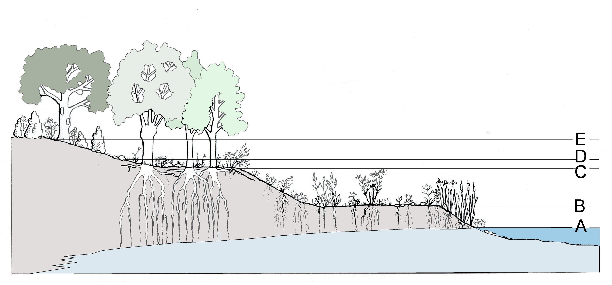

<strong>Figura nº4.-</strong> Funcionalidad ecológica y geomorfológica correspondiente a diferentes niveles de flujo (basado en Poff <em>et al.,</em> 1997). Dibujo de J. I. García Viñas.

**B.4.1.  CARACTERIZACIÓN DE VALORES HABITUALES**

La caracterización de los valores habituales persigue la parametrización de los valores no extremos del régimen de caudales. Este proceso se llevará a cabo en tres escalas de tiempo complementarias entre sí: año, mes y día.

Los datos de partida necesarios son las series completas de aportaciones anuales y mensuales más largas disponibles y los caudales medios diarios correspondientes a n años, recomendándose n15, aunque la aplicación IAHRIS 4.0 trabaja con series de al menos 7 años. La disponibilidad de datos de caudal a intervalos horarios posibilita la caracterización de la variabilidad o fluctuación absoluta intradía (**Figura nº5**).

**MAGNITUD**

**VARIABILIDAD**

**Aportaciones mensuales**

**ESTACIONALIDAD**

**Aportaciones anuales**

**Caudales medios diarios**

**Caudales a intervalos horarios**

**Figura nº 5**- Variables empleadas en la caracterización de los valores habituales del régimen de caudales

El proceso expuesto en el epígrafe B.3 permite caracterizar la variabilidad intranual ofreciendo para cada mes su valor mediano (**Tabla nº3).**

<table><thead><tr><th colspan="4">
<strong>APORTACIONES MEDIANAS MENSUALES</strong>

<strong>(hm3)</strong>
</th></tr><tr><th>
tipo 

mes
</th><th>
<strong>HÚMEDO</strong>
</th><th>
<strong>MEDIO</strong>
</th><th>
<strong>SECO</strong>
</th></tr></thead><tbody><tr><td>
<strong>Octubre</strong>
</td><td>
14,22
</td><td>
2,08
</td><td>
0,87
</td></tr><tr><td>
<strong>Noviembre</strong>
</td><td>
37,03
</td><td>
6,23
</td><td>
1,35
</td></tr><tr><td>
<strong>Diciembre</strong>
</td><td>
30,05
</td><td>
16,70
</td><td>
3,58
</td></tr><tr><td>
<strong>Enero</strong>
</td><td>
33,07
</td><td>
15,44
</td><td>
7,50
</td></tr><tr><td>
<strong>Febrero</strong>
</td><td>
49,76
</td><td>
18,13
</td><td>
5,50
</td></tr><tr><td>
<strong>Marzo</strong>
</td><td>
40,45
</td><td>
23,19
</td><td>
8,20
</td></tr><tr><td>
<strong>Abril</strong>
</td><td>
36,78
</td><td>
15,26
</td><td>
12,07
</td></tr><tr><td>
<strong>Mayo</strong>
</td><td>
26,51
</td><td>
11,61
</td><td>
7,14
</td></tr><tr><td>
<strong>Junio</strong>
</td><td>
15,40
</td><td>
6,29
</td><td>
2,70
</td></tr><tr><td>
<strong>Julio</strong>
</td><td>
4,26
</td><td>
2,09
</td><td>
0,80
</td></tr><tr><td>
<strong>Agosto</strong>
</td><td>
2,10
</td><td>
1,09
</td><td>
0,50
</td></tr><tr><td>
<strong>Septiembre</strong>
</td><td>
2,80
</td><td>
1,41
</td><td>
0,69
</td></tr></tbody></table>

**Tabla nº 3**- Ejemplo de caracterización de la variabilidad intranual del régimen de caudales

<strong>B.4.1.1.-</strong> <strong><u>VALORES ANUALES Y MENSUALES</u></strong>

**MAGNITUD**

a) <u>Significación ambiental</u>: las aportaciones anuales y mensuales no están asociadas a una específica función geomorfológica o ecológica, pero sí que son determinantes en la disponibilidad general de agua en el ecosistema (Richter <em>et al.,</em> 1995; Brizga <em>et al.</em>, 2001). Es interesante recoger las matizaciones que Richter <em>et al</em>. (1998) realizan sobre el significado ambiental de las aportaciones mensuales:

- disponibilidad de hábitat para los organismos acuáticos

- contenido de humedad en el suelo para las plantas
- disponibilidad de agua para los animales terrestres
- accesibilidad a los lugares de cría
- influencia en la temperatura, contenido de oxígeno y actividad fotosintética en la columna de agua

b) <u>Parámetro propuesto</u>: <strong>P1: MEDIA DE LAS APORTACIONES ANUALES</strong>

Referente a valores anuales se calcula para cada tipo de año el <u>promedio de las aportaciones anuales</u> correspondientes. El estimador final se obtendrá ponderando el valor obtenido según el porcentaje de presencia de cada tipo de año en la serie.

**P1 húmedo; P1 medio; P1 seco**

**P1 ponderado= 0,25\*(P1 húmedo + P1 seco) + 0,50\* P1 medio**

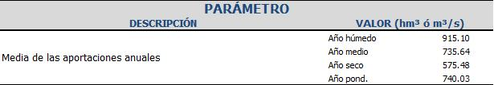

**Figura nº 6**- Extracto de un informe de IAHRIS con la evaluación de los parámetros que caracterizan las aportaciones anuales

c) <u>Referencias</u>: El uso de la media como estimador de las aportaciones anuales aparece recogido en Clausen <em>et al</em>. (2000), Brizga <em>et al</em>. (2001) y Batalla <em>et al</em>. (2004). Otros autores, Hughes y James (1989) utilizan la escorrentía media anual. Citar también que Brizga <em>et al</em>. (2001) realizan estimaciones de magnitud en base a la mediana y a estimaciones conjuntas de magnitud y estacionalidad.

En las referencias consultadas sólo se constata el empleo del caudal medio diario (media o mediana) de la serie disponible para la caracterización de valores mensuales: Richter *et al*. (1995), Clausen *et al*. (2000) y Growns y Marsh (2000).

Por último, conviene matizar que todos los trabajos revisados utilizan la serie completa de años disponible, sin realizar la discriminación previa aquí propuesta en diferentes tipos de año.

**VARIABILIDAD**

a) <u>Significación ambiental</u>: Son múltiples las referencias existentes a la acusada significación ambiental de la variabilidad del régimen de caudales. Entre otras, se recogen las siguientes:

- La variabilidad es el eje conductor de la dinámica geomorfológica y ecológica, condicionando los procesos de expansión y contracción del cauce y las pautas de comportamiento de la biota animal y vegetal (Brizga *et al.,* 2001).
        - Una disminución en la variabilidad puede favorecer la intromisión y expansión de especies exóticas (Poff *et al.,* 1997).
        - La similitud en los valores medios mensuales a lo largo del año puede interpretarse como indicativo de <strong>constancia</strong> hidrológica, mientras que la variación interanual del valor medio para un mes dado es indicativa de la <strong>contingencia</strong> ambiental (Richter <em>et al</em>., 1995). Ambos aspectos garantizan la predictibilidad de los eventos por parte de la ictiofauna (González del Tánago y García Jalón, 1995).
        - La variabilidad del régimen de caudales condiciona la heterogeneidad del hábitat hiporréico y su calidad, influyendo en el tamaño del material que conforma el lecho del cauce, en su estabilidad, en la colmatación del medio hiporréico y en sus características hidráulicas (Sedimentation Committee, 1992).

b) <u>Parámetro propuesto</u><strong>P2: DIFERENCIA ENTRE LA MÁXIMA Y MÍNIMA APORTACIÓN MENSUAL EN EL AÑO</strong>

Dado que la variabilidad interanual queda recogida en la discriminación en "años húmedos, medios y secos", se propone ahora la caracterización de la variabilidad intranual como diferencia entre la máxima y mínima aportación habida en el año.

La evaluación se realizará año a año para cada uno de los años pertenecientes a un "tipo" determinado. El procedimiento se centra en estimar cual es la diferencia existente en términos de aportación, entre el máximo y mínimo mensual de un año (**A** en la **Figura nº7**) calculándose a continuación el promedio para cada uno de los "tipos". El valor final se obtiene como media ponderada según el porcentaje de presencia de cada tipo en la serie.

**A**

**Figura nº7-** Ejemplo de estimación de la variabilidad intranual.

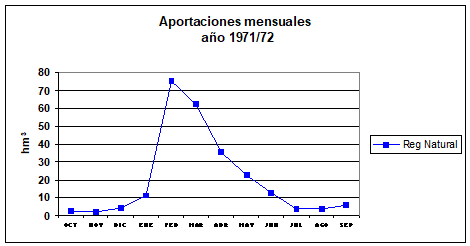

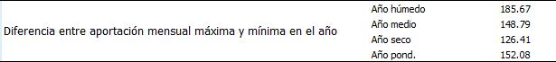

**Figura nº 8**- Extracto de un informe de IAHRIS con la evaluación de los parámetros que caracterizan la variabilidad de las aportaciones mensuales

c) <u>Referencias</u>: En las referencias consultadas es habitual el uso del coeficiente de variación como estadístico representativo de la variabilidad interanual trabajando sobre la serie de aportaciones anuales (Brizga <em>et al</em>., 2001; Baeza <em>et al</em>., 2003). Clausen <em>et al</em>. (2000) lo aplican sobre la serie de caudales diarios siendo entonces representativo de la variabilidad diaria, y destacando a escala mensual la propuesta de Growns y Marsh (2000). Otros autores introducen el empleo del sesgo bien en valores anuales o mensuales tal y como aparece recogido en Puckridge <em>et al.</em> (1998). Citar por último el empleo de la curva de caudales clasificados (Richards, 1990; Puckridge <em>et al</em>., 1998; Growns y Marsh, 2000;) para la definición de rangos de variación en los caudales diarios.

**ESTACIONALIDAD**

a) <u>Significación ambiental</u>: La estacionalidad de los valores extremos, avenidas y sequías posee ambientalmente más significación que la correspondiente a los valores habituales del régimen de caudales. No obstante, Brizga <em>et al.</em> (2001) recogen las consideraciones siguientes:

- La estacionalidad marca el ritmo de los procesos vitales de la biota acuática y riparia, íntimamente ligados y en sincronía con un conjunto de variables ambientales como la temperatura del aire, la temperatura del mar, la fase lunar y las mareas, la duración del día, las tormentas y otros factores climáticos

- La variabilidad estacional es crucial en el mantenimiento de la diversidad temporal de los hábitats
- La estacionalidad del cauce principal posibilita la sincronía con los tributarios y evita procesos de incisión en sus cauces
- La estacionalidad es un estímulo para la germinación y dispersión

b) <u>Parámetro propuesto</u><strong>P3: MES CORRESPONDIENTE A LA MÁXIMA APORTACIÓN MENSUAL DEL AÑO Y MES CORRESPONDIENTE A LA APORTACIÓN MÍNIMA</strong>

La estacionalidad de las aportaciones mensuales se evaluará para cada tipo de año (húmedo, medio y seco) en una doble caracterización: estacionalidad de los mínimos (o del mes de mínima aportación) y estacionalidad de los máximos (o del mes de máxima aportación).

Para los años pertenecientes a cada tipo de año se calculan las aportaciones medianas mensuales correspondientes a cada mes i. Trabajando en cada tipo de año con la serie de las 12 medianas así obtenidas, la estacionalidad de la aportación mensual máxima viene dada por el mes donde se localiza la mediana máxima y la estacionalidad de la aportación mensual mínima por el mes donde se localiza la mediana mínima.

La **Figura nº9** muestra un ejemplo de caracterización de la estacionalidad.

**Figura nº 9**- Ejemplo de caracterización de la estacionalidad de máximos  y de mínimos

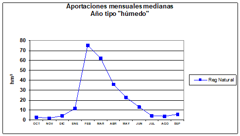

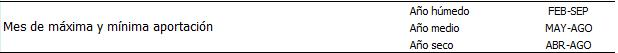

**Figura nº10**- Extracto de un informe de IAHRIS con la evaluación de los parámetros que caracterizan la estacionalidad de las aportaciones mensuales

c)   <u>Referencias</u>: En la literatura consultada, la estimación de la estacionalidad de los valores habituales es poco relevante frente a la estacionalidad de los valores extremos, especialmente de los máximos (Richter <em>et al.,</em> 1995).

Respecto a valores mensuales, Growns y Marsh (2000) estudian la estacionalidad localizando el mes más seco y el mes más húmedo, entendiendo como tales aquellos meses que poseen más frecuentemente el mínimo (y máximo) caudal medio diario mensual para un registro de 20 años. Otros autores, Brizga *et al.* (2001), realizan clasificaciones en base a distintos percentiles de excedencia de caudales medios diarios para un mes dado y proponen clasificaciones del régimen de caudales según el % de la aportación anual correspondiente a cada mes (Haines *et al.,* 1988).

<strong><u>B.4.1.2.- VALORES DIARIOS O A INTERVALOS MENORES</u></strong>

**VARIABILIDAD**

a) <u>Significación ambiental</u>: la significación ambiental de este aspecto se considera recogida al exponer la significación de la variabilidad de otros valores habituales. (ver epígrafe B.4.1.1)

b) <u>Parámetro propuesto</u> <strong>P4: INTERVALO COMPRENDIDO ENTRE LOS CAUDALES MEDIOS DIARIOS CORRESPONDIENTES A LOS PERCENTILES DE EXCEDENCIA DEL 10% Y 90%, Q10-Q90</strong>

La curva de caudales clasificados o curva de duración de caudales es el instrumento que mejor representa la variabilidad de caudales a lo largo del año, indicando el % de tiempo como media, en el que un valor determinado de caudal es igualado o superado.

Respecto a esta curva se habla del percentil de excedencia del 10% (Q10), como aquel caudal que en promedio sólo es igualado o superado el 10% del año, es decir 36,5 días. Análogamente el percentil de excedencia del 90% (Q90) indicaría aquel caudal que como media es igualado o superado un 90% del año, ó en términos diarios 328,5 días. En esta curva el intervalo Q0- Q100 representa el rango de variación de los caudales medios diarios.

Trabajando con la curva media correspondiente a cada tipo de año, la variación <em>habitual</em> puede caracterizarse mediante el intervalo <strong>Q10-Q90</strong> al prescindir de los valores extremos, tanto máximos (&gt;Q 10) como mínimos (&lt;Q 90)., <strong>Figura nº11</strong>:

**Q90%**

**Q10%**

**RANGO DE VARIABILIDAD HABITUAL**

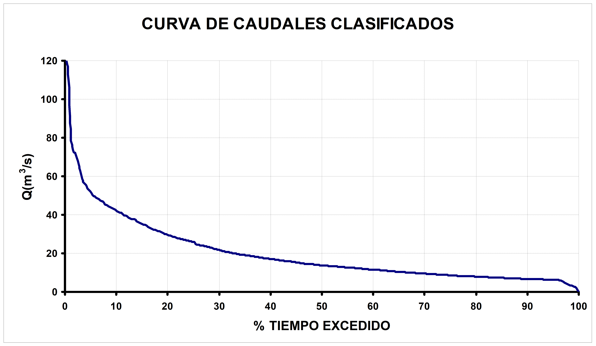

<strong>Figura nº 11</strong>- Rango de variabilidad "habitual" de los caudales medios diarios Q10 –Q90 <strong>↕</strong> en base a la curva de caudales clasificados

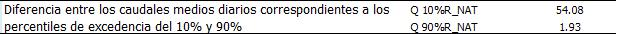

**Figura nº12**- Extracto de un informe de IAHRIS con la evaluación de los parámetros que caracterizan la variabilidad habitual

c) <u>Referencias</u>: existen múltiples referencias al empleo de la curva de caudales clasificados en la estimación de la variabilidad, siendo los percentiles de excedencia del 10%, 20%, 80% y 90% los empleados más frecuentemente (<strong>Tabla nº4</strong>).

<table><thead><tr><th>
<strong>REFERENCIA</strong>
</th><th>
<strong>PARÁMETRO</strong>
</th><th>
<strong>DEFINICIÓN</strong>
</th></tr><tr><th>
<strong>Baeza </strong><em>et al</em><strong><em>. </em></strong>(2003)
</th><th>
CV intra
</th><th>
Coeficiente de variación intranual. Cociente entre la desviación típica de los 365 caudales diarios del año y la media de caudales de dicho año
</th></tr><tr><th rowspan="3">
<strong>Clausen</strong> <em>et al</em>. (2000)
</th><th>
SK
</th><th>
Cociente entre la media y la mediana de la serie de caudales medios diarios
</th></tr><tr><th>
CV
</th><th>
Coeficiente de variación de la serie de caudales medios diarios 
</th></tr><tr><th>
PRE y CON
</th><th>
Predictibilidad y constancia calculada a partir del cociente entre el caudal medio diario y la mediana 
</th></tr><tr><th rowspan="2">
<strong>Growns y Marsh</strong> (2000)
</th><th>
Variabilidad mensual
</th><th>
Definida como (Q10-Q90)/mediana, se calcula para la serie de caudales medios diarios mensuales en una serie de 20 años 
</th></tr><tr><th>
Variabilidad intranual
</th><th>
Rango de caudales comprendido entre los percentiles de excedencia del 20 y 80% 
</th></tr><tr><th>
<strong>Puckridge </strong><em>et al</em><strong><em>.</em> </strong>(1998)
</th><th>
Variabilidad 
</th><th>
En base a caudales medios diarios, se calcula como el cociente entre Q10-Q90 y la mediana. 
</th></tr><tr><th>
<strong>Richards </strong>(1990)
</th><th>
Rangos de los caudales diarios
</th><th>
Ratio entre los pecentiles de excedencia 10%/90%, 20%/80% y 25%/75% de los caudales diarios para la serie completa.
</th></tr></thead></table>

**Tabla nº 4.-** Referencias relativas a la estimación de la variabilidad de valores habituales diarios

**FLUCTUACIÓN INTRADÍA**

a) <u>Significación ambiental</u>: aunque ya han sido reseñadas las principales implicaciones ambientales de la variabilidad del régimen de caudales (epígrafe B.4.1.1), es cierto que las fluctuaciones diarias cobran especial significación dado que al reflejar la rapidez con la que se producen las variaciones de unas magnitudes a otras afectan directamente a la a la biota y a su resiliencia (Arthington, 2002). Es fundamental que estas tasas estén en sincronía con la capacidad de respuesta de los organismos, permitiendo el sostenimiento del bentos, la migración de juveniles a hábitats más favorables, el aprovechamiento de nutrientes, etc.

Las principales implicaciones ambientales por alteración en estas fluctuaciones pueden resumirse en:

- GEOMORFOLOGÍA: Alteración en la composición y estabilidad del sustrato (Gonçalves, 2002)

- HÁBITAT HIDRÁULICO: Alteración en la velocidad del agua y otras variables asociadas (Gonçalves, 2002)

- VEGETACIÓN: Afección a los procesos de regeneración vegetal: diseminación, germinación, reproducción vegetativa, etc. (Poff *et al.,* 1997); Daños estructurales y estrés fisiológico (Arthington, 2002)

# FAUNA: Incremento de la mortalidad por arrastre en las crecidas o por quedar varados los ejemplares en decrecidas bruscas (Poff *et al.,* 1997); Afección a la ictiofauna por reducción del hábitat y disminución del alimento (Martínez de Azagra  y Sanz, 2003); Pérdida de biomasa en la comunidad béntica por arrastre en las crecidas bruscas o aislamiento en condiciones inadecuadas (Gonçalves, 2002), y reducción considerable en su diversidad (Arthington, 2002); Sustitución de especies autóctonas por otras menos exigentes y más adaptables a estas fluctuaciones (Poff *et al.,* 1997) 

- CALIDAD DEL AGUA: Alteración en los parámetros fisicoquímicos, con especial afección a la temperatura y concentración de oxígeno disuelto (Gonçalves, 2002)

b<u>) Parámetro propuesto</u>: <strong>FLUCTUACIÓN ABSOLUTA</strong>

Las fluctuaciones del régimen circulante analizadas en pequeños intervalos de tiempo (por ejemplo, horarios) cobran especial relevancia en el caso de tramos sometidos a aprovechamiento hidroeléctrico, donde es fácil que se presente la paradoja de que manteniéndose inalterables los valores medios correspondientes a los caudales diarios, las variaciones de caudal estudiadas bajo un marco temporal más limitado (horario o inferiores) sean sin embargo enormes.

Baker *et al*. (2004) proponen un índice (R-B index, *Richards–Bakers Flashiness* Index) que tomando como intervalo temporal 1 hora es de gran utilidad para caracterizar los pulsos de turbinados diarios de las centrales hidroeléctricas.

donde:          <strong>q</strong> <strong>i</strong> = caudal medio en la hora i

<strong>q</strong> <strong>i-1</strong> = caudal medio de la hora i-1

Dicho índice responde a la expresión:

Este índice adimensional refleja las oscilaciones de caudal respecto al flujo total diario, constituyendo un buen estimador de las tendencias de crecida y decrecida del caudal circulante.

**Figura nº 13**- Hidrograma aguas abajo de una central hidroeléctrica entre los días 6 y 12 de noviembre. Abajo, detalle para el día 6 de noviembre (Fuente: USGS, 2004)

Si en un supuesto práctico aplicamos <em>el R-B Index</em> a los datos recogidos en las <strong>Fig. nº13</strong> y <strong>14</strong> representativos del hidrograma aguas abajo de una central hidroeléctrica y particularizados para un día en concreto (p.e. nov 06), puede observarse como el numerador de dicho índice representa la suma total de oscilaciones de caudal habidas durante 24 horas:

**B**

**C**

**D**

**A**

**Figura nº 14** Detalle del hidrograma aguas abajo de una central hidroeléctrica para el día 6 de noviembre de 2004. (Fuente: USGS, 2004)

**= A + B +C + D= Fa**

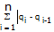

confirmando para el ejemplo dado que la suma (A+B+C+D) es representativa de estas oscilaciones. Por tanto, se propone **Fa** como parámetro para caracterizar la fluctuación absoluta.

**B.4.2.  CARACTERIZACIÓN DE VALORES EXTREMOS MÁXIMOS (AVENIDAS)**

En la caracterización del régimen natural de caudales como estructurador del paisaje geomorfológico y biológico del ecosistema fluvial, hay que prestar una especial atención al "cuello de botella" que ecológicamente representan los valores extremos, máximos y mínimos, por constituir las situaciones más críticas, pero también las oportunidades estratégicamente más importantes para la biota (Lytle y Poff, 2004).

El análisis de los valores extremos máximos se realizará en base a dos variables principales. La primera de ellas es el máximo caudal medio diario anual (Qc), obtenido a partir de la serie disponible. En segundo lugar, se trabajará con la denominada <em>avenida habitual</em>, concepto que será tratado ampliamente en este epígrafe y que viene dado por el valor del caudal correspondiente al percentil de excedencia del 5% en la curva de caudales clasificados en régimen natural (Q 5%).

En la **Figura nº15** se recogen las variables a considerar en los aspectos ecológicamente más significativos de las avenidas:

**MAGNITUD y FRECUENCIA**

**VARIABILIDAD**

**ESTACIONALIDAD**Magnitud

**DURACIÓN**

Caudal Generador del Lecho (QGL)

<strong>Caudal de la avenida habitual (Q</strong> <strong>5%)</strong>

**Avenidas**

**máximas**

Máximo caudal medio

diario anual

(Qc)

**Máximo caudal medio diario anual (Qc)**

**TASAS DE CRECIDA y**

**DEFLUENCIA**

**Figura nº 15**- Variables en la caracterización de los valores extremos máximos.

**MAGNITUD Y FRECUENCIA**

a) <u>Significación ambiental</u>: El papel que juegan las avenidas en la dinámica del ecosistema fluvial es básico para garantizar la integridad del mismo. La significación ambiental de la magnitud de estos caudales máximos esta avalada a nivel científico, manifestándose en los aspectos siguientes:

- DINÁMICA GEOMORFOLÓGICA: Mantenimiento de la morfología, geometría del cauce y granulometría del sustrato en equilibrio dinámico (Brizga *et al.,* 2001); Mantenimiento de la secuencia de rápidos y remansos (Bunn y Arthington, 2002); Remoción del sustrato (Poff *et al.*, 1997); Rejuvenecimiento y formación de brazos y pozas laterales (Poff *et al*., 1997); Formación de barras (Brizga *et al*., 2001); Transporte y aporte al cauce de grandes restos vegetales que propician la diversidad hidráulica y conforman microhábitats de gran valor ecológico (Poff *et al.,* 1997)
- CONTINUIDAD TRANSVERSAL: Restablecimiento de la conectividad cauce-llanura, facilitando el acceso a esta zona y manteniendo unas condiciones de humedad apropiadas (Brizga *et al*., 2001); Rejuvenecimiento general del hábitat ripario (Richter y Richter, 2000); Estímulo de la sucesión ecológica del bosque ripario (Richter y Richter, 2000); Creación de condiciones ambientales adecuadas para el desarrollo de numerosas especies vegetales y animales especialmente en sus primeros estadios (Poff *et al*., 1997)
- CONTINUIDAD VERTICAL: Conexión con el freático (Pinay *et al.,* 2002); Recarga del acuífero aluvial (Naiman *et al.*, 2000); Mantenimiento de condiciones ambientales adecuadas en el medio hiporréico (Poff *et al*., 1997)
- CONTINUIDAD LONGITUDINAL: Mantenimiento de la función del río como corredor (Bunn y Arthington, 2002); Aporte de sedimentos y nutrientes a lo largo del cauce con especial significación en los tramos de desembocadura, deltas y estuarios (Brizga *et al*., 2001)
- ACCIONES RELACIONADAS CON EL CICLO BIOLÓGICO DE LA BIOTA: Estímulo para los movimientos migratorios de muchas especies (Naiman *et al.,* 2000); Accesibilidad a las zonas de reproducción y alevinaje (Strange *et al.,* 1999); Adaptación de las estrategias reproductivas de muchas especies a estos caudales (Poff y Allan, 1995); Estímulo para la germinación de numerosas especies vegetales (Strange *et al*., 1999); Regulación de poblaciones, favoreciendo a las especies autóctonas adaptadas frente a las exóticas (Strange *et al*., 1999); Afecciones al bentos de diversa magnitud y naturaleza (Hickey y Salas, 1995); Un aumento en la magnitud de las avenidas puede originar daños fisiológicos y mecánicos a la vegetación (Nilsson y Svedmark, 2002); La reducción en magnitud suele favorecer la invasión del cauce por macrófitas (Bunn y Arthington, 2002)

b) <u>Parámetros propuestos</u>: La magnitud y frecuencia de las avenidas circulantes se caracteriza mediante cuatro parámetros:

**P5: MEDIA DE LOS MÁXIMOS CAUDALES DIARIOS ANUALES**

**P6: CAUDAL GENERADOR DEL LECHO**

**P7: CAUDAL DE CONECTIVIDAD**

**P8: AVENIDA HABITUAL**

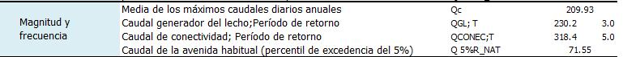

**Figura nº16**- Extracto de un informe de IAHRIS con la evaluación de los parámetros que caracterizan la magnitud y frecuencia de las avenidas

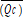

- **P5: MEDIA DE LA SERIE DE MÁXIMOS CAUDALES DIARIOS ANUALES**  como valor representativo de la magnitud media de las crecidas máximas

En la estimación de la magnitud de las avenidas, el valor medio de la serie de máximos caudales medios diarios anuales está referenciado en Richter *et al*. (1997) y Growns y Marsh (2000); otros autores (Clausen y Biggs, 2000; Growns y Marsh, 2000 ) caracterizan la magnitud de las avenidas a partir de umbrales definidos por "a" veces la mediana con a= 1, 3, 5, 7; Brizga *et al*. (2001), definen avenidas para distintos períodos de retorno (1,5; 3 y 5 años) como magnitudes características del régimen de caudales máximos. Los máximos anuales correspondientes a medias móviles con pasos de 3, 7, 30 y 90 días también aparecen referenciados en Richter *et al.* (1998) en la caracterización de valores máximos.

El valor obtenido con este parámetro es indicativo, también, de la frecuencia de estas avenidas, dada la relación existente entre  y el período de retorno: recordemos que al valor medio de la serie de caudales medios diarios máximos anuales , le corresponde un período de retorno de 2,33 años, cuando se utiliza la ley de frecuencias Gumbel.

- <strong>P6: CAUDAL GENERADOR DEL LECHO</strong> (<strong>Q</strong> <strong>GL</strong>), representativo de la magnitud y frecuencia de aquellos caudales máximos con especial significación geomorfológica

Hickey y Salas (1995) recogen una amplia relación de estudios donde se analizan las alteraciones sobre la fauna, vegetación, bentos y geomorfología como consecuencia de modificaciones en el régimen de avenidas.

De todas estas implicaciones ambientales es, sin lugar a duda, la significación geomorfológica de los caudales máximos, la más tangible, la más fácilmente expresable. Significación que además está avalada legalmente: la Ley de Aguas (RDL 1/2001, de 20 de julio) define la máxima crecida ordinaria (calculada como el valor medio de los máximos caudales medios diarios anuales de una serie representativa de diez años consecutivos) como el caudal que conforma el cauce y que por tanto es definitorio del Dominio Público Hidráulico.

Ante la indeterminación que conlleva seleccionar una serie representativa de años, el CEDEX (<em>Aspectos prácticos de definición de la máxima crecida ordinaria</em> en MIMAM, 2003) propone la expresión siguiente para el cálculo de la Máxima Crecida Ordinaria (Q MCO), caudal que puede aproximarse al denominado Caudal Generador del Lecho y que se obtiene en base a la serie completa disponible de Qc.

Q M C O = \* (0,7+0,6\*CV (Qc))  QGL

.

donde

<strong>Q</strong> <strong>M C O</strong> = Caudal correspondiente a la Máxima Crecida Ordinaria

<strong>QGL</strong> = 	Caudal Generador del Lecho

= 	media de la serie de máximos caudales medios diarios anuales

**CV (Qc)** =coeficiente de variación de la serie de máximos caudales medios diarios anuales

Representando el caudal generador del lecho (QGL) aquel caudal que a largo plazo realiza un mayor trabajo de movilización y transporte de materiales siendo responsable de la geomorfología del cauce tanto en sección como en planta.

Así, las ecuaciones empíricas clásicas de morfología fluvial (Knighton, 1998) establecen que las variables morfológicas anchura (<strong>w</strong>), calado medio (<strong>h</strong>) y perímetro mojado (<strong>Pm)</strong> pueden expresarse como funciones potenciales de Q GL:

<strong>w = K1\* QGL</strong> <strong>b</strong> 		<strong>h = K2\* QGL</strong> <strong>c</strong>     	 <strong>Pm = K3\* QGL</strong> <strong>d</strong>

siendo 		K i= constante de proporcionalidad

a, b, c = exponentes

En la literatura especializada (<strong>Tabla nº5</strong>) pueden encontrarse numerosos trabajos que permiten estimar estos parámetros, confirmándose en todos ellos que el exponente <strong>b</strong> toma un valor igual o muy próximo a 0,5, lo cual implica la relación directa entre la anchura del cauce y la raíz cuadrada de Q GL:

<table><thead><tr><th colspan="5">
<strong>VALORES EMPIRICOS DEL EXPONENTE "<em>b</em>" (Fernández Yuste, 2003)</strong>
</th></tr></thead><tbody><tr><td>
<strong>Sustrato</strong>
</td><td>
<strong>Fuente</strong>
</td><td>
<strong>Localización</strong>
</td><td>
<strong>Características</strong>
</td><td>
<strong><em>b</em></strong>
</td></tr><tr><td rowspan="7">
<strong>Gravas</strong>
</td><td>
Emmett (1975)
</td><td>
Idaho
</td><td></td><td>
0,56
</td></tr><tr><td rowspan="2">
Andrews (1984)
</td><td>
Colorado
</td><td>
Vegetación de orilla densa
</td><td>
0,48
</td></tr><tr><td></td><td>
Vegetación de orilla escasa
</td><td>
0,48
</td></tr><tr><td rowspan="4">
Hey y Thorne (1986)
</td><td rowspan="4">
Gran Bretaña
</td><td>
Vegetación de orilla herbácea
</td><td>
0,5
</td></tr><tr><td>
Árboles y arbustos 1-5%
</td><td>
0,5
</td></tr><tr><td>
Árboles y arbustos 5-50% 
</td><td>
0,5
</td></tr><tr><td>
Árboles y arbustos &gt;50%
</td><td>
0,5
</td></tr><tr><td>
<strong>Arenas</strong>
</td><td>
Mahmood <em>et al</em>. (1979)
</td><td>
Pakistan
</td><td>
Canales
</td><td>
0,51
</td></tr><tr><td rowspan="5">
<strong>Indiferenciado</strong>
</td><td>
Rundquist (1975)
</td><td></td><td></td><td>
0,52
</td></tr><tr><td rowspan="4">
Castro y Jackson (2001)
</td><td>
Pacific Northwest
</td><td rowspan="4">
Regresión en cauces agrupados en ecoregiones
</td><td>
0,49
</td></tr><tr><td>
Pacific Maritime
</td><td>
0,50
</td></tr><tr><td>
West interior
</td><td>
0,60
</td></tr><tr><td>
Western cordillera
</td><td>
0,44
</td></tr></tbody></table>

**Tabla nº5.-** Referencias empíricas relativas al valor del exponente **b** en las funciones potenciales de geometría hidráulica (tomada de Fernández Yuste, 2003).

A estas deducciones empíricas del valor de <strong>b</strong> habría que sumar las demostraciones teóricas fundamentadas en procesos físicos de difusión de la cantidad de movimiento como las recogidas en Parker (1979) con b= 0,5 y Savenije (2003), que confirma la formula de Lacey para la anchura del cauce (w= 4,8QGL 0,5). El trabajo de Savenije (2003) ofrece además una interesante relación de veinticinco estudios experimentales que vuelven a corroborar la constancia del exponente b =0,5 en la dependencia de la anchura del cauce respecto al Caudal Generador del Lecho.

Las referencias expuestas anteriormente avalan la significación ambiental del parámetro propuesto, cuyo objetivo es cuantificar la magnitud de aquellos caudales máximos con especial significación geomorfológica.

La aplicación calcula también el periodo de retorno de QGL aplicando la ley de frecuencias Gumbel.

- **P7: CAUDAL DE CONECTIVIDAD** representativo de los caudales máximos que garantizan la conexión cauce-llanura de inundación especialmente ligados con la dinámica de la banda riparia y los ecosistemas dependientes de inundaciones periódicas

El parámetro que se propone, denominado Caudal de Conectividad <strong>Q</strong> <strong>CONEC,</strong> trata de evaluar la magnitud de aquellos caudales implicados en el mantenimiento de la conectividad transversal cauce–llanura de inundación; esta conectividad garantiza la accesibilidad a dicha zona y el mantenimiento en ella de unas condiciones de humedad adecuadas para los diferentes estadios de la biota, estimulando además el rejuvenecimiento del hábitat ripario, los procesos de sucesión del bosque de ribera, asegurando el mantenimiento de la secuencia en tramos meandriformes, el rejuvenecimiento de los canales laterales, etc. (Poff <em>et al.,</em> 1997; Richter y Richter 2000; Brizga <em>et al</em>., 2001). La conectividad transversal es también crítica en el mantenimiento de la diversidad y funcionalidad de las comunidades de macroinvertebrados (Collier y Scarsbrook, 2000).

Es lógico suponer que para garantizar esta conectividad transversal cauce-llanura de inundación, es necesario un caudal que rebase el cauce y acceda a la llanura, inundándola; por consiguiente, QCONEC debe ser superior al Caudal Generador del Lecho (QGL) en régimen natural.

Richter y Richter (2000) recogen como umbral de referencia para aquellos caudales que garantizan el mantenimiento del bosque ripario en tramos meandriformes: <strong>Q  125% QGL</strong>

Buscando una correlación que nos permita estimar QCONEC en base a QGL y dado que por definición QCONEC&gt; QGL, es obvio que los períodos de retorno también lo serán.

En una primera aproximación se propone estimar QCONEC como aquel caudal que siendo superior a QGL, tenga un periodo de retorno doble al de este. Esta suposición nos llevaría a movernos en un intervalo entre 3 y 14 años, dado que el estudio "<em>Aspectos prácticos de la definición de la máxima crecida ordinaria, CEDEX</em>" en MIMAN (2003) fija para el territorio peninsular el intervalo siguiente de períodos de retorno para QGL:

<strong>Q (T=1,5 años) &lt; QGL&lt; Q (T= 7 años)</strong>

donde los valores bajos corresponden a regímenes de hidrología moderada y los altos a las corrientes de hidrología extrema. Por tanto, para el Caudal de Conectividad, se obtendría

<strong>Q (T=2 T</strong> <strong>QGL) &lt; QCONEC&lt; Q (T= 2T</strong> <strong>QGL),</strong>

<strong>Q (T=3) &lt; QCONEC&lt; Q (T= 14 años)</strong>

Contrastando esta propuesta con valores referenciados en la literatura especializada se puede concluir su aceptación. Así, para ríos de gravas, Schmitd y Potyondy (2004) sitúan el valor del caudal responsable de la inundación parcial de la llanura de inundación (asimilable a nuestro QCONEC) con sus implicaciones en la dinámica de la vegetación riparia en el intervalo:

<strong>QGL</strong> <strong>&lt; QCONEC&lt; Q (T= 25 años)</strong>

Con respecto a la vegetación Hill *et al*. (1991) estiman que los caudales necesarios para el mantenimiento de la vegetación riparia (caudales que deben inundar esta banda) ocurren con una frecuencia entre 1,5 y 10 años:

<strong>Q (T=1,5 años) &lt; QCONEC&lt; Q (T= 10 años)</strong>

Trush *et al.* (2000) concluyen que caudales altos, normalmente por encima de períodos de retorno entre 10-20 años son necesarios para el mantenimiento de la complejidad y morfología de la llanura de inundación:

<strong>QCONEC&gt; Q (T= 10 años – 20 años)</strong>

Schmitd y Potyondy (2004) sitúan el período de recurrencia de 25 años como un valor de carácter conservador en la estimación de los caudales adecuados para una inundación periódica de la llanura:

<strong>QCONEC&lt; Q (T= 25 años)</strong>

Como se ha comentado, las referencias expuestas permiten aceptar la estimación del Caudal de Conectividad como aquel caudal correspondiente al doble del periodo de retorno del Caudal Generador del Lecho en régimen natural.

El proceso de obtención del Caudal de Conectividad puede esquematizarse en las fases siguientes:

#### 1.1.1.1 Estimar QGL en régimen natural y su periodo de retorno correspondiente <strong>T</strong> <strong>QGL</strong> (Ley Gumbel) 

#### 1.1.1.2 Calcular la magnitud del Caudal de conectividad natural (QCONEC) como el caudal correspondiente a un período <strong>2 T</strong> <strong>QGL</strong>

- <strong>P8: AVENIDA HABITUAL</strong> o caudal correspondiente en la curva media de caudales clasificados al percentil de excedencia del 5% (<strong>Q</strong> <strong>5%</strong>), cuya significación ambiental se concreta a diferentes niveles destacando la función de limpieza de materiales finos del sustrato, condicionando la disponibilidad de hábitat para macroinvertebrados, garantizando el biotopo adecuado para la freza de muchas especies, promoviendo la dispersión de propágulos y reorganizando las formas del lecho a pequeña escala.

El término de "avenida habitual" introducido en este trabajo surge de la incertidumbre existente al tratar de materializar el concepto de avenida.

*¿Cuándo podemos considerar que un evento determinado es una avenida?*

Si trabajamos en términos de caudal, es cierto que el amplio abanico cubierto por estos eventos máximos nos obligaría a hablar de distintos umbrales que deben ser igualados o superados para que la avenida ejerza un trabajo geomorfológico, o asegure la conectividad con la llanura, o revitalice el sustrato, o bien actúe como llamada para la ictiofauna, etc.

En una vía paralela a la anterior, podrían discriminarse las avenidas en términos de tiempo en base a la curva de caudales clasificados, dado que estas curvas nos informan del nº de días al año, como media, en el que un caudal determinado es igualado o superado*.* De este modo, hablaríamos de avenidas cuando el caudal circulante sea un caudal "alto que se presenta ocasionalmente en el cauce" y podría seleccionarse, dentro de este conjunto de valores máximos, aquel valor que, a modo de umbral, permitiese asignar la condición de avenida a todos aquellos eventos que lo superasen.

Con este objetivo, pueden seleccionarse en la curva de caudales clasificados distintos percentiles de excedencia como umbrales para discriminar una crecida o avenida: el 5% y 16% (Batalla *et al*., 2004), el 10% y 30% (González del Tánago y García de Jalón, 1995), el 10% y 20% con especial referencia al 5% (Clausen y Biggs, 2000), el 10% (Sugiyama *et al*., 2003), el 25% (Richter *et al.*, 2004), el 17% como definitorio del umbral de avenidas de limpieza del sustrato (King *et al*., 1999) y el 5% (Baeza *et al.*, 2003; Baker *et al*, 2004), son algunos ejemplos que aparecen citados en la literatura especializada como umbrales de caudal por encima de los cuales se asegura la dinámica de la vegetación de ribera, la conectividad con la llanura de inundación, etc.

En esta línea, citar que otros autores (Growns y Marsh, 2000) toman como umbrales para caracterizar distintos niveles de avenida, el valor definido por "a" veces la mediana (a\*Q 50%) con a =1, 3, 5, 7 y 9.

No obstante, la elección de un percentil determinado como discriminante de qué es una avenida (Q ≥ Q percentil%) y qué no es una avenida (Q &lt; Q percentil%) no debe realizarse de forma generalizada. Es necesario tener en consideración tanto el número de orden del cauce (definitorio de la magnitud de los eventos) como las pautas de comportamiento hidrológico de la cuenca deducidas de los hidrogramas (caudal base, tiempos al pico, etc.) y de la propia curva de caudales clasificados (cambio perceptible de pendiente).

Ahora bien, dado que esta curva permite conocer el número de días, como media, en que un caudal es igualado o superado, pero no la secuencia temporal de estos días a lo largo del año es importante que al seleccionar el percentil discriminante se tenga presente de algún modo dicha secuencia.

Esta condición así expuesta, está basada en el hecho constatado de que la permanencia continuada de valores extremos conlleva mayor repercusión ambiental que la ocurrencia aislada de un caudal máximo. Por ello es preciso conocer para el percentil seleccionado, cual es el <em><strong>número de días consecutivos</strong></em> (como media) en que el caudal correspondiente es igualado o superado y <strong>comprobar</strong> que dicha duración es superior a siete días, umbral de permanencia ampliamente referenciado en la literatura especializada como ecológicamente significativo (Bales y Pope, 2001).

En este trabajo se ha seleccionado el percentil del 5% como umbral que define el carácter de avenida. Al caudal correspondiente a este percentil <strong>Q</strong> <strong>5%</strong> se le asigna la denominación de <strong>avenida habitual</strong>, indicando con el calificativo de habitual, que dicho caudal se presenta normalmente todos los años – es igualado o superado como promedio unos 18 días al año-. Según este criterio serían consideradas avenidas cualquier evento con caudales superiores al Q 5% (<strong>Figura nº17</strong>).

**Q5%**

**RANGO DE AVENIDAS HABITUALES**

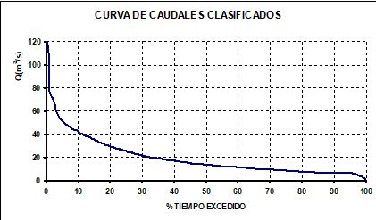

**Figura nº 17**- Determinación del umbral de avenida "habitual" a partir de la curva de caudales clasificados

Este umbral así definido <strong>Q5%</strong> se constituye en una nueva variable hidrológica que al representar fenómenos de recurrencia inferior al año permite una caracterización más precisa de la magnitud de las avenidas, evitando (Maingi y Marsh, 2002) la globalidad inherente a las deducciones obtenidas con series de máximos caudales medios diarios anuales.

Si bien la variable seleccionada lo ha sido para un aspecto de magnitud, al tratarse de un valor vinculado a una probabilidad de excedencia, el 5%, lleva implícita una relación estrecha con la frecuencia (percentil de excedencia = 1- frecuencia relativa acumulada) por lo que el parámetro propuesto para magnitud aporta información también respecto a la frecuencia.

c) <u>Referencias</u>: Dada la complejidad inherente a la caracterización de la magnitud de las avenidas, las principales referencias ya han sido expuestas al presentar y justificar otros parámetros ya propuestos.

**VARIABILIDAD**

a) <u>Significación ambiental</u>: La variabilidad interanual juega un papel director en la dinámica geomorfológica y biológica (Brizga <em>et al.,</em> 2001). Thoms y Sheldon (2002) constatan las siguientes afecciones derivadas de una pérdida de variabilidad:

- A nivel geomorfológico: alteración de los procesos de erosión y sedimentación, reducción del meandreo, pérdida de variabilidad hidráulica en el cauce y en la llanura de inundación.
- A nivel biológico: influencia en múltiples procesos del ecosistema como transporte de organismos, nutrientes, carbono orgánico y otros materiales, promoviendo la diversidad física y química, tanto espacial como temporalmente.

Poff *et al.* (1997) recogen como la pérdida de variabilidad promueve también la competencia excluyente de unas especies de peces a expensas de las nativas, que en general resultan perjudicadas. Richter *et al.* (1998) constatan la afección a las especies riparias y a la dinámica de sus comunidades, la muerte por desecación, la reducción del crecimiento, la competencia excluyente, la germinación fallida y la salinización del terreno.

Es por tanto de gran trascendencia para la biota que los valores máximos fluctúen dentro de unos rangos compatibles con sus requerimientos, y que estas fluctuaciones sean además predecibles, garantizando la armonía con los ciclos de vida de las especies.

b) <u>Parámetros propuestos</u>:

- **P9: COEFICIENTE DE VARIACIÓN DE LA SERIE DE MÁXIMOS CAUDALES DIARIOS ANUALES CV (Qc)**
- <strong>P10: COEFICIENTE DE VARIACIÓN DE LA SERIE DE CAUDALES CORRESPONDIENTES A LA AVENIDA HABITUAL CV (Q</strong> <strong>5%)</strong>

**Figura nº18**- Extracto de un informe de IAHRIS con la evaluación de los parámetros que caracterizan la variabilidad de las avenidas

c) <u>Referencias</u>: Growns y Marsh (2000) recogen el coeficiente de variación del nº de flujos al año que superan el umbral definido por "a" veces la mediana, con a= 1,3,5,7 y 9 y el coeficiente de variación de la serie de valores correspondientes al caudal punta de aquellos eventos que superan el umbral definido por "a" veces la mediana, así como la desviación típica y el coeficiente de variación de la serie de máximos caudales diarios anuales.

**DURACIÓN**

a) <u>Significación ambiental</u>: Las alteraciones ambientales derivadas de distorsiones en la duración de las avenidas están fuertemente ligadas a otros aspectos tales como su magnitud y frecuencia, y muchos de los comentarios sobre la significación ambiental de los índices de magnitud y variabilidad pueden igualmente realizarse ahora. Se reseñan también los efectos siguientes:

- GEOMORFOLOGÍA: pérdida de los rápido*s* como hábitats de calidad si se prolongan los caudales altos (Poff *et al*., 1997); Cambios geomorfológicos como corte de meandros y migraciones laterales (Richter y Richter, 2000)
- VEGETACIÓN: incremento en la tasa de mortalidad de las especies vegetales más sensibles si aumenta el período de inundación (stress por anoxia, Kozlowski, 1984), o si se prolonga el período de "no inundación" (Brizga *et al*, 2001); Afección a los procesos de sucesión vegetal, alterándose la distribución y composición de las distintas agrupaciones (Poff *et al*., 1997)
- FAUNA: Pérdida en las condiciones del hábitat fluvial si se altera la duración de los caudales máximos (Martínez de Azagra y Sanz, 2003); Afección al hábitat de macroinvertebrados, arrastre y mortalidad (Gonçalves, 2002)

b) <u>Parámetro propuesto</u> <strong>P11: MÁXIMO NÚMERO DE DÍAS CONSECUTIVOS AL AÑO CON CAUDAL MEDIO DIARIO SUPERIOR AL Q</strong> <strong>5%</strong>

**Figura nº19**- Extracto de un informe de IAHRIS con la evaluación de los parámetros que caracterizan la duración de las avenidas

Habiendo definido las avenidas como aquellos eventos que superan el umbral correspondiente al Q5% de la serie natural, la etapa siguiente es caracterizar la duración de estos eventos, lo que conlleva el planteamiento de la siguiente secuencia de cuestiones:

***¿cuánto dura una avenida? ¿cuándo empieza? ¿cuándo termina?***

***Y sobre todo, ¿cómo homogeneizar estos criterios teniendo en cuenta la variabilidad intrínseca en magnitud y duración de estos fenómenos?***

El empleo de medias móviles es un procedimiento habitualmente utilizado en la estimación de la continuidad temporal de un flujo (Richter *et al.,* 1997; Growns y Marsh, 2000; Bales y Pope, 2001). Claussen y Biggs (2000) y Growns y Marsh (2000) caracterizan la duración de las avenidas estimando la duración media de aquellos flujos que superan el umbral definido por "a" veces la mediana.

En este trabajo se propone estimar para cada año de la serie cual es el máximo número de días consecutivos en que se iguala o supera el umbral del Q 5%. El parámetro final se calcula como el valor medio de la serie de n años. El parámetro así definido es obvio que no representa la duración de las avenidas como eventos individuales (<em>tiempo de crecida + tiempo de defluencia</em>), pero sí deja constancia de la permanencia continuada en el cauce de caudales superiores al que define una avenida habitual.

c) <u>Referencias</u>:

<table><thead><tr><th>
<strong>REFERENCIA</strong>
</th><th>
<strong>PARÁMETRO</strong>
</th><th>
<strong>DEFINICIÓN</strong>
</th></tr><tr><th>
<strong>Clausen y Biggs</strong> (2000)

<strong>Growns y Marsh</strong> (2000)
</th><th>
a * Q50

con "a" = 1,3, 5, 7 y 9
</th><th>
Duración media de los flujos que superan el umbral definido por "a" veces la mediana
</th></tr><tr><th>
<strong>Clausen y Biggs</strong> (2000)
</th><th>
a * Q50

con "a" = 1,3, 5, 7 y 9
</th><th>
Nº total de días en el año, como media, en que se supera el umbral de "a" veces la mediana
</th></tr><tr><th>
<strong>Baeza </strong><em>et al</em><strong><em>.</em> </strong>(2003)
</th><th>
NQ 36
</th><th>
Nº de días al año en que el caudal supera el valor correspondiente al percentil del 10%
</th></tr><tr><th>
<strong>Growns y Marsh</strong> (2000)
</th><th>
Q30d y Q90d 
</th><th>
Mediana y media de los máximos anuales para medias móviles con paso de 30 y 90 días
</th></tr><tr><th>
<strong>Bales y Pope </strong>(2001)
</th><th>
Q7d y Q30d
</th><th>
Media de los máximos anuales para medias móviles con paso de 7 y 30 días
</th></tr><tr><th rowspan="2">
<strong>Richter </strong><em>et al</em><strong><em>.</em> </strong>(1997)
</th><th>
Q 25 %
</th><th>
Nº medio y duración media de flujos que igualan o superan el percentil del 25% en la curva de caudales clasificados
</th></tr><tr><th>
Q3d, Q7d, Q30d y Q90d
</th><th>
Media de los máximos anuales para medias móviles con paso de 3, 7, 30 y 90 días
</th></tr></thead></table>

**Tabla nº 6.-** Referencias relativas a la estimación de la duración de valores extremos máximos

**ESTACIONALIDAD**

a) <u>Significación ambiental</u>: no respetar las pautas estacionales naturales de las avenidas puede producir fuertes distorsiones en el funcionamiento del río como ecosistema, básicamente motivadas por la pérdida de sincronía con los ciclos vitales de las especies afectadas, además de múltiples efectos autoacumulables con otras variables ambientales.

Como resumen pueden citarse las alteraciones siguientes:

- Pérdida de sincronía con la fenología de muchas especies animales, afectando a las pautas reproductivas, migración, freza, incubación, supervivencia de las larvas, crecimiento y desarrollo (Naiman *et al.,* 2000)
- Aislamiento de organismos por pérdida de conectividad hidráulica (Bunn y Arthington, 2002)
- Alteración en la producción en biomasa animal y vegetal (Poff y Allan, 1995)
- Pérdida de sincronía con la fenología de muchas especies vegetales, afectando a los procesos de dispersión, germinación, etc. (Poff *et al*., 1997; Richter *et al*., 1998)
- Progresión de especies vegetales foráneas con requerimientos de germinación menos específicos, con la consecuente pérdida de diversidad y afección a la productividad del bosque ripario (Richter y Richter, 2000; Brizga *et al*., 2001)
- Afección a la calidad del agua por pérdida de sincronía con el régimen natural de precipitaciones, régimen térmico, horas de luz, etc. (Brizga *et al*., 2001)
- Cambios geomorfológicos en confluencias por la pérdida de sincronía con los tributarios (Brizga *et al.,* 2001)
- Variación en la concentración de sólidos en suspensión (Sedimentation Committee, 1992)
- Ocupación del cauce por macrófitas (Bunn y Arthington, 2002)
- Alteración en el ciclo de la materia orgánica y otros nutrientes (Dieterle *et al*., 2003)

b) Pa<u>rámetro propuesto</u><strong>P12: NÚMERO MEDIO DE DÍAS AL MES CON CAUDAL MEDIO DIARIO IGUAL O SUPERIOR AL Q</strong> <strong>5%</strong>

**Figura nº20**- Extracto de un informe de IAHRIS con la evaluación de los parámetros que caracterizan la estacionalidad de las avenidas

El parámetro aquí propuesto caracteriza la estacionalidad evaluando la presencia o ausencia de avenidas en un mes determinado. El caudal que se toma como referencia para caracterizar esta presencia o ausencia es el valor correspondiente al umbral que define la avenida habitual (Q 5%) en régimen natural.

El conteo se realiza para cada mes y año de la serie, obteniéndose al final doce valores representativos del número medio de días al mes que presentan una caudal medio diario superior al que define la avenida habitual.

**Figura nº21**- Extracto de un informe de IAHRIS con el gráfico representativo de la estacionalidad de las avenidas

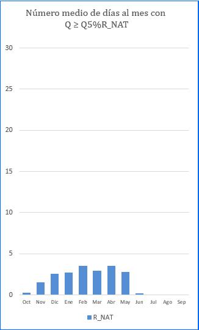

c) <u>Referencias</u>: Richter <em>et a.l</em> (1997) y Baeza <em>et al</em>. (2003) evalúan la estacionalidad en base al día del año en que se produce el caudal máximo diario anual. Growns y Marsh (2000) determinan la estación que alberga el mayor número de flujos mayores que tres y nueve veces la mediana, así como el número de eventos de estas características correspondientes a cada estación.

**TASAS DE CRECIDA Y DEFLUENCIA**

a) <u>Significación ambiental</u>: las tasas de crecida y defluencia de las avenidas están referidas a la rapidez con la que se producen las variaciones de unas magnitudes a otras en el transcurso de una avenida

Las implicaciones ambientales de estas tasas, cuya significación es crucial para la biota, han sido ya expuestas al caracterizar la fluctuación diaria (epígrafe B.4.1.2).

b) <u>Parámetros propuestos</u>: <strong>MÁXIMAS TASAS RELATIVAS EN CRECIDA Y DEFLUENCIA</strong>

La caracterización de las tasas máximas relativas de crecida y defluencia que se presentan en este epígrafe, pueden ser consideradas como pautas de comportamiento límite en la implementación de avenidas con fines eco-geomorfológicos cuando el régimen circulante no respeta las crecidas naturales (por ejemplo, en embalses donde la capacidad del vaso sea muy superior a la aportación de la cuenca, o donde las normas de explotación propicien la laminación de avenidas).

En este proceso de caracterización se trabajará con la serie de registros de caudales medios diarios disponible en régimen natural, y pueden diferenciarse las etapas siguientes:

<strong>1.-</strong> Seleccionar de la serie de caudales medios diarios disponible aquellos máximos (Qmáx) cuyo valor sea superior al de la avenida definida como habitual (<strong>Qmáx&gt;Q</strong> <strong>5%</strong>).

<strong>2.-</strong> Para las avenidas seleccionadas en 1.-, caracterizar su hidrograma con los datos correspondientes a los "a" días anteriores y los "b" días posteriores al día correspondiente al Qmáx.

Los valores de "a" y "b" deberán adoptarse para cada caso concreto, de manera que cubran adecuadamente los tramos de crecida y defluencia de los hidrogramas observados en régimen natural correspondientes a avenidas con Qmáx &gt;Q 5%

**3.-** Clasificar los hidrogramas obtenidos en dos grupos:

- <strong>Grupo I:</strong> constituido por avenidas definidas como "ordinarias", pues siendo superiores a la habitual (Q5%), su Qmáx no supera el valor del Caudal Generador del Lecho (QGL).

<strong>Q5%</strong> <strong>&lt; Qmáx</strong> <strong>&lt; QGL</strong>

- **Grupo II:** constituido por avenidas "extraordinarias" con caudales máximos siempre superiores al Caudal Generador del Lecho

<strong>Qmáx</strong> <strong>&gt; QGL</strong>

<strong>4.-</strong>A continuación, para cada uno de los grupos anteriores, se procede a adimensionalizar los hidrogramas (dividiendo los valores de las ordenadas por el Qmáx correspondiente). Esta operación permite la representación conjunta (<strong>Figura nº22</strong>) de los hidrogramas de cada grupo, y la selección <em>de visu</em> de los tramos correspondientes a las tasas de crecida y defluencia máximas relativas para cada uno de los (a+b+1) días representados.

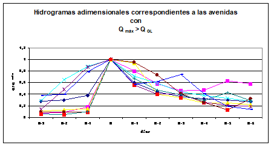

<strong>Figura nº22</strong>- <em>Hidrogramas adimensionales de las avenidas con</em> <strong>Qmáx&gt; QGL</strong><em>, mostrando la selección de los puntos correspondientes a las máximas tasas relativas de crecida y defluencia</em> ■

**5.-** En base a la selección hecha en el punto anterior, conformar un hidrograma patrón (**Figura nº23**) que sea representativo de las máximas tasas relativas observadas

<strong>Figura nº 23</strong>- <em>Hidrograma adimensional representativo de las máximas tasas diarias relativas en crecida y defluencia para avenidas con</em> <strong>Qmáx</strong> <strong>&gt;Q</strong> <strong>GL</strong>

**6.-** Estos valores pueden ser utilizados como referencia de las **máximas tasas relativas** observadas en régimen natural, sirviendo de pauta para establecer en las normas de operación de los órganos de desagüe de la presa unos umbrales máximos acorde con los observados en régimen natural.

c) <u>Referencias</u>:

En la bibliografía consultada se recogen diversos parámetros que intentan caracterizar el proceso de crecida y defluencia de una avenida. Growns y Marsh (2000) y Maingi y Marsh (2001) emplean el número de crecidas y defluencias al año (media, mediana, desviación típica y coeficiente de variación) y la duración de cada avenida (media, mediana, desviación típica y coeficiente de variación) además de otros parámetros relativos a las tasas diarias de incremento y detrimento.

**B.4.3 CARACTERIZACIÓN DE VALORES EXTREMOS MÍNIMOS (SEQUÍAS)**

Siguiendo un procedimiento similar al utilizado en la caracterización de las avenidas, al analizar las sequías se prescindirá de la segregación en años húmedos, medios y secos, trabajando con la serie disponible de mínimos caudales medios diarios anuales (Qs). Y con un razonamiento similar al expuesto para la definición de la avenida habitual (Q5%), en la caracterización de las sequías se introduce el concepto de <strong>sequía habitual,</strong> que será expuesto más detalladamente en epígrafes posteriores, y se define como aquel caudal correspondiente al percentil de excedencia del 95% en la curva de duración de caudales en régimen natural <strong>Q95%</strong>.

La **Figura nº24** recoge el conjunto de las variables empleadas en la caracterización de las sequías:

**MAGNITUD y FRECUENCIA**

**VARIABILIDAD**

**ESTACIONALIDAD**Magnitud

**DURACIÓN**

<strong>Sequías "habituales" (Q</strong> <strong>95%)</strong>

**Períodos con caudal diario Q=0**

**Sequías extremas (Qs)**

<strong>Sequías "habituales" (Q95%)</strong>

**Sequías extremas**

**Sequías "habituales"**

**Qs**

<strong>Q95%</strong>

**Figura nº 24**- Variables empleadas en la caracterización de los valores extremos mínimos

**MAGNITUD Y FRECUENCIA**

a) <u>Significación ambiental</u>: La magnitud de los caudales mínimos tiene implicaciones ambientales a distintos niveles:

- BIOTA ACUÁTICA Y RIPARIA: Influencia en el tamaño, tolerancia y comportamiento trófico de las especies presentes  (Bunn y Arthington, 2002); Alteración en la potencialidad del medio hiporreico por decantación de finos si se extreman las sequías (Sedimentation Committee, 1992); Dispersión de juveniles y adultos por pérdida de conectividad (Strange *et al*., 1999); Mortalidad de ejemplares por quedar atrapados en la llanura de inundación (Arthington, 2002); Los períodos de caudales bajos representan oportunidades de crecimiento y desarrollo para muchas especies en zonas sometidas a inundaciones frecuentes (Poff *et al*., 1997); Control de la dinámica del ecosistema, regulando la intromisión de especies exóticas (Strange *et al*., 1999); Afección a las condiciones hidráulicas determinantes para macroinvertebrados (Gonçalves 2002) y peces (Arthington 2002)
- EN LA CONTINUIDAD LONGITUDINAL, VERTICAL Y TRANSVERSAL DEL CORREDOR FLUVIAL: Mantenimiento de la lámina de agua en los meses de estío y mantenimiento del contenido de humedad en la ribera, posibilitando la supervivencia de la banda riparia en los meses de estío (Richter *et al*., 1998); Desecación de tramos y fragmentación del hábitat (Strange *et al*., 1999); Mantenimiento de la conectividad con el freático (Richter *et al*., 1998); El calado correspondiente a los caudales bajos es fundamental para mantener la conectividad entre pozas y la vitalidad en los rápidos (Thoms y Sheldon, 2002)
- CALIDAD DEL AGUA: Alteración en la capacidad de dilución (Brizga *et al.,* 2001); Alteración en el régimen térmico del agua en los meses más extremos (Brizga *et al.,* 2001)

b) <u>Parámetros propuestos</u>: La magnitud y frecuencia de las sequías se caracteriza mediante dos parámetros:

**P13: MEDIA DE LOS MÍNIMOS CAUDALES DIARIOS ANUALES**

**P14: SEQUÍA HABITUAL**

**Figura nº25**- Extracto de un informe de IAHRIS con la evaluación de los parámetros que caracterizan la magnitud y frecuencia de las sequías

- **P13: MEDIA DE LA SERIE DE MÍNIMOS CAUDALES DIARIOS ANUALES**   como valor representativo de la magnitud media de las sequías extremas.

En la literatura especializada son varios los parámetros referenciados para la caracterización de los valores extremos mínimos: Claussen y Biggs (2000) y Growns y Marsh (2000) utilizan la media de los mínimos diarios anuales, y referencian también el empleo de la mediana. Otros autores, Brizga *et al.* (2001) y Sugiyama *et al*. (2003), estiman caudales mínimos representativos a partir de la curva de percentiles de excedencia (80%, 90% y 97%). Growns y Marsh (2000) caracterizan estos eventos en base a la magnitud de los sucesos que no superan el umbral definido por "a" veces la mediana.

El parámetro aquí propuesto estima la magnitud de las sequías con el valor medio de la serie de caudales medios diarios mínimos anuales (serie Qs).

- <strong>P14: SEQUÍA HABITUAL</strong> o caudal correspondiente, en la curva media de caudales clasificados, al percentil de excedencia del 95% (<strong>Q</strong> <strong>95%</strong>).

El término de sequía habitual introducido en este trabajo surge de la incertidumbre existente al tratar de materializar el concepto de sequía.

Respecto a situaciones extremas con caudales mínimos nos encontramos con el desafío de poder discriminar cuándo estamos ante una situación de sequía en base a un cierto parámetro de magnitud.

El valor medio de la serie de mínimos caudales diarios anuales es un buen instrumento para caracterizar sequías extremas, pero se hace necesario encontrar otro parámetro que, siendo representativo de caudales bajos, no focalice su definición en situaciones límite, sino que sea representativo de los períodos de caudales bajos más habituales.

Por esta razón y al igual que se hizo al caracterizar las avenidas habituales, la curva de caudales clasificados se constituye en un instrumento altamente útil, pues a partir de percentiles de excedencia altos (80%, 90% ó 95%) pueden discriminarse distintos umbrales de caudal que permiten establecer criterios conjuntos de magnitud y presencia; es decir caudales inferiores a estos umbrales (Q80%, Q90% ó Q95%) se presentarán, en término medio, 54, 36 ó 18 días al año respectivamente.

Como umbrales en la curva de caudales clasificados para la caracterización de sequías, encontramos referencias diversas: Growns y Marsh (2000) trabajan con el umbral definido por "a" veces la mediana (Q 50%), con a = ½, 1/3, 1/9; diversos autores (Clausen y Biggs, 2000; Bales y Pope, 2001), seleccionan el percentil del 90% como definitorio de umbral para caudales bajos; Dakova <em>et al</em>. (2000) trabajan con el percentil del 95% de las medias mensuales, valor definitorio del mínimo caudal mensual en la legislación búlgara; Maingi y Marsh (2002) fijan el límite en el percentil de excedencia del 75%; King <em>et al</em>. (1999) citan el 80% como umbral que asegura un hábitat mínimo para adultos, producción de macroinvertebrados y mantenimiento de la cubierta vegetal.

No obstante, al igual que se formuló para avenidas, es necesario paliar la falta de información inherente a la curva de caudales clasificados respecto a la distribución temporal de los períodos con caudales inferiores al elegido. Por ello, se propone determinar para el percentil seleccionado cual es el **número de días consecutivos,** como media, en que el caudal toma valores inferiores al correspondiente a dicho percentil y comprobar que esta permanencia en el cauce es superior a siete días, valor referenciado en la literatura especializada como período mínimo con significación ecológica (Bales y Pope, 2001).

Por analogía al 5% elegido para avenidas, se ha seleccionado el percentil de excedencia del 95%, <strong>Q95%</strong>, como umbral por debajo del cual podemos concluir que estamos ante una <strong>sequía habitual</strong>, correspondiendo a este percentil una presencia media al año de 18 días (<strong>Figura nº26</strong>).

<strong>Figura nº26</strong>- Discriminación del umbral definitorio de sequías <strong>Q95%</strong> a partir de la curva de caudales clasificados

**DETALLE**

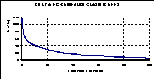

**Q 95%**

**RANGO DE SEQUÍAS HABITUALES**

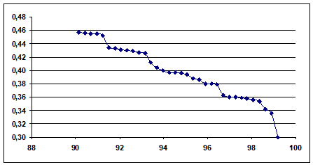

Si bien la variable seleccionada lo ha sido sólo para un parámetro de magnitud, al tratarse de un valor vinculado a una probabilidad de excedencia (Q95%) lleva implícito una estrecha vinculación con la frecuencia (percentil de excedencia = 1- frecuencia relativa acumulada) por lo que el parámetro propuesto para magnitud aporta también información respecto a frecuencia.

c) Referencias:

**REFERENCIA**

**PARÁMETRO**

**DEFINICIÓN**

**Clausen y Biggs** (2000)

Q90/Q50

Cociente entre el valor del caudal que es igualado o excedido un 90% del tiempo y el valor correspondiente al 50%

/ Q50

Media de los caudales medios diarios mínimos anuales entre el caudal correspondiente al percentil del 50%

Indice del caudal base

Volumen correspondiente al caudal base entre el volumen correspondiente al flujo total

<strong>Brizga</strong> <em>et al.</em> (2001)

% de excedencia diaria para 10 y 30 cm.

Porcentaje de días respecto al total del período en que el caudal medio diario supone un calado ≥ 10 cm. en secciones críticas (rápidos). Análoga definición para 30 cm.

Q80 y Q90

Caudales correspondientes a los percentiles de excedencia del 80% y 90% respectivamente.

**Growns y Marsh** (2000)

aQ50

Nº de eventos que no superan el umbral definido por "a" veces la mediana

10% Q medio diario anual**\***

Nº de eventos que no superan el umbral definido por el 10% del Q medio diario

Media y mediana de la serie de mínimos caudales medios diarios anuales

<strong>Richter</strong> <em>et al.,</em> (1995)

y Q3d, Q7d, Q30d y Q90d

Media de los caudales mínimos diarios anuales y de los correspondientes a pasos de 3, 7, 30 y 90 días.

**Bales y Pope** (2001)

7Q10

Mínimo valor de siete días consecutivos que como promedio ocurre una vez cada diez años.

<strong>Sugiyama</strong> <em>et al</em>., (2003)

Q97 10

Caudal correspondiente al percentil de excedencia del 97% para una serie de 10 años.

<strong>\*</strong>el método Tennant reconoce el 10% del caudal medio diario anual como el mínimo flujo recomendado para mantener a corto plazo el hábitat imprescindible para la mayor parte de la biota acuática (King <em>et al</em>., 1999)

con a = ½, 1/3, 1/9

Magnitud de aquellos eventos que no superan el umbral definido por "a" veces la mediana

Magnitud de los eventos que no superan el umbral definido por el 10% del Q medio diario

**Tabla nº 7.-** Referencias relativas a la estimación de la magnitud de valores extremos mínimos

**VARIABILIDAD**

a) <u>Significación ambiental</u>: es de gran trascendencia para la biota que los valores mínimos circulantes, al igual que los máximos, fluctúen dentro de unos rangos compatibles con sus requerimientos y que estas fluctuaciones sean además predecibles por los organismos afectados, pues es la predictibilidad de ciertos eventos, especialmente de los valores extremos, la salvaguarda que permite la adaptación a ellos de los ciclos de vida de las especies (González del Tánago y García de Jalón, 1995). Esta variabilidad juega un papel director en la dinámica del ecosistema fluvial (Brizga <em>et al.,</em> 2001), de modo que se constata que una pérdida de la misma puede originar:

- Afecciones diversas al bentos, favoreciendo a unas especies en detrimento de otras (Jowet, 2000)
- Afección a la dinámica vegetal, intromisión en la sucesión y en la competencia no excluyente (Poff *et al*., 1997)
- Pérdida de diversidad en la ictiofauna (Richter *et al*., 1998)

b) <u>Parámetros propuestos</u>:

- **P15: COEFICIENTE DE VARIACIÓN DE LA SERIE DE MÍNIMOS CAUDALES DIARIOS ANUALES CV (Qs)**
- <strong>P16: COEFICIENTE DE VARIACIÓN DE LA SERIE DE CAUDALES CORRESPONDIENTES A LA SEQUÍA HABITUAL, CV (Q</strong> <strong>95%)</strong>

**Figura nº27**- Extracto de un informe de IAHRIS con la evaluación de los parámetros que caracterizan la variabilidad de las sequías

# 2 <u>Referencias</u>: Richter <em>et al.</em> (1997) emplea el coeficiente de variación de la serie de mínimos caudales diarios anuales

**DURACIÓN**

a) <u>Significación ambiental</u>: las alteraciones ambientales derivadas de distorsiones en la duración de las sequías están fuertemente ligadas a otros aspectos tales como su magnitud y frecuencia y muchos de los comentarios sobre la significación ambiental de los índices de magnitud y variabilidad pueden igualmente realizarse ahora. Lytle y Poff (2004) presentan una relación exhaustiva de adaptaciones en el ciclo de vida, en el comportamiento y en las adaptaciones morfológicas de especies animales y vegetales a los eventos extremos de avenidas y sequías. Dicho trabajo concluye que el modo en que los organismos se han adaptado a estos eventos es el factor determinante de su vulnerabilidad frente a diferentes alteraciones en el régimen de caudales, quedando como interrogante abierto cual es la facilidad de adaptación como respuesta a estas alteraciones.

Se reseñan también los efectos siguientes:

- EN LA BIOTA ACUÁTICA Y RIPARIA: Afección si se altera la tolerancia de las comunidades de macroinvertebrados y peces a la duración de la sequía (Poff *et al*., 1997); Influencia en el tamaño, tolerancia y comportamiento trófico de la ictiofauna presente, observando ejemplares más pequeños, y predominio de especies más generalistas si persisten los períodos de aguas bajas (Bunn y Arthington, 2002); Pérdida de sincronía con la temperatura y la duración del día, pudiendo impactar en las pautas reproductivas y de crecimiento de las especies (Poff *et al*., 1997); Pérdida en las condiciones del hábitat fluvial si se altera la duración de los períodos secos (Martínez de Azagra y Sanz, 2003)
- EN EL CICLO DE NUTRIENTES: Afección al ciclo del nitrógeno, debido a que la duración de los caudales bajos posibilita la secuencia de condiciones aerobias-anaerobias necesaria para completar dicho ciclo (Pinay *et al*., 2002); Afección a la mineralización de muchos compuestos orgánicos, afectando a la fertilidad del suelo (Pinay *et al*., 2002).

Estos comentarios referentes a la significación ambiental de la duración de los períodos secos pueden ser matizados más intensamente cuando nos referimos a períodos de caudal nulo. La ausencia de caudal es un aspecto de gran trascendencia biológica dentro del régimen hidrológico (Growns y Marsh, 2000), pues determina las condiciones de vida más críticas para la biocenosis y la posible alteración de la estructura del ecosistema si se supera su capacidad de resiliencia.

b) <u>Parámetros propuestos</u>:

- <strong>P 17: MÁXIMO NÚMERO DE DÍAS CONSECUTIVOS CON CAUDAL MENOR O IGUAL AL Q95%</strong>
- **P18: NÚMERO MEDIO DE DÍAS AL MES CON CAUDAL DIARIO NULO**

**Figura nº28**- Extracto de un informe de IAHRIS con la evaluación de los parámetros que caracterizan la duración de las sequías

**Figura nº29**- Extracto de un informe de IAHRIS con la evaluación de los parámetros que caracterizan la duración de los períodos de cese de caudal

**Figura nº30**- Extracto de un informe de IAHRIS con el gráfico representativo de la estacionalidad de los periodos de cese de caudal

Puede plantearse un razonamiento semejante al expuesto respecto a la caracterización de la duración de las avenidas:

***¿cuánto dura una sequía? ¿cuándo empieza? ¿cuándo termina?***

***Y sobre todo, ¿cómo homogeneizar estos criterios teniendo en cuenta la variabilidad intrínseca en magnitud y duración de estos fenómenos?***

El procedimiento más habitual para caracterizar la duración de los períodos secos es determinar el número de días o de períodos de días consecutivos en que no se supera un umbral determinado (Richter *et al*., 1997; Growns y Marsh, 2000; Brizga *et al*., 2001; Baeza *et al*., 2003), definiéndose el umbral mediante variables hidráulicas como un calado mínimo, o a partir de un caudal definido por "a" veces la mediana, o a partir de la curva de caudales clasificados. Otros autores se basan en procesos de medias móviles (Richter *et al.,* 1997; Palau 1998; Growns y Marsh, 2000; Bales y Pope, 2001).

En este trabajo se propone estimar para cada año de la serie cual es el máximo número de días consecutivos en que no se iguala o supera el umbral del Q 95%. El parámetro final se calcula como la media para la serie de n años. En definitiva, se trata de caracterizar el valor medio del máximo número de días secos consecutivos al año, entendiendo por día seco aquel cuyo caudal es inferior al Q 95%. Este parámetro así calculado, permite estimar la máxima permanencia continuada en el cauce de caudales inferiores al correspondiente a un día seco. Es obvio que en el caso de sequías muy prolongadas pero que presenten una fase intermedia de recuperación (días con caudal medio diario&gt; Q 95%), el índice propuesto fragmentaría la duración total del período seco, estimándose exclusivamente el período parcial de mayor duración.

- **P18: NÚMERO MEDIO DE DÍAS AL MES CON CAUDAL DIARIO NULO**

El estudio de los períodos de caudal nulo, dada su trascendencia ambiental, aparece bien referenciado en la literatura especializada (Richter *et al*., 1997; Growns y Marsh, 2000) estimando el número total de días con caudal nulo en la serie, o la media anual, o el porcentaje de meses con algún día de caudal nulo. El parámetro aquí propuesto se obtiene como el valor medio del número de días al mes que presentan un caudal diario igual a cero.

c) <u>Referencias</u>:

<table><tr><td>
<strong>REFERENCIA</strong>
</td><td>
<strong>PARÁMETRO</strong>
</td><td>
<strong>DEFINICIÓN</strong>
</td></tr><tr><td rowspan="3">
<strong>Brizga <em>et al.</em></strong> (2001)
</td><td>
Nº de períodos secos 
</td><td>
Nº de períodos de días consecutivos en los cuales no se superó un calado de 10 cm. y con duración igual o superior a 1, 3, 6 y 9 meses.
</td></tr><tr><td>
Duración de flujos&lt; 1ML/día 
</td><td>
Porcentaje de días respecto al total del período en que el caudal medio diario es inferior a 1 ML/día
</td></tr><tr><td>
Número de períodos &lt; umbral 
</td><td>
Nº de períodos de días consecutivos con caudal medio diario &lt; umbral y con duración igual o superior a 1, 3, 6 y 9 meses.
</td></tr><tr><td rowspan="2">
<strong>Baeza <em>et al</em>. </strong>(2003)
</td><td>
NQ10%
</td><td>
Número de días en que no se alcanza un caudal mínimo representando por el 10% del caudal modular
</td></tr><tr><td>
Q7d, Q25d y Q100d
</td><td>
Valor medio de los mínimos de cada año de la serie de medias móviles con pasos de 7, 25 y 100 días
</td></tr><tr><td rowspan="3">
<strong>Growns y Marsh </strong>(2000)
</td><td>
a*Q50

con a = ½, 1/3, 1/9 
</td><td>
Duración de los eventos que no superan el umbral definido por "a" veces la mediana
</td></tr><tr><td>
10% Q medio diario
</td><td>
Duración de los eventos que no superan el umbral definido por el 10% del Q medio diario anual
</td></tr><tr><td>
Q30d y Q90d 
</td><td>
Mediana y media de los mínimos anuales para medias móviles con paso de 30 y 90 días
</td></tr><tr><td>
<strong>Bales y Pope </strong>(2001)
</td><td>
Q7d y Q30d
</td><td>
Media de los mínimos anuales para medias móviles con paso de 7 y 30 días
</td></tr><tr><td>
<strong>Richter <em>et al.</em> </strong>(1997)
</td><td>
Q75 %
</td><td>
Nº medio y duración media de flujos que no superan el percentil del 75% en la curva de caudales clasificados
</td></tr></table>

**Tabla nº 8.-** Referencias relativas a la estimación de la duración de valores extremos mínimos

<table><tr><td>
<strong>REFERENCIA</strong>
</td><td>
<strong>PARÁMETRO</strong>
</td><td>
<strong>DEFINICIÓN</strong>
</td></tr><tr><td rowspan="3">
<strong>Growns y Marsh </strong>(2000)
</td><td rowspan="3">
Días con Q = 0

 
</td><td>
Número total de días con Q = 0 en los registros de la serie
</td></tr><tr><td>
Número medio de días por año con Q = 0
</td></tr><tr><td>
Porcentaje de meses que tienen algún día con Q = 0
</td></tr><tr><td rowspan="2">
<strong>Richter </strong><em>et al</em> (1997)
</td><td>
Días con Q = 0
</td><td>
Número total de días con Q = 0 en los registros de la serie
</td></tr><tr><td>
Caudal base
</td><td>
Cociente entre el caudal mínimo para 7 días consecutivos y el caudal medio anual.
</td></tr></table>

**Tabla nº 9.-** Referencias relativas a la estimación de la duración de períodos de caudal nulo

**ESTACIONALIDAD**

a) <u>Significación ambiental</u>: la estacionalidad de las sequías de no respetar las pautas naturales puede producir fuertes distorsiones en el funcionamiento del río como ecosistema. La razón de ello es la pérdida de sincronía con los ciclos vitales de las especies afectadas, además de múltiples efectos autoacumulables sobre otras variables ambientales. Como ejemplo de afecciones sobre la biota acuática y riparia se recogen las referencias siguientes:

- Estrés fisiológico en muchas especies si se prolongan los períodos secos (Poff *et a*l., 1997)
- Un incremento de los caudales circulantes en verano puede alterar la dinámica vegetal, favoreciendo a las especies más generalistas (Strange *et al.,* 1999)
- Afección diversa, dependiendo de su sensibilidad a los cambios según diferentes aspectos: época de freza, período de desarrollo larvario, huevos flotantes, reducción del hábitat, etc. (Strange *et al.,* 1999; Poff et al., 1997)
- Pérdida de sincronía con la temperatura y la duración del día, que puede afectar a la reproducción y crecimiento de las especies (Poff *et al.,* 1997)
- Pérdida de sincronía en la respuesta de los organismos a la recesión de caudales según pautas que permitan el aprovechamiento de nutrientes, desarrollo de semillas, sostenimiento del bentos y migración de juveniles a hábitats más favorables (Arthington 2002)
- Pérdida de sincronía con la fenología de muchas especies animales, afectando a las pautas reproductivas, migración, freza, incubación, supervivencia de las larvas, crecimiento y desarrollo (Naiman *et al.,* 2000)
- La pérdida de la estacionalidad favorece a las especies exóticas, originando una pérdida de biodiversidad (Bunn y Arthington, 2002).
- Alteración en el estado de diapausa sincronizado con los períodos secos (Lytle y Poff, 2004)

# 3 <u>Parámetro propuesto</u><strong>P19: NÚMERO MEDIO DE DÍAS AL MES CON CAUDAL INFERIOR AL Q</strong> <strong>95%</strong> 

**Figura nº31**- Extracto de un informe de IAHRIS con la evaluación de los parámetros que caracterizan la estacionalidad de las sequías

La estacionalidad o temporalidad de las sequías es caracterizada en las fuentes consultadas con varios enfoques: Richter *et al.* (1997) utiliza como parámetro el día del año en que se presenta el mínimo anual y Growns y Marsh (2003) determinan la estación del año que alberga el mayor número de flujos inferiores a un tercio de la mediana.

El parámetro propuesto en este trabajo caracteriza la estacionalidad evaluando la presencia o ausencia de <strong>días secos</strong> en un mes determinado, es decir aquellos días con caudal medio diario inferior al que define la sequía habitual en régimen natural (Q 95%).

El conteo se realiza para cada mes y año de la serie, obteniéndose al final doce valores representativos del número medio de días al mes que presentan una caudal medio diario inferior al Q 95%.

**C                            ÍNDICES DE ALTERACIÓN HIDROLÓGICA: ASPECTOS GENERALES**

<strong>C.1</strong>  <strong><u>ÍNDICES PARCIALES_</u></strong>

Habiendo constatado en los epígrafes anteriores el papel vertebrador que juega el régimen natural de caudales en el funcionamiento del ecosistema fluvial, es fundamental conocer en qué grado el régimen actualmente circulante, distinto del natural (**régimen alterado**) difiere o se asemeja al natural, dado que estas analogías y diferencias revertirán en la integridad del ecosistema fluvial. Este régimen alterado puede ser el régimen actual circulante como resultado real de un aprovechamiento y/o regulación, o cualquier otro régimen propuesto resultado de una simulación como respuesta a distintos escenarios de gestión incluyendo los regímenes ecológicos o ambientales.

Con el objetivo de evaluar esta alteración se proponen un conjunto de índices numéricos, denominados **Índices de Alteración Hidrológica (IAH)** que, abordando los aspectos anteriormente expuestos, evalúen la distorsión originada en los caudales circulantes respecto a la situación natural:

- Si las series disponibles en natural y alterado cumplen la condición de coetaneidad con al menos 15 años comunes, la evaluación de la alteración se realizará según los índices recogidos en la **Tabla nº11**. La explicación detallada de estos índices se recoge en el **epígrafe D.**
- En el caso de análisis de alteración en situación de no coetaneidad con al menos 15 años, los índices para valores habituales difieren de los anteriores, proponiéndose los recogidos en la **Tabla nº12**. La explicación detallada de los mismos puede consultarse en el **epígrafe E.**
- La aplicación permite el análisis de series inferiores a 15 años, siempre que se disponga de al menos siete años completos de registros. En esta situación (disponibilidad entre 7 y 14 años en alguno de los dos regímenes), el tipo de estudio se denomina con SERIE REDUCIDA y será detallada en el Anexo 1 de este documento.

<table><tr><td colspan="5">
<strong><em>Tabla nº11:</em></strong><em> RELACIÓN DE ÍNDICES DE ALTERACIÓN PARA REGÍMENES COETÁNEOS con al menos 15 años de datos. Los índices de avenidas y sequías sólo pueden calcularse si el usuario ha facilitado datos a nivel diario</em>
</td></tr><tr><td colspan="2">
ASPECTO
</td><td>
CODIGO
</td><td>
DENOMINACIÓN
</td><td>
Parámetro del que proviene
</td></tr><tr><td rowspan="6">
VALORES HABITUALES
</td><td rowspan="2">
<strong>MAGNITUD</strong>
</td><td>
IAH 1
</td><td>
Magnitud de las aportaciones anuales
</td><td rowspan="2">
<strong>P1</strong>
</td></tr><tr><td>
IAH 2
</td><td>
Magnitud de las aportaciones mensuales 
</td></tr><tr><td rowspan="2">
<strong>VARIABILIDAD</strong>
</td><td>
IAH 3
</td><td>
Variabilidad habitual
</td><td>
<strong>P4</strong>
</td></tr><tr><td>
IAH 4
</td><td>
 Variabilidad extrema
</td><td>
<strong>P2</strong>
</td></tr><tr><td rowspan="2">
<strong>ESTACIONALIDAD</strong>
</td><td>
IAH 5
</td><td>
Estacionalidad de máximos
</td><td rowspan="2">
<strong>P3</strong>
</td></tr><tr><td>
IAH 6
</td><td>
Estacionalidad de mínimos
</td></tr><tr><td rowspan="7">
AVENIDAS
</td><td rowspan="4">
<strong>MAGNITUD Y FRECUENCIA</strong>
</td><td>
IAH 7
</td><td>
Magnitud de las avenidas máximas
</td><td>
<strong>P5</strong>
</td></tr><tr><td>
IAH 8
</td><td>
Magnitud del Caudal Generador del Lecho
</td><td>
<strong>P6</strong>
</td></tr><tr><td>
IAH 9
</td><td>
Magnitud del Caudal de conectividad
</td><td>
<strong>P7</strong>
</td></tr><tr><td>
IAH 10
</td><td>
Magnitud de las avenidas habituales
</td><td>
<strong>P8</strong>
</td></tr><tr><td rowspan="2">
<strong>VARIABILIDAD</strong>
</td><td>
IAH 11
</td><td>
Variabilidad de las avenidas máximas
</td><td>
<strong>P9</strong>
</td></tr><tr><td>
IAH 12
</td><td>
Variabilidad de las avenidas habituales
</td><td>
<strong>P10</strong>
</td></tr><tr><td>
<strong>DURACION</strong>
</td><td>
IAH 13
</td><td>
Duración de avenidas
</td><td>
<strong>P11</strong>
</td></tr><tr><td></td><td>
<strong>ESTACIONALIDAD</strong>
</td><td>
IAH 14
</td><td>
Estacionalidad de avenidas 

(12 valores, uno para cada mes)
</td><td>
<strong>P12</strong>
</td></tr><tr><td rowspan="7">
SEQUÍAS
</td><td rowspan="2">
<strong>MAGNITUD Y FRECUENCIA</strong>
</td><td>
IAH 15
</td><td>
Magnitud de las sequías extremas
</td><td>
<strong>P13</strong>
</td></tr><tr><td>
IAH 16
</td><td>
Magnitud de las sequías habituales
</td><td>
<strong>P14</strong>
</td></tr><tr><td rowspan="2">
<strong>VARIABILIDAD</strong>
</td><td>
IAH 17
</td><td>
Variabilidad de las sequías extremas
</td><td>
<strong>P15</strong>
</td></tr><tr><td>
IAH 18
</td><td>
Variabilidad de las sequías habituales
</td><td>
<strong>P16</strong>
</td></tr><tr><td rowspan="2">
<strong>DURACION</strong>
</td><td>
IAH 19
</td><td>
Duración de sequías
</td><td>
<strong>P17</strong>
</td></tr><tr><td>
IAH 20
</td><td>
Nº de días con caudal nulo 

(12 valores, uno para cada mes)
</td><td>
<strong>P18</strong>
</td></tr><tr><td>
<strong>ESTACIONALIDAD</strong>
</td><td>
IAH 21
</td><td>
Estacionalidad de sequías 

(12 valores, uno para cada mes)
</td><td>
<strong>P19</strong>
</td></tr><tr><td></td><td></td><td></td><td></td><td></td></tr><tr><td></td><td>
<strong>21 ÍNDICES</strong>
</td><td></td><td colspan="2">
Índice desglosado por tipo de año, como resumen se ofrece el valor ponderado
</td></tr><tr><td></td><td></td><td></td><td colspan="2">
Índice especificado a nivel mensual, como resumen se ofrece la media anual
</td></tr></table>

<table><tr><td colspan="5">
<strong><em>Tabla nº12</em></strong><em>: RELACIÓN DE ÍNDICES DE ALTERACIÓN PARA REGÍMENES NO COETÁNEOS con al menos 15 años de datos. Los índices de avenidas y sequías sólo pueden calcularse si el usuario ha facilitado datos a nivel diario</em>
</td></tr><tr><td colspan="2">
ASPECTO
</td><td>
CODIGO
</td><td>
DENOMINACIÓN
</td><td>
Parámetro del que proviene
</td></tr><tr><td rowspan="10">
VALORES HABITUALES
</td><td rowspan="3">
<strong>MAGNITUD</strong>
</td><td>
<strong>M1</strong>
</td><td>
Magnitud de las aportaciones anuales
</td><td rowspan="4">
<strong>P1</strong>
</td></tr><tr><td>
<strong>M2</strong>
</td><td>
Magnitud de las aportaciones mensuales 
</td></tr><tr><td>
<strong>M3</strong>
</td><td>
Magnitud de las aportaciones de cada mes: 12 valores
</td></tr><tr><td rowspan="4">
<strong>VARIABILIDAD</strong>
</td><td>
<strong>V1</strong>
</td><td>
Variabilidad de las aportaciones anuales
</td></tr><tr><td>
<strong>V2</strong>
</td><td>
 Variabilidad de las aportaciones mensuales 
</td><td rowspan="3">
<strong>P2</strong>
</td></tr><tr><td>
<strong>V3</strong>
</td><td>
Variabilidad de las aportaciones de cada mes: 12 valores
</td></tr><tr><td>
<strong>V4</strong>
</td><td>
Variabilidad extrema
</td></tr><tr><td></td><td>
<strong>IAH 3</strong>
</td><td>
Variabilidad habitual
</td><td>
<strong>P4</strong>
</td></tr><tr><td rowspan="2">
<strong>ESTACIONALIDAD</strong>
</td><td>
<strong>E1</strong>
</td><td>
Estacionalidad de máximos
</td><td rowspan="2">
<strong>P3</strong>
</td></tr><tr><td>
<strong>E2</strong>
</td><td>
Estacionalidad de mínimos
</td></tr><tr><td rowspan="7">
AVENIDAS
</td><td rowspan="4">
<strong>MAGNITUD Y FRECUENCIA</strong>
</td><td>
<strong>IAH 7</strong>
</td><td>
Magnitud de las avenidas máximas
</td><td>
<strong>P5</strong>
</td></tr><tr><td>
<strong>IAH 8</strong>
</td><td>
Magnitud del Caudal Generador del Lecho
</td><td>
<strong>P6</strong>
</td></tr><tr><td>
<strong>IAH 9</strong>
</td><td>
Magnitud del Caudal de conectividad
</td><td>
<strong>P7</strong>
</td></tr><tr><td>
<strong>IAH 10</strong>
</td><td>
Magnitud de las avenidas habituales
</td><td>
<strong>P8</strong>
</td></tr><tr><td rowspan="2">
<strong>VARIABILIDAD</strong>
</td><td>
<strong>IAH 11</strong>
</td><td>
Variabilidad de las avenidas máximas
</td><td>
<strong>P9</strong>
</td></tr><tr><td>
<strong>IAH 12</strong>
</td><td>
Variabilidad de las avenidas habituales
</td><td>
<strong>P10</strong>
</td></tr><tr><td>
<strong>DURACION</strong>
</td><td>
<strong>IAH 13</strong>
</td><td>
Duración de avenidas
</td><td>
<strong>P11</strong>
</td></tr><tr><td></td><td>
<strong>ESTACIONALIDAD</strong>
</td><td>
<strong>IAH 14</strong>
</td><td>
Estacionalidad de avenidas (12 valores, uno para cada mes)
</td><td>
<strong>P12</strong>
</td></tr><tr><td rowspan="6">
SEQUÍAS
</td><td rowspan="2">
<strong>MAGNITUD Y FRECUENCIA</strong>
</td><td>
<strong>IAH 15</strong>
</td><td>
Magnitud de las sequías extremas
</td><td>
<strong>P13</strong>
</td></tr><tr><td>
<strong>IAH 16</strong>
</td><td>
Magnitud de las sequías habituales
</td><td>
<strong>P14</strong>
</td></tr><tr><td rowspan="2">
<strong>VARIABILIDAD</strong>
</td><td>
<strong>IAH 17</strong>
</td><td>
Variabilidad de las sequías extremas
</td><td>
<strong>P15</strong>
</td></tr><tr><td>
<strong>IAH 18</strong>
</td><td>
Variabilidad de las sequías habituales
</td><td>
<strong>P16</strong>
</td></tr><tr><td rowspan="2">
<strong>DURACION</strong>
</td><td>
<strong>IAH 19</strong>
</td><td>
Duración de sequías
</td><td>
<strong>P17</strong>
</td></tr><tr><td>
<strong>IAH 20</strong>
</td><td>
Nº de días con caudal nulo (12 valores, uno para cada mes)
</td><td>
<strong>P18</strong>
</td></tr><tr><td></td><td>
<strong>ESTACIONALIDAD</strong>
</td><td>
<strong>IAH 21</strong>
</td><td>
Estacionalidad de sequías (12 valores, uno para cada mes)
</td><td>
<strong>P19</strong>
</td></tr><tr><td></td><td></td><td></td><td></td><td></td></tr><tr><td></td><td>
<strong>25 ÍNDICES</strong>
</td><td></td><td colspan="2">
Índices similares a los ya definidos para series coetáneas 
</td></tr><tr><td></td><td></td><td></td><td colspan="2">
Índice especificado a nivel mensual, como resumen se ofrece la media anual
</td></tr></table>

**EXPRESIÓN GENERAL**

Conceptualmente los Índices de Alteración pueden definirse como cociente entre el valor del parámetro de caracterización en régimen alterado y el valor de ese mismo parámetro en régimen natural:

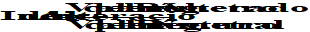

Esta expresión debe recogerse en un sentido estrictamente teórico y conceptual. En la práctica este "cociente entre parámetros" se modula o matiza en función de las características y peculiaridades del parámetro utilizado.

En la <strong>Tabla nº10</strong>, los cuatro índices relativos a la estacionalidad <strong>(IAH 5, IAH 6, IAH 14,</strong> e <strong>IAH 21</strong>) escapan de esta expresión general y sus particularidades serán analizadas con más detalle posteriormente.

Cuando se trabaja con parámetros que discriminan según el tipo de año (por ejemplo, los relativos a valores habituales), los índices correspondientes (<strong>AH 1 –IAH 6</strong>) se calculan en una primera etapa de forma independiente para cada tipo de año. Una vez obtenidos los valores Índice año húmedo, Índice año medio e Índice año seco se obtiene el valor final del índice como media ponderada según el porcentaje de presencia de cada tipo de año en la serie:

.

**CÁLCULO DEL VALOR FINAL DE LOS ÍNDICES QUE DISCRIMINAN SEGÚN EL "TIPO DE AÑO"**

<strong>ÍNDICE = 0,25 \* Índice</strong> <strong>año húmedo</strong> <strong>+ 0,5\* Índice</strong> <strong>año medio</strong> <strong>+ 0,25\* Índice</strong> <strong>año seco</strong>

Dado que la discriminación en tipos de años (ver epígrafe B.2) presupone que:

- Un año húmedo se presenta como promedio el 25% de las veces
- Un año medio se presenta un 50% de las veces
- Un año seco se presenta un 25% de las veces

**RANGO E INTERPRETACIÓN**

Todos los índices propuestos están acotados inferiormente por 0, no estando definido a priori su límite superior.

**0< INDICE < límite superior (habitualmente = 1)**

Con el objetivo de trabajar siempre con índices acotados entre 0 y 1, en aquellas situaciones en que **IAH >1**, se sustituirá el valor obtenido por su inverso. De este modo no se modifica la proporcionalidad en la alteración de un régimen respecto a otro, y sin embargo se evitan las compensaciones que se producirían en el cálculo de la alteración global al trabajar con índice mayores y menores que 1. En esos casos la aplicación informa con un \* de esta circunstancia.

También se señalan la presencia de indeterminaciones en el cálculo de los índices, motivados por valores igual a cero en el denominador.

**Interpretación:**

- Un valor de **IAH = 0** es indicativo de **alteración máxima**
- Un valor de **IAH = 1** es indicativo de **ausencia de alteración**

<strong>C.2.</strong>  <strong><u>ÍNDICES DE ALTERACIÓN GLOBAL</u></strong>

Una vez han sido calculados los índices **AH 1** a **AH 21**, es necesario obtener una cuantificación global que aúne el resultado de los índices relativos a cada componente del régimen de caudales (valores habituales, avenidas y sequías)

Se define así el Índice de Alteración Global (**IAG**) como índice integrador de aquellos índices parciales que evalúan la alteración sobre los diferentes aspectos de un componente del régimen de caudales.

Existirán por consiguiente tres índices globales:

<strong>IAGH:</strong>	Índice de Alteración Global sobre valores habituales, obtenido a partir de los índices de alteración <strong>AH 1</strong> a <strong>IAH 6</strong>

<strong>IAGA:</strong>	Índice de Alteración Global sobre avenidas, obtenido a partir de los índices de alteración <strong>IAH 7</strong> a <strong>IAH 14</strong>

<strong>IAGS:</strong>	Índice de Alteración Global sobre sequías, obtenido a partir de los índices de alteración <strong>IAH 15</strong> a <strong>AH 21</strong>

**RÉGIMEN NATURAL DE CAUDALES**

**Aspectos con significación ecológica**\*

M

**E**

**V**

**Índices de Alteración**

**Índice de Alteración Global**

**Avenidas**

<strong>IAG</strong> <strong>A</strong>

**Sequías**

<strong>IAG</strong> <strong>S</strong>

**Valores habituales**

<strong>IAG</strong> <strong>H</strong>

**Valores habituales**

**Avenidas**

**RÉGIMEN NATURAL DE CAUDALES**

**Sequías**

**Componentes críticos en la regulación de los procesos ambientales**

E

D

V

\*

IAH20

IAH21

IAH19

IAH17

IAH18

IAH15

IAH16

IAH14

IAH13

IAH11

IAH12

IAH7

IAH8

IAH9

IAH10

IAH5

IAH6

IAH3

IAH4

IAH1

IAH2

**Cuantificación global de la alteración sobre el Régimen Natural de Caudales**

\*Aspectos del régimen de caudales con significación ecológica:  **M** = magnitud, **V** = variabilidad,

**D** = duración, **E** = Estacionalidad

**Figura nº32**- Esquema del proceso de valoración de la alteración hidrológica

Es obvio que el cálculo del <strong>IAG</strong> correspondiente a un determinando componente exige el cálculo previo de los índices de alteración correspondientes.   Por ejemplo, supongamos que la estimación en régimen alterado de los índices <strong>AHj- AHk- AHl</strong> <strong>- AHm- AHn- AHp</strong> <strong>- AHq</strong> arroja los valores <strong>aj-- ak- al</strong> <strong>- am- an- ap</strong> <strong>- aq</strong> tal y como se recoge en la tabla de la <strong>Fig. nº33</strong>. Puede observarse en esta Figura que el valor asignado a cualquier índice en régimen natural es 1, por ser esta cifra indicativa de la ausencia de alteración.

La representación gráfica de estas dos series de valores en un plano con tantos ejes como índices, daría como resultado dos recintos poligonales, donde la línea azul corresponde a los valores obtenidos para régimen natural (1 para todos ellos) y la línea roja a los obtenidos en régimen alterado (<strong>aj</strong> <strong>- ak- al</strong> <strong>- am- an- ap</strong> <strong>- aq</strong> respectivamente).

**INDICE**

**Rég. Nat**

**Rég. Alt**

<strong>j</strong>

**1**

<strong>a</strong> <strong>j</strong>

<strong>k</strong>

<strong>a</strong> <strong>k</strong>

<strong>l</strong>

<strong>a</strong> <strong>l</strong>

<strong>m</strong>

<strong>a</strong> <strong>m</strong>

<strong>n</strong>

<strong>a</strong> <strong>n</strong>

<strong>p</strong>

<strong>a</strong> <strong>p</strong>

<strong>q</strong>

<strong>a</strong> <strong>q</strong>

**Figura nº 33**- Cálculo del Indice de Alteración Global (IAG) a partir de los índices parciales (IAH)

Dada una secuencia determinada de los Índices de alteración (por ejemplo, la secuencia  <strong>AHj-- AHk- AHl</strong> <strong>- AHm- AHn- AHp</strong> <strong>- AHq</strong> ), el <strong>IAG</strong> correspondiente se calcula como el cociente entre el área definida por el polígono del régimen alterado y la correspondiente al polígono del régimen natural, pudiendo obtenerse fácilmente con la expresión:

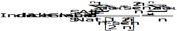

**Ec.1**

.

siendo:

**S Alt**: superficie definida por el polígono en régimen alterado

**S Nat**: superficie definida por el polígono en régimen natural

<strong>a</strong> <strong>i:</strong> valor del índice <strong>IAH</strong> <strong>i</strong> en régimen alterado

<strong>a</strong> <strong>i+ 1:</strong> valor del índice <strong>IAH</strong> <strong>i+1</strong> en régimen alterado

**n =**	nº de índices de alteración que evalúan un aspecto del régimen de caudales

El IAG así definido depende de la ordenación relativa de los índices i.

Para evitar esta dependencia se redefine el Índice de Alteración Global (<strong>IAG</strong>) como el valor medio de los índices globales correspondientes a las diferentes posibilidades de ordenación relativa de los <strong>n</strong> índices parciales. En adelante se denominará con las siglas <strong>iag</strong> al índice de alteración global obtenido para una postura determinada de los índices de alteración i.

Si suponemos <strong>n</strong> índices <strong>AHi</strong>, existirán <strong>n!</strong> índices <strong>iag</strong> correspondientes a las <strong>n!</strong> posibilidades de ordenación.

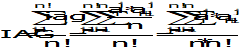

**Ec. 2**

.

donde:

**IAG** = media de los n! valores de iag

<strong>ai</strong> <strong>j</strong> = valor de Índice que ocupa el eje i-ésimo en la j-ésima postura de los ejes

denominando <strong>a</strong> <strong>i</strong> <strong>j</strong> <strong>= b</strong> <strong>p</strong> y <strong>a</strong> <strong>i+1</strong> <strong>j</strong> <strong>= b</strong> <strong>k</strong>

cada producto <strong>bp</strong> <strong>\* bk</strong>  puede aparecer un total de   <strong>2 n (n-2)!</strong>  veces

– hay un total de parejas posibles <strong>b</strong> <strong>p</strong> <strong>\* b</strong> <strong>k</strong> –

<em><strong><u>Nota aclaratoria</u></strong>: suponiendo bp</em> <em>en el 1º eje y bk</em> <em>en el 2º eje, los (n-2) ejes restantes podrán ordenarse de (n-2)! formas distintas. Para bk</em> <em>en el 1º eje y bp</em> <em>en el 2º eje, aparecerán otras (n-2)! posibles ordenaciones de los ejes restantes. Por último, la pareja b</em> <em>p\* b</em> <em>k</em> <em>rotará desde el eje 1º hasta al eje n, ocupando por tanto n posiciones distintas.</em>

por consiguiente, en el numerador de la <strong>Ec 2,</strong> cada posible factor <strong>a</strong> <strong>i</strong> <strong>j</strong> <strong>\* a</strong> <strong>i+1</strong> <strong>j</strong>   aparecerá un total de 2(n-2)!n veces :

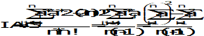

**Ec. 3**

obteniéndose la expresión final del **IAG** como:

**Ec. 4**

.

donde:

<strong>a</strong> <strong>i</strong> <strong>:</strong> valor que toma el <strong>índice IAH</strong> <strong>i</strong> en Régimen Alterado

**n =** nº de Índices de Alteración que evalúan un aspecto del régimen de caudales

Particularizando para los tres Índices de Alteración Global propuestos:

Índice de Alteración Global de valores habituales <strong>IAG</strong> <strong>H</strong>, obtenido en base a los Índices de Alteración <strong>IAH 1 a  AH 6</strong>

Índice de Alteración Global de avenidas <strong>IAG</strong> <strong>A</strong>, obtenido en base a los Índices de Alteración <strong>IAH 7 a IAH 14</strong>

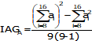

Índice de Alteración Global de sequías <strong>IAG</strong> <strong>S</strong>, obtenido en base a los Índices de Alteración <strong>IAH 15 a IAH 21</strong>

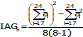

**0  IAG  1**

El Índice de Alteración Global, así definido esta acotado (al igual que los índices parciales <strong>AHi</strong>) entre 0 y 1:

Se comprueba que expresar IAG como una relación entre superficies motiva que este índice global no varíe linealmente con los índices parciales. Si todos los índices de alteración parcial tuviesen el mismo valor, K, el IAG valdría K2. Como K≤1, el IAG&lt;K salvo para los casos extremos de K=1 o K=0. En la <strong>Figura nº34</strong> se aprecia la variación del valor de IAG respecto al rango de variación de K.

**Figura nº 34**- Variación del Índice de Alteración Global (IAG) respecto al valor medio K de los índices parciales

La relación cuadrática entre K e IAG, AG=K2 siendo 0K1, implica que, aunque IAG también varíe entre 0 y 1 difícilmente tomará valores altos –por ejemplo, para K=0,70 IAG=0,5- y en términos relativos la disminución del valor de IAG respecto al de K es mayor cuanto menor es K, como puede apreciarse al expresar el IAG como porcentaje respecto al correspondiente valor de K (<strong>Tabla nº14</strong>).

<table><tr><td>
<strong>K</strong>
</td><td>
<strong>IAG</strong>
</td><td>
<strong>% IAG respecto a K</strong>
</td></tr><tr><td>
<strong>0.1</strong>
</td><td>
<strong>0.01</strong>
</td><td>
<strong>10</strong>
</td></tr><tr><td>
<strong>0.2</strong>
</td><td>
<strong>0.04</strong>
</td><td>
<strong>20</strong>
</td></tr><tr><td>
<strong>0.3</strong>
</td><td>
<strong>0.09</strong>
</td><td>
<strong>30</strong>
</td></tr><tr><td>
<strong>0.4</strong>
</td><td>
<strong>0.16</strong>
</td><td>
<strong>40</strong>
</td></tr><tr><td>
<strong>0.5</strong>
</td><td>
<strong>0.25</strong>
</td><td>
<strong>50</strong>
</td></tr><tr><td>
<strong>0.6</strong>
</td><td>
<strong>0.36</strong>
</td><td>
<strong>60</strong>
</td></tr><tr><td>
<strong>0.7</strong>
</td><td>
<strong>0.49</strong>
</td><td>
<strong>70</strong>
</td></tr><tr><td>
<strong>0.8</strong>
</td><td>
<strong>0.64</strong>
</td><td>
<strong>80</strong>
</td></tr><tr><td>
<strong>0.9</strong>
</td><td>
<strong>0.81</strong>
</td><td>
<strong>90</strong>
</td></tr></table>

**Tabla nº14**- Porcentaje del Índice de Alteración Global (IAG) respecto al valor medio K de los índices parciales

<strong>C.3.</strong>  <strong><u>DEFINICIÓN DEL ESTATUS HIDROLÓGICO</u></strong>

Con el objetivo de ofrecer una valoración no sólo cuantitativa sino también cualitativa del grado de alteración, se proponen cinco niveles o estados de alteración hidrológica, denominados <strong>estatus hidrológicos,</strong> definidos siguiendo las recomendaciones respecto a niveles y asignación de colores (<strong>Figura nº35</strong>) recogida en CIS-WFD, 2003 (<em>EU Common Implementation Strategy (CIS) for the Water Framework Directive</em>) en su epígrafe 2.6 para la clasificación del denominado <em>status ecológico</em> a partir de los Ecological Quality Ratios (<strong>EQR</strong>).

<strong>Figura nº 35</strong> - Principios básicos para la clasificación del status ecológico basada en los denominado EQR Ecological Quality Ratios (fuente: CIS-WDF, 2003<em>)</em>

Conviene señalar dos fuertes analogías entre los **EQR** y los índices de alteración propuestos en este trabajo:

- en ambos casos, la valoración de la alteración se realiza comparando el valor que toma un determinado parámetro en la situación alterada y la correspondiente al estado natural o de referencia.
- El intervalo de variación está acotado entre 0 y 1, correspondiendo a 1 la situación óptima (mínima alteración) y a 0 la más degradada o de máxima alteración.

Adoptando una distribución equitativa de las cinco clases propuestas entre 0 y 1, la **Tabla nº15** resume los criterios de representación y asignación de los diferentes **estatus** o **niveles hidrológicos** deducidos de los índices parciales:

<em><strong>ESTATUS HIDROLÓGICO</strong></em><strong>: INDICES PARCIALES (AH)</strong>

**NIVEL I**

**NIVEL II**

**NIVEL III**

**NIVEL IV**

**NIVEL V**

**0,8< AH 1**

**0,6<AH 0,8**

**0,4<AH 0,6**

**0,2<AH 0,4**

**0≤AH 0,2**

**Tabla nº15**- Código de colores y valores correspondientes de los índices de alteración parciales (IAH) para los diferentes estatus hidrológicos

Respecto a los índices de alteración global, recordando la relación cuadrática existente entre <strong>AH</strong> e <strong>IAG</strong> - IAG = f (<strong>2</strong>) (<strong>Figura nº34</strong>)– se obtendrían los siguientes criterios de representación y asignación de estatus (<strong>Tabla nº16</strong>):

<em><strong>ESTATUS HIDROLÓGICO</strong></em><strong>: INDICES GLOBALES (IAG)</strong>

**NIVEL I**

**NIVEL II**

**NIVEL III**

**NIVEL IV**

**NIVEL V**

**0,64< AG1**

**0,36<AG0,64**

**0,16<AG0,36**

**0,04<AG0,16**

**0≤AG0,04**

**Tabla nº16**- Código de colores y valores correspondientes de los índices de alteración global (IAG) para los diferentes estatus hidrológicos

**D                             ÍNDICES DE ALTERACIÓN HIDROLÓGICA DEFINICIONES**

Cada índice se desarrollará según el siguiente esquema:

<strong>IAH</strong> <strong>j: DENOMINACIÓN DEL ÍNDICE</strong>

**Objetivo:**  	se describe qué pretende evaluarse con el índice

**Expresión:** 	se incluye la ecuación que permite calcular el índice

**Comentario:**  	en algunos casos, se recoge un breve texto que aclara o amplía algunos aspectos de interés.

NOTA ACLARATORIA: todo lo recogido en este epígrafe ser refiere a estudios con disponibilidad de datos de al menos 15 años en ambos regímenes. Para el caso de series entre 7 y 14 años se remite al lector al Anexo 1.

<strong>D.1</strong> <strong><u>ÍNDICES DE ALTERACIÓN DE VALORES HABITUALES EN REGÍMENES COETÁNEOS</u></strong>

Si las series disponibles en natural y alterado cumplen la condición de coetaneidad (y al menos 15 años comunes), la evaluación de la alteración hidrológica se realizará mediante los índices que se presentan a continuación.

Los índices propuestos para la estimación de la alteración en los diferentes aspectos con significación ambiental (magnitud, variabilidad y estacionalidad) de los valores habituales (diarios, anuales y mensuales) del régimen de caudales quedan recogidos en la **Tabla nº17**:

<table><tr><td>
<strong>ASPECTO</strong>
</td><td>
<strong>ÍNDICE</strong>
</td><td>
<strong>DENOMINACIÓN</strong>
</td></tr><tr><td colspan="3">
<strong>Valores habituales</strong>
</td></tr><tr><td rowspan="2">
<strong>magnitud</strong>
</td><td>
<strong>ΙAH 1</strong>
</td><td>
Ind. de Magnitud de las aportaciones anuales
</td></tr><tr><td>
<strong>IAH 2</strong>
</td><td>
Ind. de Magnitud de las aportaciones mensuales
</td></tr><tr><td rowspan="2">
<strong>variabilidad</strong>
</td><td>
<strong>ΙAH 3</strong>
</td><td>
Ind. de Variabilidad habitual 
</td></tr><tr><td>
<strong>ΙAH 4</strong>
</td><td>
Ind. de Variabilidad extrema
</td></tr><tr><td rowspan="2">
<strong>estacionalidad</strong>
</td><td>
<strong>IAH 5</strong>
</td><td>
Ind. de Estacionalidad de máximos
</td></tr><tr><td>
<strong>IAH 6</strong>
</td><td>
Ind. de Estacionalidad de mínimos
</td></tr></table>

**Tabla nº17**- Índices para la estimación de la alteración de los valores habituales del régimen de caudales

**¿DÓNDE CONSULTAR ESTOS RESULTADOS EN UN ESTUDIO CON IAHRIS?**

Informe nº7x

**Figura nº36**- Extracto de un informe de IAHRIS con los índices de valores habituales en regímenes coetáneos (tabla de índices parciales por tipo de año; gráficos de araña y tabla de índices globales)

**IAH 1: ÍNDICE DE MAGNITUD DE LAS APORTACIONES ANUALES**

**Objetivo:** evaluar la distorsión ocasionada por el régimen circulante sobre la magnitud de las aportaciones anuales respecto a su valor en régimen natural

**Expresión:**

<em>para</em> <em><strong>z</strong>= húmedo, medio y seco en régimen natural</em>

donde:

**k** = nº de años perteneciente al tipo z en régimen natural. La tipología del año (húmedo, medio y seco) la determina el régimen natural.

**(AA) a** = Aportación anual en régimen alterado

**(AA) n** = Aportación anual en régimen natural

Se obtendrán por tanto tres índices de magnitud <strong>IAH 1</strong> <strong>hum</strong>, <strong>IAH 1med</strong> y <strong>IAH</strong> <strong>sec</strong> para años húmedos, medios y secos respectivamente

El valor ponderado del índice **IAH 1** se obtendrá ponderando estos tres índices parciales por el % de presencia de cada tipo de año en la serie global (25% para húmedos y secos y 50% para años medios.

<strong>IAH 1 ponderado = 0,25\* IAH 1hum</strong> <strong>+ 0,5\* IAH 1med</strong> <strong>+ 0,25\* IAH 1sec</strong>

**Comentario:** Como puede observarse la comparación entre un régimen y otro se evalúa año a año y posteriormente se calcula el valor medio de estas alteraciones anuales observadas. De este modo se evita la compensación interanual que se produciría al calcular la alteración como cociente de las aportaciones medias anuales en ambos regímenes.

**IAH 2: ÍNDICE DE MAGNITUD DE LAS APORTACIONES MENSUALES**

**Objetivo:**  Con el objetivo de evitar las compensaciones que se pueden producir entre los distintos meses del año cuando se trabaja con valores anuales, se propone este segundo índice que mitiga lo anterior al dotar del mismo peso a la alteración habida cada mes.

**Expresión:** La evaluación de la alteración se realizará por tanto mes a mes, obteniendo un índice por mes y tipo (húmedo, medio y seco) según la expresión:

*para z= húmedo, medio y seco en régimen natural*

donde:

**K =** nº de meses perteneciente al tipo z en régimen natural. La tipología del mes (húmedo, medio y seco) la determina el régimen natural.

**(Am mes i, año j) a** = Aportación mensual correspondiente al mes i del año j en régimen alterado

**(Am mes i, año j) n** = Aportación mensual correspondiente al mes i del año j en régimen natural

Observación: si en algún caso el cociente (Am mesi, año j) a / (Am mesi, año j) n es >1, se almacena el valor inverso y se indica en el informe con un \*

De este modo, se obtiene un índice para cada mes y tipo: <strong>IAH 2 mesi</strong> <strong>hum, IAH 2 mesi</strong> <strong>med, IAH 2 mesi</strong> <strong>sec</strong>

**Figura nº37**- Extracto de un informe de IAHRIS con los índices de alteración de la magnitud de las aportaciones mensuales en regímenes coetáneos

El IAH ponderado para cada mes se obtiene ponderando según % de presencia de cada tipo

<strong>IAH 2 mesi ponderado = 0,25\* IAH 2 mesi</strong> <strong>hum</strong> <strong>+ 0,5\* IAH 2 mesi</strong> <strong>med</strong> <strong>+ 0,25\* IAH 2 mesi</strong> <strong>sec</strong>

Se ofrece también un valor anual para cada tipo: <strong>IAH2</strong> <strong>hum</strong>, <strong>IAH2</strong> <strong>med</strong>, <strong>IAH2</strong> <strong>sec,</strong> <strong>IAH2</strong> <strong>pond</strong> como media de los 12 valores mensuales correspondientes a cada uno de esos tipos.

Por último, y a partir de los valores anuales anteriores, se calcula un valor final del índice **IAH 2**  según el % de presencia de cada tipo de mes

<strong>IAH 2 medio = 0,25\* IAH 2</strong> <strong>hum</strong> <strong>+ 0,5\* IAH 2</strong> <strong>med</strong> <strong>+ 0,25\* IAH 2</strong> <strong>sec</strong>

**IAH 3: ÍNDICE DE VARIABILIDAD HABITUAL**

**Objetivo:** evaluar la distorsión que en variabilidad habitual presenta un régimen alterado frente al natural, entendiendo por variabilidad habitual la que prescinde de los valores extremos que se presentan en el año.

**Expresión:**

*para z= húmedo, medio y seco en régimen natural*

donde:

**k**= nº de años de la serie disponible pertenecientes al tipo z en régimen natural. La tipología del año (húmedo, medio y seco) la determina el régimen natural.

<strong>Q</strong> <strong>10</strong> = Caudal correspondiente al percentil de excedencia del 10% en la curva media de caudales clasificados del tipo z

<strong>Q</strong> <strong>90</strong> = Caudal correspondiente al percentil de excedencia del 90% en la curva media de caudales clasificados del tipo z

Los subíndices **a** y **n** hacen referencia al régimen alterado y natural respectivamente.

**Comentario:** Este índice sólo es aplicable cunado ambas series disponen de datos diarios.

**IAH 4: ÍNDICE DE VARIABILIDAD EXTREMA**

**Objetivo:** evaluar la distorsión ocasionada por el régimen circulante sobre la variabilidad extrema de los valores habituales respecto al régimen natural.

**Expresión:**

**B**

**A**

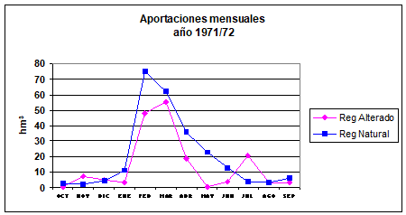

**Figura nº 38** – Evaluación del índice de variabilidad o de diferencias extremas en un año determinado

**A**= Aportación mensual máxima – Aportación mensual mínima en régimen alterado

**B**= Aportación mensual máxima – Aportación mensual mínima en régimen natural

*para z= húmedo, medio y seco en régimen natural*

**k** = nº de años perteneciente al tipo **z**. La tipología del año (húmedo, medio y seco) la determina el régimen natural.

**Am máxima, año i, a** = Aportación mensual máxima del año i en régimen alterado. Análogamente para Am mínima año i, a.

**Am máxima, año i, n** = Aportación mensual máxima del año i en régimen natural.

Análogamente para Am mínima, año i, n.

El valor final del índice **IAH 4** se obtiene ponderando los índices correspondientes a cada tipo de año según el % de presencia del tipo en la serie:

<strong>IAH 4 = 0,25\* IAH 4</strong> <strong>hum</strong> <strong>+ 0,5\* IAH 4med</strong> <strong>+ 0,25\* IAH 4</strong> <strong>sec</strong>

**Comentario:** Como puede observarse la comparación entre un régimen y otro se evalúa año a año y posteriormente se calcula el valor medio de estas alteraciones anuales observadas. De este modo se evita posibles compensaciones entre años de comportamientos diferentes.

**IAH 5: INDICE DE ESTACIONALIDAD DE MÁXIMOS**

**IAH 6: INDICE DE ESTACIONALIDAD DE MÍNIMOS**

**Objetivo:** evaluar la distorsión ocasionada por el régimen circulante sobre la estacionalidad de las aportaciones mensuales naturales.

<strong>Expresión:</strong> la alteración en la estacionalidad de los mínimos para un año determinado se estimará como el desfase existente (medido en nº de meses) entre el mes con mínima aportación en régimen alterado y el mes con mínima aportación en régimen natural (<strong>E</strong> <strong>mín</strong> en la <strong>Figura nº39</strong>).  Referente a los máximos, el desfase se evaluará entre el mes con máxima aportación en régimen alterado y el correspondiente en régimen natural para un año dado (<strong>E</strong> <strong>máx</strong> en la <strong>Figura nº39</strong>).

<strong>E</strong> <strong>máx</strong>

<strong>E</strong> <strong>mín</strong>

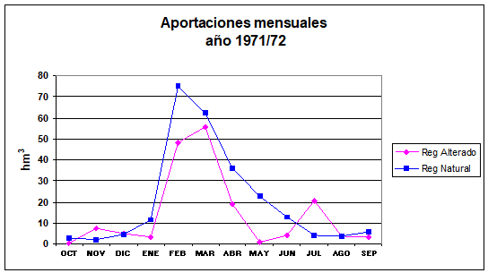

**Figura nº39** – Representación gráfica del significado del índice de estacionalidad o de desfase temporal para valores máximos y mínimos

Para cada tipo de año se obtendrá un desfase temporal de máximos <strong>IAH 5</strong> <strong>z</strong> y un desfase temporal de mínimos <strong>IAH 6</strong> <strong>z</strong>, según las expresiones siguientes:

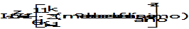

*para z= húmedo, medio y seco en régimen natural*

**k** = nº de años perteneciente al tipo **z**. La tipología del año (húmedo, medio y seco) la determina el régimen natural-

**nº de meses de desfase del máximo**= nº de meses de desfase entre el mes de máxima aportación en régimen alterado y el mes de máxima aportación en régimen natural para un año dado.

**nº de meses de desfase del mínimo**= nº de meses de desfase entre el mes de mínima aportación en régimen alterado y el mes de mínima aportación en régimen natural para un año dado.

Conviene hacer dos puntualizaciones en la estimación de estos parámetros:

- En la estimación del desfase de mínimos, puede ocurrir que la aportación mínima sea común a varios meses. En tal caso se seleccionará aquel mes que suponga el desfase máximo.
- No se considerarán desfases superiores a 6 meses, estando definido el índice de modo tal que para este desfase tome el valor de 0, indicativo de máxima alteración.
- Como puede observarse, los indicadores propuestos no responden a la expresión general de cociente entre parámetros. La razón de ello es la conveniencia de que el indicador elegido este siempre acotado entre 1 y 0.

En definitiva, para cada tipo de año, se obtendrán dos desfases, lo que supone un total de seis índices de estacionalidad (**Tabla nº18**):

**TIPO DE AÑO**

**DESFASE de (en base a)**

**INDICE de Estacionalidad**

**Año húmedo**

**Máximos** (mes de aportación máxima)

<strong>IAH 5</strong> <strong>hum</strong>

**Mínimos** (mes de aportación mínima)

<strong>IAH 6</strong> <strong>hum</strong>

**Año medio**

<strong>IAH 5med</strong>

<strong>IAH 6med</strong>

<strong>IAH 5sec</strong>

<strong>IAH 6ec</strong>

**Año seco**

**Tabla nº18**- Denominación del índice de estacionalidad para máximos y mínimos correspondiente a cada tipo de año

El valor final de los índices **IAH 5 e IAH 6**, de estacionalidad de máximos y mínimos respectivamente se obtiene ponderando en base al porcentaje de presencia de cada tipo de año en la serie:

<strong>IAH 5 = 0,25\* IAH 5</strong> <strong>hum</strong> <strong>+ 0,5\* IAH 5med</strong> <strong>+ 0,25\* IAH 5sec</strong>

<strong>IAH 6 = 0,25\* IAH 6</strong> <strong>hum</strong> <strong>+ 0,5\* IAH 6</strong> <strong>med</strong> <strong>+ 0,25\* IAH 6</strong> <strong>sec</strong>

**Comentario:** dada su especial significación se procede a interpretar el resultado obtenido con estos índices, estableciendo las correspondencias existentes entre el valor de **IAH 5** o **IAH 6** y el número de meses de desfase existente entre ambos regímenes (**Tabla nº19**).

**Tabla nº19**- Interpretación de los resultados de los índices de estacionalidad **IAH 5** ó **IAH 6**

**Interpretación**

**Valor de IAH**

**Desfase**

0

6 meses

0,16

5 meses

0,33

4 meses

0,5

3 meses

0,66

2 meses

0,8

1 mes

1

Sin desfase

<strong>D.2</strong> <strong><u>ÍNDICES DE ALTERACIÓN DE VALORES HABITUALES EN REGÍMENES NO COETÁNEOS</u></strong>

En situación de no coetaneidad (<15 años comunes entre las series natural y alterada) la evaluación de la alteración en valores habituales se llevará a cabo según unos índices específicamente definidos para este caso (**Tabla nº20**).

<table><tr><td>
<strong>ASPECTO</strong>
</td><td>
<strong>ÍNDICE</strong>
</td><td>
<strong>DENOMINACIÓN</strong>
</td></tr><tr><td colspan="3">
<strong>Valores habituales</strong>
</td></tr><tr><td rowspan="3">
<strong>magnitud</strong>
</td><td>
<strong>M 1</strong>
</td><td>
Ind. de Magnitud de las aportaciones anuales
</td></tr><tr><td>
<strong>M 2</strong>
</td><td>
Ind. de Magnitud de las aportaciones mensuales
</td></tr><tr><td>
<strong>M 3</strong>
</td><td>
Ind. de Magnitud de las aportaciones de cada mes: 12 valores
</td></tr><tr><td rowspan="4">
<strong>variabilidad</strong>
</td><td>
<strong>V 1</strong>
</td><td>
Ind. de Variabilidad de las aportaciones anuales
</td></tr><tr><td>
<strong>V 2</strong>
</td><td>
Ind. de Variabilidad de las aportaciones mensuales
</td></tr><tr><td>
<strong>V 3</strong>
</td><td>
Ind. de Variabilidad de las aportaciones de cada mes: 12 valores
</td></tr><tr><td>
<strong>IAH 3</strong>
</td><td>
Ind. de Variabilidad habitual
</td></tr><tr><td rowspan="2">
<strong>estacionalidad</strong>
</td><td>
<strong>E 1</strong>
</td><td>
Ind. de Estacionalidad de máximos
</td></tr><tr><td>
<strong>E 2</strong>
</td><td>
Ind. de Estacionalidad de mínimos
</td></tr></table>

**Tabla nº20**- Índices de alteración en valores habituales para regímenes no coetáneos. El índice IAH3 es aplicable tanto a series coetáneas como no coetáneas siempre que se disponga de datos diarios.

La evaluación de la alteración en valores extremos, -avenidas y sequías-, al no exigir la condición de coetaneidad se realizará mediante los índices **IAH 7- IAH 21** aplicables tanto a series coetáneas como no coetáneas y que serán expuestos en los epígrafes **D.3** y **D.4**.

**¿DÓNDE CONSULTAR ESTOS RESULTADOS EN UN ESTUDIO CON IAHRIS?**

Informe nº7x

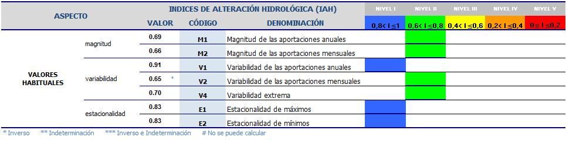

**Figura nº40**- Extracto de un informe de IAHRIS con los índices de valores habituales para regímenes no coetáneos (tabla de índices parciales; gráfico de araña y tabla de índices globales)

**M1: ÍNDICE DE MAGNITUD DE LAS APORTACIONES ANUALES**

**Objetivo:** evaluar la distorsión ocasionada por el régimen circulante sobre la magnitud de las aportaciones anuales respecto a su valor en régimen natural

**Expresión:**

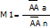

donde:

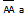

= Aportación media anual en régimen alterado

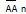

= Aportación media anual en régimen natural

**M 2: ÍNDICE DE MAGNITUD DE LAS APORTACIONES MENSUALES**

**Objetivo:** Con el objetivo de evitar las compensaciones que se pueden producir entre los distintos meses del año cuando se trabaja con valores anuales, se propone este segundo índice que mitiga lo anterior al dotar del mismo peso a la alteración habida cada mes.

**Expresión:** La evaluación de la alteración se realizará por tanto mes a mes, para cada mes de cada año. El índice se expresará finalmente como el valor medio de todas las alteraciones mensuales estimadas.

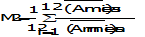

donde:

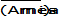

= Aportación mensual media del mes i en régimen alterado

= Aportación mensual media del mes i en régimen natural

<strong>M 3</strong> <strong>mes i: ÍNDICE DE MAGNITUD DE LAS APORTACIONES DE CADA MES</strong>

**Expresión:** La evaluación de la alteración se realizará de modo independiente para cada mes, ofreciéndose los 12 índices mensuales.

donde:

= Aportación mensual media del mes i en régimen alterado

= Aportación mensual media del mes i en régimen natural

**Figura nº41**- Extracto de un informe de IAHRIS con los índices de alteración de la magnitud de las aportaciones mensuales para regímenes no coetáneos

**Figura nº42**- Extracto de un informe de IAHRIS con el gráfico de araña de los índices de alteración de la magnitud de las aportaciones mensuales para regímenes no coetáneos

**V1: ÍNDICE DE VARIABILIDAD DE LAS APORTACIONES ANUALES**

**Objetivo:** evaluar la alteración en la variabilidad a nivel de aportación anual

**Expresión:**

donde:

CV (AA) a= coeficiente de variación de la serie de aportaciones anuales en régimen alterado.

CV (AA) n= coeficiente de variación de la serie de aportaciones anuales en régimen natural.

**V2: ÍNDICE DE VARIABILIDAD DE LAS APORTACIONES MENSUALES**

**Objetivo:** evaluar la alteración en la variabilidad a nivel de aportación mensual

**Expresión:**

donde:

CV (mes i) a= coeficiente de variación de la serie de aportaciones mensuales del mes i en régimen alterado.

CV (mes i) n= coeficiente de variación de la serie de aportaciones mensuales del mes i en régimen natural.

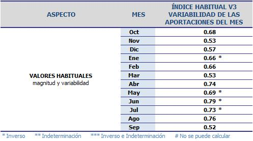

**Figura nº43**- Extracto de un informe de IAHRIS con los índices de variabilidad de las aportaciones mensuales para regímenes no coetáneos

**Figura nº44**- Extracto de un informe de IAHRIS con el gráfico de araña de los índices de variabilidad de las aportaciones mensuales para regímenes no coetáneos

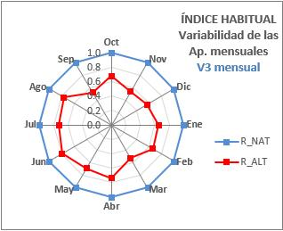

<strong>V 3</strong> <strong>mes i: ÍNDICE DE VARIABILIDAD DE LAS APORTACIONES DE</strong>

**CADA MES**

**Expresión:** La evaluación de la alteración se realizará de modo independiente para cada mes, ofreciéndose los 12 índices mensuales.

donde:

CV (mes i) a = Coeficiente de variación de la serie de aportaciones del mes i en régimen alterado

CV (mes i) n = Coeficiente de variación de la serie de aportaciones del mes i en régimen natural

**V 4: ÍNDICE DE VARIABILIDAD EXTREMA**

**Objetivo:** evaluar la distorsión ocasionada por el régimen circulante sobre la variabilidad extrema de los valores habituales respecto al régimen natural.

**Expresión:**

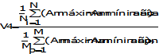

**Am máxima, año i, a** = Aportación mensual máxima del año i en régimen alterado. Análogamente para Am mínima año i, a.

**Am máxima, año i, n** = Aportación mensual máxima del año p en régimen natural.

Análogamente para Am mínima, año p, n.

**N**= nº de años disponibles en régimen alterado

**M**= nº de años disponibles en régimen natural

**E1: INDICE DE ESTACIONALIDAD DE MÁXIMOS**

**Objetivo:** evaluar la distorsión ocasionada por el régimen circulante sobre la estacionalidad de las aportaciones mensuales máximas naturales.

**Expresión:** construida la tabla de frecuencias relativas de la presencia de máximos en cada mes (ver epígrafe **B.3.**), la alteración en la estacionalidad de los máximos se estimará como el desfase existente (medido en nº de meses) entre el mes con máxima frecuencia en régimen alterado y el mes con máxima frecuencia en régimen alterado. En el caso de que el carácter de máximo sea común a varios meses (es decir, que varios meses tengan el máximo valor de frecuencia relativa), se seleccionará como máximo el primer mes en sentido cronológico (octubre- septiembre). Fijados estos máximos en cada régimen se procede del modo siguiente:

- Ubicados en el mes de máxima frecuencia en régimen natural, se determina el número de meses (**x** meses) que anteceden cronológicamente hasta alcanzar el mes más alejado donde se localiza la máxima frecuencia en alterado.
- Ubicados en el mes de máxima frecuencia en régimen natural, se determina cuantos meses faltan (**y** meses) para llegar al primer mes de máxima frecuencia en alterado.
- El **número de meses de desfase** vendrá dado por el mayor de los valores **x** e **y** obtenidos anteriormente, no admitiéndose nunca desfases superiores a 6 meses.

El valor final del índice se obtiene como:

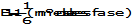

**Tabla nº21**- Interpretación de los resultados de los índices de estacionalidad

**Interpretación**

**Valor de E1**

**Desfase**

0

6 meses

0,16

5 meses

0,33

4 meses

0,5

3 meses

0,66

2 meses

0,8

1 mes

1

Sin desfase

**Comentario:** La **Tabla nº21** establece las correspondencias existentes entre valor obtenido al calcular **E1** y el número de meses de desfase existente entre ambos regímenes

**E2: INDICE DE ESTACIONALIDAD DE MÍNIMOS**

**Objetivo:** evaluar la distorsión ocasionada por el régimen circulante sobre la estacionalidad de las aportaciones mensuales mínimas naturales.

**Expresión:** construida la tabla de frecuencias relativas de la presencia de mínimos en cada mes (ver epígrafe **B.3.**), la alteración en la estacionalidad de los mínimos se estimará como el desfase existente (medido en nº de meses) entre el mes con máxima frecuencia en régimen alterado y el mes con máxima frecuencia en régimen alterado. En el caso de que el carácter de máximo sea común a varios meses (es decir, que varios meses tengan el máximo valor de frecuencia relativa), se seleccionará como máximo el primer mes en sentido cronológico (octubre- septiembre). Fijados estos máximos en cada régimen se procede del modo siguiente:

- Ubicados en el mes de máxima frecuencia en régimen natural, se determina el número de meses (**x** meses) que anteceden cronológicamente hasta alcanzar el mes más alejado donde se localiza la máxima frecuencia en alterado.
- Ubicados en el mes de máxima frecuencia en régimen natural, se determina cuantos meses faltan (**y** meses) para llegar al mes más alejado de máxima frecuencia en alterado.
- El número de meses de desfase vendrá dado por el mayor de los valores **x** e **y** obtenidos anteriormente, no admitiéndose valores de desfase superiores a 6 meses.

El valor final del índice se obtiene como:

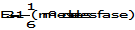

<strong>D.3</strong> <strong><u>ÍNDICES DE ALTERACIÓN DE AVENIDAS_</u></strong>

Los índices propuestos para la estimación de la alteración en magnitud, frecuencia, variabilidad, estacionalidad y duración de las avenidas quedan recogidos en la **Tabla nº22**.

A diferencia de los índices de valores habituales que presentaban formulaciones distintas según coetaneidad o no coetaneidad de las series, los índices de avenidas propuestos se aplican de manera general con independencia de esta circunstancia.

El estudio de las tasas de crecida y defluencia no está enfocado a la formulación de un índice de alteración, sino a la caracterización de las tasas máximas relativas que se presentan en régimen natural con el objeto de caracterizarlas y de servir de ayuda al gestor del recurso como patrón de comportamiento límite en la implementación de avenidas.

<table><tr><td>
<strong>ASPECTO</strong>
</td><td>
<strong>INDICE</strong>
</td><td>
<strong>DENOMINACIÓN</strong>
</td></tr><tr><td colspan="3">
<strong>Valores extremos máximos: avenidas</strong>
</td></tr><tr><td rowspan="4">
<strong>magnitud y frecuencia</strong>
</td><td>
<strong>ΙAH 7</strong>
</td><td>
Ind. de Magnitud de las avenidas máximas
</td></tr><tr><td>
<strong>ΙAH 8</strong>
</td><td>
Ind. de Magnitud del caudal generador del lecho
</td></tr><tr><td>
<strong>ΙAH 9</strong>
</td><td>
Ind. de Frecuencia del caudal de conectividad
</td></tr><tr><td>
<strong>ΙAH 10 </strong>
</td><td>
Ind. de Magnitud de las avenidas habituales
</td></tr><tr><td rowspan="2">
<strong>variabilidad</strong>
</td><td>
<strong>ΙAH 11</strong>
</td><td>
Ind. de Variabilidad de las avenidas máximas
</td></tr><tr><td>
<strong>ΙAH 12 </strong>
</td><td>
Ind. de Variabilidad de las avenidas habituales
</td></tr><tr><td>
<strong>duración</strong>
</td><td>
<strong>IAH 13</strong>
</td><td>
Ind. de Duración de avenidas
</td></tr><tr><td>
<strong>estacionalidad  </strong>
</td><td>
<strong>IAH 14</strong>
</td><td>
Ind. de Estacionalidad &amp; Duración de avenidas
</td></tr></table>

**Tabla nº22**- Índices para la estimación de la alteración de avenidas del régimen de caudales

**¿DÓNDE CONSULTAR ESTOS RESULTADOS EN UN ESTUDIO CON IAHRIS?**

Informe nº7x

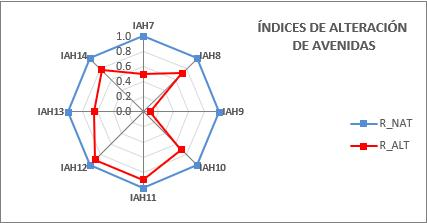

**Figura nº44**- Extracto de un informe de IAHRIS con los índices de avenidas (tabla de índices parciales; gráfico de araña y tabla de índices globales)

**IAH 7: INDICE DE MAGNITUD DE LAS AVENIDAS MÁXIMAS**

**Objetivo:**  evaluar la alteración en el valor medio de las avenidas circulantes

**Expresión:** El índice propuesto evalúa la alteración en magnitud de las avenidas máximas tomando como parámetro el valor medio de la serie de máximos caudales medios diarios anuales en uno y otro régimen.

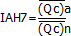

= media de los máximos caudales medios diarios anuales de la serie disponible en régimen alterado

= media de los máximos caudales medios diarios anuales de la serie disponible en régimen natural

**Comentario: e**l valor obtenido con este índice es representativo de la alteración producida en el valor medio de los caudales máximos circulantes (Máximos Caudales Medios Diarios Anuales), pudiendo considerarse indicativo también de la alteración en la frecuencia de estas avenidas, dada la relación existente entre  y el período de retorno. Al valor medio de la serie de caudales medios diarios máximos anuales  , le corresponde un período de retorno de 2,33 años, cuando se utiliza la ley de frecuencias Gumbel.

**IAH 8: INDICE DE MAGNITUD DEL CAUDAL GENERADOR DEL LECHO**

**Objetivo:** evaluar la alteración en el valor de aquellos caudales con especial significación geomorfológica

<strong>Expresión:</strong> Las referencias expuestas en epígrafes anteriores avalan la significación ambiental del caudal generador del lecho (QGL) como aquel caudal que a largo plazo realiza un mayor trabajo de movilización y transporte de materiales siendo responsable de la geomorfología del cauce tanto en sección como en planta. El índice propuesto toma como parámetro de referencia el caudal generador del lecho y corrige la relación obtenida con el exponente 0,5 habida cuenta de la relación directa entre la anchura del cauce y la raíz cuadrada de Q GL .

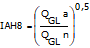

<strong>QGL</strong> <strong>a</strong> = Caudal Generador del Lecho correspondiente al régimen alterado

<strong>QGL</strong> <strong>n</strong> = Caudal Generador del Lecho correspondiente al régimen natural

**IAH 9: INDICE DE MAGNITUD DEL CAUDAL DE CONECTIVIDAD**

**Objetivo:** evaluar la alteración en la frecuencia de aquellos caudales que garantizan una conexión periódica con la llanura de inundación

<strong>Expresión:</strong> en epígrafes anteriores se definió el <strong>caudal de conectividad</strong> QCONEC como el caudal representativo de aquellos valores máximos que garantizan la conexión cauce-llanura de inundación y están íntimamente ligados con la dinámica de la banda riparia.

La alteración en esta funcionalidad de los valores máximos se estima como cociente entre la frecuencia correspondiente al caudal de conectividad en régimen alterado y la frecuencia estimada para dicho caudal en régimen natural.

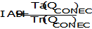

<strong>QCONEC</strong> <strong>=</strong> Caudal de conectividad en régimen natural (=caudal que duplica el período de retorno del caudal generador del lecho en dicho régimen)

<strong>T</strong> <strong>a</strong> <strong>(QCONEC)</strong> = Período de retorno correspondiente al Caudal de Conectividad en régimen alterado

<strong>T</strong> <strong>n</strong> <strong>(QCONEC)</strong> = Período de retorno correspondiente al Caudal de Conectividad en régimen natural

Siendo la distribución Gumbel la ley de frecuencias considerada para la caracterización de los caudales máximos.

El proceso de obtención de este índice puede esquematizarse:

#### 3.1.1.1 Estimar QGL en régimen natural y su periodo de retorno correspondiente <strong>T</strong> (Ley Gumbel) 

#### 3.1.1.2 Calcular la magnitud del caudal de conectividad natural QCONEC definido como aquel caudal correspondiente a un período <strong>2T</strong> 

#### 3.1.1.3 Calcular la frecuencia que corresponde en régimen alterado al caudal de conectividad natural (QCONEC)

#### 3.1.1.4 Comparar las frecuencias de QCONEC en régimen alterado y natural.

<strong>QCONEC</strong>

<strong>Tn (QCONEC)</strong>

<strong>Ta (QCONEC)</strong>

**Figura nº 23** – Asignación del período de retorno correspondiente al caudal de conectividad para el régimen natural y alterado

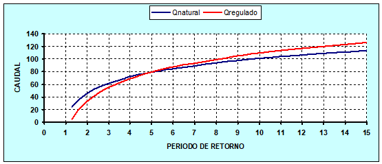

**IAH 10: ÍNDICE DE MAGNITUD DE LAS AVENIDAS HABITUALES**

**Objetivo:** caracterizar la alteración en la magnitud de las avenidas, evitando trabajar sólo con valores extremos dado que enmascaran muchas avenidas menores de gran significación ambiental.

<strong>Expresión:</strong> en epígrafes anteriores se definió la avenida habitual como el caudal correspondiente en la curva media de caudales clasificados al percentil de excedencia del 5% (<strong>Q5%</strong>), constituyendo una nueva variable hidrológica que al representar fenómenos de recurrencia inferior al año sintetiza múltiples aspectos de funcionalidad biológica de los valores máximos.

El índice propuesto evalúa la alteración en el valor de la avenida habitual entre ambos regímenes:

<strong>Q</strong> <strong>5% a</strong> = avenida habitual en régimen alterado.

<strong>Q</strong> <strong>5% n</strong> = avenida habitual en régimen natural.

<strong>Comentario:</strong> Estando definida la avenida habitual por el valor del caudal (m3/s) correspondiente al percentil de excedencia del 5% en la curva media de caudales clasificados, lo que es análogo en términos de duración a aquel valor del caudal que como promedio es igualado o superado 18 días al año.

**IAH 11: ÍNDICE DE VARIABILIDAD DE LAS AVENIDAS MÁXIMAS**

**Objetivo:**  cuantificar la distorsión en la variabilidad interanual de los caudales máximos.

**Expresión:** el índice propuesto utiliza como estimador el coeficiente de variación de la serie de máximos caudales medios diarios anuales (Qc).

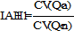

**CV (Qc a)** = coeficiente de variación de la serie de máximos caudales medios diarios anuales correspondiente al régimen alterado.

**CV (Qc n)** = coeficiente de variación de la serie de máximos caudales medios diarios anuales correspondiente al régimen natural.

**IAH 12: ÍNDICE DE VARIABILIDAD DE LAS AVENIDAS HABITUALES**

**Objetivo:** cuantificar la distorsión en la variabilidad interanual de las avenidas habituales.

<strong>Expresión:</strong> el índice propuesto emplea como estimador el coeficiente de variación de la serie de valores Q 5% de los regímenes natural y alterado.

<strong>CV (Q</strong> <strong>5% a)</strong> = coeficiente de variación de la serie de valores correspondientes a la avenida habitual en régimen alterado (serie anual de Q 5%).

<strong>CV (Q</strong> <strong>5% n)</strong> = coeficiente de variación de la serie de valores correspondientes a la avenida habitual en régimen natural (serie anual de Q 5%).

**IAH 13: ÍNDICE DE DURACIÓN DE AVENIDAS**

**Objetivo:** comprobar si en régimen alterado los períodos de avenidas mantienen una duración análoga a los del régimen natural.

<strong>Expresión:</strong> el parámetro propuesto para caracterizar la duración de las avenidas ha sido definido en epígrafes anteriores como el máximo número de días consecutivos en que se iguala o supera el umbral del Q 5%. Se elige como caudal de referencia para discriminar la presencia o no de una AVENIDA en un mes determinado el correspondiente al Q 5% en régimen natural, en adelante Q5% nat.

Por consiguiente, la alteración en la duración de avenidas se evalúa como cociente entre el valor de este parámetro en régimen alterado y su homólogo en natural.

<strong>(Máximo nº de días consecutivos con Q ≥ Q</strong> <strong>5% nat)</strong> <strong>a</strong>= Máximo número de días consecutivos, en valor medio, en el régimen alterado, en que se iguala o supera la avenida habitual natural.

<strong>(Máximo nº de días consecutivos con Q ≥ Q</strong> <strong>5% nat)</strong> <strong>n</strong>= Máximo número de días consecutivos, en valor medio, en el régimen natural, en que se iguala o supera la avenida habitual natural.

**IAH 14: ÍNDICE DE ESTACIONALIDAD DE AVENIDAS**

**Objetivo:** se propone este índice con el objetivo de evaluar la alteración en el aspecto de estacionalidad de las avenidas.

<strong>Expresión:</strong> al igual que en anteriores ocasiones se elige como caudal de referencia para discriminar la presencia o no de una avenida en un mes determinado el correspondiente al Q5% en régimen natural, en adelante Q5%nat.

El procedimiento se centra en evaluar la afección a la estacionalidad de las avenidas para cada mes del año y calcular posteriormente el índice de alteración como el promedio de estos índices mensuales.

El índice mensual IAH 14mes i se obtiene siguiendo la lógica siguiente:

## Si ABS (natural-alterado)&gt;5  IAH 14mes i = 0

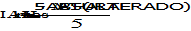

## Si ABS (natural-alterado)≤5  

donde

**ABS:** valor absoluto

<strong>NATURAL:</strong> nº medio de días al mes con Q≥Q5%nat en régimen natural para el mes considerado.

<strong>ALTERADO:</strong> nº medio de días al mes con Q≥ Q5%nat en régimen alterado para el mes considerado.

**Figura nº45**- Extracto de un informe de IAHRIS con el índice de estacionalidad de avenidas desglosado a nivel mensual

Al final se ofrece un índice final **IAH 14** obtenido como media de los doce valores mensuales

<strong>D.4</strong>  <strong><u>ÍNDICES DE ALTERACIÓN DE SEQUÍAS</u></strong>

Los índices propuestos para la estimación de la alteración en magnitud, frecuencia, variabilidad, estacionalidad y duración de las sequías quedan recogidos en la **Tabla nº23.**

<table><tr><td>
<strong>ASPECTO</strong>
</td><td>
<strong>ÍNDICE</strong>
</td><td>
<strong>DENOMINACIÓN</strong>
</td></tr><tr><td colspan="3">
<strong>Valores extremos mínimos: sequías</strong>
</td></tr><tr><td rowspan="2">
<strong>magnitud y frecuencia</strong>
</td><td>
<strong>ΙAH 15</strong>
</td><td>
Ind. de Magnitud de las sequías extremas
</td></tr><tr><td>
<strong>IAH 16</strong>
</td><td>
Ind. de Magnitud de las sequías habituales
</td></tr><tr><td rowspan="2">
<strong>variabilidad</strong>
</td><td>
<strong>IAH 17</strong>
</td><td>
Ind. de Variabilidad de las sequías extremas
</td></tr><tr><td>
<strong>IAH 18</strong>
</td><td>
Ind. de Variabilidad de las sequías habituales
</td></tr><tr><td rowspan="2">
<strong>duración</strong>
</td><td>
<strong>IAH 19</strong>
</td><td>
Ind. de Duración de sequías
</td></tr><tr><td>
<strong>IAH 20</strong>
</td><td>
Ind. de nº de días con caudal no nulo
</td></tr><tr><td>
<strong>estacionalidad  </strong>
</td><td>
<strong>IAH 21</strong>
</td><td>
Ind. de Estacionalidad de sequías
</td></tr></table>

**Tabla nº23**- Índices para la estimación de la alteración de sequías del régimen de caudales

**¿DÓNDE CONSULTAR ESTOS RESULTADOS EN UN ESTUDIO CON IAHRIS?**

Informe nº7x

**Figura nº46**- Extracto de un informe de IAHRIS con los índices de sequías (tabla de índices parciales; gráfico de araña y tabla de índices globales)

**IAH 15: ÍNDICE DE MAGNITUD DE LAS SEQUÍAS EXTREMAS**

**Objetivo:** evaluar la alteración en el valor medio de los caudales mínimos circulantes

**Expresión:**  el índice propuesto estima la alteración en magnitud de las sequías a partir de la relación existente entre el valor medio de las series de caudales diarios mínimos anuales correspondientes al régimen alterado y al régimen natural.

donde:

= media de los caudales diarios mínimos anuales de la serie disponible en régimen alterado

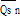

= media de los caudales diarios mínimos anuales de la serie disponible en régimen natural

**IAH 16: ÍNDICE DE MAGNITUD DE LAS SEQUÍAS HABITUALES**

**Objetivo:** evaluar la alteración en la magnitud de las sequías evitando trabajar sólo con valores mínimos extremos, dado que enmascaran otras situaciones que aun siendo menos críticas sean sin embargo de gran trascendencia ambiental

**Expresión:**

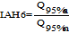

<strong>Q</strong> <strong>95% a</strong> = caudal (m3/s) correspondiente a la sequía habitual en régimen alterado.

<strong>Q</strong> <strong>95% n</strong> = caudal (m3/s) correspondiente a la sequía habitual en régimen natural.

En ambos casos la sequía habitual vendrá definida por el valor del caudal correspondiente al percentil del 95% en la respectiva curva media de caudales clasificados, lo que es análogo, en términos de duración, a aquel valor del caudal, que como promedio no es igualado ni superado 18 días al año.

**IAH 17: ÍNDICE DE VARIABILIDAD DE LAS SEQUÍAS EXTREMAS**

**Objetivo:** evaluar la alteración en la variabilidad de los caudales mínimos anuales.

**Expresión:** se utiliza como parámetro estimador el coeficiente de variación de la serie de mínimos caudales diarios anuales correspondientes a cada uno de los regímenes.

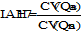

**CV (Qs a)** = coeficiente de variación de la serie de mínimos caudales diarios anuales correspondiente al régimen alterado.

**CV (Qs n)** = coeficiente de variación de la serie de mínimos caudales diarios anuales correspondiente al régimen natural.

**IAH 18: ÍNDICE DE VARIABILIDAD DE LAS SEQUÍAS HABITUALES**

**Objetivo:** evaluar la alteración en la variabilidad de las sequías más frecuentes.

<strong>Expresión:</strong> el índice propuesto utiliza como parámetro estimador el coeficiente de variación de la serie de valores Q95% correspondientes a los dos regímenes en estudio.

<strong>CV (Q95% a)</strong> = coeficiente de variación de la serie anual de valores correspondientes a la sequía habitual en régimen alterado (serie anual de Q 95%).

<strong>CV (Q95% n)</strong> = coeficiente de variación de la serie anual de valores correspondientes a la sequía habitual en régimen natural (serie anual de Q 95%).

**IAH 19: ÍNDICE DE DURACIÓN DE SEQUÍAS**

**Objetivo:** comprobar si en régimen alterado los períodos de sequías mantienen una duración análoga a los del régimen natural.

<strong>Expresión:</strong> el parámetro propuesto para caracterizar la duración de las sequías ha sido definido en epígrafes anteriores como el máximo número de días consecutivos en que no se alcanza el umbral definido por el valor Q 95%. Se elige como caudal de referencia para discriminar la presencia o no de una SEQUÍA en un mes determinado el correspondiente al Q95% en régimen natural, en adelante Q95%nat.

Por consiguiente, la alteración en la duración de sequías se evalúa como cociente entre el valor de este parámetro en régimen alterado y su homólogo en natural.

<strong>(Máximo nº de días consecutivos con Q  Q</strong> <strong>95% nat)</strong> <strong>a</strong>= Máximo número de días consecutivos, en valor medio, en el régimen alterado, en que no se supera la sequía habitual natural.

<strong>(Máximo nº de días consecutivos con Q  Q</strong> <strong>95% nat)</strong> <strong>n</strong>= Máximo número de días consecutivos, en valor medio, en el régimen natural, en que se no se supera la sequía habitual natural.

**IAH 20: ÍNDICE DE NÚMERO DE DÍAS CON CAUDAL NULO**

**Objetivo:** evaluar la alteración en el número de días con caudal nulo característico del régimen natural.

**Procedimiento:** El procedimiento se centra en evaluar la afección a la duración de los períodos de caudal nulo para cada mes del año y calcular posteriormente el índice de alteración como el promedio de estos índices mensuales.

El índice mensual IAH 20mes i se obtiene siguiendo la lógica siguiente:

## Si ABS(natural-alterado)&gt;5  IAH 20mes i = 0

## Si ABS(natural-alterado)≤5  

donde

**ABS:** valor absoluto

**NATURAL:** nº medio de días al mes con Q=0 en régimen natural para el mes considerado

**ALTERADO:** nº medio de días al mes con Q=0 en régimen alterado para el mes considerado

**Figura nº47**- Extracto de un informe de IAHRIS con el índice de estacionalidad de caudales cero desglosado a nivel mensual

**Figura nº48**- Extracto de un informe de IAHRIS con el gráfico de araña de los índices de estacionalidad de caudales cero desglosados por mes

Al final se ofrece un índice final **IAH 20** obtenido como media de los doce valores mensuales

**IAH 21: ÍNDICE DE ESTACIONALIDAD DE SEQUÍAS**

**Objetivo:** se propone este índice con el objetivo de evaluar la alteración en el aspecto de estacionalidad de las sequías.

<strong>Expresión:</strong> al igual que en anteriores ocasiones se elige como caudal de referencia para discriminar la presencia o no de una SEQUÍA en un mes determinado el correspondiente al Q95% en régimen natural, en adelante Q95%nat.

El procedimiento se centra en evaluar la afección a la estacionalidad de las sequías para cada mes del año y calcular posteriormente el índice de alteración como el promedio de estos índices mensuales.

El índice mensual IAH 21mes i  (se obtiene siguiendo la lógica siguiente:

## Si ABS(natural-alterado)&gt;5  IAH 21mes i = 0

## Si ABS(natural-alterado)≤5  

donde

**ABS:** valor absoluto

<strong>NATURAL:</strong> nº medio de días al mes en régimen natural con QQ 95%nat para el mes considerado

<strong>ALTERADO:</strong> nº medio de días al mes en régimen alterado con QQ 95%nat para el mes considerado

**Figura nº49**- Extracto de un informe de IAHRIS con el índice de estacionalidad de sequías desglosado a nivel mensual

**Figura nº50**- Extracto de un informe de IAHRIS con el gráfico de araña de los índices de estacionalidad de sequías desglosados a nivel mensual

Al final se ofrece un índice final **IAH 21** obtenido como media de los doce valores mensuales.

**E                             TRASCENDENCIA AMBIENTAL DE LA ALTERACIÓN HIDROLÓGICA**

Como se ha comentado con anterioridad en diversos epígrafes de este Manual, la vinculación existente entre los diversos componentes, funciones y procesos del ecosistema es tan rica, compleja y variada que sería totalmente utópico tratar de abarcar su totalidad. Es por ello, que el procedimiento que a continuación se presenta debe entenderse como un marco de referencia, un punto de apoyo, de partida, desde el que acercarnos a la interpretación de las posibles relaciones causa-efecto y a partir de ahí, contrastarlas y completarlas en base a las peculiaridades intrínsecas de cada tramo de estudio e indiscutiblemente a un seguimiento y monitoreo de campo.

El proceso de diagnóstico aquí expuesto pretende, sino responder, si al menos reflexionar sobre algunas cuestiones:

- *¿Cuál es la sensibilidad del ecosistema frente a alteraciones en el régimen de caudales?*
- *¿Responden todos los componentes del ecosistema fluvial con igual intensidad y dependencia a estas alteraciones?*
- *¿Es posible establecer relaciones entre el agente causante y el efecto? ¿Son consistentes estas relaciones?*
- *¿Pueden ayudar a predecir cambios en el ecosistema bajo distintas hipótesis de regulación de regímenes?*

El diagnóstico presentado a continuación se estructura del modo siguiente:

- Se seleccionan como componentes básicos del ecosistema fluvial: tres componentes bióticos (ictiofauna, bentos y vegetación de riparia) y dos componentes abióticos (morfología y hábitat fluvial).
- Para cada componente del ecosistema anteriormente indicado, se eligen los componentes del régimen de caudales más determinantes (avenidas, sequías o valores habituales), así como sus aspectos (magnitud, variabilidad, estacionalidad o duración) con mayor implicación en el funcionamiento, conformación y estabilidad del componente a estudiar.
- A continuación, se asigna a cada uno de los aspectos anteriores, el Índice de Alteración Hidrológica (IAH) correspondiente.
- Para cada índice se establece el **umbral de 0.4** como determinante de alteración significativa y se diagnóstica en base a ese umbral si ha habido o no alteración significativa. Recordemos que un índice de alteración hidrológica menor o igual a 0.4 índica que el valor del parámetro en el régimen alterado difiere en un 60% o más del valor observado en el régimen natural.
- Por último, se justifica de modo resumido las relaciones componente del ecosistema- IAH establecidas.

El esquema siguiente sintetiza este proceso de diagnóstico:

Por último, las **Tablas nº24.1 a 24.5** resumen las relaciones más significativas entre los diferentes componentes del ecosistema (morfología, hábitat, vegetación, ictiofauna y macroinvertebrados) y los **IAH** propuestos.

En la columna denominada **SIGNIFICACIÓN** se exponen los criterios que justifican la elección de un índice de alteración como herramienta más representativa en la evaluación de un componente y aspecto del régimen de caudales, así como su significación ambiental.

Los comentarios recogidos en esa columna no pueden ni pretenden ser un compendio exahustivo de la significación ambiental de cada uno de los componentes del régimen hidrológico analizado.

El objetivo es sólo señalar aspectos relevantes que, de manera general, aparecen recogidos en la literatura especializada.

El usuario que quiera conocer con detalle el papel que la alteración de los distintos componentes del régimen de caudales tiene en componentes, procesos, dinámica y resiliencia del ecosistema fluvial, debe consultar textos especializados en ecología fluvial y validar con trabajo de campo la respuesta del ecosistema a la alteración hidrológica. Se sugieren dos libros que abordan un amplio espectro:

- Allan, J. D., Castillo, M M., & Capps, K. A. (2020). Stream Ecology: Structure and Function of Running Waters. Springer Cham. 485p. https://doi.org/10.1007/978-3-030-61286-3
- Rowiński, P & Radecki-Pawlik, A (Ed) (2015). **Rivers, Physical, Fluvial and Environmental Processes**. Springer Cham. 613p. https://doi.org/10.1007/978-3-319-17719-9

Referencias a este tipo de diagnósticos causa-efecto pueden encontrarse en los brillantes "modelos conceptuales" de Brizga y Arthington (2001), donde se exponen en forma de diagramas las relaciones entre "*indicadores clave del flujo*" y "*funciones ecológicas y geomorfológicas"* para tramos interiores y de desembocadura.

**COMPONENTE DEL ECOSISTEMA: MORFOLOGÍA                                                   Tabla nº 24.1**

<table><tr><td colspan="2">
<strong>Componentes y aspectos del régimen de caudales más directamente implicados</strong>
</td><td colspan="2">
<strong>Índices de Alteración Hidrológica</strong>

<strong>que los evalúan (IAH)</strong>
</td><td>
<strong>TRASCENDENCIA AMBIENTAL</strong>
</td></tr><tr><td rowspan="3">
<strong>AVENIDAS</strong>
</td><td>
Magnitud
</td><td>
<strong>ΙAH 8</strong>
</td><td>
Ind. de Magnitud del caudal generador del lecho
</td><td>
El caudal generador del lecho representa aquel caudal que a largo plazo realiza un mayor trabajo de movilización y transporte de materiales siendo responsable de la geomorfología del cauce tanto en sección como en planta.
</td></tr><tr><td>
Variabilidad
</td><td>
<strong>IAH 11</strong>
</td><td>
Ind. de Variabilidad de las avenidas 
</td><td rowspan="2">
Implicaciones en la conformación y estabilidad del cauce
</td></tr><tr><td>
Duración
</td><td>
<strong>IAH 13</strong>
</td><td>
Ind. de Duración de avenidas
</td></tr></table>

**COMPONENTE DEL ECOSISTEMA: HÁBITAT                                                                           Tabla nº 24.2**

<table><tr><td colspan="2">
<strong>Componentes y aspectos del régimen de caudales más directamente implicados</strong>
</td><td colspan="2">
<strong>Índices de Alteración Hidrológica</strong>

<strong>que los evalúan (IAH)</strong>
</td><td>
<strong>TRASCENDENCIA AMBIENTAL</strong>
</td></tr><tr><td rowspan="4">
<strong>AVENIDAS</strong>
</td><td>
Magnitud habitual
</td><td>
<strong>IAH 10</strong>
</td><td>
Ind. de Magnitud de las avenidas habituales
</td><td rowspan="4">
 Fundamentales en procesos de limpieza y revitalización del sustrato, mantenimiento de la diversidad de hidrohábitats, secuencia rápido-remanso, mantenimiento de diversidad granulométrica y adecuadas condiciones en el medio hiporreico.
</td></tr><tr><td>
Variabilidad habitual
</td><td>
<strong> IAH 12</strong>
</td><td>
Ind. de Variabilidad de las avenidas habituales
</td></tr><tr><td>
Estacionalidad
</td><td>
<strong>IAH 14</strong>
</td><td>
Ind. de Estacionalidad de avenidas
</td></tr><tr><td>
Duración
</td><td>
<strong>IAH 13</strong>
</td><td>
Ind. de Duración de avenidas
</td></tr><tr><td rowspan="2">
<strong>SEQUÍAS</strong>
</td><td>
Magnitud habitual
</td><td>
<strong>IAH 16</strong>
</td><td>
Ind. de Magnitud de las sequías habituales
</td><td rowspan="2">
Determinantes en la dinámica del medio hiporreico; alteración en la calidad del agua; procesos de desecación y fragmentación del hábitat; conectividad con el freático.
</td></tr><tr><td>
Variabilidad habitual
</td><td>
<strong>IAH 18</strong>
</td><td>
Ind. de Variabilidad de las sequías habituales
</td></tr><tr><td rowspan="3">
<strong>VALORES HABITUALES</strong>
</td><td>
Magnitud
</td><td>
<strong>IAH1 pond</strong>
</td><td>
Ind. de Magnitud de las aportaciones anuales
</td><td rowspan="3">
Condicionantes de la variabilidad del hábitat y su heterogeneidad, tamaño del material que conforma el lecho, características hidráulicas, características y colmatación del medio hiporreico.
</td></tr><tr><td>
Variabilidad habitual
</td><td>
<strong>IAH 3 pond</strong>
</td><td>
Ind. de Variabilidad habitual
</td></tr><tr><td>
Variabilidad extrema
</td><td>
<strong>IAH 4 pond</strong>
</td><td>
Ind. de Variabilidad extrema
</td></tr></table>

**COMPONENTE DEL ECOSISTEMA: VEGETACIÓN RIPARIA                                                   Tabla nº 24.3**

<table><tr><td colspan="2">
<strong>Componentes y aspectos del régimen de caudales más directamente implicados</strong>
</td><td colspan="2">
<strong>Índices de Alteración Hidrológica</strong>

<strong>que los evalúan (IAH)</strong>
</td><td>
<strong>TRASCENDENCIA AMBIENTAL</strong>
</td></tr><tr><td rowspan="3">
<strong>AVENIDAS</strong>
</td><td>
Frecuencia de conectividad
</td><td>
<strong>IAH 9</strong>
</td><td>
Ind. de Frecuencia del caudal de conectividad
</td><td rowspan="3">
El caudal de conectividad es el responsable de la inundación periódica de la llanura de inundación, garantizando la conectividad transversal, el rejuvenecimiento del medio ripario, los procesos de sucesión y las condiciones ambientales adecuadas para el desarrollo de numerosas especies, especialmente en sus primeros estadios, y siendo en ocasiones un estímulo para la germinación. 
</td></tr><tr><td>
Estacionalidad 
</td><td>
<strong>IAH 14</strong>
</td><td>
Ind. de Estacionalidad de avenidas
</td></tr><tr><td>
Duración
</td><td>
<strong>IAH 13</strong>
</td><td>
Ind. de Duración de avenidas
</td></tr><tr><td rowspan="4">
<strong>SEQUÍAS</strong>
</td><td>
Magnitud sequías extremas
</td><td>
<strong>IAH 15</strong>
</td><td>
Ind. de Magnitud de las sequías extremas
</td><td rowspan="3">
Definen las situaciones ambientalmente más críticas, especialmente si se supera la capacidad de tolerancia de las distintas especies, afectando a la dinámica vegetal, procesos de competencia excluyente y pérdida de diversidad.
</td></tr><tr><td>
Variabilidad sequías extremas
</td><td>
<strong>IAH 17</strong>
</td><td>
Ind. de Variabilidad de las sequías extremas
</td></tr><tr><td>
Estacionalidad 
</td><td>
<strong>IAH 21</strong>
</td><td>
Ind. de Estacionalidad de sequías
</td></tr><tr><td>
Duración
</td><td>
<strong>IAH 19</strong>
</td><td>
Ind. de Duración de sequías
</td><td rowspan="2">
Potencia la heterogeneidad del hábitat, regulando la intromisión y expansión de especies exóticas.
</td></tr><tr><td>
<strong>VALORES HABITUALES</strong>
</td><td>
Variabilidad habitual
</td><td>
<strong>IAH 3 pond</strong>
</td><td>
Ind. de Variabilidad habitual
</td></tr></table>

**COMPONENTE DEL ECOSISTEMA: ICTIOFAUNA                                                                  Tabla nº 24.4**

<table><tr><td colspan="2">
<strong>Componentes y aspectos del régimen de caudales más directamente implicados</strong>
</td><td colspan="2">
<strong>Índices de Alteración Hidrológica</strong>

<strong>que los evalúan (IAH)</strong>
</td><td>
<strong>TRASCENDENCIA AMBIENTAL</strong>
</td></tr><tr><td rowspan="2">
<strong>AVENIDAS</strong>
</td><td>
Magnitud 
</td><td>
<strong>IAH 7</strong>
</td><td>
Ind. de Magnitud de las avenidas máximas
</td><td rowspan="2">
Las crecidas actúan como estímulo para los movimientos migratorios de muchas especies y garantizan su accesibilidad a las zonas de cría y alevinaje; regulan las poblaciones, favoreciendo a las especies autóctonas adaptadas frente a las exóticas
</td></tr><tr><td>
Estacionalidad 
</td><td>
<strong>IAH 14</strong>
</td><td>
Ind. de Estacionalidad de avenidas
</td></tr><tr><td rowspan="5">
<strong>SEQUÍAS</strong>
</td><td>
Magnitud sequías extremas
</td><td>
<strong>IAH 15</strong>
</td><td>
Ind. de Magnitud de las sequías extremas
</td><td rowspan="5">
Las sequías influyen en el comportamiento trófico y tolerancia de las especies: las situaciones más extremas (duración de caudales mínimos o caudales cero) son críticas en relación con la capacidad de resiliencia de las especies autóctonas. 

Las sequías condicionan la disponibilidad de hábitat, la transitabilidad y características del hidrohábitat (calados y velocidades) y la calidad del agua. 
</td></tr><tr><td>
Variabilidad sequías extremas
</td><td>
<strong>IAH 17</strong>
</td><td>
Ind. de Variabilidad de las sequías extremas
</td></tr><tr><td>
Duración
</td><td>
<strong>IAH 19</strong>
</td><td>
Ind. de Duración de sequías
</td></tr><tr><td>
Caudales cero
</td><td>
<strong>IAH 20</strong>
</td><td>
Ind. del nº de días con Q≠0
</td></tr><tr><td>
Estacionalidad 
</td><td>
<strong>IAH 21</strong>
</td><td>
Ind. de Estacionalidad de sequías
</td></tr><tr><td rowspan="3">
<strong>VALORES HABITUALES</strong>
</td><td>
Aportaciones mensuales
</td><td>
<strong>IAH 2pond</strong>
</td><td>
Ind. de Magnitud de aportaciones mensuales
</td><td rowspan="3">
Determinantes de la disponibilidad general de hábitat para la ictiofauna. La estacionalidad marca el ritmo de los procesos vitales y debe guardar sincronía con la fenología de las especies presentes.
</td></tr><tr><td>
Estacionalidad de máximos
</td><td>
<strong>IAH 5pond</strong>
</td><td>
Ind. de Estacionalidad de máximos
</td></tr><tr><td>
Estacionalidad de mínimos
</td><td>
<strong>IAH 6 pond</strong>
</td><td>
Ind. de Estacionalidad de mínimos
</td></tr></table>

**COMPONENTE DEL ECOSISTEMA: MACROINVERTEBRADOS                                          Tabla nº 24.5**

<table><tr><td colspan="2">
<strong>Componentes y aspectos más directamente implicados</strong>
</td><td colspan="2">
<strong>Índices de Alteración Hidrológica </strong>

<strong>que los evalúan</strong>

<strong>(IAH)</strong>
</td><td>
<strong>SIGNIFICACIÓN</strong>
</td></tr><tr><td rowspan="3">
<strong>AVENIDAS</strong>
</td><td>
Magnitud 
</td><td>
<strong>IAH 7</strong>
</td><td>
Ind. de Magnitud de las avenidas máximas
</td><td rowspan="3">
El régimen de avenidas influye en la abundancia y composición del bentos, siendo la alteración del sustrato y la deriva las causas fundamentales de afección a esta comunidad. Aunque es difícil predecir sus efectos, en general un incremento en la magnitud y frecuencia de las avenidas induce una disminución en la riqueza taxonómica.
</td></tr><tr><td>
Variabilidad
</td><td>
<strong>IAH 11</strong>
</td><td>
Ind. de Variabilidad de las avenidas máximas
</td></tr><tr><td>
Estacionalidad 
</td><td>
<strong>IAH 14</strong>
</td><td>
Ind. de Estacionalidad de avenidas
</td></tr><tr><td rowspan="5">
<strong>SEQUÍAS</strong>
</td><td>
Magnitud sequías extremas
</td><td>
<strong>IAH 15</strong>
</td><td>
Ind. de Magnitud de las sequías extremas
</td><td rowspan="5">
Las sequías establecen las condiciones más críticas para el bentos, favoreciendo a aquellas especies con capacidad de encontrar refugio en las condiciones más desfavorables del medio hiporreico y estando muy condicionadas por la duración y la magnitud de estos eventos. 
</td></tr><tr><td>
Variabilidad sequías extremas
</td><td>
<strong>IAH 17</strong>
</td><td>
Ind. de Variabilidad de las sequías extremas
</td></tr><tr><td>
Duración
</td><td>
<strong>IAH 19</strong>
</td><td>
Ind. de Duración de sequías
</td></tr><tr><td>
Caudales cero
</td><td>
<strong>IAH 20</strong>
</td><td>
Ind. del nº de días con Q≠ 0
</td></tr><tr><td>
Estacionalidad 
</td><td>
<strong>IAH 21</strong>
</td><td>
Ind. de Estacionalidad de sequías
</td></tr><tr><td rowspan="3">
<strong>VALORES HABITUALES</strong>
</td><td>
Aportaciones mensuales
</td><td>
<strong>IAH 2pon</strong>
</td><td>
Ind. de Magnitud de aportaciones mensuales
</td><td rowspan="3">
Determinantes de un conjunto de variables ambientales como la disponibilidad general de agua y su variabilidad intranual que en última instancia afectan a la abundancia y distribución del bentos.  
</td></tr><tr><td>
Variabilidad habitual
</td><td>
<strong>IAH 3 pond</strong>
</td><td>
Ind. de Variabilidad habitual
</td></tr><tr><td>
Estacionalidad de máximos
</td><td>
<strong>IAH5 pond</strong>
</td><td>
Ind. de Estacionalidad de máximos
</td></tr></table>

**F                             DATOS, TIPOLOGÍAS DE ESTUDIO E INFORMES FACILITADOS**

Las series de datos (natural y/o alterada) pueden caracterizarse atendiendo a tres aspectos: periodicidad, naturaleza y coetaneidad. A continuación, se presenta, de manera resumida, cómo esas características determinan los resultados ofrecidos por la aplicación.

PERIODICIDAD: Pueden contener dos tipos de registros: caudales medios diarios (m3/s) o aportaciones mensuales (hm3). Cada serie sólo puede contener datos del mismo tipo.

¿Cómo influye la periodicidad en los resultados?

Disponer sólo de series de aportaciones mensuales limita los resultados a la obtención de tres parámetros –P1; P2 y P3-, y cinco índices –IAH1; IAH2; IAH4; IAH 5 e IAH6- vinculados, parámetros e índices, sólo a la componente de Valores Habituales.  No puede realizarse la caracterización de avenidas ni de sequías que requieren registros a nivel diario. Por consiguiente, la obtención del índice global de masas muy alteradas hidrológicamente se realizará exclusivamente en base a los índices disponibles.

NATURALEZA: Los registros, ya sean diarios o mensuales, pueden corresponder al régimen natural o a un régimen alterado.  Para un punto de estudio, el régimen natural es único, aunque pueden disponerse de hasta dos series con datos de esa naturaleza, una con registros diarios y otra con registros mensuales. Pueden considerarse tantos regímenes alterados como de los que el usuario disponga de información. Son indispensables al menos 7 años de registros, no necesariamente consecutivos, aunque como se ha comentado anteriormente se recomienda trabajar con al menos 15 años.

¿Cómo influye la naturaleza del régimen en los resultados?

La caracterización de los regímenes natural y alterado es independiente. Es decir, podemos caracterizar el régimen natural sin disponer de un régimen alterado asociado y viceversa.

Sin embargo, para la evaluación de la alteración es indispensable contar con los registros de ambos regímenes coetáneos o no y siempre de al menos 7 años.

COETANEIDAD: Cualidad común de las series natural y alterada de un punto que hace referencia al hecho de que la información contenida en dichas series corresponda a los mismos años.

¿Cómo influye la coetaneidad en los resultados?

La situación ideal, así calificada porque sería la que permitiría a IAHRIS ofrecer la información más completa, corresponde al caso en el que el usuario dispone de series natural y alterada coetáneas de quince años o más. Para ese caso, la aplicación facilitaría para cada uno de los regímenes los 19 parámetros, así como los 21 Índices de Alteración, más los tres Índices de Alteración Global (Índice de Alteración de valores habituales; Índice de Alteración de avenidas; Índice de Alteración de sequías).

Sin embargo, cuando las series natural y alterada tienen menos de quince años coetáneos, o teniendo más el usuario decide no considerar esa condición (en IAHRIS, y para las dos circunstancias, el caso se identifica con NO COETANEIDAD), la aplicación utiliza Parámetros e Índices específicos para ese caso.

El índice global de masas muy alteradas se obtendrá a partir de los índices calculados en cada caso.

La casuística posible según los datos facilitados en función de los aspectos anteriormente citados da lugar a 8 TIPOLOGÍAS principales (para series de al menos 15 años, que se resumen en la **Tabla nº25**:

**Tabla nº25**- Tipología de casos de estudio en función de las características de los datos disponibles para series de al menos 15 años

Se recuerda al usuario que estas tipologías serán diferentes si se trabaja con SERIES REDUCIDAS (entre 7 y 14 años). Se remite al lector al Anexo 1 donde se explica todo lo referente a esta casuística.

En la **Tabla nº26** se presenta la relación de todos los informes que la aplicación puede generar y en la **Tabla nº27** los generados en cada una de las tipologías de estudio. El usuario puede familiarizarse con el contenido de los informes utilizando los que genera IAHRIS con los datos que contienen los dos ejemplos que se facilitan incluidos en la base de datos de la aplicación.

<table><tr><td colspan="3">
<strong><em>RELACIÓN DE INFORMES </em></strong>
</td></tr><tr><td rowspan="9">
<em>Caracterización de la magnitud y variabilidad</em>
</td><td>
<strong>1</strong>
</td><td>
RN: CARACTERIZACIÓN DE LA MAGNITUD Y VARIABILIDAD INTERANUAL
</td></tr><tr><td>
<strong>1a</strong>
</td><td>
RA: CARACTERIZACIÓN DE LA MAGNITUD Y VARIABILIDAD INTERANUAL
</td></tr><tr><td>
<strong>1b</strong>
</td><td>
RN y RA: CARACTERIZACIÓN DE LA MAGNITUD Y VARIABILIDAD INTERANUAL
</td></tr><tr><td>
<strong>2</strong>
</td><td>
RN: CARACTERIZACIÓN DE LA MAGNITUD Y VARIABILIDAD INTRANUAL (estadísticos) 
</td></tr><tr><td>
<strong>2a</strong>
</td><td>
RN: CARACTERIZACIÓN DE LA MAGNITUD Y VARIABILIDAD INTRANUAL (medianas)
</td></tr><tr><td>
<strong>3</strong>
</td><td>
RA: CARACTERIZACIÓN DE LA MAGNITUD Y VARIABILIDAD INTRANUAL (estadísticos)
</td></tr><tr><td>
<strong>3a</strong>
</td><td>
RA: CARACTERIZACIÓN DE LA MAGNITUD Y VARIABILIDAD INTRANUAL (medianas)
</td></tr><tr><td>
<strong>3b</strong>
</td><td>
RN y RA: CARACTERIZACIÓN DE LA MAGNITUD Y VARIABILIDAD INTRANUAL (medianas)
</td></tr><tr><td>
<strong>3c</strong>
</td><td>
RN y RA: CARACTERIZACIÓN DEL RANGO DE VARIABILIDAD INTRANUAL (percentiles)
</td></tr><tr><td rowspan="5">
<em>Parámetros para la caracterización del régimen </em>
</td><td>
<strong>4</strong>
</td><td>
RN: PARÁMETROS PARA LA CARACTERIZACIÓN CON DATOS DIARIOS
</td></tr><tr><td>
<strong>4a</strong>
</td><td>
RN: PARÁMETROS PARA LA CARACTERIZACIÓN CON DATOS MENSUALES
</td></tr><tr><td>
<strong>5</strong>
</td><td>
RA: PARÁMETROS PARA LA CARACTERIZACIÓN CON DATOS DIARIOS
</td></tr><tr><td>
<strong>5a</strong>
</td><td>
RA: PARÁMETROS PARA LA CARACTERIZACIÓN CON DATOS MENSUALES
</td></tr><tr><td>
<strong>5b</strong>
</td><td>
RA: PARÁMETROS PARA LA CARACTERIZACIÓN CON DATOS DIARIOS (Régimen Natural no disponible)
</td></tr><tr><td rowspan="6">
<em>Curvas de caudales clasificados</em>
</td><td>
<strong>6</strong>
</td><td>
RN: VALORES MEDIOS DE LAS CURVAS ANUALES DE CAUDALES CLASIFICADOS
</td></tr><tr><td>
<strong>6a</strong>
</td><td>
RA: VALORES MEDIOS DE LAS CURVAS ANUALES DE CAUDALES CLASIFICADOS
</td></tr><tr><td>
<strong>6b</strong>
</td><td>
RN y RA: VALORES MEDIOS DE LAS CURVAS ANUALES DE CAUDALES CLASIFICADOS
</td></tr><tr><td>
<strong>6c</strong>
</td><td>
RN: VALORES MEDIOS DE LAS CURVAS MENSUALES DE CAUDALES CLASIFICADOS
</td></tr><tr><td>
<strong>6d</strong>
</td><td>
RA: VALORES MEDIOS DE LAS CURVAS MENSUALES DE CAUDALES CLASIFICADOS
</td></tr><tr><td>
<strong>6e</strong>
</td><td>
RN y RA: VALORES MEDIOS DE LAS CURVAS MENSUALES DE CAUDALES CLASIFICADOS
</td></tr><tr><td rowspan="4">
<em>Índices de alteración hidrológica</em>
</td><td>
<strong>7a</strong>
</td><td>
RA: ÍNDICES DE ALTERACIÓN HIDROLÓGICA: VALORES HABITUALES (datos diarios coetáneos) 
</td></tr><tr><td>
<strong>7b</strong>
</td><td>
RA: ÍNDICES DE ALTERACIÓN HIDROLÓGICA: VALORES HABITUALES (datos mensuales coetáneos) 
</td></tr><tr><td>
<strong>7c</strong>
</td><td>
RA: ÍNDICES DE ALTERACIÓN HIDROLÓGICA: VALORES HABITUALES (datos no coetáneos)
</td></tr><tr><td>
<strong>7d</strong>
</td><td>
RA: ÍNDICES DE ALTERACIÓN HIDROLÓGICA: AVENIDAS Y SEQUÍAS 
</td></tr><tr><td rowspan="5">
<em>Indicador global según IPH para Masas Muy alteradas</em>
</td><td>
<strong>8</strong>
</td><td>
RA: INDICADOR P10-90 PARA MASAS MUY ALTERADAS (IPH)
</td></tr><tr><td>
<strong>8a</strong>
</td><td>
RA: INDICADOR IAH-MMA PARA MASAS MUY ALTERADAS según IPH (datos diarios coetáneos)
</td></tr><tr><td>
<strong>8b</strong>
</td><td>
RA: INDICADOR IAH-MMA PARA MASAS MUY ALTERADAS según IPH (datos diarios no coetáneos)
</td></tr><tr><td>
<strong>8c</strong>
</td><td>
RA. INDICADOR IAH-MMA PARA MASAS MUY ALTERADAS según IPH (datos mensuales coetáneos)
</td></tr><tr><td>
<strong>8d</strong>
</td><td>
RA: INDICADOR IAH-MMA PARA MASAS MUY ALTERADAS según IPH (datos mensuales no coetáneos)
</td></tr><tr><td rowspan="4">
<em>Significación ambiental de la alteración hidrológica</em>
</td><td>
<strong>10a</strong>
</td><td>
SIGNIFICACIÓN AMBIENTAL DE LOS ÍNDICES DE ALTERACIÓN HIDROLÓGICA: VALORES HABITUALES, AVENIDAS Y SEQUÍAS (datos diarios coetáneos) 
</td></tr><tr><td>
<strong>10b</strong>
</td><td>
SIGNIFICACIÓN AMBIENTAL DE LOS ÍNDICES DE ALTERACIÓN HIDROLÓGICA: VALORES HABITUALES (datos mensuales coetáneos) 
</td></tr><tr><td>
<strong>10c</strong>
</td><td>
SIGNIFICACIÓN AMBIENTAL DE LOS ÍNDICES DE ALTERACIÓN HIDROLÓGICA: VALORES HABITUALES, AVENIDAS Y SEQUÍAS (datos diarios no coetáneos) 
</td></tr><tr><td>
<strong>10d</strong>
</td><td>
SIGNIFICACIÓN AMBIENTAL DE ÍNDICES DE ALTERACIÓN HIDROLÓGICA: VALORES HABITUALES (datos mensuales no coetáneos) 
</td></tr></table>

**Tabla nº26**- Relación de informes generados por IAHRIS

**Tabla nº27**- Relación de informes generados por IAHRIS en cada una de las tipologías de estudio

En el Manual de Usuario el lector puede encontrar información relativa al contenido específico de cada informe.

**ANEXO 1: METODOLOGÍA PARA EL CASO DE SERIES REDUCIDAS**

Como se ha comentado en la INTRODUCCIÓN de este Manual, IAHRIS recomienda disponer de al menos 15 años completos de datos para recoger la variabilidad interanual del régimen hidrológico.  De ese modo se garantiza un mínimo de información con la que poder obtener conclusiones razonablemente aceptables relacionadas con la variabilidad y con los valores extremos.

No obstante, la aplicación permite el análisis de series más cortas, siempre que se disponga de al menos siete años completos de registros. Cuando la disponibilidad es de entre 7 y 14 años, el tipo de estudio se denomina de SERIE REDUCIDA.

El análisis de SERIES REDUCIDAS presenta las siguientes características:

•	El cálculo de los índices de alteración se realizará siempre según la opción de "no coetaneidad" ya que la no disponibilidad de más de 15 años no recomienda hacer la división en años húmedos, medios y secos.  En consecuencia, los informes solo muestran los resultados correspondientes a la serie disponible completa, sin aportar valores de variables para años secos, medios, o húmedos.

•	En principio podrían presentarse, según la disponibilidad de datos en uno y/u otro régimen, las mismas tipologías que para la situación de 15 o más años, salvo las tipologías 5 y 6 (ya que son opciones que exigen coetaneidad). En la tabla 1 se describen las tipologías que pueden presentarse y los informes correspondientes.

**Tabla nº1**- Tipologías consideradas en series reducida (<15 años) según la disponibilidad de datos e indicación de los informes facilitados por IAHRIS en cada caso

Los informes identificados en la tabla anterior como \_SR presentan ligeras diferencias frente a sus homónimos de series largas. Estas diferencias consisten básicamente, como se ha comentado anteriormente en no considerar la división de años en los tres tipos (húmedo, medio y seco) y, en consecuencia, mostrar los resultados correspondientes a la serie disponible completa, sin aportar valores de variables para cada tipo de año. Tampoco se aportan resultados por tipo de mes.

Al obtener el informe en SERIE REDUCIDA, en la carátula aparece el aviso "El usuario debe tener presente la incertidumbre asociada a la escasa disponibilidad de datos".

En el Manual de Usuario el lector puede encontrar información relativa al contenido específico de cada informe.