***1***

**INTRODUCCIÓN**

***¿POR QUÉ EVALUAR LA ALTERACIÓN DEL RÉGIMEN NATURAL DE CAUDALES?***

***¿QUÉ ES IAHRIS?***

***¿QUÉ CRITERIOS SE HAN UTILIZADO PARA SELECCIONAR LOS PARÁMETROS?***

***¿CÓMO CUANTIFICAR LA ALTERACIÓN DEL RÉGIMEN NATURAL DE CAUDALES?***

***¿QUÉ INFORMACIÓN ES NECESARIA?***

***¿QUÉ RESULTADOS SE OBTIENEN?***

***¿PARA QUÉ PUEDEN SERVIR?***

***PARA SABER MÁS***

## ***¿POR QUÉ EVALUAR LA ALTERACIÓN DEL RÉGIMEN NATURAL DE CAUDALES?***

Se puede contestar a esta pregunta considerando tres puntos de vista: legal, científico y de gestión.

Desde el punto de vista **legal**, es necesario evaluar la alteración del régimen de caudales porque así lo establece la Directiva Marco del Agua (DMA). Esta Directiva plantea como objetivo prioritario que la gestión de los recursos hídricos debe alcanzar el buen estado ecológico de los ecosistemas vinculados. Para conseguir este objetivo es necesario disponer de protocolos que permitan conocer de manera objetiva y eficiente el estado ecológico de los ríos, y la DMA, en su anejo V, recoge una serie de componentes del ecosistema fluvial que necesariamente deben considerarse para valorar su estado ecológico. Entre esos elementos, se cita expresamente el régimen hidrológico.

Desde una óptica <strong>científica</strong>, la trascendencia del régimen de caudales como elemento articulador y vertebrador del ecosistema fluvial ha tenido un reconocimiento relativamente reciente, alcanzando su cenit  con la formulación del paradigma del régimen natural de caudales: <em>"el rango completo de variación intra e interanual del régimen hidrológico con sus características asociadas de magnitud, estacionalidad, duración, frecuencia y tasa de cambio, son críticas para sustentar la biodiversidad natural y la integridad de los ecosistemas acuáticos"</em> (Poff <em>et al</em>., 1997). El corolario de este axioma es inmediato: el éxito en la conservación de la biodiversidad y funcionalidad de nuestros ríos depende de nuestra capacidad de conocer, proteger y/o restaurar los principales aspectos del régimen natural de caudales.

Para los responsables públicos de la <strong>gestión</strong> de los ríos, es necesario conocer en qué situación se encuentran los aspectos del régimen de caudales más relevantes desde el punto de vista ambiental. Sólo desde ese conocimiento es posible formular diagnósticos adecuados sobre los que cimentar políticas de uso y gestión que permitan avanzar hacia el objetivo del "<em>buen estado ecológico</em>" o del óptimo "potencial". También para las masas de agua que puedan resultar calificadas como "<em>muy alteradas hidrológicamente</em>", es necesario caracterizar tanto la situación que actualmente presenta su régimen de caudales como el óptimo potencial hidrológico compatible con los condicionantes que obliguen a asignar esa condición.

## ***¿QUÉ ES IAHRIS?***

**Í**ndices de **A**lteración **H**idrológica en **RÍ**o**S** es una **aplicación informática** que permite obtener:

- **Parámetros** con los que **caracterizar el régimen hidrológico**, tanto natural como alterado, en un punto de un río. Estos parámetros valoran aspectos hidrológicos del régimen con marcada trascendencia ambiental (duración de las sequías, estacionalidad de las avenidas… ).

- Si el usuario facilita datos de los dos regímenes, natural y alterado, la aplicación, además, calcula unos **índices** que permiten **valorar el grado de alteración del régimen** hidrológico en aquellos aspectos de mayor significación ambiental.

- La aplicación ofrece también la interpretación ambiental de la alteración anteriormente evaluada, resumiendo su trascendencia sobre los principales componentes del ecosistema afectado: morfología, ictiofauna, macroinvertebrados bentónicos, hábitat fluvial y vegetación de ribera.

- En las circunstancias anteriores, es decir disponiendo de datos en régimen natural y alterado, la aplicación asigna la **condición de masa de agua "muy alterada hidrológicamente"** según dos criterios complementarios (criterio P10-90 y criterio IAH-MMA).

- Para un régimen natural dado, la aplicación permite obtener un **conjunto de escenarios de regímenes de caudales ecológicos mínimos** especificados a nivel de aportación mensual.

- IAHRIS ofrece también una herramienta que permite evaluar la idoneidad ambiental de distintos escenarios de régimen de caudales ecológicos en su componente de caudal mínimo, así como la idoneidad de la implementación de esos escenarios.

- Por último, la aplicación permite la descarga de las aportaciones mensuales del modelo SIMPA en las estaciones de aforo de la ROEA o en cualquier otro punto especificado por el usuario.

**RECUERDA:**

- **PARÁMETRO:** Cada una de las variables que, numéricamente, permite caracterizar los aspectos de mayor transcendencia ambiental del régimen de caudales.
- **ÍNDICE:** Relación entre los valores del mismo parámetro, en régimen natural y en régimen alterado. Permite cuantificar las diferencias entre el estado de referencia –régimen natural- y cualquier otro –régimen alterado-.

## ***¿QUÉ CRITERIOS SE HAN UTILIZADO PARA SELECCIONAR LOS PARÁMETROS?***

El paradigma del régimen de caudales ya indica los principales aspectos del régimen de caudales que poseen una mayor significación ambiental. La vinculación de esos aspectos del régimen con factores clave del ecosistema fluvial puede sintetizarse en:

- <strong>Magnitud</strong>: ya que determina la <em><strong>disponibilidad</strong></em> general de agua en el ecosistema.
- <strong>Frecuencia</strong> con la que un evento se produce en un intervalo de tiempo dado: indicativa de la variabilidad en el régimen de caudales y condicionante de la dinámica geomorfológica y ecológica, y por ende de la <em><strong>diversidad</strong></em>.
- <strong>Duración</strong> o intervalo de tiempo asociado con unas determinadas condiciones de flujo: en situaciones extremas, avenidas y sequías, la duración está íntimamente ligada a los umbrales de <em><strong>resiliencia</strong></em> de las diferentes especies.
- <strong>Estacionalidad</strong> o regularidad con la que ese evento acontece en una época determinada del año: es un aspecto vinculado estrechamente y en <em><strong>sincronía</strong></em> con los ciclos de vida de las especies (fluviales, de estuarios y marinas).
- <strong>Tasas de cambio</strong>: referente a la rapidez con la que se producen los cambios de unas magnitudes a otras, afectando a la <em><strong>capacidad de respuesta</strong></em> de la biota.

Por tanto, el proceso de caracterización del régimen de caudales debe contemplar esos cinco aspectos, y debe hacerlo atendiendo tanto a los valores medios o habituales, como determinantes de la disponibilidad general de agua en el ecosistema, como a los valores extremos –avenidas y sequías-, al definir éstos las condiciones más críticas que soporta el ecosistema, y considerando la variabilidad tanto interanual como estacional.

La tabla nº1 resume, para cada componente del régimen, los aspectos considerados y el parámetro propuesto para su caracterización.

En el *Manual de Referencia Metodológica* pueden consultarse los detalles de la definición y formulación utilizada para la cuantificación de cada uno de los parámetros.

Con esta batería de parámetros –cuatro para los valores habituales, ocho para las avenidas y siete para las sequías- puede obtenerse una caracterización cuantitativa del régimen que recoge los aspectos con mayor significación y repercusión ambiental. Esa caracterización puede obtenerse para cualquier régimen del que se disponga de información suficiente, ya sea natural o alterado bien como resultado real de un aprovechamiento y/o regulación o resultado de una simulación como respuesta a distintos escenarios de gestión.

<strong>Tabla nº1:</strong> <em>Relación de parámetros (P1-P19) para la caracterización del régimen de caudales.</em>

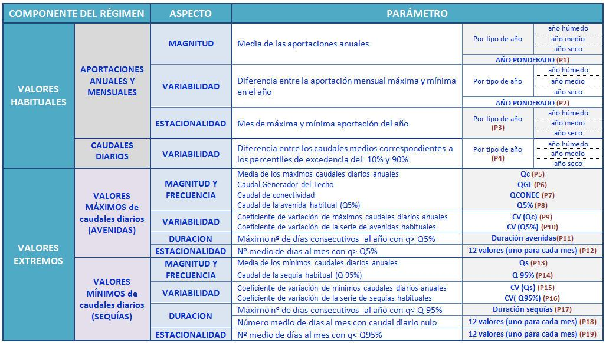

Como se puede apreciar, en la relación de parámetros que ofrece IAHRIS no hay ninguno vinculado con las tasas de cambio. Es de esperar que en próximas versiones pueda incorporarse algún parámetro que permita recoger este aspecto.

El lector interesado puede encontrar una propuesta para caracterizar las tasas de cambio, tanto en la fase de crecida del hidrograma como en la de decrecida, en el libro "*ÍNDICES DE ALTERACIÓN HIDROLÓGICA EN ECOSISTEMAS FLUVIALES*" (Martínez Santa-María, C. & Fernández Yuste, J.A. 2006. CEDEX. Mº de Fomento; Mº de Medio Ambiente), así como en el Manual de Referencias Metodológicas IAHRIS v4.0 descargable con la aplicación.

## ***¿CÓMO CUANTIFICAR LA ALTERACIÓN DEL RÉGIMEN NATURAL DE CAUDALES?***

La DMA establece que la caracterización del estado ecológico debe plantearse mediante la comparación de la situación que se quiere analizar con la de referencia. Para cada uno de los elementos a considerar –régimen hidrológico; macroinvertebrados; fitobentos; ictiofauna…- se debe:

1) Definir las variables a medir en atención a su capacidad para reflejar la integridad ambiental del elemento analizado.

2) Establecer el estado de referencia, esto es, los valores que esas variables tomarían para unas condiciones de mínima alteración del ecosistema fluvial.

3) Calcular los Ecological Quality Ratios (EQR) como cociente entre el valor de la variable para las condiciones actuales y el que le corresponde en el estado de referencia.

Aceptado que el régimen natural de caudales es el factor que en mayor medida determina la integridad del ecosistema fluvial, y disponiendo de herramientas –parámetros- que permiten cuantificar los aspectos ambientalmente más trascendentes del régimen, se formulan unos índices que permiten valorar de manera objetiva en qué grado el régimen actualmente circulante, distinto del natural –régimen alterado-, o cualquier otro propuesto –por ejemplo un régimen ambiental de caudales-, difiere o se asemeja al natural, dado que esa analogía o diferencia determinarán la integridad actual o potencial del río.

<strong>Figura nº1:</strong> <em>Recomendación del CIS-WDF para los Ecological Quality Ratios</em>.

Atendiendo a las recomendaciones del CIS-WDF (2003) referentes a los EQR (figura nº1), la mayor parte de los **ÍNDICES DE ALTERACIÓN** se han definido como **cociente entre el valor del parámetro en régimen alterado y el valor de ese mismo parámetro en régimen natural.**

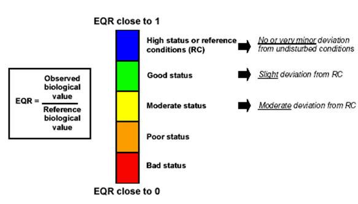

La tabla nº2 muestra la correspondencia entre los Índices de Alteración Hidrológica que puede calcular IAHRIS y los componentes del régimen cuya alteración evalúa, así como el parámetro que se utiliza para calcular el índice.  En el *Manual de Referencia Metodológica* pueden consultarse los detalles de la definición y formulación utilizada para cada índice. Si la alteración se evalúa con series coetáneas a nivel diario del régimen natural y alterado, los índices utilizados son los recogidos en la tabla nº2.

<strong>Tabla nº2:</strong> <em>Relación de Índices de Alteración Hidrológica (IAH1 – IAH21) en regímenes coetáneos. Los índices de avenidas y sequías sólo pueden calcularse si el usuario ha facilitado datos a nivel diario</em>

Si las series de régimen natural y alterado no tienen un periodo coetáneo igual o superior a 15 años, se emplean los índices recogidos en la tabla nº3.

<strong>Tabla nº3:</strong> <em>Relación de Índices de Alteración Hidrológica en regímenes no coetáneos. Los índices de avenidas y sequías sólo pueden calcularse si el usuario ha facilitado datos a nivel diario</em>

Todos los índices, para homogeneizar y facilitar su interpretación, presentan valores acotados entre cero y uno, siendo el cero indicativo de alteración máxima y uno de ausencia de alteración. Siguiendo las recomendaciones para los EQR, se han establecido cinco niveles o Estatus Hidrológicos distribuidos linealmente en el rango en el que se mueven los índices –cerouno-, asignando el código de colores recomendado para los EQR (figura nº2).

<strong>Figura nº2:</strong> <em>Criterio de asignación de categorías cualitativas a los Índices de Alteración</em>. (Valor del Índice muy bajoAlteración hidrológica muy altaNivel V; Valor del Índice muy altoAlteración hidrológica muy bajaNivel 1)

Para facilitar la interpretación global, y para cada uno de los tres grandes componentes del régimen –valores habituales, avenidas y sequías-, se ofrece dos ayudas.

Por un lado, una gráfica en malla que permite ver simultáneamente los valores de los índices implicados en el aspecto evaluado (figura nº3). En esta gráfica cada eje representa un índice y se puede apreciar con facilidad cuán lejos o cerca está el valor actual que alcanza cada índice –en rojo en la figura- de su valor natural, que siempre, por la convención asumida, es uno (1.00).

<strong>Figura nº3:</strong> <em>Diagrama para la representación conjunta de los índices</em> de valores habituales.

Por otro, se calcula un índice de alteración global para cada componente -valores habituales; avenidas; sequías- que agrega los valores de los índices utilizados para valorar cada uno de los aspectos considerados en ese componente del régimen. Ese índice agregado o global, se evalúa como el cociente entre el área definida por el polígono correspondiente al régimen alterado (delimitado por la línea roja de la figura nº3), y la correspondiente al polígono del régimen natural –que lógicamente se corresponde a la superficie asociada a todos los índices con valor uno (línea azul de la figura nº3)-.  También para estos índices de alteración global se establece un código de colores (figura nº4).

Es importante tener presente que los índices globales comparan superficies, y por tanto consideran los cuadrados de los valores de los índices del componente considerado –habituales, avenidas o sequías- y por eso el rango al que se asigna un determinado estatus es distinto -sigue una ley cuadrática-, del utilizado para los índices individuales.

<strong>Figura nº4:</strong> <em>Criterio de asignación de categorías cualitativas a los Índices de Alteración</em> Global.

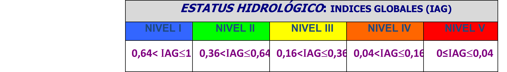

## ***¿QUÉ INFORMACIÓN ES NECESARIA?***

Como norma general, IAHRIS **recomienda disponer de al menos 15 años completos** de datos para recoger la variabilidad interanual del régimen hidrológico.  De ese modo se garantiza un mínimo de información con la que poder obtener conclusiones razonablemente aceptables relacionadas con la variabilidad y con los valores extremos.

No obstante, la aplicación permite el análisis de series más cortas, siempre que se disponga de al menos siete años completos de registros. Cuando la disponibilidad es de entre 7 y 14 años, el tipo de estudio se denomina con **SERIE REDUCIDA** y será detallada en el Anexo 2 de este documento.

**IMPORTANTE:**

- El periodo recomendado de análisis es de al menos 15 años completos de datos en las series natural y alterada.
- Si alguna de las series a analizar dispone de entre 7 y 14 años, el estudio también es posible**,** aunque en este caso se catalogará como **SERIE REDUCIDA.** Toda la casuística de esta situación será desarrollada en el **ANEXO 2** de este Manual.

En cualquiera de los dos casos citados (≥15 años o entre 14 y 7 años), los datos que deben contener las series pueden ser caudales diarios (m3/s) o aportaciones mensuales (hm3).  Si se aportan series diarias y mensuales del mismo régimen y que abarcan el mismo período de tiempo, la aplicación sólo considerará la información obtenida de la lectura de los caudales diarios. Por tanto, sólo deben aportarse series con caudales diarios y aportaciones mensuales si los registros cubren fechas distintas.

Los datos se agrupan en dos tipos:

- Serie en régimen **NATURAL**: contiene registros correspondientes al régimen natural de caudales. En cada punto de análisis sólo es posible aportar a la aplicación un **máximo** de **dos series**, una con aportaciones mensuales y otra con caudales diarios.
- Serie en régimen **ALTERADO**: contiene registros correspondientes a un régimen distinto del natural. Ese régimen puede ser el resultado de:

a)  Un aprovechamiento y/o regulación que ha venido sufriendo el río.

b) Una simulación, resultado de aplicar unos protocolos de gestión de una infraestructura, un escenario de régimen ambiental de caudales o cualquier otra hipótesis derivada de la planificación hidrológica del sistema.

La aplicación admite en cada punto de análisis tantos regímenes alterados como el usuario quiera analizar, aportando para cada uno de esos regímenes un máximo de dos series, una con aportaciones mensuales y otra con caudales diarios.

El tipo de información suministrada a la aplicación determina los resultados obtenidos. En particular, esos resultados dependen de los siguientes aspectos:

- periodicidad de los registros: datos de caudales medios diarios o aportaciones mensuales
- coetaneidad de las series:  si los datos de los regímenes natural y alterado que se comparan son o no del mismo periodo
- extensión de las series: número de años completos facilitados (≥15 años o entre 14 y 7 años).

Las posibles combinaciones de estos tres aspectos dan lugar a las 8 tipologías principales que se recogen en la tabla nº4:

<strong>Tabla nº4:</strong> <em>Tipologías de estudio en IAHRIS en función de las características de los datos facilitados</em>

En el apartado que sigue se detallan los informes que la aplicación genera en función de las características –periodicidad, coetaneidad y extensión- de los datos facilitados.

## ***¿QUÉ RESULTADOS SE OBTIENEN?***

Como se acaba de indicar, los <strong>resultados</strong> que la aplicación ofrece <strong>dependen de la información suministrada</strong>. Cuando en un punto de cálculo se aporta la <u>información más completa</u>-series de caudales diarios en régimen natural y alterado, para 15 años o más y siendo los registros coetáneos-, la aplicación facilita:

1. **La caracterización de los regímenes natural y alterado:**

Este proceso se realiza de modo independiente para cada régimen en estudio, permitiendo caracterizar y/o obtener:

- <u>Variabilidad interanual</u>, clasificando los años en húmedos, medios o secos según su aportación anual esté en el cuartil que corresponde a los valores más altos –húmedos-, en el cuartil de los más bajos –secos- o en los dos intermedios –medios-. La aplicación ofrece también un conjunto de estadísticos descriptivos de la serie de aportaciones anuales calculada a partir de los datos facilitados.
- <u>Variabilidad intranu</u>al, haciendo una clasificación en cada mes (octubre, noviembre, …) siguiendo un proceso similar al realizado anteriormente a nivel anual. De este modo los registros de cada mes se clasifican en húmedos, medios o secos según su aportación mensual esté en el cuartil que corresponde a los valores más altos de ese mes –húmedos-, en el cuartil de los más bajos de ese mes –secos- o en los dos intermedios –medios-. La aplicación ofrece también un conjunto de estadísticos descriptivos de la serie de aportaciones mensuales.

# Diecinueve <u>parámetros</u> (variables que, numéricamente, permiten caracterizar los aspectos de mayor trascendencia ambiental del régimen de caudales):

## Cuatro para la caracterización de los <u>valores habituales</u> del régimen.

## Ocho para la caracterización de las <u>avenidas.</u>

## Siete para la caracterización de las <u>sequías.</u>

# Curva de caudales clasificados para el año medio y para cada uno de los doce meses

2. La evaluación de **la alteración hidrológica, mediante los Índices de alteración, IAH** (calculados generalmente como cociente entre el valor del parámetro en régimen alterado y el valor de ese mismo parámetro en régimen natural) ofrecen para registros coetáneos (opción más favorable):

- Veintiún <u>índices individuales</u>–cada uno evalúa la alteración de un parámetro-:

## Seis para la caracterización de los <u>valores habituales</u> del régimen.

## Ocho para la caracterización de las <u>avenidas.</u>

## Siete para la caracterización de las <u>sequías</u>.

# Tres <u>Índices globales</u> –cada uno evalúa la alteración de un componente; considera conjuntamente la alteración de los parámetros utilizados para la caracterización de ese componente-. Resumen la información facilitada por los veintiún índices individuales:

## Índice de alteración de valores habituales

## Índice de alteración de avenidas

## Índice de alteración de sequías

3. La **interpretación ambiental de la alteración detectada** anteriormente, indicando su trascendencia potencial sobre los principales componentes del ecosistema fluvial: morfología, ictiofauna, macroinvertebrados, hábitat y vegetación de ribera.

4. La **catalogación como masa de agua muy alterada hidrológicamente:**

# <u>Un informe obtenido según el criterio P10-90</u>: <em>El epígrafe 3.4.2 de la IPH (Masas de agua muy alteradas hidrológicamente) indica: ...Se entenderá que una masa de agua está muy alterada hidrológicamente cuando presenta una desviación significativa en la magnitud de los parámetros que caracterizan las condiciones mensuales y anuales del régimen hidrológico... Se considerará que la desviación es significativa cuando la magnitud del parámetro anual o mensual se desvía significativamente de los valores del percentil del 10% al 90% de la serie en régimen natural.</em>

En este INFORME de IAHRIS se asume que una masa de agua está hidrológicamente <strong>muy alterada cuando el % del</strong> <strong><u>nº total de meses_</u>o el % del</strong> <strong><u>nº total de años_</u>que cumple es inferior al 50%</strong>. Si no se cumple este requisito, IAHRIS no asigna clasificación.

# <u>Un informe obtenido según el criterio IAH-MMA</u>. <em>El epígrafe 3.4.2 de la IPH  indica: … En los ríos identificados como masas de agua se analizará su grado de alteración hidrológica mediante el cálculo de índices de alteración hidrológica… con estos índices se comparan las condiciones del régimen natural de referencia con las condiciones actuales… los parámetros utilizados deben basarse en las características fundamentales de los regímenes hidrológicos, como magnitud, duración, frecuencia, estacionalidad y tasas de cambio....</em>

En este INFORME de IAHRIS se asume que una masa de agua está **hidrológicamente muy alterada si más del 50% de los indicadores seleccionados muestran una alteración ≥al 50% (es decir, el índice toma un valor ≤ 0,5).** Si no se cumple este requisito, IAHRIS no asigna clasificación.

Todos estos resultados, con tablas numéricas y gráficos, IAHRIS los ofrece ordenados en informes como hojas contenidas en un **libro Excel**. La tabla nº5 presenta la relación de todos los informes que puede ofrecer IAHRIS para el caso de series de al menos 15 años. Será la casuística de los datos facilitados –mensuales o diarios; coetáneos o no coetáneos-la que determinará los informes presentados para un caso concreto.

<table><tr><td colspan="3">
<strong>RELACIÓN DE INFORMES </strong>
</td></tr><tr><td rowspan="9">
Caracterización de la magnitud y variabilidad
</td><td>
<strong>1</strong>
</td><td>
RN: CARACTERIZACIÓN DE LA MAGNITUD Y VARIABILIDAD INTERANUAL
</td></tr><tr><td>
<strong>1a</strong>
</td><td>
RA: CARACTERIZACIÓN DE LA MAGNITUD Y VARIABILIDAD INTERANUAL
</td></tr><tr><td>
<strong>1b</strong>
</td><td>
RN y RA: CARACTERIZACIÓN DE LA MAGNITUD Y VARIABILIDAD INTERANUAL
</td></tr><tr><td>
<strong>2</strong>
</td><td>
RN: CARACTERIZACIÓN DE LA MAGNITUD Y VARIABILIDAD INTRANUAL (estadísticos) 
</td></tr><tr><td>
<strong>2a</strong>
</td><td>
RN: CARACTERIZACIÓN DE LA MAGNITUD Y VARIABILIDAD INTRANUAL (medianas)
</td></tr><tr><td>
<strong>3</strong>
</td><td>
RA: CARACTERIZACIÓN DE LA MAGNITUD Y VARIABILIDAD INTRANUAL (estadísticos)
</td></tr><tr><td>
<strong>3a</strong>
</td><td>
RA: CARACTERIZACIÓN DE LA MAGNITUD Y VARIABILIDAD INTRANUAL (medianas)
</td></tr><tr><td>
<strong>3b</strong>
</td><td>
RN y RA: CARACTERIZACIÓN DE LA MAGNITUD Y VARIABILIDAD INTRANUAL (medianas)
</td></tr><tr><td>
<strong>3c</strong>
</td><td>
RN y RA: CARACTERIZACIÓN DEL RANGO DE VARIABILIDAD INTRANUAL (percentiles)
</td></tr><tr><td rowspan="5">
Parámetros para la caracterización del régimen 
</td><td>
<strong>4</strong>
</td><td>
RN: PARÁMETROS PARA LA CARACTERIZACIÓN CON DATOS DIARIOS
</td></tr><tr><td>
<strong>4a</strong>
</td><td>
RN: PARÁMETROS PARA LA CARACTERIZACIÓN CON DATOS MENSUALES
</td></tr><tr><td>
<strong>5</strong>
</td><td>
RA: PARÁMETROS PARA LA CARACTERIZACIÓN CON DATOS DIARIOS
</td></tr><tr><td>
<strong>5a</strong>
</td><td>
RA: PARÁMETROS PARA LA CARACTERIZACIÓN CON DATOS MENSUALES
</td></tr><tr><td>
<strong>5b</strong>
</td><td>
RA: PARÁMETROS PARA LA CARACTERIZACIÓN CON DATOS DIARIOS (Régimen Natural no disponible)
</td></tr><tr><td rowspan="6">
Curvas de caudales clasificados
</td><td>
<strong>6</strong>
</td><td>
RN: VALORES MEDIOS DE LAS CURVAS ANUALES DE CAUDALES CLASIFICADOS
</td></tr><tr><td>
<strong>6a</strong>
</td><td>
RA: VALORES MEDIOS DE LAS CURVAS ANUALES DE CAUDALES CLASIFICADOS
</td></tr><tr><td>
<strong>6b</strong>
</td><td>
RN y RA: VALORES MEDIOS DE LAS CURVAS ANUALES DE CAUDALES CLASIFICADOS
</td></tr><tr><td>
<strong>6c</strong>
</td><td>
RN: VALORES MEDIOS DE LAS CURVAS MENSUALES DE CAUDALES CLASIFICADOS
</td></tr><tr><td>
<strong>6d</strong>
</td><td>
RA: VALORES MEDIOS DE LAS CURVAS MENSUALES DE CAUDALES CLASIFICADOS
</td></tr><tr><td>
<strong>6e</strong>
</td><td>
RN y RA: VALORES MEDIOS DE LAS CURVAS MENSUALES DE CAUDALES CLASIFICADOS
</td></tr><tr><td rowspan="4">
Índices de alteración hidrológica
</td><td>
<strong>7a</strong>
</td><td>
RA: ÍNDICES DE ALTERACIÓN HIDROLÓGICA: VALORES HABITUALES (datos diarios coetáneos) 
</td></tr><tr><td>
<strong>7b</strong>
</td><td>
RA: ÍNDICES DE ALTERACIÓN HIDROLÓGICA: VALORES HABITUALES (datos mensuales coetáneos) 
</td></tr><tr><td>
<strong>7c</strong>
</td><td>
RA: ÍNDICES DE ALTERACIÓN HIDROLÓGICA: VALORES HABITUALES (datos no coetáneos)
</td></tr><tr><td>
<strong>7d</strong>
</td><td>
RA: ÍNDICES DE ALTERACIÓN HIDROLÓGICA: AVENIDAS Y SEQUÍAS 
</td></tr><tr><td rowspan="5">
Indicador global según IPH para Masas Muy alteradas
</td><td>
<strong>8</strong>
</td><td>
RA: INDICADOR P10-90 PARA MASAS MUY ALTERADAS (IPH)
</td></tr><tr><td>
<strong>8a</strong>
</td><td>
RA: INDICADOR IAH-MMA PARA MASAS MUY ALTERADAS según IPH (datos diarios coetáneos)
</td></tr><tr><td>
<strong>8b</strong>
</td><td>
RA: INDICADOR IAH-MMA PARA MASAS MUY ALTERADAS según IPH (datos diarios no coetáneos)
</td></tr><tr><td>
<strong>8c</strong>
</td><td>
RA. INDICADOR IAH-MMA PARA MASAS MUY ALTERADAS según IPH (datos mensuales coetáneos)
</td></tr><tr><td>
<strong>8d</strong>
</td><td>
RA: INDICADOR IAH-MMA PARA MASAS MUY ALTERADAS según IPH (datos mensuales no coetáneos)
</td></tr><tr><td rowspan="4">
Significación ambiental de la alteración hidrológica
</td><td>
<strong>10a</strong>
</td><td>
SIGNIFICACIÓN AMBIENTAL DE LOS ÍNDICES DE ALTERACIÓN HIDROLÓGICA: VALORES HABITUALES, AVENIDAS Y SEQUÍAS (datos diarios coetáneos) 
</td></tr><tr><td>
<strong>10b</strong>
</td><td>
SIGNIFICACIÓN AMBIENTAL DE LOS ÍNDICES DE ALTERACIÓN HIDROLÓGICA: VALORES HABITUALES (datos mensuales coetáneos) 
</td></tr><tr><td>
<strong>10c</strong>
</td><td>
SIGNIFICACIÓN AMBIENTAL DE LOS ÍNDICES DE ALTERACIÓN HIDROLÓGICA: VALORES HABITUALES, AVENIDAS Y SEQUÍAS (datos diarios no coetáneos) 
</td></tr><tr><td>
<strong>10d</strong>
</td><td>
SIGNIFICACIÓN AMBIENTAL DE ÍNDICES DE ALTERACIÓN HIDROLÓGICA: VALORES HABITUALES (datos mensuales no coetáneos) 
</td></tr></table>

<strong>Tabla nº5:</strong> <em>Relación de todos los informes que puede ofrecer IAHRIS para el caso de series de al menos 15 años, con referencia a la información contenida en cada uno de ellos</em>. <em>El número de informes que ofrece en un análisis concreto depende de los datos suministrados por el usuario, es decir de la TIPOLOGÍA de estudio (ver Tabla nº 4). Para conocer con más detalle los resultados que facilita la aplicación según las características de la información suministrada por el usuario, consultar el Capítulo 5.</em>

## ***¿PARA QUÉ PUEDE SERVIR IAHRIS?***

Aunque serán el tiempo, la experiencia y aportaciones de los usuarios quienes mejor puedan dar una respuesta a la pregunta que encabeza este epígrafe, se incluyen a continuación algunas cuestiones a las que esta aplicación, eso esperamos, pueda contribuir a abordar con rigor y objetividad.

**¿Para qué IAHRIS?** Para:

- Poner a disposición de la comunidad científica y de los gestores de recursos hídricos un instrumento que permite cumplir lo exigido por la DMA para la **caracterización del estado hidrológico de las masas de agua**.
- Cuantificar objetivamente la **alteración que inducen los aprovechamientos** de los recursos hídricos sobre el régimen natural de caudales.
- Interpretar las **consecuencias de la alteración** del régimen de caudales en la integridad del ecosistema fluvial.
- Trabajar como **banco de pruebas**:

- Valorar la alteración que sobre el régimen natural de caudales producirían **distintos escenarios de usos y gestión** de los recursos hídricos.

- Identificar los aspectos del régimen actual que en mayor medida condicionan la **rehabilitación o recuperación** de la masa de agua en estudio.
- Fijar criterios objetivos para **establecer prioridades** en la restauración de ecosistemas fluviales.
- Calcular y evaluar escenarios de regímenes ambientales en la componente de mínimos tomando como referencia el régimen natural.
- Asignar la condición de masa de agua muy alterada hidrológicamente con criterios objetivos

## ***PARA SABER MÁS***

**RECUERDA:**

- Para poder hacer una buena interpretación, aplicación y valoración de los resultados obtenidos con los <strong>Í</strong>ndices de <strong>A</strong>lteración <strong>H</strong>idrológica en <strong>RÍ</strong>o<strong>S</strong>, es necesario dedicar tiempo suficiente para familiarizarse con los detalles conceptuales y metodológicos presentados en el <em><strong>Manual de Referencia Metodológica.</strong></em>

Con las indicaciones que se van a presentar en los epígrafes siguientes, es fácil, eso esperamos, preparar unos datos y ejecutar la aplicación, obteniendo los correspondientes informes.

Sin embargo, es muy aconsejable invertir el tiempo necesario en conocer con detalle los principios y conceptos básicos en los que este trabajo se basa, los cómos y por qués de los parámetros seleccionados para caracterizar los distintos componentes y aspectos del régimen de caudales, así como su formulación y la de los índices correspondientes, y las singularidades que pueden aparecer y los criterios planteados para abordarlas. Sólo así se dispondrá de un bagaje adecuado para poder hacer una buena interpretación, valoración y aplicación de los resultados obtenidos.

IAHRIS nace como software libre, con la esperanza de ofrecer a la comunidad científica, técnica y de gestión, una herramienta con la que contribuir al conocimiento del estado del régimen hidrológico de nuestros ríos. Mejorar los fundamentos en los que se apoya IAHRIS, y mejorar también el software para facilitar el trabajo a todos los interesados, debe ser un objetivo permanente en el que pueden integrarse todos los usuarios. El código fuente de la aplicación está disponible en….

***2***

**INSTALACIÓN**

***¿QUÉ REQUISITOS DEBE TENER EL SISTEMA?***

***DESCARGAR Y EJECUTAR EL INSTALABLE***

***¿QUÉ FICHEROS INSTALA Y DÓNDE?***

## ***¿QUÉ REQUISITOS DEBE TENER EL SISTEMA?***

**IMPRESCINDIBLE:**

- .NET Framework 4.0

*Todos los informes generados por IAHRIS se presentan en archivos con formato \*.xlsx, pero no es necesario tener instalado Microsoft Excel para que IAHRIS funcione.*

*Todos los datos de entrada utilizados por la aplicación se almacenan en un archivo con formato \*.mdb. IAHRIS se ejecuta sin necesidad de tener instalado Microsoft Access, permitiendo exportar e importar bases de datos.*

## ***DESCARGAR Y EJECUTAR EL INSTALABLE***

*La instalación de la aplicación se efectúa a través del fichero instalable*

*disponible en* [*https://ambiental.cedex.es/hidromorfologia-iahris.php*](https://ambiental.cedex.es/hidromorfologia-iahris.php)

## ***¿QUÉ FICHEROS INSTALA Y DÓNDE?***

El instalable se encarga de colocar en el directorio escogido por el usuario todos los ficheros requeridos por la aplicación.

Al pulsar aparece una ventana de presentación con un botón de acceso (Ir/Go) a la aplicación:

<strong>Figura nº5:</strong> <em>Ventana inicial de la aplicación IAHRIS</em>.

Los archivos colocados en el directorio de la aplicación no deben manipularse para garantizar un correcto funcionamiento.

***3***

**DATOS**

***¿QUÉ TIPOS DE DATOS PUEDEN EMPLEARSE?***

***LA APLICACIÓN Y LA BASE DE DATOS ASOCIADA***

***¿QUÉ ESTRUCTURA DEBEN TENER LOS FICHEROS DE DATOS?***

## ***¿QUÉ TIPOS DE DATOS PUEDEN EMPLEARSE?***

La aplicación utiliza series temporales de datos correspondientes a <strong>caudales diarios</strong>, expresados en m3/s, y/o a <strong>aportaciones mensuales</strong>, expresadas en hm3. En ambos casos, cada registro –caudal o aportación- debe llevar <strong>asociada la correspondiente fecha</strong>, día, mes y año en el caso de caudal diario, y mes y año para la aportación mensual.

Para cada punto del río sólo se podrá disponer de hasta dos series en régimen natural, una con caudales diarios y otra con aportaciones mensuales.

En régimen alterado, el usuario podrá aportar tantas como disponga. Por ejemplo, si se trata de una presa que lleva años en explotación puede considerarse una única serie correspondiente al régimen alterado, o varias, si a lo largo de ese período los criterios de gestión han cambiado, de manera que cada una de las series de caudales correspondiente a cada uno de esos períodos se trataría como serie independiente, todas con el carácter de régimen alterado y asociadas al mismo punto del río. Otro caso para el que se dispondría de varias series en régimen alterado para el mismo punto del río sería aquel en el que se analicen distintas estrategias de gestión de una infraestructura hidráulica: para cada hipótesis, y con la misma o distinta ventana temporal, se generaría la correspondiente serie simulada, y cada una de esas series constituiría un régimen alterado distinto vinculado al mismo punto del río.

Esta posibilidad de que el usuario pueda disponer en un punto de un río de más de una serie asociada en régimen alterado hace que la aplicación prevea un tratamiento específico para estas series.

## ***LA APLICACIÓN Y LA BASE DE DATOS ASOCIADA***

Para entender adecuadamente la estructura, la gestión de datos y el funcionamiento de la aplicación, es necesario tener presente que su núcleo central lo constituye la base de datos.

Hay tres conceptos fundamentales en torno a los que la aplicación organiza y gestiona la información, los cálculos y los resultados:

- **PROYECTO:** entidad o unidad de trabajo que engloba un conjunto de puntos, así como sus alteraciones y series asociadas**.**
- **PUNTO:** Se entiende por punto la sección o tramo de río para el que se dispone de datos de caudales diarios y/o aportaciones mensuales, bien en régimen natural, o en régimen alterado o en ambos regímenes. Todos los puntos a almacenar en la base de datos requieren un CÓDIGO identificativo y una DESCRIPCIÓN, pudiendo introducirse tantos puntos como se quiera, siempre que su CÓDIGO identificativo sea diferente de cualquier otro código utilizado para otro punto del mismo proyecto.
- **SERIE:** Serie de caudales medios diarios o aportaciones mensuales asociada a un determinado PUNTO. Todas las SERIES utilizadas por la aplicación requieren tener asignado:

- **Tipo de periodicidad:**  MENSUAL o DIARIO
- **Tipo de régimen:** NATURAL o ALTERADO
- **Código de PUNTO asociado al régimen natural**
- **Código de ALTERACIÓN asociada** (sólo para las series correspondientes a un régimen alterado)

El máximo número de series asociadas a un determinado punto es de 2\*(1+Nº alteraciones asociadas), ya que cada punto puede llevar asociadas dos series diferentes (de aportaciones mensuales y de caudales medios diarios) para cada tipo de régimen.

- <strong>ALTERACIÓN:</strong> Como ya se ha señalado en el primer epígrafe de este capítulo, en un punto pueden considerarse varias series correspondientes a distintos regímenes alterados. Para facilitar la gestión de esta información, la aplicación exige que cualquier serie de régimen alterado vaya siempre asociada a un PUNTO y sea declarada en la base de datos con un CÓDIGO identificativo de la alteración y una DESCRIPCIÓN, pudiendo introducirse, para un determinado PUNTO, tantos regímenes alterados como se quiera, siempre que el <u>CÓDIGO identificativo sea diferente de cualquier otro utilizado para una alteración dentro del mismo proyecto</u>, con independencia del punto al que esta última se encuentre asociada.

## ***¿QUÉ ESTRUCTURA DEBEN TENER LOS FICHEROS DE DATOS?***

La aplicación **sólo lee ficheros tipo csv** (**c**omma **s**eparated **v**alues). Se trata de un tipo de fichero de texto sencillo, en el que las columnas se separan utilizando un determinado carácter (que, en el caso que nos ocupa, es el punto y coma), y las filas por saltos de línea.

Dichos ficheros pueden confeccionarse con distintos editores, pero se atienen a una estructura fácilmente manejada por **Microsoft Excel**, por lo que éste resulta ser un buen editor para su manejo, ya que permite organizar toda la información estructurada en columnas, y guardarlo como fichero tipo csv delimitado por comas.

Los ficheros de importación válidos deben incorporar una primera línea conteniendo la información necesaria para establecer a qué tipo de datos corresponden, cuál es la periodicidad de los mismos y a qué punto de cálculo y alteración –esta última, sólo en caso de corresponder a una serie de datos alterados- corresponden. El resto de las líneas –ninguna de ellas en blanco- contienen cada una el periodo (mes y año) o fecha (día, mes y año) al que corresponden, así como el valor correspondiente a la serie en cuestión para dicho periodo o fecha.

El procedimiento más habitual para generar estos archivos csv es crearlos primero en Excel y posteriormente guárdalos en el formato requerido.

Se describen a continuación la estructura adecuada en Excel de los archivos correspondientes a las diferentes casuísticas de datos:

1. **Archivo de datos en régimen natural con periodicidad diaria**

La primera fila del archivo debe recoger siempre en MAYÚSCULAS:

•	Columna A: periodicidad de los datos. Para este caso sería DIARIO

•	Columna B: tipo de régimen, NATURAL

•	Columna C: código del punto de estudio (a elegir por el usuario). Máximo 12 caracteres. En el ejemplo que aparece en la figura nº 6 se ha elegido como código del punto EA3051

Las filas siguientes deben recoger:

•	Columna A: fecha en formato dd/mm/aaaa

•	Columna B: caudal medio diario en m3/s

<strong>Figura nº6:</strong> <em>Ejemplo del formato del archivo de datos en régimen natural con datos de caudales medios diarios</em>.

2. **Archivo de datos en régimen natural con periodicidad mensual**

La primera línea debe recoger siempre en MAYÚSCULAS:

•    Columna A: periodicidad de los datos. Para este caso sería MENSUAL

•	Columna B: tipo de régimen, NATURAL

•	Columna C: código del punto de estudio (a elegir por el usuario). Máximo 12 caracteres. Para el ejemplo que aparece en la figura nº 7 se ha elegido como código del punto EA3051

Las filas siguientes deben recoger:

•	Columna A: año, en formato aaaa

•	Columna B: mes, con el nº de mes correspondiente (1 enero, …. 12 diciembre)

•	Columna C: Aportación mensual en hm3

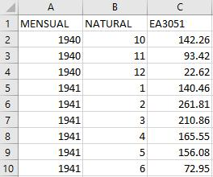

<strong>Figura nº7:</strong> <em>Ejemplo del formato del archivo de datos en régimen natural con datos de aportaciones mensuales</em>

3. **Archivo de datos en régimen alterado con periodicidad diaria**

La primera fila del archivo debe recoger siempre en MAYÚSCULAS:

•	Columna A: periodicidad de los datos. Para este caso sería DIARIO

•	Columna B: tipo de régimen, ALTERADO

•	Columna C: código del punto de estudio (a elegir por el usuario). Máximo 12 caracteres. Si la serie alterada se va a comparar con una serie natural, debe ponerse aquí el mismo código punto utilizado en el archivo de datos naturales. En el ejemplo que aparece en la figura nº8 se ha elegido como código del punto EA3051

•	Columna D: código de la alteración (a elegir por el usuario). Máximo 12 caracteres. En el ejemplo que aparece en la figura nº8 se ha elegido como código de la alteración: EA3051\_A

Las filas siguientes deben recoger:

•	Columna A: fecha en formato dd/mm/aaaa

•	Columna B: caudal medio diario en m3/s

<strong>Figura nº8:</strong> <em>Ejemplo del formato del archivo de datos en régimen alterado con datos de caudales medios diarios</em>.

4. **Archivo de datos en régimen alterado con periodicidad mensual**

La primera línea debe recoger siempre en MAYÚSCULAS:

•    Columna A: periodicidad de los datos. Para este caso sería MENSUAL

•	Columna B: tipo de régimen, ALTERADO

•	Columna C: código del punto de estudio (a elegir por el usuario). Máximo 12 caracteres. Si la serie alterada se va a comparar con una serie natural, debe ponerse aquí el mismo código punto utilizado en el archivo de datos naturales. Para el ejemplo que aparece en la figura nº9 se ha elegido como código del punto EA3051

- Columna D: código de la alteración (a elegir por el usuario). Máximo 12 caracteres. En el ejemplo que aparece en la figura nº9se ha elegido como código de la alteración: EA3051\_A

Las filas siguientes deben recoger:

•	Columna A: año, en formato aaaa

•	Columna B: mes, con el nº de mes correspondiente (1 enero, …. 12 diciembre)

•	Columna C: Aportación mensual en hm3

<strong>Figura nº9:</strong> <em>Ejemplo del formato del archivo de datos en régimen alterado con datos de aportaciones mensuales</em>

**OBSERVACIONES IMPORTANTES**:

- La información temporal contenida en un fichero de importación no tiene por qué estar ordenada en función de la fecha, ya que aquélla se ordena posteriormente en la base de datos. Sin embargo, no se admiten fechas inexistentes ni tampoco fechas repetidas (dos o más líneas con fecha o periodo coincidente). Los años bisiestos deben incorporar el 29 de febrero.

- Los ficheros no pueden contener líneas en blanco, y cada línea debe contener toda la información requerida.

- El correcto funcionamiento de la aplicación exige verificar en el Panel de control; Región:

- Formato: Español (España)
- Fecha: dd/MM/aaaa
- El separador decimal debe ser el "." y el separador de listas ";"

- Los códigos tanto del punto como de la alteración deben ir en mayúsculas, sin tildes ni caracteres extraños (no usar la letra "ñ")

- La aplicación está preparada para **rechazar** cualquier **fichero** que **no se ajuste** estrictamente a **los requisitos de formato** expuestos.

- Si al cargar los ficheros en la aplicación, se detectan errores o fallos, la aplicación facilita un listado de los mismos.

- Una vez completado el fichero Excel, el usuario debe guardar el archivo con formato <strong>csv</strong>. Para ello sólo tiene que abrir la pestaña <em>Guardar como tipo</em> que presenta Excel cuando se selecciona <em>Guardar Como</em> y marcar <em><strong>CSV</strong></em> (delimitado por comas).

- En la figura nº10 se incluyen ejemplos de diferentes ficheros válidos para su importación, visualizados a través del bloc de notas.

<strong>Figura nº10:</strong> <em>Ejemplos de ficheros tipo csv válidos para su importación a la aplicación</em>. En el ejemplo mostrado se ha utilizado como código del punto GALLEGO y como código de la alteración GALLEGO1.

Como comprobación final se recomienda abrir, con el Bloc de Notas u otro editor de texto de características similares, el fichero **\*.csv** generado desde Excel para VERIFICAR que cumple los requisitos exigidos para que pueda ser leído por IAHRIS.

<strong>Figura nº11:</strong> <em>Aspecto del block de notas de un archivo incorrecto al presentar filas en blanco</em>.

En ocasiones, cuando se utiliza Excel como puente para generar los ficheros **csv**, éstos presentan líneas en blanco a continuación de la última que contiene datos. Esta circunstancia se aprecia con facilidad cuando el fichero **\*.csv** se abre con el Bloc de Notas y con la barra de desplazamiento se accede al final de la lista de datos (Figura nº 11). Si aparece una situación como la de la imagen, ese fichero NO será leído por IAHRIS, ya que interpreta que contiene líneas en blanco, que se identifican fácilmente porque sólo contienen punto y coma. Para solventar este posible problema, el usuario puede eliminar las filas en blanco directamente sobre el fichero **\*.csv** con el Bloc de Notas, o en Excel eliminar las filas que hay entre la que sigue a la última con datos y hasta agotar el recorrido de la barra de desplazamiento vertical; aparentemente se eliminan filas que no contienen ninguna información, pero que al convertirse a formato csv incorporan las líneas en blanco que dan problemas. El archivo **\*.csv** generado después de esa acción debería ser válido.

***4***

**LA APLICACIÓN**

***PRIMER CONTACTO***

***ÁREA DE DECLARACIÓN DE DATOS***

***ÁREA DE SELECCIÓN DE PUNTO, ALTERACIÓN Y SERIES***

***ÁREA DE INFORMACIÓN SOBRE LAS SERIES***

***ÁREA DE SELECCIÓN DEL MÓDULO A REALIZAR***

***ÁREA DE RESULTADOS***

***ÁREA DE GESTIÓN DE BASES DE DATOS***

***OTRAS UTILIDADES***

***PRIMER CONTACTO***

La pantalla principal de la aplicación presenta, al entrar, el siguiente aspecto:

<strong>Figura nº12:</strong> <em>Pantalla principal de IAHRIS con indicación de las distintas áreas</em>

Hay que distinguir SIETE áreas que contienen menús habilitados para cubrir distintas acciones:

1. Área de declaración de datos
2. Área de selección de punto, alteración y series
3. Área de información sobre las series
4. Área de selección del tipo de estudio a realizar
5. Área de resultados
6. Área de gestión de bases de datos
7. Otras utilidades

1. **ÁREA DE DECLARACIÓN DE DATOS**

Situada en la cabecera de la ventana principal, contiene cuatro pestañas –Gestión de Proyectos, Gestión de Puntos; Gestión de Alteraciones y Gestión de Series-, que habilitan las acciones necesarias para declarar a la base de datos los puntos a estudiar, las alteraciones consideradas y las series de datos disponibles.

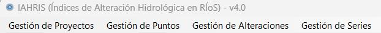

#### **A.1 GESTIÓN DE PROYECTOS**

El Proyecto es la carpeta de trabajo donde se van guardando los puntos de estudios, sus alteraciones (si las hubiera) y las series asociadas.

La pestaña de GESTION DE PROYECTOS permite: añadir un proyecto nuevo, editar un proyecto existente y eliminar un proyecto creado anteriormente.

- **Añadir proyecto:** permite introducir un nuevo proyecto, introduciendo su nombre y una breve descripción del mismo.

<strong>Figura nº12:</strong> <em>Interfaz para añadir un proyecto nuevo</em>

Se admiten hasta 12 caracteres para la introducción del Nombre, y 20 para la introducción de la Descripción

- **Eliminar proyecto**: permite eliminar en la base de datos cualquier proyecto previamente declarado. Al seleccionar esta opción, el programa nos informa del número de puntos asociados a este proyecto que también serán eliminados.

<strong>Figura nº13:</strong> <em>Interfaz para eliminar un proyecto existente</em>

- **Editar proyecto:** permite visualizar y modificar el nombre y descripción de un proyecto ya creado.

#### **A.2 GESTIÓN DE PUNTOS**

Permite gestionar el conjunto de puntos de cálculo que se desee tratar. Al seleccionar el correspondiente menú se presentan las siguientes opciones:

- **Añadir punto:** Permite introducir un nuevo punto de cálculo. Seleccionada la opción, se presenta la siguiente pantalla emergente:

<strong>Figura nº14:</strong> <em>Interfaz para añadir un punto nuevo</em>

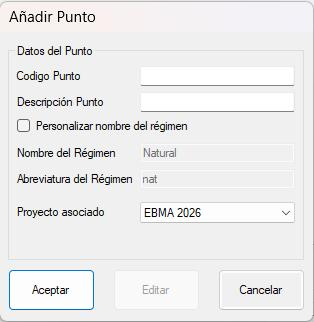

Como datos del Punto deben introducirse:

- <strong>El código del punto:</strong> este código debe <u>coincidir exactamente con el declarado en el archivo csv de la serie natural</u><strong><u>.</u></strong>Se recuerda la obligatoriedad de escribirlo en mayúsculas<strong>,</strong> sin tildes ni caracteres extraños y con un máximo de 12 caracteres.
- **La descripción del punto:** descripción adicional facilitada por el usuario con un máximo de 20 caracteres. En caso de que el usuario no desee introducir una descripción deberá dejar al menos un espacio en blanco.
- **Proyecto asociado:** seleccionando el proyecto -dentro de los existentes- donde se desea guardar el punto declarado.
- Como opción complementaria se puede activar "<strong>Personalizar el nombre del régimen".</strong> Al activar esta opción el usuario puede sustituir el nombre y la abreviatura que por defecto da la aplicación al régimen de referencia (<em>Natural</em> y <em>nat</em> respectivamente). Este nombre y abreviatura serán los que aparezcan en las tablas y salidas gráficas de los informes generados.

Introducida toda la información se dispone de los botones para **Aceptar** el nuevo punto o **Cancelar** la operación.

En caso de introducir un **Código** de **Punto** ya registrado en el mismo proyecto, aparece un mensaje emergente indicando tal circunstancia y abortando su introducción. En caso contrario, el nuevo punto queda registrado para introducir posteriormente cuantas alteraciones y series asociadas se encuentren disponibles.

La aplicación permite repetir códigos de puntos siempre que pertenezcan a proyectos distintos.

- **Eliminar punto:** Permite eliminar de la base de datos cualquier punto de cálculo introducido previamente. Seleccionada la opción, se presenta la pantalla emergente que se muestra seguidamente.

<strong>Figura nº15:</strong> <em>Interfaz para eliminar un punto existente</em>

Contiene a su izquierda una lista desplegable para seleccionar uno cualquiera de los **Puntos** previamente declarados. En el momento en que se actúe sobre uno de ellos, se destacará sobre fondo azul, presentándose en la lista de la derecha cuantas alteraciones tenga asociadas, si las hubiere. Asimismo, el botón de **Borrar**, situado en la parte inferior derecha de la pantalla, quedará habilitado para eliminar el punto seleccionado. Como se indica en la propia pantalla, la eliminación de un punto conlleva la de todas las alteraciones y series asociadas al punto en cuestión. Por último, en la parte superior derecha de la pantalla se encuentra un botón para abandonar la pantalla y regresar a la aplicación principal, que permanecerá inactiva mientras la de borrado se encuentre presente.

#### **A.3 GESTIÓN DE ALTERACIONES**

De manejo similar al anterior, permite gestionar las alteraciones de régimen asociadas al conjunto de puntos de cálculo previamente declarados. Al seleccionar el correspondiente menú se presentan las siguientes opciones:

- **Añadir alteración**: Permite introducir una nueva alteración, que debe estar ligada a un determinado punto de cálculo. Seleccionada la opción, se presenta la siguiente pantalla emergente:

<strong>Figura nº16:</strong> <em>Interfaz para añadir una alteración</em>

- <strong>El código de la alteración:</strong> este código debe <u>coincidir exactamente con el declarado en el archivo csv de la serie alterada</u><strong><u>.</u></strong>Se recuerda la obligatoriedad de escribirlo en mayúsculas<strong>,</strong> sin tildes ni caracteres extraños y con un máximo de 12 caracteres.
- **La descripción de la alteración:** descripción adicional facilitada por el usuario con un máximo de 20 caracteres. En caso de que el usuario no desee introducir una descripción deberá dejar al menos un espacio en blanco.
- **Proyecto asociado:** seleccionando el proyecto -dentro de los existentes- donde se desea guardar la alteración declarada.
- **Punto asociado:** seleccionando el punto -dentro de los existentes- con el que se desea vincular la alteración declarada.
- Como opción complementaria se puede activar "<strong>Personalizar el nombre del régimen".</strong> Al activar esta opción el usuario puede sustituir el nombre y la abreviatura que por defecto da la aplicación al régimen alterado (<em>Alterado</em> y <em>alt</em> respectivamente). Este nombre y abreviatura serán los que aparezcan en las tablas y salidas gráficas de los informes generados.

En el caso de que el **Código** de la alteración ya haya sido registrado anteriormente (bien para el propio punto, bien para otro punto del mismo proyecto), aparecerá un mensaje emergente rechazando la introducción de la alteración. En caso contrario, ésta se añadirá a la base de datos, regresando a la pantalla principal de la aplicación. La aplicación permite repetir el código de la alteración siempre que pertenezcan a proyectos diferentes.

- **Eliminar alteración**: Permite eliminar de la base de datos cualquier alteración introducida previamente.

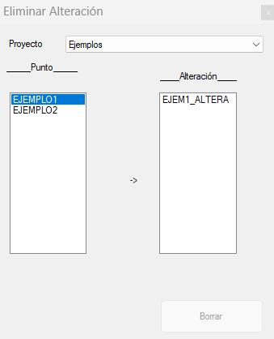

<strong>Figura nº17:</strong> <em>Interfaz para eliminar una alteración existente</em>

- **Editar alteración**: Permite visualizar o modificar la información de la alteración seleccionada.

#### **A.4 GESTIÓN DE SERIES**

De manejo similar a los anteriores, está diseñado para añadir o eliminar de la base de datos una determinada serie temporal. Presenta las siguientes opciones:

- <strong>Añadir serie</strong>: Permite añadir una serie temporal a la base de datos, siempre que corresponda a alguno de los tipos de series posibles y esté asociada a alguno de los <u>puntos y alteraciones previamente declarados</u>. Para ello, toda la información correspondiente a una determinada serie temporal debe encontrarse previamente en un fichero determinado, ubicado en el equipo de trabajo. Los ficheros a utilizar deberán llevar la extensión \*.csv, y además deberán acomodarse a los formatos ya descritos (ver Capítulo 3). Seleccionada la opción, aparecerá la pantalla emergente:

<strong>Figura nº18:</strong> <em>Interfaz para añadir series de datos</em>

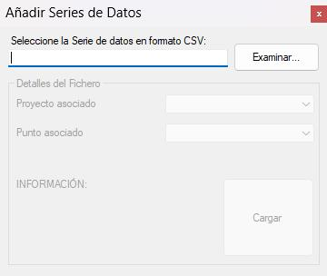

Presionando el botón para **Examinar** directorios, permite buscar y seleccionar el fichero tipo csv que contenga la serie temporal que pretenda importarse a la base de datos.

Al cargar una serie, las ventanas emergentes que muestra la aplicación son diferentes según se trate de una serie con registros del régimen natural o del régimen alterado.

1. <u>Ventana de carga de datos de régimen natural</u>:

El usuario debe seleccionar en los desplegables correspondientes, el proyecto y el punto asociados, los cuales habrán sido declarados previamente.

La aplicación se habrá encargado de leer la primera línea del archivo (donde se ha incluido la información sensible, tal y como se ya se ha comentado), mostrando en el bloque inferior de INFORMACIÓN, el tipo de régimen, su periodicidad y el código del punto (que deberá coincidir con el seleccionado por el usuario en el combo superior).

<strong>Figura nº19:</strong> <em>Ejemplo de carga de la serie en régimen natural</em>

2. <u>Ventana de carga de datos de régimen alterado</u>

El usuario debe seleccionar en los desplegables correspondientes, el proyecto y la alteración asociados, los cuales habrán sido declarados previamente.

La aplicación se habrá encargado de leer la primera línea del archivo (donde se ha incluido la información sensible, tal y como se ya se ha comentado), mostrando en el bloque inferior de INFORMACIÓN, el tipo de régimen, su periodicidad, el código del punto y el código de la alteración (que deberá coincidir con el seleccionado por el usuario en el combo superior).

<strong>Figura nº20:</strong> <em>Ejemplo de carga de la serie en régimen alterado</em>

A continuación, se debe apretar el botón de **Cargar**.

En caso de que el fichero csv no cumpla determinadas condiciones (que incluya en la primera línea tipo de periodicidad y tipo de régimen, así como códigos registrados en la base relativos al punto y alteración de que se trate, o que las fechas correspondientes a los valores observados no resulten adecuadas), al cargar la serie aparecerá un mensaje emergente abortando la importación.

Una vez apretado el botón para **Cargar** la serie incluida en el archivo csv, se procederá primeramente a comprobar si ya se encuentra en el banco de datos la serie en cuestión (caracterizada por la información incluida en la primera línea del archivo). En caso de que ya se encuentre, aparecerá un mensaje emergente, indicando la citada circunstancia y presentando al usuario dos opciones posibles: bien suprimir toda la información cargada previamente e introducir a continuación toda la incluida en el fichero seleccionado, bien cancelar la operación de carga. En el resto de los casos, se procederá a introducir la información contenida en el fichero.

La carga de información desde un fichero csv se realiza trabajando línea por línea, comprobando formatos de fechas y valores, de acuerdo con lo que se indica más adelante. En caso de detectarse algún error durante el proceso de carga, aparecerá un mensaje emergente indicando que la importación no ha podido llevarse a efecto, dejando la base de datos en el mismo estado en que se encontraba antes de proceder a la correspondiente carga. La aplicación facilita un fichero detallado de los errores detectados en la serie a cargar. De este modo el usuario puede acceder al fichero csv y corregir los errores detectados.

- **Eliminar serie**: Permite eliminar completamente una serie de datos temporales previamente cargada en la base asociada. Seleccionada la opción, aparecerá la pantalla emergente que se presenta seguidamente:

<strong>Figura nº21:</strong> <em>Interfaz para la eliminación de series previamente cargadas</em>

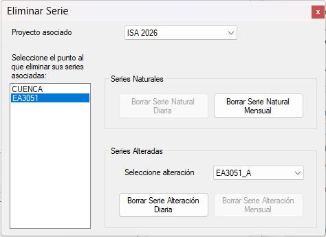

Actuando sobre la lista de la izquierda, preparada para que el usuario **Seleccione** un **Punto** para eliminar una o todas sus series asociadas, aquél quedará destacado sobre fondo azul, rellenándose el combo preparado para que se **Seleccione** una **alteración** con el conjunto de alteraciones asociadas al punto, si las hubiere, de manera que se pueda escoger la que se desee de entre todas ellas. Al mismo tiempo, se activarán todos los botones que permiten **Borrar** una **Serie Natural Diaria, Natural Mensual, Alteración Diaria o Alteración Mensual.**

Al presionar cualquiera de ellos, la aplicación procederá a borrar toda la información correspondiente a dicha serie que se haya introducido previamente en la base de datos asociada. Por último, la pantalla dispone de un botón, situado en su esquina superior derecha, para abandonar la presente utilidad y regresar a la pantalla principal de la aplicación.

2. **ÁREA DE SELECCIÓN DE PUNTO, ALTERACIÓN Y SERIES**

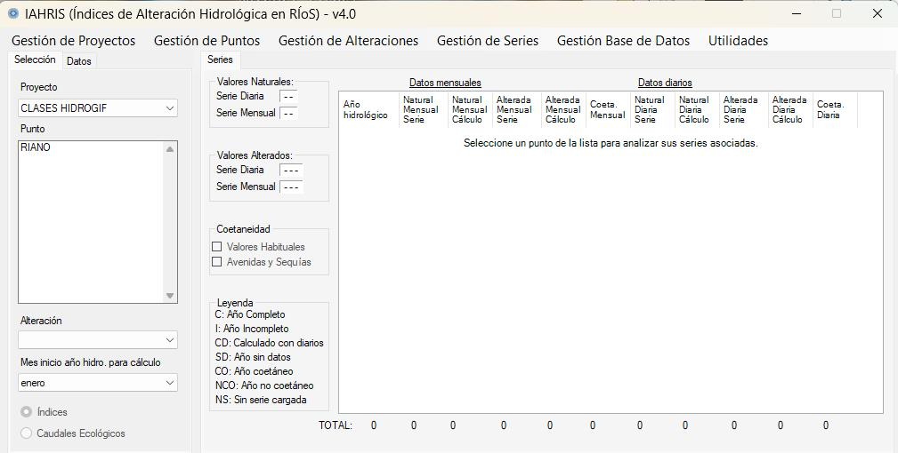

Ocupa la zona izquierda del cuerpo central de la pantalla. Permite que el usuario seleccione el punto que desea analizar, informa de las series disponibles para ese análisis y permite escoger, de entre las series de valores alterados, la deseada para hacer los cálculos.

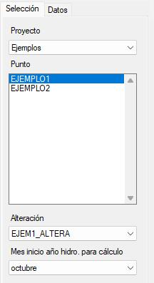

En primer lugar, se debe seleccionar el proyecto, y dentro de él el punto de estudio. A continuación, en el desplegable de alteraciones, deberá seleccionarse la alteración deseada de entre las declaradas para ese punto.

Por último, la ventana inferior permite elegir el mes de comienzo del año hidrológico. Por defecto aparece el mes de octubre.

<strong>Figura nº22:</strong> <em>Interfaz para la selección del punto y alteración</em>

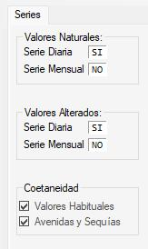

En el cuerpo intermedio, la aplicación, de manera automática, identifica la serie en régimen natural asociada al punto, indicando si los datos facilitados son diarios, mensuales o ambos, y también la(s) de régimen alterado. Es necesario que esas series, natural y alterada(s), estén previamente declaradas en la base de datos usando las pestañas Gestión de Series y, en su caso, Gestión de Alteraciones. En el caso de que el punto tenga vinculada más de una serie en régimen alterado, el usuario puede seleccionar la que desee utilizar en el análisis que pretenda efectuar. La aplicación presenta la descripción asociada a la serie seleccionada y el tipo de temporalidad de los datos.

<strong>Figura nº23:</strong> <em>Información de las series natural y alterada seleccionadas por el usuario</em>

**RECUERDA:**

- El primer paso es **seleccionar el proyecto de trabajo**, bien creando uno nuevo o eligiéndolo entre los ya existentes. A continuación, hay que **declarar** el **PUNTO** de cálculo **(Añadir Punto)**.
- Si hay disponibles datos de régimen alterado (independientemente de que haya o no datos en régimen natural), el segundo paso es **declarar** la **ALTERACIÓN (Añadir Alteración)**. A continuación, hay que **cargar** las **SERIES** (de régimen natural o/y alterado) en la base de datos de la aplicación **(Añadir Serie)**.

3. **ÁREA DE INFORMACIÓN SOBRE LAS SERIES**

Siempre que se haya seleccionado un determinado punto de cálculo y –opcionalmente- una alteración asociada y exista declarada en el banco alguna de las series temporales relacionadas, se presentará información relativa a los datos disponibles a través de la rejilla diseñada al efecto, situada en la parte derecha de la pantalla, tal y como se refleja en la figura nº 24.

- Para cada **PUNTO** declarado en la base de datos, y, si es el caso, seleccionada la alteración asociada, esta área INFORMA:

- **D**e los **datos** contenidos en las series seleccionadas por el usuario para el análisis.
- De los datos que finalmente se **utilizarán** para los **cálculos**.

Las columnas terminadas en SERIE hacen referencia a la información recogida en el archivo facilitado por el usuario. Las terminadas en CÁLCULO informan de los datos que utilizará la aplicación para calcular parámetros e índices.

<strong>Figura nº24:</strong> <em>Panel informativo de la información existente de las series natural y alterada seleccionadas por el usuario</em>

En dicha rejilla se indica, para todo el periodo de años hidrológicos y series disponibles, la información existente en el banco.

Para cada año hidrológico del periodo total, así como tipo de serie implicada –serie mensual o diaria correspondiente al régimen natural o alterado-, se indica si se dispone o no de todos los datos del año.

En lo que se refiere a las series mensuales –tanto de régimen natural como alterado-, los años señalados en la rejilla puede que no coincidan con los registrados en la base de datos (que sólo contienen los valores de aportaciones mensuales facilitados por el usuario). A efectos de cálculo, las series mensuales de un determinado régimen se confeccionan –por simple acumulación de aportaciones en función de los caudales medios diarios disponibles del citado régimen, para aquellos meses en que existen datos diarios en todos los días del mes. En el resto de los meses en que no se encuentren todos los datos diarios necesarios y, en cambio, sí exista dato mensual de la aportación acumulada, ésta se tomará de la serie mensual previamente registrada en el banco. Por este motivo, y en lo referente a los datos mensuales, se indica si se han obtenido todos los datos mensuales de un año hidrológico y si estos se han calculado a partir de los caudales diarios, de acuerdo con la leyenda –CD- que también se incluye en la pantalla de la aplicación.

Además de los datos disponibles, en la rejilla también se indican los que se van a utilizar en los cálculos correspondientes (con un tic en las columnas natural diaria *calculo*, natural mensual *cálculo*, …). Como ya se ha comentado, se recomienda al menos 15 años completos, sean o no consecutivos, aunque la aplicación esta diseñada para trabajar con series de al menos 7 años.

La coetaneidad de las series en régimen natural y alterado es una característica muy importante que el usuario debe siempre conocer antes de hacer una interpretación de los resultados. Lo ideal sería que las series sometidas al análisis fuesen coetáneas; así las alteraciones puestas de manifiesto por los índices no tendrían ninguna componente relacionada con la variabilidad que pudiesen presentar los períodos de tiempo no comunes. Una alternativa es exigir coetaneidad para calcular los índices, pero esta opción podría dejar fuera el análisis de casos de interés, aun corriendo el riesgo de "contaminar" los índices con el "ruido" de comparar comportamientos en períodos de tiempo distintos. En IAHRIS se ha optado por ofrecer al usuario la posibilidad de obtener resultados incluso cuando las series no son coetáneas. Por eso, en la rejilla se incluye la indicación de los años coetáneos existentes, tanto para series mensuales como diarias.

En relación con la coetaneidad de las series, conviene señalar algunos detalles importantes que se comentarán a continuación, utilizando la figura nº 25 que facilita la interpretación.

Período con datos en Régimen Natural

*Período con datos coetáneos*

Período con datos en Régimen Alterado

<strong>Figura nº25:</strong> <em>Ejemplo ilustrativo de la gestión de la coetaneidad en IAHRIS</em>

Si el período de **datos coetáneos es de quince años o superior**, como en el ejemplo (21 años del 59/60 al 79/80), y **hay más registros no coetáneos**, se habilitarán los check situados debajo de la rejilla: **Usar Coetaneidad para Valores Habituales** y **Usar Coetaneidad para Avenidas y Sequías**.

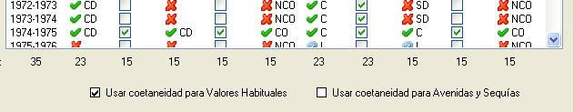

<strong>Figura nº26:</strong> <em>Checks para la selección de coetaneidad en valores habituales y/o avenidas y sequías</em>

**RECUERDA:**

- Se asume que los registros son **COETÁNEOS** cuando las series natural y alterada tienen **15 años completos comunes**, años que no tienen por qué ser consecutivos.

Hay tres opciones de cálculo:

1. <strong>Activar los dos check</strong>. Esto supone que para el cálculo de parámetros e índices (habituales, avenidas y sequías) se utilizará únicamente el período con datos coetáneos. Ese mismo período se utilizará para la caracterización de la variabilidad interanual e intranual tanto del natural como del alterado. <em>Es la opción más recomendable cuando el número de años coetáneos es sólo ligeramente inferior al número de años disponibles.</em>

2. <strong>Activar sólo Usar Coetaneidad para valores habituales</strong>. La aplicación utilizará para el cálculo de parámetros e índices de valores habituales sólo los datos del período coetáneo. Ese mismo período se utilizará para la caracterización de la variabilidad interanual e intranual tanto del natural como del alterado. Para los parámetros e índices de avenidas y sequías utilizará todos los datos disponibles (en el ejemplo: 41/42 – 79/80 para régimen natural y 59/60 – 05/06 para régimen alterado). <em>Es la opción más recomendable cuando el número de años disponibles es sensiblemente superior al número de años coetáneos.</em>

3. **Activar sólo Usar Coetaneidad para avenidas y sequías.** La aplicación utilizará sólo los años coetáneos para los cálculos de parámetros e índices relacionados con avenidas y sequías. Para valores habituales y para la caracterización de la variabilidad inter e intranual del régimen natural y alterado utilizará todos los años disponibles en cada régimen: en el ejemplo, para el régimen natural utilizaría el periodo 41/42 – 79/80, y 59/60-05/06 para régimen alterado.

- Cuando se activen los check, el usuario siempre podrá conocer el efecto que esa acción tiene, al poder ver en la rejilla tanto los años de las diferentes series empleados en el cálculo, como el conjunto de informes que la aplicación ofrece para la opción seleccionada.

4. **ÁREA DE SELECCIÓN DEL MÓDULO A REALIZAR**

En la pantalla principal de IAHRIS se puede seleccionar dos módulos o tipos de estudio a realizar con los datos cargados:

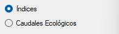

- **Índices:** relativo a la caracterización del régimen de caudales y estimación de los Índices de Alteración Hidrológica. La casuística e informes obtenidos para esta opción se detallan en el Capítulo 5 de este Manual. Los fundamentos metodológicos se recogen en el Manual de Referencias Metodológicas de IAHRIS.

- **Caudales ecológicos:** Estimación de escenarios de caudales ecológicos mínimos y evaluación de su idoneidad ambiental. Este módulo requiere datos de régimen natural de al menos 15 años. La casuística e informes obtenidos para esta opción se detallan en el Capítulo 6 de este Manual. Los fundamentos metodológicos se recogen en el Manual de Referencias metodológicas para estimación y evaluación de escenarios de caudales ecológicos mínimos.

Estos dos módulos no son excluyentes, de modo que el usuario puede realizar uno de ellos y a continuación el otro.

5. **ÁREA DE RESULTADOS**

Esta área ocupa el tercio inferior de la pantalla donde se presenta la relación de informes que la aplicación puede obtener, relación que varía según el módulo elegido (Índices o Caudales ecológicos) y la información disponible para el punto analizado.

<strong>Figura nº27:</strong> <em>Ejemplo de listado de informes obtenidos con ÍNDICES, para un análisis de la Tipología 1</em>

A la derecha, y una vez que la aplicación comprueba la disponibilidad de los datos y vínculos necesarios para poder hacer los cálculos necesarios, se activa el botón de cálculo que el usuario debe pulsar para efectuarlos. En función de la opción elegida (Índices o Caudales ecológicos) y de los datos facilitados se indica la tipología del estudio.

La aplicación confecciona los correspondientes informes, que se almacenarán en un libro Excel, cuyo nombre, por defecto, se genera automáticamente en función de los códigos del punto de cálculo y de la alteración asociada, así como si se ha exigido o no coetaneidad para los datos mensuales y diarios.

La ubicación del fichero, así como el nombre definitivo con que vaya a almacenarse, puede escogerla el usuario a través de la pantalla emergente.

Los ficheros de resultados pueden consultarse e imprimirse a través de Microsoft Excel. Incluyen un conjunto de informes, cada uno en una hoja, y en todas ellas aparecen los datos identificativos del punto de cálculo y régimen alterado seleccionados. En la primera, se incluye, además, un listado con el conjunto de informes que se han podido calcular, así como una relación con los datos disponibles y los utilizados en los cálculos. En el resto se incluyen valores correspondientes a los diferentes parámetros e índices obtenidos, así como gráficos relacionados.  Todas las hojas de este libro están protegidas SIN CONTRASEÑA, para evitar que el usuario accidentalmente pueda provocar cambios en los procesos internos de cálculo. El usuario puede desproteger cada hoja accediendo en Excel al menú REVISIÓN; Desproteger hoja.

- Para cada cálculo realizado, la aplicación presenta los resultados en un libro Excel. Cada hoja del libro es el informe de un aspecto determinado del régimen, de los parámetros que lo caracterizan o de los índices de alteración. También los resultados de Caudales ecológicos se presentan en un libro Excel.

- Todas las hojas de este libro están protegidas SIN CONTRASEÑA, para evitar que el usuario accidentalmente pueda provocar cambios en los procesos internos de cálculo. El usuario puede desproteger cada hoja accediendo en Excel al menú REVISIÓN; Desproteger hoja.

- El número y contenido de los informes depende de las características de los datos suministrados en las series –periodicidad (diario o mensual); coetaneidad; nº de años-.

6. **ÁREA DE GESTIÓN DE BASE DATOS**

Este menú posibilita el intercambio de bases de datos entre distintos usuarios de IAHRIS, permitiendo la exportación e importación de los archivos de bases datos.

Si se selecciona **Importar Base de Datos**, se abre una ventana que permite:

- En primer lugar, <strong>seleccionar la base de datos a importar</strong>: dicha base de datos se encuentra en el ejecutable, siendo un archivo Access con una extensión <em><strong>.mdb</strong></em>

<strong>Figura nº28:</strong> <em>Interfaz para la selección de la base de datos a importar</em>

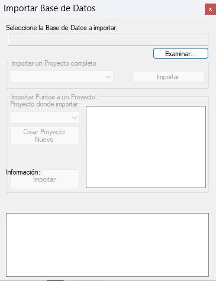

Una vez seleccionada la base de datos a importar se habilitan dos opciones:

1. <strong>Importar un proyecto completo:</strong> Para ello en el desplegable se selecciona el proyecto que queremos importar y accionando el botón correspondiente se realiza la importación a la base de datos destino. En la ventana inferior <em>Información</em>, puede seguirse el proceso de importación, que en ocasiones y dependiendo del tamaño de la base de datos puede durar varios minutos. El proceso no debe darse por concluido hasta que el programa no mande el aviso de exportación finalizada.

<strong>Figura nº29:</strong> <em>Opciones de importación de la base de datos</em>

2. **Importar Puntos a un Proyecto:** esta opción debe seleccionarse cuando el usuario no quiere importar un proyecto entero sino sólo alguno o algunos de sus puntos. Hay dos posibilidades:

- **El proyecto donde se quieren importar los puntos es un proyecto existente**, es decir podemos acceder a él en la lista despegable "Proyecto donde importar". El usuario debe seleccionar el proyecto en cuestión, macar los puntos a importar y presionar "Importar"
- **Se desea crear un nuevo proyecto a donde importar los puntos**. Para ello el usuario debe presionar el botón "Crear nuevo proyecto" e introducir el nombre y la descripción del nuevo proyecto y presionar aceptar

Automáticamente el nuevo proyecto creado aparece en la lista despegable de "Proyecto donde importar". Los pasos siguientes son similares a los descritos con anterioridad, es decir seleccionar el punto o puntos a importar y presionar "Importar". Como ya se ha comentado, el proceso de importación no debe darse por concluido hasta que el programa no mande el aviso correspondiente.

Si se selecciona "**Exportar base de datos**", se realizará la exportación global de la base de datos existente en ese momento en la aplicación.  El proceso es inmediato, pues automáticamente podemos seleccionar la ubicación de destino de la base a exportar, así como su denominación.

7. **OTRAS UTILIDADES**

En esta pestaña se habilitan dos opciones:

- **Carga masiva:** permite procesar de forma desatendida y rápida grandes cantidades de archivos de datos.

- Permite seleccionar múltiples archivos de una o varias carpetas
- Lista los ficheros de datos detectados con los puntos y alteraciones identificados
- Permite generar y ejecutar un archivo .bat que realizará el proceso de todos los datos de forma desatendida: añade puntos y alteraciones a IAHRIS con las series asociadas, calcula los informes correspondientes y exporta el libro excel generado para cada caso.
- Los ficheros Excel de análisis resultantes se encontrarán en la carpeta indicada por el usuario
- Una vez terminado el proceso de los datos, la aplicación genera un listado en el que aparece una síntesis de la información suministrada, si ha sido posible procesarla (figura 30).
- De aparecer errores en el proceso, se puede generar un fichero de texto mostrándolos

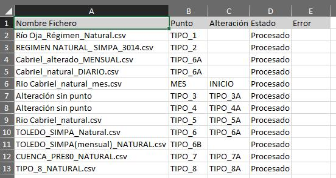

<strong>Figura nº30:</strong> <em>Ejemplo del listado de ficheros cargados al utilizar la opción de Carga Masiva</em>

En el Anexo 3 de este Manual se recogen los pasos a seguir en un proceso de carga masiva.

- **Importar datos SIMPA:** esta utilidad permite obtener los resultados del modelo SIMPA (aportaciones mensuales en régimen natural desde el año hidrológico 1940/41) para el periodo de interés, en cualquier punto de la red de drenaje.

<strong>Figura nº31:</strong> <em>Interfaz para la importación de datos SIMPA</em>

El usuario indica en la aplicación la estación de aforo elegida o las coordenadas del punto de estudio y selecciona *"Obtener datos SIMPA*". En la pantalla emergente debe indicar el periodo de estudio, el código del Punto y el Proyecto donde guardar esa información.

<strong>Figura nº32:</strong> <em>Datos a introducir para la importación de datos SIMPA</em>

La aplicación proporciona el fichero csv de datos SIMPA en régimen natural a la vez que carga automáticamente ese archivo en el proyecto indicado.

#### <strong><u>Observaciones importantes:</u></strong>

#### 1.1.1.1 **Descarga de datos SIMPA desde el servidor del CEDEX**

- Para generar el archivo csv del punto solicitado, IAHRIS necesita disponer en el equipo del usuario de los datos SIMPA para el periodo requerido.
- Cuando se utiliza por primera vez esta utilidad, IAHRIS se conecta con el servidor de datos SIMPA para bajarse y almacenar el archivo con la información correspondiente al periodo solicitado. Esa información no se limita al punto; es para toda la red fluvial.
- Como dicha información está almacenada por décadas, se descargará las necesarias para cubrir el periodo solicitado.

- Puede ocurrir que el espacio disponible en el disco del usuario sea insuficiente. En ese caso la descarga se interrumpe y el usuario debe asegurar que el disco tenga espacio suficiente.

- Una vez descargadas los datos SIMPA se descomprimen para extraer los datos necesarios. Ese proceso puede dilatarse y en ocasiones puede aparecer un mensaje de "no responde", pero si se espera, el proceso terminará adecuadamente.

- Una vez extraída la información, los datos SIMPA se mantienen en el equipo del usuario comprimidos.
- Si el usuario solicita la descarga de datos para otro punto y para el mismo periodo, IAHRIS utiliza los datos comprimidos que ya se bajó.
- Si el periodo solicitado tiene años que no están disponibles en el equipo del usuario, IAHRIS accede al servidor de SIMPA para descargar el decenio o decenios que necesite.

**B) Búsqueda por coordenadas**

- El usuario debe asegurarse que las coordenadas que introduce se corresponden exactamente con su punto de interés.
- Es recomendable utilizar las coordenadas UTM ETRS 89 obtenidas con Iberpix.
- Es importante tener presente que el mapa es sólo un apoyo visual. NO ofrece una información que garantice que el punto cuyas coordenadas se han introducido se corresponde con el deseado por el usuario.
- Para asegurar que la información obtenida es la adecuada, es muy recomendable visualizar el archivo csv obtenido:
- Puede ocurrir que las coordenadas facilitadas no estén en el pixel adecuado y los valores que aparezcan se correspondan a un pixel del terreno en el que no hay concentración de flujo y, por tanto, las aportaciones mensuales obtenidas sean cero o despreciables.
- Esta verificación es siempre importante, pero especialmente en el caso de que el punto esté cerca de una confluencia, ya que puede estar ofreciendo valores de aguas abajo de la confluencia, cuando lo que interesa es aguas arriba, o a la inversa.

**IMPORTANTE**

**En el Anexo 1 dispones de una BREVE GUÍA DE USUARIO**

**En el Anexo 3dispones  de una Guía de la herramienta CARGA MASIVA**

***5***

**MÓDULO ÍNDICES**

***UNA VISIÓN GENERAL***

***¿CÓMO INFLUYEN LAS CARACTERÍSTICAS DE LOS DATOS EN LOS RESULTADOS QUE OFRECE IAHRIS?***

***¿CÓMO SE OFRECEN LOS RESULTADOS?***

***¿CÓMO SE VINCULAN LOS INFORMES CON LAS CARACTERÍSTICAS DE LOS DATOS?***

##  ***UNA VISIÓN GENERAL***

En su módulo de ÍNDICES , activado por defecto,

IAHRIS permite obtener **PARÁMETROS** con los que **caracterizar el régimen hidrológico**, tanto natural como alterado, e **ÍNDICES** que permiten **valorar el grado de alteración del régimen** hidrológico en aquellos aspectos de mayor significación ambiental. Parámetros e índices constituyen los resultados fundamentales de IAHRIS. La aplicación permite también obtener un indicador global de masas de agua muy alteradas hidrológicamente y la simulación a nivel mensual de escenarios de regímenes ambientales de caudales mínimos junto a la valoración de su idoneidad ambiental.

### ***PARÁMETROS E ÍNDICES***

En la tabla nº1 se presentó la relación completa de los parámetros que la aplicación puede utilizar para la caracterización tanto del régimen natural como del alterado. Para comodidad del lector, se vuelven a presentar a continuación. En el *Manual de Referencia Metodológica* pueden encontrarse las definiciones y especificaciones de cálculo de cada uno de estos parámetros. Con independencia de la consulta que de esas especificaciones de cálculo se haga, conviene señalar que:

•	Los parámetros **P1**, **P2** y **P4** caracterizan al denominado año ponderado.

Ello exige la caracterización independiente de estos parámetros para cada uno de los tipos de año considerados.

Por ejemplo, para estimar P1 se calculan P1 húmedo, P1 medio, P1 seco, que caracterizan respectivamente los años húmedos, medios y secos.

Estos tres valores concluyen en uno único, P1; obtenido al ponderar según el porcentaje de presencia de cada tipo de año en la serie (25 % para años húmedos y secos y 50% para los años medios).

P1 = 0,25\*(P1 húmedo + P1 seco) + 0,50\* P1 medio

•	Los parámetros **P12**, **P18** y **P19** se especifican a nivel mensual: P12 octubre, P12 noviembre…

<strong>Tabla nº1:</strong> <em>Relación de parámetros (P1-P19) para la caracterización del régimen de caudales (natural y alterado)</em>

También se vuelven a presentar las tablas nº2 y 3, en las que se mostraron los Índices de Alteración que la aplicación ofrece al usuario, distinguiendo entre las situaciones de regímenes coetáneos o no coetáneos. Por otro lado, los índices de avenidas y sequías sólo pueden calcularse si el usuario ha facilitado datos a nivel diario.

1. <u>PARA REGÍMENES COETÁNEOS:</u>

<strong>Tabla nº2:</strong> <em>Relación de Índices de Alteración Hidrológica (IAH1 – IAH21) para regímenes coetáneos.  Los índices de avenidas y sequías sólo pueden calcularse si el usuario ha facilitado datos a nivel diario</em>

En el *Manual de Referencia Metodológica* pueden encontrarse especificaciones de cálculo de cada uno de estos índices, recogiéndose a continuación dos indicaciones que conviene tener presentes:

•	Todos los Índices de Valores Habituales se calculan desglosados por tipo de año. Como resumen de la alteración, se ofrece el valor ponderado.

•	Los Índices IAH14, IAH20 e IAH21, se especifican a nivel mensual, y se ofrece, a modo de conclusión, la media anual de esos valores mensuales

1. <u>PARA REGÍMENES NO COETÁNEOS</u>, se mantienen los mismos índices para avenidas y sequías que en la opción de coetaneidad y sólo cambian los índices de valores habituales:

<strong>Tabla nº3:</strong> <em>Relación de Índices de Alteración Hidrológica en regímenes no coetáneos. Los índices de avenidas y sequías sólo pueden calcularse si el usuario ha facilitado datos a nivel diario</em>

Como ha quedado puesto de manifiesto, los resultados que la aplicación ofrece en cada análisis solicitado dependen de la información suministrada a la aplicación. La casuística que se deriva de los datos proporcionados es relativamente compleja, y los dos casos genéricos presentados en los párrafos anteriores no agotan las posibilidades, aunque si pueden servir como punto de partida para luego entrar en más detalle. Por eso, y para que el usuario pueda saber qué le ofrecerá IAHRIS, este manual, en los epígrafes que siguen:

1. Describe las distintas características que pueden tener los datos suministrados.
2. Presenta todos los informes que puede ofrecer la aplicación.
3. Indica los informes ofrecidos en función de la tipología de los datos facilitados
4. Resume el contenido de cada informe

## ***¿CÓMO INFLUYEN LAS CARACTERÍSTICAS DE LOS DATOS EN LOS RESULTADOS QUE OFRECE IAHRIS?***

Las series pueden caracterizarse atendiendo a tres aspectos: periodicidad, naturaleza y coetaneidad. A continuación, se presenta, de manera resumida, cómo esas características determinan los resultados ofrecidos por la aplicación.

<strong>PERIODICIDAD:</strong> Pueden contener dos tipos de registros: caudales medios diarios (m3/s) o aportaciones mensuales (hm3). Cada serie sólo puede contener datos del mismo tipo.

¿Cómo influye la periodicidad en los resultados?

Disponer sólo de series de aportaciones mensuales limita los resultados a la obtención de tres parámetros –P1; P2 y P3-, y cinco índices –IAH1; IAH2; IAH4; IAH 5 e IAH6- vinculados, parámetros e índices, sólo a la componente de Valores Habituales.  No puede realizarse la caracterización de avenidas ni de sequías que requieren registros a nivel diario. Por consiguiente, la obtención del índice global de masas muy alteradas hidrológicamente se realizará exclusivamente en base a los índices disponibles.

**NATURALEZA:** Los registros, ya sean diarios o mensuales, pueden corresponder al régimen natural o a un régimen alterado.  Para un punto de estudio, el régimen natural es único, aunque pueden disponerse de hasta dos series con datos de esa naturaleza, una con registros diarios y otra con registros mensuales. Pueden considerarse tantos regímenes alterados como de los que el usuario disponga de información. Son indispensables al menos 7 años de registros, no necesariamente consecutivos, aunque como se ha comentado anteriormente se recomienda trabajar con al menos 15 años.

¿Cómo influye la naturaleza del régimen en los resultados?

La caracterización de los regímenes natural y alterado es independiente. Es decir, podemos caracterizar el régimen natural sin disponer de un régimen alterado asociado y viceversa.

Sin embargo, para la evaluación de la alteración es indispensable contar con los registros de ambos regímenes coetáneos o no y siempre de al menos 7 años.

**COETANEIDAD:** Cualidad común de las series natural y alterada de un punto que hace referencia al hecho de que la información contenida en dichas series corresponda a los mismos años.

¿Cómo influye la coetaneidad en los resultados?

La situación ideal, así calificada porque sería la que permitiría a IAHRIS ofrecer la información más completa, corresponde al caso en el que el usuario dispone de series natural y alterada coetáneas de quince años o más. Para ese caso, la aplicación facilitaría para cada uno de los regímenes los 19 parámetros (tabla nº1), así como los 21 Índices de Alteración (tabla nº2), más los tres Índices de Alteración Global (Índice de Alteración de valores habituales; Índice de Alteración de avenidas; Índice de Alteración de sequías).

Sin embargo, cuando las series natural y alterada tienen menos de quince años coetáneos, o teniendo más el usuario decide no considerar esa condición (en IAHRIS, y para las dos circunstancias, el caso se identifica con <strong>NO COETANEIDAD</strong>), la aplicación utiliza <strong>Parámetros</strong> e <strong>Índices</strong> específicos para ese caso (Véase <em>Manual de Referencia Metodológica</em>).

El índice global de masas muy alteradas se obtendrá a partir de los índices calculados en cada caso.

La casuística posible según los datos facilitados en función de los aspectos anteriormente citados da lugar a **8 TIPOLOGÍAS principales (para series de al menos 15 años**, que se resumen en la Tabla nº4:

<strong>Tabla nº4:</strong> <em>Tipología de casos de estudio en función de las características de los datos disponibles para series de al menos 15 años</em>

Se recuerda al usuario que estas tipologías serán diferentes si se trabaja con **SERIES REDUCIDAS** (entre 7 y 14 años). Se remite al lector al Anexo 2 donde se explica todo lo referente a esta casuística.

## ***¿CÓMO SE OFRECEN LOS RESULTADOS?***

Para facilitar la ordenación y sistematización de los resultados suministrados por la aplicación, éstos se estructuran en INFORMES, como HOJAS de un LIBRO EXCEL. A continuación, se muestra parte de una hoja (informe) de uno de esos libros (véanse las pestañas situadas en la parte inferior que dan acceso a cada uno de los informes del libro de resultados del análisis realizado).

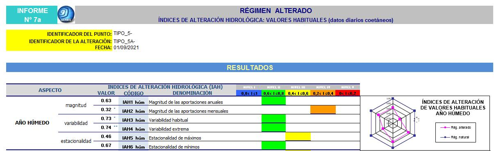

<strong>Figura nº33:</strong> <em>Ejemplo de las distintas hojas de un libro de Excel que contiene el informe de IAHRIS listado de ficheros cargados al utilizar la opción de Carga Masiva</em>

Por defecto, IAHRIS denomina al archivo Excel del modo que se muestra a continuación, donde el código punto utilizado ha sido "EJEMPLO2" y el código alteración "EJEM2\_ALTERA" y la simulación se ha realizado con datos mensuales coetáneos (COEMSI) y datos diarios no coetáneos (COEDNO):

***EJEMPLO2\_EJEM2\_ALTERA\_COEMSI\_COEDNO.xlsx***

## ***¿CÓMO SE VINCULAN LOS INFORMES CON LAS CARACTERÍSTICAS DE LOS DATOS?***

En la tabla nº5 se presentó la relación de todos los informes que la aplicación puede generar, tabla que se vuelve a incluir para facilitar al usuario el seguimiento de este capítulo. El usuario puede familiarizarse con el contenido de los informes utilizando los que genera IAHRIS con los datos que contienen los dos ejemplos que se facilitan incluidos en la base de datos de la aplicación.

En la tabla nº6 se presentan los informes generados para cada Tipología de estudio según los datos facilitados:

<strong>Tabla nº5:</strong> <em>Relación de todos los informes que puede ofrecer IAHRIS.</em>

<table><tr><td colspan="3">
<strong>RELACIÓN DE INFORMES </strong>
</td></tr><tr><td rowspan="9">
Caracterización de la magnitud y variabilidad
</td><td>
<strong>1</strong>
</td><td>
RN: CARACTERIZACIÓN DE LA MAGNITUD Y VARIABILIDAD INTERANUAL
</td></tr><tr><td>
<strong>1a</strong>
</td><td>
RA: CARACTERIZACIÓN DE LA MAGNITUD Y VARIABILIDAD INTERANUAL
</td></tr><tr><td>
<strong>1b</strong>
</td><td>
RN y RA: CARACTERIZACIÓN DE LA MAGNITUD Y VARIABILIDAD INTERANUAL
</td></tr><tr><td>
<strong>2</strong>
</td><td>
RN: CARACTERIZACIÓN DE LA MAGNITUD Y VARIABILIDAD INTRANUAL (estadísticos) 
</td></tr><tr><td>
<strong>2a</strong>
</td><td>
RN: CARACTERIZACIÓN DE LA MAGNITUD Y VARIABILIDAD INTRANUAL (medianas)
</td></tr><tr><td>
<strong>3</strong>
</td><td>
RA: CARACTERIZACIÓN DE LA MAGNITUD Y VARIABILIDAD INTRANUAL (estadísticos)
</td></tr><tr><td>
<strong>3a</strong>
</td><td>
RA: CARACTERIZACIÓN DE LA MAGNITUD Y VARIABILIDAD INTRANUAL (medianas)
</td></tr><tr><td>
<strong>3b</strong>
</td><td>
RN y RA: CARACTERIZACIÓN DE LA MAGNITUD Y VARIABILIDAD INTRANUAL (medianas)
</td></tr><tr><td>
<strong>3c</strong>
</td><td>
RN y RA: CARACTERIZACIÓN DEL RANGO DE VARIABILIDAD INTRANUAL (percentiles)
</td></tr><tr><td rowspan="5">
Parámetros para la caracterización del régimen 
</td><td>
<strong>4</strong>
</td><td>
RN: PARÁMETROS PARA LA CARACTERIZACIÓN CON DATOS DIARIOS
</td></tr><tr><td>
<strong>4a</strong>
</td><td>
RN: PARÁMETROS PARA LA CARACTERIZACIÓN CON DATOS MENSUALES
</td></tr><tr><td>
<strong>5</strong>
</td><td>
RA: PARÁMETROS PARA LA CARACTERIZACIÓN CON DATOS DIARIOS
</td></tr><tr><td>
<strong>5a</strong>
</td><td>
RA: PARÁMETROS PARA LA CARACTERIZACIÓN CON DATOS MENSUALES
</td></tr><tr><td>
<strong>5b</strong>
</td><td>
RA: PARÁMETROS PARA LA CARACTERIZACIÓN CON DATOS DIARIOS (Régimen Natural no disponible)
</td></tr><tr><td rowspan="6">
Curvas de caudales clasificados
</td><td>
<strong>6</strong>
</td><td>
RN: VALORES MEDIOS DE LAS CURVAS ANUALES DE CAUDALES CLASIFICADOS
</td></tr><tr><td>
<strong>6a</strong>
</td><td>
RA: VALORES MEDIOS DE LAS CURVAS ANUALES DE CAUDALES CLASIFICADOS
</td></tr><tr><td>
<strong>6b</strong>
</td><td>
RN y RA: VALORES MEDIOS DE LAS CURVAS ANUALES DE CAUDALES CLASIFICADOS
</td></tr><tr><td>
<strong>6c</strong>
</td><td>
RN: VALORES MEDIOS DE LAS CURVAS MENSUALES DE CAUDALES CLASIFICADOS
</td></tr><tr><td>
<strong>6d</strong>
</td><td>
RA: VALORES MEDIOS DE LAS CURVAS MENSUALES DE CAUDALES CLASIFICADOS
</td></tr><tr><td>
<strong>6e</strong>
</td><td>
RN y RA: VALORES MEDIOS DE LAS CURVAS MENSUALES DE CAUDALES CLASIFICADOS
</td></tr><tr><td rowspan="4">
Índices de alteración hidrológica
</td><td>
<strong>7a</strong>
</td><td>
RA: ÍNDICES DE ALTERACIÓN HIDROLÓGICA: VALORES HABITUALES (datos diarios coetáneos) 
</td></tr><tr><td>
<strong>7b</strong>
</td><td>
RA: ÍNDICES DE ALTERACIÓN HIDROLÓGICA: VALORES HABITUALES (datos mensuales coetáneos) 
</td></tr><tr><td>
<strong>7c</strong>
</td><td>
RA: ÍNDICES DE ALTERACIÓN HIDROLÓGICA: VALORES HABITUALES (datos no coetáneos)
</td></tr><tr><td>
<strong>7d</strong>
</td><td>
RA: ÍNDICES DE ALTERACIÓN HIDROLÓGICA: AVENIDAS Y SEQUÍAS 
</td></tr><tr><td rowspan="5">
Indicador global según IPH para Masas Muy alteradas
</td><td>
<strong>8</strong>
</td><td>
RA: INDICADOR P10-90 PARA MASAS MUY ALTERADAS (IPH)
</td></tr><tr><td>
<strong>8a</strong>
</td><td>
RA: INDICADOR IAH-MMA PARA MASAS MUY ALTERADAS según IPH (datos diarios coetáneos)
</td></tr><tr><td>
<strong>8b</strong>
</td><td>
RA: INDICADOR IAH-MMA PARA MASAS MUY ALTERADAS según IPH (datos diarios no coetáneos)
</td></tr><tr><td>
<strong>8c</strong>
</td><td>
RA. INDICADOR IAH-MMA PARA MASAS MUY ALTERADAS según IPH (datos mensuales coetáneos)
</td></tr><tr><td>
<strong>8d</strong>
</td><td>
RA: INDICADOR IAH-MMA PARA MASAS MUY ALTERADAS según IPH (datos mensuales no coetáneos)
</td></tr><tr><td rowspan="4">
Significación ambiental de la alteración hidrológica
</td><td>
<strong>10a</strong>
</td><td>
SIGNIFICACIÓN AMBIENTAL DE LOS ÍNDICES DE ALTERACIÓN HIDROLÓGICA: VALORES HABITUALES, AVENIDAS Y SEQUÍAS (datos diarios coetáneos) 
</td></tr><tr><td>
<strong>10b</strong>
</td><td>
SIGNIFICACIÓN AMBIENTAL DE LOS ÍNDICES DE ALTERACIÓN HIDROLÓGICA: VALORES HABITUALES (datos mensuales coetáneos) 
</td></tr><tr><td>
<strong>10c</strong>
</td><td>
SIGNIFICACIÓN AMBIENTAL DE LOS ÍNDICES DE ALTERACIÓN HIDROLÓGICA: VALORES HABITUALES, AVENIDAS Y SEQUÍAS (datos diarios no coetáneos) 
</td></tr><tr><td>
<strong>10d</strong>

<strong>Tabla nº5: </strong>Relación de todos los informes que puede ofrecer IAHRIS.
</td><td>
SIGNIFICACIÓN AMBIENTAL DE ÍNDICES DE ALTERACIÓN HIDROLÓGICA: VALORES HABITUALES (datos mensuales no coetáneos) 
</td></tr></table>

<strong>Tabla nº6:</strong> <em>Informes facilitados según la tipología del caso de estudio</em>

Todos los estudios, independiente de su tipología llevan además una página inicial o carátula.

## ***¿CÚAL ES EL CONTENIDO DE LOS INFORMES?***

En las páginas siguientes se presenta un breve resumen del contenido de cada uno de estos informes.

<table><tr><td colspan="3">
<strong>CARÁTULA</strong>
</td></tr><tr><td></td><td></td><td>
<strong>RESUMEN DEL CONTENIDO</strong>
</td></tr><tr><td colspan="2">
<strong><em>Datos generales del estudio</em></strong>
</td><td><ul><li>Códigos utilizados</li><li>Fecha de realización del informe</li><li>Listado de informes obtenidos</li><li>Mes de inicio del año hidrológico</li><li>Datos disponibles y datos utilizados para la realización de los informes con indicación del:<ul><li>año hidrológico</li><li>periodicidad mensual o anual</li><li>coetaneidad entre regímenes </li><li>años completos o incompletos</li><li>nº total de años utilizados</li></ul></li></ul></td></tr></table>

<table><tr><td colspan="3">
<strong>CARACTERIZACIÓN DE LA MAGNITUD DE LAS APORTACIONES ANUALES Y DE LA VARIABILIDAD INTERANUAL</strong>
</td></tr><tr><td>
<strong><em>INFORME</em></strong>
</td><td>
<strong>RÉGIMEN </strong>
</td><td>
<strong>RESUMEN DEL CONTENIDO</strong>
</td></tr><tr><td>
<strong><em>1</em></strong>
</td><td>
RN
</td><td rowspan="2"><ul><li>Aportaciones anuales para cada año de la serie</li><li>Caracterización de la variabilidad interanual: <ul><li>umbrales de aportación para cada tipo de año (húmedo, medio y seco)</li><li>Años pertenecientes a cada tipo </li></ul></li><li>Estadísticos descriptivos de las aportaciones anuales: mínimo, media, máximo, cuartiles (Q1, Q2, Q3), rango intercuartílico, coeficiente de variación y coeficiente de asimetría</li><li>Diagrama de cajas y bigotes</li><li>Gráfico de aportaciones anuales</li></ul></td></tr><tr><td>
<strong><em>1a</em></strong>
</td><td>
RA
</td></tr><tr><td>
<strong><em>1b</em></strong>
</td><td>
RN y RA
</td><td><ul><li>Aportaciones anuales para cada año de la serie en ambos regímenes</li><li>Caracterización de la variabilidad interanual:  umbrales de aportación para cada tipo de año (húmedo, medio y seco) en ambos regímenes</li><li>Gráfica conjunta para ambos regímenes de aportaciones anuales</li><li>Diagrama conjunto de cajas y bigotes</li></ul></td></tr></table>

<table><tr><td colspan="3">
<strong>CARACTERIZACIÓN DE LA MAGNITUD DE LAS APORTACIONES MENSUALES Y DE LA VARIABILIDAD INTRANUAL</strong>
</td></tr><tr><td>
<strong><em>INFORME</em></strong>
</td><td>
<strong>RÉGIMEN </strong>
</td><td>
<strong>RESUMEN DEL CONTENIDO</strong>
</td></tr><tr><td>
<strong><em>2</em></strong>
</td><td>
RN
</td><td rowspan="2"><ul><li>Aportaciones mensuales para cada mes y año de la serie</li><li>Caracterización de la variabilidad extrema en cada año (AP mes máxima -AP mes mínima)</li><li>Estadísticos descriptivos de las aportaciones mensuales para cada mes: mínimo, media, máximo, cuartiles (Q1, Q2, Q3), rango intercuartílico, coeficiente de variación y coeficiente de asimetría</li><li>Frecuencias relativas de las aportaciones mensuales máximas y mínimas (nº de veces que se presenta el máximo /mínimo en un mes determinado respecto al total de datos)</li><li>Gráfico de estadísticos de aportaciones mensuales</li><li>Diagrama de cajas y bigotes de la variabilidad extrema</li></ul></td></tr><tr><td>
<strong><em>3</em></strong>
</td><td>
RA
</td></tr><tr><td>
<strong><em>2a</em></strong>
</td><td>
RN 
</td><td rowspan="2"><ul><li>Aportaciones medianas mensuales para cada mes y tipo (húmedo, medio y seco)</li><li>Caudales medianos diarios mensuales para cada mes y tipo (húmedo, medio y seco)</li><li>Indicación – si la hubiera- de distribución atípica de la tipología mensual en ese mes. </li><li>Gráfica conjunta de las aportaciones medianas mensuales para los tres tipos (húmedo, medio y seco)</li></ul></td></tr><tr><td>
<strong><em>3a</em></strong>
</td><td>
RA
</td></tr><tr><td>
<strong><em>3b</em></strong>
</td><td>
RN y RA
</td><td><ul><li>Aportaciones medianas mensuales para cada mes y tipo (húmedo, medio y seco) en ambos regímenes</li><li>Caudales medianos diarios mensuales para cada mes y tipo (húmedo, medio y seco) en ambos regímenes</li><li>Para cada tipo de mes  (húmedo, medio y seco), gráfica conjunta de aportaciones medianas mensuales en ambos regímenes</li><li>Tabla y gráfico de % RALT/RNAT de aportaciones medianas para cada mes y tipo</li><li>Diagrama de cajas y bigotes conjunto RN Y RA de la variabilidad extrema</li></ul></td></tr><tr><td>
<strong><em>3c</em></strong>
</td><td>
RN y RA
</td><td><ul><li>Rango de variabilidad intranual (P10-P90) de las aportaciones mensuales</li><li>Alteración relativa (%) del rango de variabilidad intranual (P10-P90) de las aportaciones mensuales</li><li>Gráficas correspondientes</li></ul></td></tr></table>

<table><tr><td colspan="3">
<strong>PARÁMETROS PARA LA CARACTERIZACIÓN DEL RÉGIMEN</strong>
</td></tr><tr><td>
<strong><em>INFORME</em></strong>
</td><td>
<strong>RÉGIMEN </strong>
</td><td>
<strong>RESUMEN DEL CONTENIDO</strong>
</td></tr><tr><td>
<strong><em>4</em></strong>
</td><td>
RN
</td><td rowspan="2"><ul><li>Parámetros para la caracterización de valores habituales</li><li>Parámetros para la caracterización de avenidas</li><li>Parámetros para la caracterización de sequías</li><li>Tabla del nº medio de días al mes con avenidas, sequías y caudales nulos</li><li>Gráficas del nº medio de días al mes con avenidas, sequías y caudales nulos </li></ul></td></tr><tr><td>
<strong><em>5</em></strong>
</td><td>
RA
</td></tr><tr><td>
<strong><em>4a</em></strong>
</td><td>
RN 
</td><td rowspan="2"><ul><li>Parámetros para la caracterización de valores habituales</li></ul></td></tr><tr><td>
<strong><em>5a</em></strong>
</td><td>
RA
</td></tr><tr><td>
<strong><em>5b</em></strong>
</td><td>
RA
</td><td><ul><li>Parámetros para la caracterización de valores habituales</li><li>Parámetros para la caracterización de avenidas</li><li>Parámetros para la caracterización de sequías</li><li>Tabla del nº medio de días al mes con avenidas, sequías y caudales nulos</li><li>Gráficas del nº medio de días al mes con avenidas, sequías y caudales nulos</li></ul></td></tr></table>

<table><tr><td colspan="3">
<strong>CURVAS DE CAUDALES CLASIFICADOS</strong>
</td></tr><tr><td>
<strong><em>INFORME</em></strong>
</td><td>
<strong>RÉGIMEN </strong>
</td><td>
<strong>RESUMEN DEL CONTENIDO</strong>
</td></tr><tr><td>
<strong><em>6</em></strong>
</td><td>
RN
</td><td rowspan="3"><ul><li>Valores medios de la curva anual (media) de caudales clasificados <ul><li>Percentiles estándar</li><li>Gráfica </li></ul></li></ul></td></tr><tr><td>
<strong><em>6a</em></strong>
</td><td>
RA
</td></tr><tr><td>
<strong><em>6b</em></strong>
</td><td>
RN y RA
</td></tr><tr><td>
<strong><em>6c</em></strong>
</td><td>
RN 
</td><td rowspan="2"><ul><li>Valores medios de las curvas mensuales de caudales clasificados: <ul><li>Percentiles estándar para cada mes</li><li>Gráficas </li></ul></li></ul></td></tr><tr><td>
<strong><em>6d</em></strong>
</td><td>
RA
</td></tr><tr><td>
<strong><em>6e</em></strong>
</td><td>
RN y RA
</td><td><ul><li>Valores medios de las curvas mensuales de caudales clasificados</li><li>Para cada mes: <ul><li>Tablas comparativas de ambos regímenes </li><li>Gráfica conjunta de ambos regímenes </li></ul></li></ul></td></tr></table>

<table><tr><td colspan="3">
<strong>ÍNDICES DE ALTERACIÓN HIDROLÓGICA</strong>
</td></tr><tr><td>
<strong><em>INFORME</em></strong>
</td><td>
<strong>RÉGIMEN </strong>
</td><td>
<strong>RESUMEN DEL CONTENIDO</strong>
</td></tr><tr><td>
<strong><em>7a</em></strong>
</td><td>
RA
</td><td rowspan="2"><ul><li>Índices de alteración hidrológica para valores habituales en regímenes coetáneos<ul><li>Índices parciales por tipo de año (húmedo, medio, seco y ponderado)</li><li>Índices globales para cada tipo</li><li>Valoración cuantitativa (0-1) y cualitativa (5 niveles)</li><li>Diagramas de tela de araña</li></ul></li></ul></td></tr><tr><td>
<strong><em>7b</em></strong>
</td><td>
RA
</td></tr><tr><td>
<strong><em>7c</em></strong>
</td><td>
RA 
</td><td><ul><li>Índices de alteración hidrológica para valores habituales en regímenes no coetáneos<ul><li>Índices parciales </li><li>Índice global </li><li>Valoración cuantitativa (0-1) y cualitativa (5 niveles)</li><li>Diagrama de tela de araña</li><li>Especificación de índices a nivel mensual</li></ul></li></ul></td></tr><tr><td>
<strong><em>7d</em></strong>
</td><td>
RA
</td><td><ul><li>Índices de alteración hidrológica para avenidas y sequías<ul><li>Índices parciales </li><li>Índices globales </li><li>Valoración cuantitativa (0-1) y cualitativa (5 niveles)</li><li>Diagrama de tela de araña</li><li>Especificación de índices a nivel mensual</li></ul></li></ul></td></tr></table>

<table><tr><td colspan="3">
<strong>INDICADOR GLOBAL SEGÚN IPH PARA MASAS MUY ALTERADAS</strong>
</td></tr><tr><td>
<strong><em>INFORME</em></strong>
</td><td>
<strong>RÉGIMEN </strong>
</td><td>
<strong>RESUMEN DEL CONTENIDO</strong>
</td></tr><tr><td>
<strong><em>8</em></strong>
</td><td>
RA
</td><td><ul><li>Indicador P10-90 para masas muy alteradas</li><li>Régimen Natural: <ul><li>Mensual: P10%, 50% y 90% </li><li>Anual: P10%, 50% y 90%</li></ul></li><li>Régimen alterado: <ul><li>Mensual:  P50% y grado de cumplimiento</li><li>Anual: P50% y grado de cumplimiento</li></ul></li></ul></td></tr><tr><td>
<strong><em>8a</em></strong>
</td><td rowspan="4">
RA
</td><td rowspan="4"><ul><li> Indicador IAH-MMA para masas muy alteradas</li><li>Valor de los indicadores y grado de cumplimiento</li></ul></td></tr><tr><td>
<strong><em>8b</em></strong>
</td></tr><tr><td>
<strong><em>8c</em></strong>
</td></tr><tr><td>
<strong><em>8d</em></strong>
</td></tr></table>

<table><tr><td colspan="3">
<strong>SIGNIFICACIÓN AMBIENTAL DE LA ALTERACIÓN HIDROLÓGICA</strong>
</td></tr><tr><td>
<strong><em>INFORME</em></strong>
</td><td>
<strong>RÉGIMEN</strong>
</td><td>
<strong>RESUMEN DEL CONTENIDO</strong>
</td></tr><tr><td>
<strong><em>10a</em></strong>
</td><td rowspan="2">
RA
</td><td rowspan="2"><ul><li>Significación ambiental de los Índices de alteración hidrológica para valores habituales, avenidas y sequías: <ul><li>Componente del ecosistema afectado</li><li>Componentes y aspectos del régimen de caudales más directamente implicados</li><li>Índices de alteración hidrológica que los evalúan</li><li>Evaluación de alteración hidrológica significativa</li><li>Trascendencia ambiental </li></ul></li></ul></td></tr><tr><td>
<strong><em>10c</em></strong>
</td></tr><tr><td>
<strong><em>10b</em></strong>
</td><td rowspan="2">
RA 
</td><td rowspan="2"><ul><li>Significación ambiental de los Índices de alteración hidrológica para valores habituales  <ul><li>Componente del ecosistema afectado</li><li>Componentes y aspectos del régimen de caudales más directamente implicados</li><li>Índices de alteración hidrológica que los evalúan</li><li>Evaluación de alteración hidrológica significativa</li><li>Trascendencia ambiental</li></ul></li></ul></td></tr><tr><td>
<strong><em>10d</em></strong>
</td></tr></table>

***6***

**MÓDULO CAUDALES ECOLÓGICOS**

***UNA VISIÓN GENERAL***

***¿QUÉ DATOS SON NECESARIOS?***

***¿CÓMO OBTENER LOS INFORMES?***

***¿CÓMO SE VINCULAN LOS INFORMES CON LAS CARACTERÍSTICAS DE LOS DATOS?***

##  ***UNA VISIÓN GENERAL***

En el módulo de Caudales Ecológicos ,

IAHRIS se presenta como un sistema soporte a la decisión en la selección del régimen ecológico de caudales mínimos (RCEmin).

La aplicación permite:

- La generación de escenarios RCEmin con base hidrológica
- La evaluación de la calidad hidroambiental de los escenarios RCEmin generados por IAHRIS y de los introducidos manualmente por el usuario
- La evaluación del efecto hidrológico de la implementación de escenarios de RCEmin seleccionados por el usuario

Se recomienda al lector revisar el Manual de Referencias metodológicas para estimación y evaluación de escenarios de caudales ecológicos mínimos.

## ***¿QUÉ DATOS SON NECESARIOS?***

- **Para la generación de escenarios RCEmin y la evaluación de su calidad hidroambiental**

El módulo de Caudales ecológicos requiere necesariamente datos de régimen natural de <u>al menos 15 años completos</u> (a nivel diario o mensual).

La justificación de este requerimiento es que los escenarios de RCEmin calculados por la aplicación son como se ha comentado, de base hidrológica, y utilizan el régimen natural como referencia para su estimación. Si la disponibilidad de datos es inferior al valor citado, no se aplica el módulo y el usuario recibe un aviso al intentar ejecutarlo.

Como restricción adicional, el módulo no puede aplicarse cuando el régimen natural presenta un carácter temporal, intermitente o efímero, ya que las metodologías empleadas no son adecuadas para regímenes con este tipo de naturaleza.  Para comprobar esta circunstancia la aplicación realiza un chequeo previo de los datos facilitados en régimen natural consistente en los siguiente:

*Con los datos del régimen natural calcula el percentil de excedencia del 80% y 90%  (P80 y P90 respectivamente) para cada mes y comprueba:*

*A)	¿El régimen natural presenta dos o más meses con P90 =0?*

*B)	¿El régimen natural presenta uno o más meses con P80=0?*

Si la respuesta a alguna de las dos opciones es SI, NO se aplica la metodología y el usuario recibe un aviso al intentar ejecutar el módulo.

Por tanto, cuando se dispone de una serie natural de al menos 15 años completos de datos y no afectada por temporalidad la aplicación calcula -a nivel mensual- 11 escenarios de caudales ecológicos mínimos de base hidrológica.

Estos escenarios son:

- Tennant (1976)
- Tessman  (1980)
- VMF, Variability monthly flow (2016)
- NMTM,  New Modified Tennant Method (2014), con 4 escenarios: mínimum o P90, Fair, Good y Excellent
- ADMM, Versión modificada en 2024 de Annual Distribution Method (2013)
- IAHRIS\_RCE (2024) con tres escenarios IAHRIS\_P90, IAHRIS\_P85 e IAHRIS\_P80

A continuación, realiza la evaluación de su calidad hidroambiental a través de tres parámetros: puntuación, demanda ambiental y eficiencia:

- Puntuación: es una valoración cuantitativa -acotada entre 100 y -100) del escenario RCEmin. Resulta de compararlo con percentiles de excedencia altos del régimen natural, considerando magnitud, estacionalidad y variabilidad
- Demanda ambiental: es el cociente entre la aportación anual requerida por el escenario de RCEmin y la aportación anual media del régimen natural.
- Eficiencia: es el cociente entre la Puntuación y la aportación anual requerida por el escenario RCmin. Su valor indica el número de puntos que se consigue con cada hm3 del RCEmin.

Para una información más detallada, consultar Manual de Referencias metodológicas para estimación y evaluación de escenarios de caudales ecológicos mínimos

<strong>Figura nº34:</strong> <em>Caudales medios mensuales (m3/s) para los 11 escenarios de RCEmin calculados por IAHRIS</em>

<strong>Figura nº35:</strong> <em>Valoración final para los 11 escenarios de RCEmin calculados por IAHRIS, con indicación de su puntuación, demanda ambiental y eficiencia</em>

Activando la pestaña "valoraciones", se visualiza la representación conjunta de la "*Puntuación versus Demanda ambiental"* que permite al usuario tener una visión conjunta de la idoneidad ambiental de los escenarios. Esta misma gráfica junto con toda la información que aparece en la pantalla de IAHRIS se obtendrá también en el informe generado en Excel.

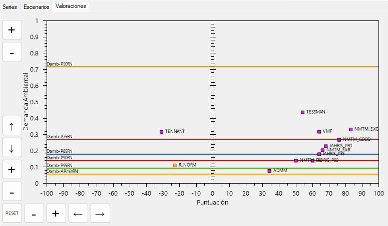

<strong>Figura nº36:</strong> <em>Representación gráfica Puntuación vs demanda ambiental para los escenarios de RCEmin generados. Las líneas horizontales representan diferentes umbrales de demanda ambiental correspondientes a distintos percentiles del régimen natural</em>

Los botones que aparecen en el borde izquierdo de la gráfica posibilitan el desplazamiento por la pantalla o /y el acercamiento/alejamiento de la misma.

*Observación: Si el usuario sólo quiere utilizar este módulo, sin hacer un uso previo del módulo ÍNDICES, deberá proceder a la carga de los datos del RN del modo descrito en el epígrafe 4. Si, por el contrario, el usuario ya ha utilizado el módulo ÍNDICES y ha realizado el estudio en este punto, la serie natural ya estará disponible en la base de datos de IAHRIS y sólo tendrá que seleccionar el punto correspondiente en la pantalla principal.*

- **Para la evaluación de otros escenarios de RCEmin diferentes a los calculados por IAHRIS**

El módulo ofrece también la posibilidad de evaluar escenarios de RCE min introducidos por el usuario y diferentes a los calculados por la aplicación. Sería el caso por ejemplo del régimen normativo o de cualquier otro escenario que el usuario decida testar. IAHRIS permite la introducción del régimen normativo y de otros 4 escenarios más.

En estos casos el usuario deberá introducir los valores de caudal medio mensual en m3/s de cada uno de los escenarios a valorar. Para ello, una vez activado el módulo de Caudales ecológicos, se habilita la pestaña "Escenarios" y dentro de ella "Añadir".

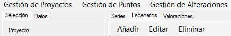

<strong>Figura nº37:</strong> <em>Pestañas habilitadas para la gestión del módulo de Caudales ecológicos</em>

El usuario puede elegir entre añadir el régimen normativo o cualquier otro escenario. En ambos casos se habilita una ventana para introducir los caudales ecológicos mínimos mensuales en m3/s.

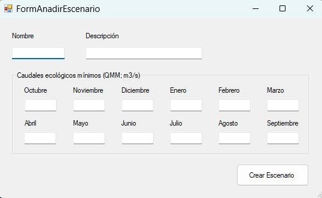

<strong>Figura nº38:</strong> <em>Interfaz para la introducción por parte del usuario de los valores de caudal medio mensual (m3/s) correspondientes a un escenario de RCEmin.</em>

Los escenarios introducidos por el usuario pueden ser editados y/o eliminados.

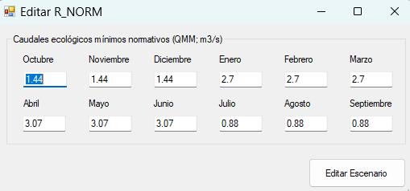

<strong>Figura nº39:</strong> <em>Interfaz para la edición de los valores de caudal medio mensual (m3/s) correspondientes a un escenario de RCEmin, en este caso el Régimen normativo</em>

Todos los escenarios introducidos por el usuario se incorporan a la relación de métodos que recoge la pantalla principal de IAHRIS con indicación de sus valores mensuales, puntuación, demanda ambiental y eficiencia.

- **Para la evaluación del efecto hidrológico de la implementación de escenarios de RCEmin**

Si el usuario desea obtener esta evaluación requerirá además del régimen natural (al menos 15 años), datos del régimen alterado -o régimen actualmente circulante- de <u>al menos 7 años_</u>completos, a escala diaria o mensual.

*Observación: Si el usuario sólo quiere utilizar este módulo, sin hacer un uso previo del módulo ÍNDICES, deberá proceder a la carga de los datos en RA del modo descrito en el epígrafe 4. Si, por el contrario, el usuario ya ha utilizado el módulo ÍNDICES y ha realizado el estudio para este punto y alteración, las series natural y alterada ya estarán disponibles en la base de datos de IAHRIS y el usuario sólo tendrá que seleccionarlas en la pantalla principal*.

<strong>Figura nº40:</strong> <em>Selección del punto y alteración para el estudio de Caudales ecológicos</em>

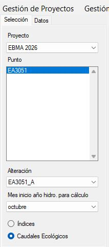

La aplicación realiza la evaluación del efecto hidrológico de la implementación a los siguientes escenarios:

- siempre para el régimen normativo (si el usuario previamente lo ha introducido). Esta opción esta siempre habilitada por defecto.
- para dos escenarios más seleccionados por el usuario. Esta selección se realiza activando la casilla situada a la derecha del nombre del escenario.

<strong>Figura nº40:</strong> Caudales medios mensuales (m3/s), <em>Puntuación, demanda ambiental y eficiencia para el conjunto de escenarios. Los escenarios seleccionados por el usuario para su implementación aparecen con un tick.</em>

## ***¿CÓMO OBTENER LOS INFORMES?***

Una vez introducido los datos mencionados en el epígrafe anterior, se puede proceder a la generación de los informes.

Cómo resumen de los datos a introducir citaremos:

<table><tr><td>
<strong>TIPOLOGÍA DE LOS DATOS</strong>
</td><td>
<strong>ESTUDIO REALIZADO</strong>
</td></tr><tr><td>
Serie en régimen natural, al menos 15 años completos a escala diaria o mensual, sin carácter temporal
</td><td>
Escenarios de RCEmin de base hidrológica (11 escenarios)

Evaluación de su idoneidad ambiental
</td></tr><tr><td>
Régimen normativo
</td><td>
Evaluación de su idoneidad ambiental
</td></tr><tr><td>
Otros escenarios introducidos por el usuario (máximo de 4)
</td><td>
Evaluación de su idoneidad ambiental
</td></tr><tr><td>
Régimen alterado, al menos 7 años completos a escala diaria o mensual
</td><td>
Evaluación del efecto hidrológico de la implementación del escenario (REC normativo + 2 escenarios seleccionados por el usuario)
</td></tr></table>

<strong>Tabla nº7:</strong> <em>Resumen del contenido del estudio en función de los datos facilitados</em>

Seleccionando el botón calcular situado en el extremo inferior derecho se procede al cálculo del informe correspondiente.

<strong>Figura nº42:</strong> <em>Pantalla principal de IAHRIS con el módulo de caudales ecológicos activado. En la parte inferior derecha el botón para calcular el informe correspondiente</em>

Para facilitar la ordenación y sistematización de los resultados suministrados por la aplicación, éstos se estructuran en INFORMES, del modo HOJAS de un LIBRO EXCEL.

IAHRIS denomina al archivo Excel del modo siguiente, donde en el ejemplo realizado en fecha 02/03/2026 se ha utilizado código punto "EJEMPLO 2", pertenece a la Tipología 2b y se ha realizado:

*EJEMPLO2-Natural-Tipo2B-02-03-2026.xlsx*

*Código del punto- Natural- Tipología de estudio- Fecha de realización*

Cada informe –hoja del libro-, agrupa aspectos sensiblemente homogéneos de resultados. A continuación, se muestra parte de una hoja (informe) de uno de esos libros (véanse las pestañas situadas en la parte inferior que dan acceso a cada uno de los informes del libro de resultados del análisis realizado).

<strong>Figura nº43:</strong> <em>Libro Excel correspondiente a un informe de Caudales ecológicos</em>

## ***¿CÓMO SE VINCULAN LOS INFORMES CON LOS DATOS?***

En la tabla nº8 se presenta la relación de las tipologías consideradas en función de los datos disponibles. Se indican también los informes generados en cada caso.

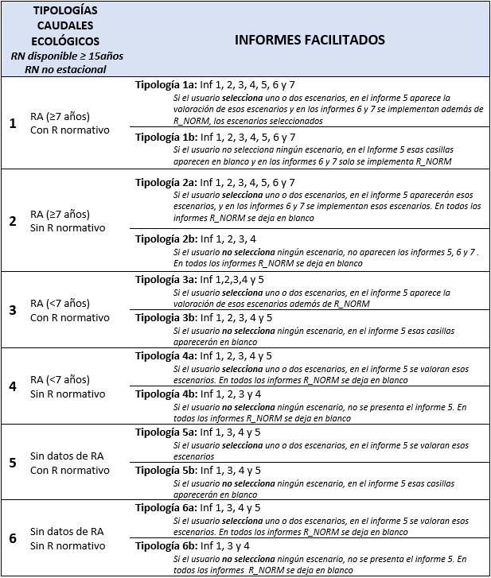

<strong>Tabla nº8:</strong> <em>Relación de posibles tipologías en el estudio de caudales ecológicos en función de los datos disponibles. Se indican también los informes obtenidos en cada caso</em>

En la tabla nº9 se presentan los informes generados para cada Tipología de estudio -según los datos facilitados-, junto a una breve descripción del contenido de cada informe:

<strong>Tabla nº9:</strong> <em>Resumen del contenido de los informes obtenidos en un estudio de caudales ecológicos con IAHRIS</em>

**ANEXO 1**

**BREVE GUÍA DE USO DE IAHRIS**

**ANEXO 2: INFORMES FACILITADOS POR IAHRIS PARA EL CASO DE SERIES REDUCIDAS**

Como se ha comentado en la INTRODUCCIÓN de este Manual, IAHRIS **recomienda disponer de al menos 15 años completos** de datos para recoger la variabilidad interanual del régimen hidrológico.  De ese modo se garantiza un mínimo de información con la que poder obtener conclusiones razonablemente aceptables relacionadas con la variabilidad y con los valores extremos.

No obstante, la aplicación permite el análisis de series más cortas, siempre que se disponga de al menos siete años completos de registros. Cuando la disponibilidad es de entre 7 y 14 años, el tipo de estudio se denomina de **SERIE REDUCIDA.**

Una vez cargados los datos de la serie o series de análisis, la aplicación verifica los años completos disponibles y notifica al usuario en caso de tratarse de una serie reducida, marcando en rojo si el total de años no alcanza el mínimo recomendado de 15 (ver figura 1).

<strong>Figura nº1:</strong> <em>Pantalla principal de IAHRIS para el caso de serie reducida (&lt;15 años) en régimen natural</em>

En el caso de analizar dos series (natural y alterada) basta con que una de ella tenga menos de 15 años, para que el estudio se considere de SERIE REDUCIDA y se identifique con el acrónimo SR en el botón de Calcular (ver figura 1). No obstante, si alguno de los dos regímenes dispone de más de 15 años, el usuario puede también analizar dicho régimen de manera individual.

El análisis de SERIES REDUCIDAS presenta las siguientes características:

- El cálculo de los índices de alteración se realizará siempre según la opción de "no coetaneidad" ya que la no disponibilidad de más de 15 años no recomienda hacer la división en años húmedos, medios y secos.  En consecuencia, los informes solo deben mostrar los resultados correspondientes a la serie disponible completa, sin aportar valores de variables para años secos, medios, o húmedos.
- No se presentarán el Informe de masas muy alteradas hidrológicamente (Inf 8).
- En principio podrían presentarse, según la disponibilidad de datos en uno y/u otro régimen, las mismas tipologías que para la situación de 15 o más años, salvo las tipologías 5 y 6 (ya que son opciones que exigen coetaneidad). En la tabla 1 se describen las tipologías que pueden presentarse y los informes correspondientes.

<strong>Tabla nº1:</strong> <em>Tipologías consideradas en series reducida (&lt;15 años) según la disponibilidad de datos e indicación de los informes facilitados por IAHRIS en cada caso</em>

Los informes identificados en la tabla anterior como **\_SR** presentan ligeras diferencias frente a sus homónimos de series largas. Estas diferencias consisten básicamente, como se ha comentado anteriormente en no considerar la división de años en los tres tipos (húmedo, medio y seco) y, en consecuencia, mostrar los resultados correspondientes a la serie disponible completa, sin aportar valores de variables para cada tipo de año. Tampoco se aportan resultados por tipo de mes.

Al obtener el informe en SERIE REDUCIDA, en la carátula aparece el aviso "*El usuario debe tener presente la incertidumbre asociada a la escasa disponibilidad de datos".*

**ANEXO 3: CARGA MASIVA**

- [CARGA MASIVA](#_TOC_250017)
    - INTERFAZ DE USUARIO CARGA MASIVA
        - Área de Selección de CSV
        - Área de Información sobre CSV
        - Área de Resumen de Procesado
        - Área de Ejecución de Procesado
    - INTERFAZ DE USUARIO GENERAR FICHERO BAT
        - Área de Exportaciones
        - Área de configuración de Informes
        - Selectores de Coetaneidad
        - Área de Guardado

## ***CARGA MASIVA: INTERFAZ DE USUARIO*** 

La aplicación Carga Masiva es una pequeña utilidad asociada a IAHRIS que permite generar y ejecutar de forma sencilla un archivo por lotes (extensión .bat) para añadir puntos y alteraciones a IAHRIS de forma masiva y si el usuario lo desea también exportar el informe de cada uno. El nombre que tendrán los puntos y alteraciones en IAHRIS se toman directamente del archivo CSV. Estos puntos y alteraciones y sus datos asociados se guardan en IAHRIS directamente y se pueden consultar y editar desde la propia IAHRIS.

El usuario puede acceder a "Carga Masiva", desplegando el menú de Utilidades que se encuentra en la pantalla principal de IAHRIS. El sistema avisa que es necesario cerrar IAHRIS para utilizar la herramienta de Carga Masiva.

IMPORTANTE: Se recomienda no abrir de nuevo IAHRIS mientras se esté ejecutando la Carga Masiva.

La interfaz de usuario presenta el siguiente aspecto:

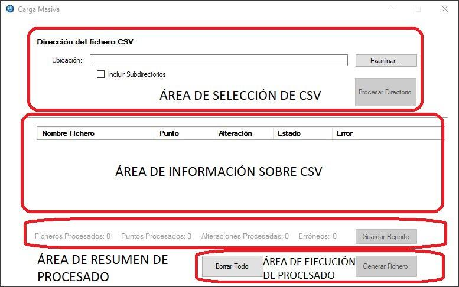

<strong>Figura nº1:</strong> <em>Interfaz de usuario de carga masiva</em>

**Área de Selección de CSV**

Esta área es donde el usuario selecciona la ruta de acceso al directorio donde se encuentran los archivos CSV que quiere añadir a IAHRIS bien escribiendo la ruta manualmente en el campo de texto o bien seleccionando el botón "Examinar…" el cuál abrirá un buscador de directorios del ordenador.

El selector de "*Incluir subdirectorios*" permite que la aplicación busque archivos CSV en el interior de las subcarpetas del directorio indicado, no solo los archivos del directorio raíz.

El botón "*Procesar Directorio*" ejecuta el procesado de la aplicación y nos muestra un listado de los puntos y alteraciones que se van a añadir a IAHRIS en el área de información sobre CSV.

**Área de Información sobre CSV**

Esta área nos muestra el nombre de cada fichero CSV leído, el nombre del punto y de la alteración si procede que ha leído de cada CSV y si el CSV ha sido procesado o no, y si no ha sido procesado nos muestra el error por el que no lo ha sido. Esta aplicación no permite editar ni modificar nada de los CSV leídos por lo que si nos aparece un error debemos modificarlo directamente en el CSV y volver a cargar el directorio.

**Área de Resumen de Procesado**

Aquí nos aparecerá el número de ficheros CSV procesados, el número de puntos y alteraciones que contienen esos CSV y el número de ficheros CSV erróneos que hay. El botón "*Guardar Reporte"* nos permite guardar la tabla de información sobre CSV en formato Excel.

**Área de Ejecución de Procesado**

Tenemos dos botones: "*Borrar todo*" nos permite resetear la interfaz y volver a cargar un directorio y "*Generar Fichero*" nos abrirá primero un buscador para indicar dónde y con qué nombre queremos guardar el archivo .bat.

Se puede guardar el archivo .bat en cualquier ruta pero se recomienda guardarlo en la carpeta donde se encuentran los CSV o en la de salida de los informes para tener el archivo ubicado por si fuera necesario volver a ejecutarlo o editarlo en algún momento.

Al seleccionar la ruta de guardado nos aparecerá una nueva interfaz para seleccionar las opciones de generación:

*INTERFAZ DE USUARIO GENERAR FICHERO BAT*

<strong>Figura nº2:</strong> <em>Interfaz para la selección de opciones en un proceso de carga masiva</em>

**Área de Exportaciones**

Aquí se asigna el nombre del Proyecto que se creara en IAHRIS y donde se guardarán todos los puntos y alteraciones. el usuario puede añadir una breve descripción del proyecto o dejarlo en blanco.

Si el nombre del proyecto ya existe en IAHRIS se crearán los puntos y alteraciones y se cargarán los CSV dentro de dicho proyecto ya existente. Si no existe se creará uno y aparecerá que ha sido generado automáticamente por la aplicación.

El selector "*Crear fichero de salida de errores*" permite la generación de un archivo .txt con el reporte de la ejecución del archivo.bat informando del resultado de la ejecución de cada comando por línea.

**Área de configuración de Informes**

El selector "*Exportar informe*" permite seleccionar o no la exportación de los informes Excel de los puntos y alteraciones procesados. Si lo marcamos se activa para seleccionar la ruta donde queremos que se guarden los informes.

*SELECTORES DE COETANEIDAD*

- Estos selectores son equivalentes a los que se encuentran en IAHRIS y permiten seleccionar la opción de coetaneidad para el cálculo de índices de valores habituales o/y avenidas y sequías.
- Activar estas opciones supone que IAHRIS solo trabajará con aquellos datos correspondientes a registros coetáneos en ambos regímenes. Se recomienda tener siempre activada porque esta opción elimina el "ruido" que supone trabajar con datos no coetáneos.
- Cuando se trabaja por lotes no se puede seleccionar individualmente para cada punto, siendo, por tanto, una opción común a todos los puntos del proyecto.
- Estos selectores solo se aplicarán si los datos lo permiten. Por ejemplo, si en uno de los puntos procesados los datos no son coetáneos, IAHRIS obviará el requisito de coetaneidad para ese punto generando los informes correspondientes. De esta "decisión" IAHRIS dará cuenta en la salida de errores.

También se podrá consultar la coetaneidad de los datos en la caratula de los informes generados mediante la utilidad.

**Área de Guardado**

Dos botones disponibles, "s*olo guardar el bat*"; "*guardar y ejecutar el bat*".

El botón de guardar solo crea el archivo bat en la ruta seleccionada permitiendo que el usuario lo ejecute cuando desee o lo edite manualmente antes de ejecutarlo. El botón guardar y ejecutar el bat guarda el archivo en la ruta deseada y lo ejecuta instantáneamente.

**ANEXO 4: AUTOMATIZACIÓN MEDIANTE LINEA DE COMANDOS DE IAHRIS.EXE**

    - CD – Carga de datos
        - Carga de Datos de un Punto
        - Carga de Datos de una Alteración
    - GIS – Generar Informe de Salida
        - Generar Informe de Salida de un punto
        - Generar Informe de Salida de una alteración

<strong><u>AUTOMATIZACIÓN MEDIANTE LÍNEA DE COMANDOS DE IAHRIS.EXE</u></strong>

IAHRIS permite la ejecución de comandos diferentes mediante línea de comandos además de su interfaz gráfica.

Como norma, los parámetros de la línea de comandos han de pasarse entre comillas dobles ("parámetro") para evitar que caracteres especiales como espacios provoquen interpretaciones no deseadas de dichos comandos.

Los parámetros se pueden pasar en cualquier orden tras indicar la operación a realizar.

El carácter ":" (dos puntos) es un carácter no permitido en los nombres y descripciones. Únicamente se puede utilizar en las rutas para indicar la unidad. Ejemplo: "C:\Users"

La sintaxis genérica es IAHRIS.exe [Operaciones] [Parámetros]

**CD – Carga de datos**

Esta operación permite crear un punto o una alteración en el proyecto que le indiquemos. Si el proyecto no existe nos creará uno con el nombre indicado. El punto puede crearse vacío (sin cargarle datos de un csv) o indicar una ruta de un archivo csv para cargarle dichos datos.

**Carga de Datos de un Punto**

Parámetros

/t:P	Aquí indicamos sobre que vamos a realizar la operación, en este caso un punto.

/np:""	El nombre que queremos darle al punto. Limitado a 12 caracteres.

/d:""	Descripción para el punto. Limitado a 20 caracteres.

/p:""	Nombre del proyecto donde queremos añadir el punto. Limitado a 20 caracteres.

/dp:""	Descripción para el proyecto.

/rn:""	Nombre del régimen natural que queremos asignar al punto.

/ra:""	Abreviatura del régimen natural que queremos asignar al punto.

/fe:""	Ruta del csv que queremos cargar en el punto. Si no queremos cargar datos debemos indicarlo con unas comillas vacías.

Ejemplo de sintaxis:

CD /t:P /np:"TIPO\_2" /d:"Punto Tipo 2" /p:"PuntosPro" /dp:"Puntos Proyecto"	/rn:"Natural"	/ra:"nat"

/fe:"C:\Users\jperera1\Desktop\Puntos\REGIMEN	NATURAL\_ SIMPA\_3014.csv"

**Carga de Datos de una Alteración**

Parámetros

/t:A	Aquí indicamos sobre que vamos a realizar la operación, en este caso una alteración.

/np:""	El nombre del punto asociado a la alteración. DEBE DE EXISTIR, si no nos dará un error indicando que debemos crear el punto

primero. Limitado a 12 caracteres.

/na:""	El nombre que queremos darle a la alteración. Limitado a 12 caracteres.

/d:""	Descripción para la alteración. Limitado a 20 caracteres.

/p:""	Nombre del proyecto donde queremos añadir la alteración. Limitado a 20 caracteres.

/dp:""	Descripción para el proyecto.

/rn:""	Nombre del régimen natural que queremos asignar al punto.

/ra:""	Abreviatura del régimen natural que queremos asignar al punto.

/fe:""	Ruta del csv que queremos cargar en la alteración. Si no queremos cargar datos debemos indicarlo con unas comillas vacías.

Ejemplo de sintaxis:

IAHRIS.exe CD /t:A /np:"TIPO\_6A" /na:"6A\_ALT" /d:"Alteracion 6"

/p:"PuntosPro" /dp:"Puntos Proyecto" /rn:" Alterado" /ra:"alt"

/fe:"C:\Users\jperera1\Desktop\Puntos\Cabriel\_alterado\_MENSUAL.csv"

GIS – Generar Informe de Salida

Esta operación permite exportar el informe de IAHRIS de un punto o una alteración del proyecto que le indiquemos.

**Generar Informe de Salida de un punto**

Parámetros

/t:P	Aquí indicamos sobre que vamos a realizar la operación, en este caso un punto.

/np:""	El nombre del punto del cual queremos exportar el informe.

/p:""	Nombre del proyecto al que pertenece el punto del cual vamos a exportar el informe

/fs:""	Ruta donde queremos exportar el informe.

-n	Parámetro opcional que indica si se añade que no sobrescriba en caso de encontrar un informe con el mismo nombre al que se va a

exportar.

Ejemplo de sintaxis:

IAHRIS.exe	GIS	/t:P	/np:"TIPO\_2"	/p:"PuntosPro"

/fs:"C:\Users\jperera1\Desktop\Exportacion" -n

**Generar Informe de Salida de una alteración**

Parámetros

/t:P	Aquí indicamos sobre que vamos a realizar la operación, en este caso un punto.

/np:""	El nombre del punto al cual pertenece la alteración de la que vamos a exportar el informe.

/na:""	El nombre de la alteración de la cual queremos exportar el informe.

/p:""	Nombre del proyecto al que pertenece el punto y la alteración de la cual vamos a exportar el informe

/fs:""	Ruta donde queremos exportar el informe.

-n	Parámetro opcional que indica si se añade que no sobrescriba en caso de encontrar un informe con el mismo nombre al que se va a

exportar.

-cvh	Parámetro opcional que indica que se usará Coetaneidad de Valores Habituales allá donde sea posible. La consola nos informará

de que valor se ha usado.

-cas	Parámetro opcional que indica que se usará Coetaneidad de

Avenidas y Sequias allá donde sea posible. La consola nos informará de que valor se ha usado.

Ejemplo de sintaxis:

IAHRIS.exe  GIS  /t:A  /np:"TIPO\_6A"  /na:"6A\_ALT"  /p:"PuntosPro"

/fs:"C:\Users\jperera1\Desktop\Exportacion" -n -cvh –cas

**Ejemplo de uso**

Se muestra una captura del uso de los comandos para crear un punto y exportar un informe, mostrando como usar las operaciones y sus parámetros y mostrando la información que devuelve la consola.

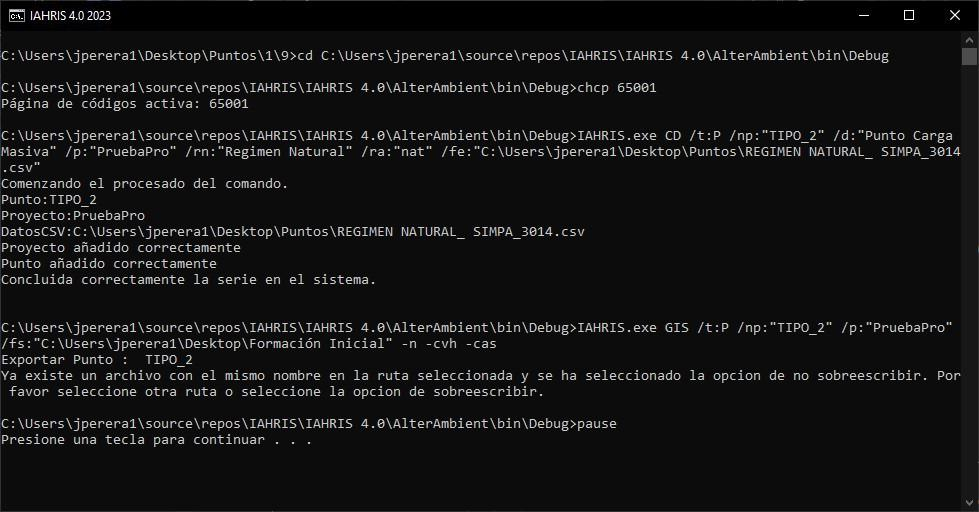