**A natural flow and river ecosystem**

<strong>A.1.</strong> <strong><u>BASIC CONCEPTS_</u></strong>

The natural flow regime of a river (<strong>RNC</strong>) is the result of the integration of all factors, processes and synergies of its basin: climate, topography, geology, soils, vegetation, size and shape of the basin, typology of the drainage network, soil uses, etc. (Baker <em>et al.</em>, 2004).

Some of the factors cited above are characterized by their stability over time, such as geology. Land use, on the contrary, can undergo spectacular changes in very short periods, as a result of fires, deforestations, or land developments. hydrological regime, altering infiltration and runoff patterns in the basin and translating into changes in the flows of flood, in the times of concentration, etc.

In this work, we understand how **RNC** the one that would naturally circulate through the channel, accepting the complexity and variability of all the factors involved, in contrast to other regimes, to which we can call altered, obtained by modifying the natural regime by a regulation and/or direct detraction of flows from the channel.

The meaning of the river ecosystem should also be nuanced, or using a simpler term, the meaning of **River.** As we speak of a river, we are referring to all the components, functions and processes that exist both in the riverbed and in the riparian zone, the flood plain and the associated aquifer.

These four spheres, channel, bank, plain and aquifer form an open and dynamic system, stable in time, with two-way flows of matter and energy according to three main axes: longitudinal – along the channel-, transversal – connecting channel, bank and plain - and vertical – relating the channel to the water table.

The link between these areas and the flow regime is very narrow, and today there is an almost general agreement within the scientific community to affirm that the <strong>RNC</strong> is the main organizing agent of the river ecosystem: floods extraordinary and ordinary, droughts normal, droughts extremes and extreme usual values of the <strong>RNC</strong>, all of them, with their own guidelines of seasonality, duration and inter- and intra-nual variability, are combined, imbued to shape the <em>river landscape.</em>

Each of the features of this <em>landscape</em>, for example, the width of the channel, the size and shape of the sediment, the predominance of macrophytes in a bend, the wealth in odonts of a rapid, the birds nesting in a sote, or the trout that come to fry a given enclave, may be more strongly conditioned by a particular aspect of the <strong>RNC</strong>, but it is the conjunction of all of them, which shapes the river and shapes its biocenosis.

Such is the complexity of the interactions between the **RNC** and the river ecosystem to be studied at different spatial and temporal scales (Bunn and Arthington, 2002).

The ideas presented below only aim to bring the reader into the incredible window of this network:

**THE IMPORTANCE OF MORPHOLOGICAL DYNAMIC**

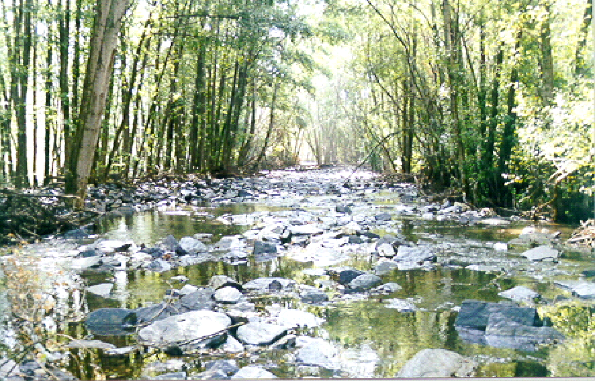

The morphology of a river represents its response to the mass inputs -flow liquid and flow solid- and energy-defined by the slope of the valley on which the channel runs-, Fernández Yuste (2003).

The river adjusts this energy with the shape in plant, drawing curves and meanders, or forming a succession of jumps and wells in the continuous search for a balance between the available slope and the flow liquid and solid to transport.

The curves of a river are not capricious forms. They respond to a very concrete purpose: with the meandering the river gets the real slope that the flow finds to be inferior to that of the valley. The straight, braided and anastomized forms of our rivers are also answers in the continuous search for that balance.

Multiple morphological variables such as the width of the bed, the wet surface, the medium space between rapids and remands, the granulometry of the transported materials and those that make up the bed, can be expressed depending on the flows as the classical equations of river morphology (Knighton, 1998) reflect.

Although this morphology and its dynamics are in the strict sense the abiotic part of the river system, its role in the definition and conformation of the biotic components is unquestionable as it marks the quantitative and qualitative guidelines of its biotope.

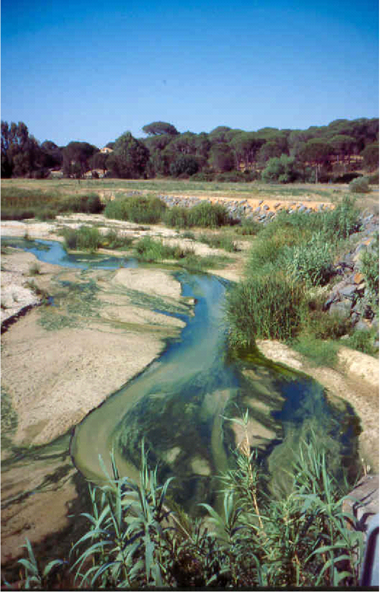

Of all components of **RNC** They're the ones. flows maximum or floods those with greater geomorphological significance.

The floods are critical in the configuration and stability of the channel, maintaining its morphology in a dynamic equilibrium, both in section and in plant. flows maximums guarantee the connectivity in a transversal direction with the flood plain allowing a two-way flow not only of water, but also of organisms, sediments, propagules and nutrients, stimulating the creation and rejuvenation of channels and lateral pools, the formation of bars, etc. magnitude, variability and duration of the floods has implications in the granulometry of the materials transported and sedimented along the river corridor, in the removal of the bed and in the maintenance of transfers with the water table.

In most cases, the alteration of the **RNC** by the regulation of flows the reduction in the magnitude and frequency of the floods and a change in their seasonality.

The construction of the Gen Canyon Dam (Colorado, USA) in 1963 has floods seasonal to about 430 km of river, among which is the Grand Canyon National Park, passing from flows peak of 2400 m3/s by thaw at only 500 m3/s, to which must be attached the retention in the dam of almost 95% of the transported sediments (Collier <em>et al</em>. 1997). alteration of the hydrological regime and sedimentology caused the reduction in the proportion of shallow water areas and low speeds required for fish in their youth phase. flows tip propitiated the expansion of riparian vegetation in areas previously subjected to strong erosions, narrowing the channel and progressively increasing the expansion of foreign species (<em>Tamarix sp</em>.) Following the implementation in 1996 of a floods (35 per cent of total flood natural spring) there was an increase in the size of the bars and sand areas with the consequent side effects on the fauna and vegetation.

Regulation of the Danube River by two large dams (Pinay *et al*., 2002) has caused serious problems of stabilization of the channel, accentuating the erosive processes up to 1000 km downstream, destabilising the sedimentological regime on which the dynamics of the delta depended, which as a result undergoes a continuous process of erosion by the currents of the Black Sea.

**THE IMPORTANCE OF HABITAT DIVERSITY**

In a river hydraulic diversity is synonymous with biodiversity.

The different existing habitats (Richter and Richter, 2000) have been created by a wide range of flows. In this way, the inter and intranual diversity of **RNC** guarantees the biotic diversity, its dynamism and permanence.

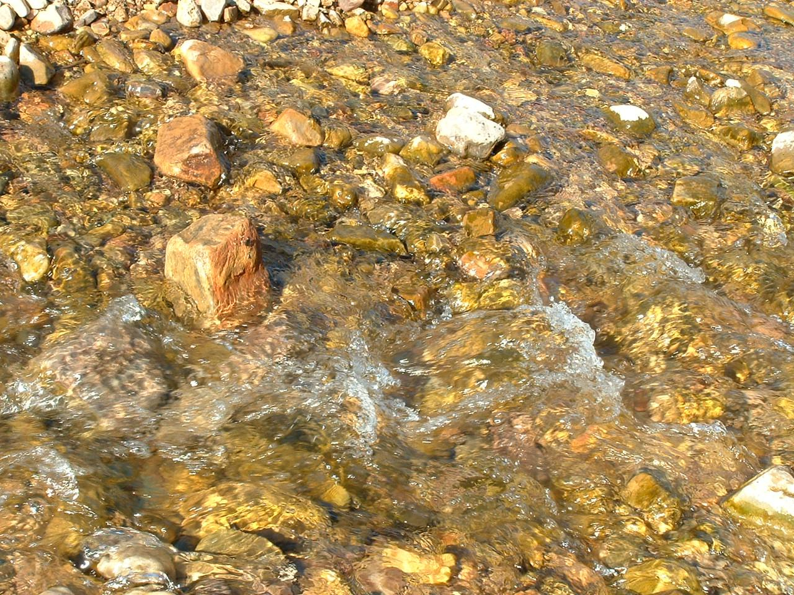

That's the way it is. floods of small magnitude are essential to: ensure the cleaning and revitalization processes of the substrate; maintain adequate conditions in the hyporheic medium; ensure its granulometric diversity; and enable rapid-remand sequence in the fluvial axis.

Also important are the flows extraordinary with recurrence of decades or periods of higher, which can uproot trees and transport large plant remains, which once deposited in the channel contribute to maintaining the hydraulic diversity and the creation of crucial habitats for many species (Gippel, 1995).

The minimum values of the **RNC** they also play a decisive role at the microhabitat level while they may affect the potentiality of the hyporrheal environment, its hydraulic conditions and water quality. flows minimums can limit longitudinal passability in the river and promote critical conditions to which only native species are adapted. Thus, the most extreme values of the RNC function as a barrier against the intrusion of more euriotic species.

The relationships between granulometry, flow and biota are multiple. The speed of water in the vicinity of the bed, cutting forces, turbulence and stability are the factors of greatest importance from the biological point of view, conditioning the abundance and diversity of the bentos and the fish fauna Dependent (Sedimentation Comittiee, 1992). Although requirements vary with age and species, granulometric characteristics are crucial for fish in such critical phases as frenzy and alevinage.

Reservoir regulation can alter the natural dynamics of transition in the bed of the channel, affecting the relative distribution of one habitat versus another, its stability or the characteristics of the hyporheic medium, mainly by sedimentation or colmatation of the interstitial gaps. In other cases, the regulation of the regime produces an ardouration due to lack of flows The final consequence is the condition of the primary link in the trophic chain of a river, the bentos, which reduces its available habitat.

Steinbacher (2003) has studied the effects of alteration of the flow regime on habitat heterogeneity: in general, the regulation induced by a dam means a loss of variability that results in the decline of many aquatic and riparian species.

In Willamette River (USA), riparian forest was reduced from 250 to 64 km in about 100 years. alteration was critical to the functioning of the river, as vegetation regulated erosion and sedimentation, nutrient entry, water quality and ecosystem productivity. Loss of riparian forest resulted in habitat loss for many species in the area and loss of biodiversity for the river.

**THE IMPORTANCE OF SyncRONY WITH VITAL CYCLES**

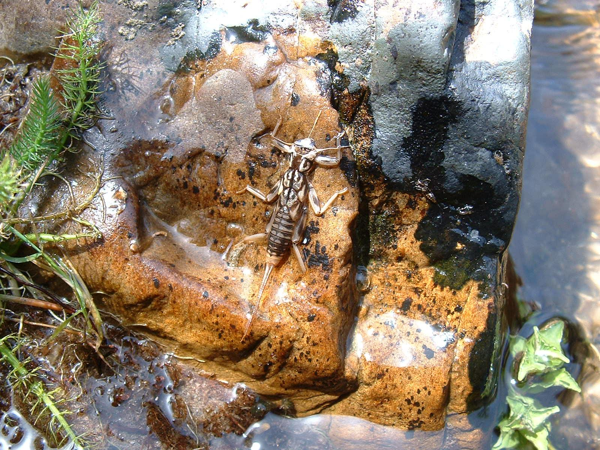

Many vital processes occur in response to environmental conditions of synchrony between temperature, duration of the day and hydrological conditions, so that a alteration in the regime that breaks such harmony can negatively impact on biota.

With regard to certain floods is crucial the moment of the year in which they are produced, as they act as a call for the reproduction of many species: Bunn and Arthigton (2002) collect as in wide flood plains, many aquatic species, from macroinvertebrates, zooplankton, phytoplankton and fish, are "avised" by the flows extraordinary, emerging from its resting stages in response to this increase in the height of water sheet.

Poff *et al*. (1997) note that in Arizona the alteration in the seasonality of the flows, from spring to summer, when in regulated sections more detractions are required for irrigation, it has assumed that the flows tip take place after germination and not before (as happened in natural regime), harming the regeneration of the native species *Populus fremontii* and favoring those exotic as *Tamarix sp.,* with less specific requirements.

The duration is also critical because it determines how and for how long longitudinal and transversal connectivity is guaranteed. duration Fish can access breeding sites and return to the main channel or be isolated in small pools. Insulation in disconnected enclaves of the main course can lead to high mortality rates, as the physical-chemical characteristics of water deteriorate, food resources are scarce and predator pressure increases.

The different tolerances of many plant species to duration from floods (anoxia stress, Kozlowski, 1984) and from macroinvertebrate and fish communities to duration of the drought (Poff *et al*., 1997). Richter and Richter (2000) establish for the Yampa River (USA) relations between duration and magnitude the floods so that there are no substantial changes in the dynamics of the riparian forest. *et al.*, (2002) notes the relations between the duration, magnitude and frequency of the floods and droughts and the nitrogen cycle, since the processes involved are very sensitive to the level of oxidizing-reducing existing in the soil.

Strange *et al.* (1999) collects as in South Platte River (USA), the floods promote the dispersion of the seeds of *Populus deltoids*, which are viable for a short period of time requiring adequate moisture conditions in the soil, not tolerating the cover and needing to achieve radical growth deep enough to guarantee its survival when the water table level descends. floods the proliferation of introduced species was observed as *Eleagnus angustifolia*, more tolerant to shade. In addition, its dissemination occurs during the summer and the seeds maintain their germination capacity for months in a wide range of moisture and cover conditions. It also records the expansion of *Tamarix spp*., possessors of a powerful radical system that makes them less vulnerable to the decline of the water table due to regulation.

Cascading effects are difficult to predict and this alteration the riparian forest indirectly affected the communities that inhabited it: in South Platte River (USA) the loss of at least four native species of birds by hybridization with exotic congeners was found. The causes can be multiple and closely related: loss of suitable places for nesting, disappearance of certain species of insects that constituted the main food, etc.

The rates of growth and defluence of the flows circulators must also keep synchrony with the response capacity of organisms. Arthington (2002) indicates up to 14% biomass loss in the benthic community due to sudden increases in flow.

In Haweai River (New Zealand) Jowett (2000) points out as sudden flow produced a 40-90% detriment in the abundance of all the taxonomic macroinvertebrates groups, except for *Mollusca* which experienced growth of up to 30%.

A special paragraph deserves the attention of the Commission. alteration which is produced as a result of the regulation of flows in the regime of temperatures and nutrients and its effects on the biology of many species. This situation is clearly perceptible downstream of large dams with discharge level under the hypolimnion, or where the return of irrigation or waste water, rich in nutrients, favor some species to the detriment of others (Strange *et al*., 1999; Pinay *et al*., 2002).

**THE IMPORTANCE OF COMPETITION NOT EXCLUDING**

It is a fact that native species evolve in response to the characteristics of **RNC**. Therefore, it is easy for sections with altered regimes to move indigenous species by less demanding or restrictive species.

Cobo (2000) underpins the stability of rivers in their physical and biological complexity. If this complexity breaks or impoverishes, the system becomes increasingly unstable and alterations that were previously easily cushioned can now overcome the ecosystem’s homeostasis capacity causing irreversible damage.

Naiman *et al*(2002) provides alarming data in Mobile River, USA, where 16 species of native molluscs are virtually extinct as a result of regulation.

<strong>A.2.</strong> <strong><u>THE PARADIGMA OF THE flow regime</u></strong>

The current level of knowledge therefore allows us to conclude that the flow regime is the vertebral element of river ecosystems, structuring both the aquatic environment and the riparian, modeling their environmental conditions and enabling the variety of habitats and dynamism in their interactions (Poff *et al*., 1997; Strange *et al.,* 1999; Arthington, 2002; Bunn and Arthington, 2002; Naiman *et al.,* 2002; Nilsson and Svedmark, 2002:

- The natural flow regime He's the main agent. **structure of the physical habitat**, which in turn conditions the richness and diversity in species.
- Disorders in the natural flow regime may mean **alteration in life cycles** of numerous species.
- The maintenance of the **longitudinal and cross-sectional connectivity** is essential to ensure the population dynamics and survival of the ecosystem.
- The alteration of the natural regime favours the **Intromission** and success in the establishment of **exotic species.**

Poff <em>et al</em>. (1997) in the so-called <strong>paradigm of the natural flow regime</strong> brilliantly synthesizes these ideas:

<em><strong>"the full range of intra- and inter-annual variation of hydrological regime with its associated characteristics of seasonality, duration, frequency and rate of changeare critical for sustaining natural biodiversity and the integrity of aquatic ecosystems"</strong></em> <strong>(Figure 1):</strong>

**Figure No 1.-** Paradigm of the natural flow regime (based on Bunn and Arthington, 2002)

**Figure No 1.-** Paradigm of the natural flow regime (based on Bunn and Arthington, 2002)

**LATERAL AND LONGITUDINAL CONNECTIVITY**

**BIODIVERSITY**

**ACCESS TO RIPARY BAND AND PLANNING**

**floods EXTRAORDINARY**

**Seed dispersion,**

**propagules and aquatic organisms**

**seasonality**

**VARIABILITY**

**flows BASE**

**droughts**

**VITAL CYCLES**

**STRUCTURE COMPOSITION**

**MORPHOLOGICAL DYNAMIC**

**ALOGENICAL SUCESSION**

**DIVERSITY OF HYDROHABITATS**

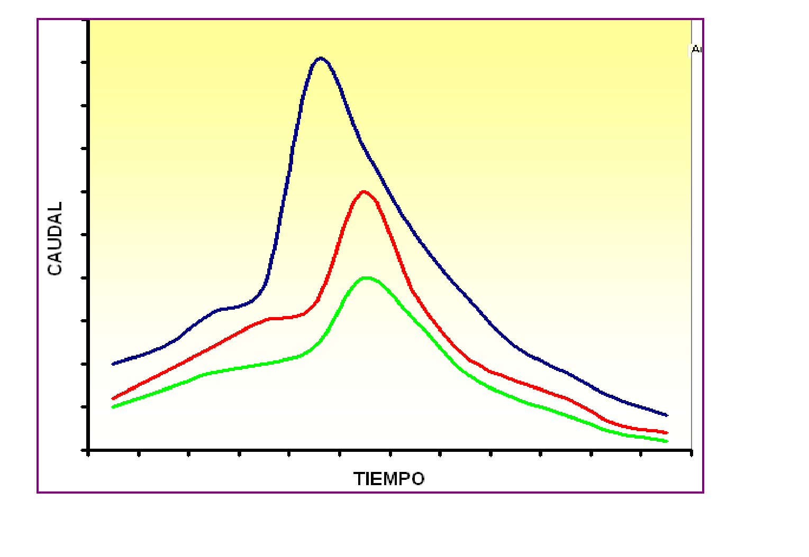

However, although the role of hydrology in the generation of biodiversity is known and accepted, its application in restoration programmes is still very limited.

In humid areas, Fredrickson (1997) presents various proposals to manage water resources in coordination with vegetation and wildlife, always taking into account aspects such as seasonality, magnitude and duration of the floods.

Poff *et al.* (1997) cite many examples where the restoration of some of the components of the natural regime has helped to improve both the physical and biological processes of the ecosystem:

On the Oldman River, Canada, the restoration of flows maximum with defluences that mimic the natural ones has favored the recovery of the riparian band (Rood *et al*., 1995)

In the Ranoke River (USA) damping the oscillations of flow The presence of juveniles of native species has increased (Rulifson and Manooch, 1993).

In the Pekos River (USA) simulation of floods of cut-off duration In the wake of the summer storms, reproductive rates of indigenous species have benefited (Robertson, 1997)

In the Grande River (USA) the restoration of floods of large magnitude access to the floodplain improved nitrogen cycle and nutrient transfer (Molles *et al*., 1995)

Therefore, the success in conserving the biodiversity and functionality of our rivers depends on the ability to protect or restore the main aspects of <strong>RNC</strong> (Arthington, 1997; Poff <em>et al</em>., 1997; Richter <em>et al</em>., 1998) and to know how hydrological and hydraulic variables interact with biological processes by controlling the composition in species and the functionality of the different components of the ecosystem.

Today the main scientific-administrative challenge is to seek water management and management protocols that respect, within a certain level, the ranges of variability of the <strong>RNC</strong> in what Poff <em>et al.</em> (1997) define as <strong>predictable diversity</strong>.

<strong>A.3.</strong>   <strong><u>LA alteration OF THE RNC AS INDICATOR OF THE STATE OF THE FLUVIAL ECOSYSTEM</u></strong>

The Water Framework Directive was published in 2000 (**DMA**) Directive 2000/60/EC of 23 October 2000 has brought about a conceptual revolution with regard to the traditional criteria for water resources management, with the safeguarding of water resources as a priority objective. good ecological status To this end, it is necessary to have protocols that enable the ecological status of rivers, lakes and wetlands to be objectively, accurately and efficiently qualified.

Accepted the hypothesis of the paradigm of flow regime, it is immediate to conclude that any attempt to analyze the state of river ecosystems must go through inexcusably a detailed knowledge of the alteration of the RNC.

DMA requires, to characterize the state of rivers, to use biological, chemical, morphological and **hydrological**. It is therefore necessary to have a tool that allows to know what the natural regime is like (reference condition) and from this knowledge to evaluate the distortion that in hydrological terms generates any other regime than this one.

The **Figure 2** It clearly illustrates this need, this objective.

In this figure is represented the hydrogram of the Green River (USA) between the years 1930-2000. The construction of a dam in 1963 completely altered the patterns of its natural regime that had its own characteristics, very defined, in terms of floods and droughts. The most distinctive character was the alternation of a dry period more or less extreme (from October to May) with a wet period associated with floods of considerable magnitude for the rest of the year.

**Figure No 2.-** Hydrogram corresponding to the Green River (USA) in the period 1930-2000 (taken from Lytle and Poff, 2004)

The construction of the dam completely altered the observed guidelines, both for floods as for droughts, inducing a new regime that does not seasonality, magnitude and/or frequency, had no similarity to the natural one. Large dams like that of the figure there are more than 45000 worldwide (Gupta, 1998), of which about 1200 are in Spain (Magdaleno, 2005), where the pronounced mediterraneity of its rainfall regime motivates the need to regulate water resources as a guarantee of various uses and activities.

If, as has been said, all the components, functions and processes of the river ecosystem are determined by the characteristics of the natural regime, what alterations to the ecosystem will occur as a result of the commissioning of a dam? This question, ambitious in essence, can be broken down into the following partial questions:

**How can we evaluate in hydrological terms the alteration induced by the new flow regime?**

**What is the sensitivity of the ecosystem to these changes?**

**Is it possible to establish relationships between the causative agent and the effect?**

**Are these relationships consistent?**

**Can these relationships help predict changes in the ecosystem under different scenarios of regulation of flows?**

Neither Spain nor the rest of Europe has a procedure for making an objective assessment of the alteration by the use of the water resources of the river network, and indices commonly used in the USA (Richter *et al*.,1996; 1997; 1998) do not, however, address the peculiarities of the Mediterranean regime.

Accepted the paradigm of flow regime, it is consistent to assess the environmental effects occurring in regulated tranches, assessing the alteration that has taken place on the natural flow regime and/or which would occur when considering different water resource use and management scenarios.

Against this background, and in order to establish a methodology for the characterization of flow regime and evaluation of the alteration This work is presented in relation to the natural regime by any other circulating regime, the partial objectives of which are summarized in:

- Select the **appearance**s of the flow regime with greater environmental significance.
- Select the **parameters** and variables that allow to characterize these aspects.
- Define a set of <strong>indices</strong> comparing the values of the parameters between different situations: natural regime <em>versus</em> altered regime and natural regime <em>versus</em> regimes for different scenarios to define the proposed environmental regime.
- Deduce the environmental implications of the changes assessed

**B CHARACTERIZATION OF THE flow regime**

<strong><u>B.1 ASPECTS OF THE MOST SIGNIFICANT REGIME</u></strong>

Each river system, and more specifically each stretch of river, has a flow regime own responsible for its features, which maintains its physical habitat, biological diversity and ecological processes.

In determining the aspects of this regime that have the greatest environmental significance, the scientific community also offers a general view in the selection of the magnitude, frequency, seasonality, duration and rates of change of the natural regime as the most significant aspects (Arthington, 1997; Poff *et al*., 1997; Richter *et al*., 1998;)

- **magnitude:** as it determines the **availability** general water in the ecosystem.

- **frequency** with which an event occurs in a given time interval: indicative of variability in the flow regime and conditioning of the geomorphological and ecological dynamics and therefore of the **diversity.**
- **duration** or time interval associated with certain flow conditions: in extreme situations, floods and droughts; the duration is intimately linked to the **resilience thresholds** of the different species.
- **seasonality:** or regularity with which that event occurs at a certain time of the year. It is a closely linked aspect and **synchrony** with the life cycles of the species (fluvial, estuaries and marine).
- **rates of change:** on the speed with which the changes take place magnitudeis to others, affecting the **response capacity** biota.

These five components enable the natural regime to be characterized and assessed on the basis of them the distortion that any regime other than natural will produce in the ecosystem.

The above definitions allow us to intuit the environmental significance of flow regime. So understood, a alteration in the magnitude of the flows in circulation will mean a alteration the availability of habitat for organisms dependent on that regime, and alteration in the seasonality of certain events will induce a mismatch with dependent biological processes. flow regime in the areas of magnitude, frequency, duration, seasonality and rate of change is to know its possibilities regarding habitat availability, diversity, resilience and responsiveness and synchrony with life cycles (**Figure 3**):

**FLUVIAL ECOSYSTEM**

**Availability**

**Diversity**

**Resilience**

**== sync, corrected by elderman == @elder_man**

**Response capacity**

**flow regime**

**magnitude**

**frequency**

**duration**

**seasonality**

**rate of change**

**Figure No 3.-** Hydrological aspects of flow regime and their correspondence in environmental terms

In this characterization of flow regime preferential interest should be given to extraordinary events, floods and droughts, because they are components of strategic importance in the maintenance and dynamics of the ecosystem.

This is why the process of characterizing the natural flow regime has been carried out on two parallel tracks:

- in the light of the **average or usual values** as determinants of the overall availability of water in the ecosystem.
- in the light of the **extreme values** of the scheme: maximum -floods- and minimum -droughts- by representing the most environmentally critical conditions.

In turn, each of these components should be analysed in those environmentally significant aspects.

The characterization of usual values be carried out in two time frames (year and month) and where data availability permits, the daily characterization or time intervals may be carried out.

The **Table 1** lists the aspects to be evaluated for each of the components mentioned above.

**COMPONENT OF THE NATURAL SYSTEM**

**ASPECT**

**usual values**

Annual values

- magnitude

Daily or hourly values

- Variability

**EXTREME VALUES**

Maximum values

- magnitude and frequency

Minimum values

and monthly

- Variability
- Daily fluctuations

(floods)

- Variability

(droughts)

- seasonality
- duration
- Rate of growth and defluence

**Table No 1.-** Components of flow regime and main aspects with environmental significance

<strong><u>B.2 CHARACTERIZATION OF INTERANUAL VARIABILITY</u></strong>

**WHERE TO CONSULT THESE RESULTS IN A STUDY WITH IAHRIS?**

Report No1 for Natural Regime

Report No1a and b for Altered Regime

In order to avoid that the year-on-year variability (a very strong climate characteristic in our Mediterranean area) is masked by working with average values calculated on the globality of the available years, it is proposed to make a previous discrimination of the years based on its annual contribution in three types, called "wet year", "medium year" and "dry year". This results in a characterization of the regime in terms of its year-on-year variability.

The process to be followed in this discrimination is based on a study of quartiles (or non-absence percentiles) in the series of annual contributions:

**ESTIMATES OF NON-EXCEDENCE PERCENTILE FOR ANNUAL CONTRIBUTIONS**

<strong>Variable:</strong> 	annual contribution in hm3

**Data:** 		set of values corresponding to the annual contributions of the **N** available years

**Estimator:**	Percentile of surplus of the event occupying position i (probability that the variable takes a value greater than or equal to i) obtained by the expression of Weibull= i/(N+1)

Where:

**i**= position that occupies that value in the ordered series from higher to lower, with i=1,2...N

**N** = total number of data in the series

In order to establish contribution thresholds that discriminate between "wet" years and "dry" years, contributions corresponding to the percentages of leave of 25% and 75% are considered.

**CRITERIA FOR THE ALLOCATION OF THE "TYPE" OF THE YEAR**

- One year will be considered **HUMID** if their contribution is greater than or equal to the contribution corresponding to the third quartile -Q3- of the series of annual contributions (percentile of 25% leave)
- One year will be considered **SECO** if their contribution is less than or equal to the contribution corresponding to the first quartile -Q1- of the series of annual contributions (percentile of 75% leave)
- One year will be considered **Medium** if their contribution is among the contributions corresponding to Q1 and Q3 quartiles (75 per cent and 25 per cent leave percentages)

Thus accepting the sample as representative of the behavior of the variable "annual contributions", in any other sample the "medium" years will appear, on average, in 50% of the cases, while the "wet" and "dry" will have an average presence of 25% respectively.

These thresholds were established and working with a series of **N** years each year according to their annual contribution may be ascribed to a particular rate.

This process of characterization of year-on-year variability is carried out independently for the natural regime (report No1) and the altered regime (report No1a). The application offers in addition to the values of the Q1 and Q3 quartiles other descriptive statistics: minimum, mean, median (Q2 or P50%), maximum, interquartile range, coefficient of variation and coefficient of asymmetry.

<strong><u>B.3 CHARACTERIZATION OF INTRANUAL VARIABILITY</u></strong>

**WHERE TO CONSULT THESE RESULTS IN A STUDY WITH IAHRIS?**

Report No2x for Natural Regime

Report No3x for Altered Regime

The objective of the intranual variability characterization is to obtain representative values of monthly contributions for each regime, natural and altered

First of all, it may be asked whether the segregation carried out under the previous heading by “year type” on the basis of the annual contribution discriminates either the monthly contributions or whether, on the contrary, for a given month there are no significant differences in the magnitudeis representative (e.g. medium) for the three types of year considered. The latter situation is very likely to arise; let us put it, for example, in August. Overall, the contribution of that month compared to the annual one will be little significant, so it will hardly influence a year to be wet, medium or dry; in other words, it could present a very dry month of August in the context of a globally humid year, or a singular August. flowbear in a year to which the condition of dry corresponded overall; it is therefore not impossible that the records of August corresponding to wet years do not show significant differences with those of average years and those of dry ones.

In this work it is assumed that to characterize the contribution of the month i corresponding to each type (wet, medium and dry) it is necessary: (i) to dispense with the discrimination established with the annual contributions and, (ii) to establish a new criterion that is appropriate for each month in question.

In order to generate this new discrimination, a process similar to that carried out with annual contributions is followed for each month independently. Thus, the monthly contribution thresholds for the month i (with i=October, November, ...., September) are obtained that allow discrimination, for example, the "wet", "medium" and "dry" Octobers considering the monthly contributions of October corresponding to the percentages of leave of 75% and 25% (Q1 and Q3 quartiles respectively). The process is summarized in the following table:

**ESTIMATES OF PERCENTILE OF EXCEDENCE FOR MONTHLY CONTRIBUTIONS**

<strong>Variable:</strong> 	monthly contribution (month i) in hm3

**Data:** 		series of values corresponding to monthly contributions (month i) **n** years available.

**Estimators:**	Percentile of surplus of the event occupying position i (probability that the variable takes a value greater than or equal to i) obtained by the expression of Weibull= i/(N+1)

Where:

**i**= position that occupies that value in the ordered series from higher to lower, with i=1,2...N

**N** = total number of data in the series

**CRITERIA FOR THE ALLOCATION OF THE "TIME" OF MONTHS (IN A CERTAIN MONTH)**

- One month will be considered **HUMID** if your contribution is greater than or equal to the contribution corresponding to the third quartile -Q3- of the monthly contribution series of that month (percentile of 25% leave)
- One month will be considered **SECO** if your contribution is less than or equal to the contribution corresponding to the first quartile -Q1- of the monthly contribution series of that month (percentile of 75% leave)
- One month will be considered **Medium** if their contribution is among the contributions corresponding to Q1 and Q3 quartiles (75 per cent and 25 per cent leave percentages)

These thresholds were established and working with a series of **N** years, each month according to its monthly contribution may be ascribed to a particular rate.

The process of characterization of intranual variability concludes by estimating a representative contribution for each month and type. In principle, this representativeness could be assumed with the monthly average, but the presence of appreciable biases in the variable (monthly contribution) makes the use of the median more advisable (Growns and Marsh, 2000).

If the sample is accepted as representative of the behavior of the variable "monthly contributions of the month i", in any other sample the "medium" months will appear, on average, in 50% of the cases, while the "wet" and "dry" will have an average presence of 25% respectively. However, in special circumstances (e.g. temporary, seasonal or ephemeral rivers) atypical distributions of the monthly values for a given month or months may be presented (this occurs with greater frequency In summer months, where the proportion of wet, medium and dry months does not correspond to the normal patterns mentioned above. For those months, the application (Reports 2a and 3a) offers the values A/B/C, being:

A: No months in the series with wet condition

B: No of months in the series with medium condition

C: No of months in the series with dry condition

This process of characterization of intranual variability is carried out independently for natural regime (reports Nos. 2 and 2a) and altered regime (reports Nos. 3 and 3a). The application offers in addition to the values of the Q1 and Q3 quartiles other descriptive statistics: minimum, mean, median (Q2 or P50%), maximum, interquartile range, coefficient of variation and asymmetry coefficient. The results of characterizing extreme variability (difference between the maximum and minimum monthly contribution in each year) and the table of frequencyrelative monthly maximum and minimum (probability of the maximum or minimum monthly contribution of the year being located in that month, respectively).

<strong>B.4</strong> <strong><u>parameters PROPOSALS</u></strong>

**WHERE TO CONSULT THESE RESULTS IN A STUDY WITH IAHRIS?**

Report No4x for Natural Regime

Report No5x for Altered Regime

The process of characterizing flow regime is specified in the selection of parameters appropriate to allow for a clear and precise assessment of each of the above aspects.

In the **Table 2** the 19 are collected parameters (**P1-P19**) that allow the characterization of the regime and that can be obtained with IAHRIS.

These 19 parameters are completed with the characterization of two other aspects (whose calculation does not include version 4.0 of the software):

1. The daily fluctuation obtained from flows at hourly or minor intervals.
2. The rates of growth and decline of the comings, which must be obtained for the different types of floods Considered in this work.

The procedure to be followed for the characterization of these two aspects is set out in subsequent headings.

With regard to the 19 parameters presented in the **Table 2** the following considerations may be made:

# The application calculates the **19 parameters** proposed herein for:

### any regime qualified as natural

### any regime classified as altered, which may be the current regime, the environmental regime or any other proposed regime 

# The parameters **P1, P2, P3 and P4** broken down by type of year, the value for the "weighted year" is also offered as an overall result

This requires the independent characterisation of these parameters, for each of the types of year considered.

For example, to estimate P1 are calculated: wet P1, medium P1, dry P1, which characterize the wet, medium and dry years respectively.

These three values conclude in a single, weighted P1, obtained when weighted according to the percentage of presence of each type of year in the series

**Weighted P1= 0.25\*(Wet P1 + Dry P1) + 0.50\* Medium P1**

# The parameters **P12, P18, and P19** specified at monthly level

- Depending on the periodicity of the data provided, the application calculates:

- total of parameters **P1-P19**if daily data have been provided
- **P1-P3**if only monthly data have been provided

# The 4x and 5x reports calculated with IAHRIS reflect the set of parameters for natural and altered regime. 

<table><tr><td colspan="6">
<strong><em>Table 2: RELATIONSHIP OF parameters (P1-P19) FOR THE CHARACTERIZATION OF flow regime. The parameters P3 to p19 are only calculated if daily data have been provided. </em></strong>
</td></tr><tr><td colspan="2">
<strong>COMPONENT OF THE SYSTEM</strong>
</td><td>
<strong>ASPECT</strong>
</td><td colspan="3">
<strong>parameter</strong>
</td></tr><tr><td rowspan="15">
<strong>usual values</strong>
</td><td rowspan="11">
<strong>ANNUAL AND MONTHLY CONTRIBUTIONS</strong>
</td><td rowspan="4">
<strong>magnitude</strong>
</td><td rowspan="4">
Average annual contributions
</td><td rowspan="3">
By type of year
</td><td>
wet year
</td></tr><tr><td>
average year
</td></tr><tr><td>
dry year
</td></tr><tr><td colspan="2">
<strong>YEAR PURSUANT (P1)</strong>
</td></tr><tr><td rowspan="4">
<strong>VARIABILITY</strong>
</td><td rowspan="4">
Difference between maximum and minimum monthly contribution in the year
</td><td rowspan="3">
By type of year
</td><td>
wet year
</td></tr><tr><td>
average year
</td></tr><tr><td>
dry year
</td></tr><tr><td colspan="2">
<strong>YEAR PURSUANT (P2)</strong>
</td></tr><tr><td rowspan="3">
<strong>seasonality</strong>
</td><td rowspan="3">
Maximum and minimum contribution of the year
</td><td rowspan="3">
By type of year

<strong>(P3)</strong>
</td><td>
wet year
</td></tr><tr><td>
average year
</td></tr><tr><td>
dry year
</td></tr><tr><td rowspan="4">
<strong>flows DARIOS</strong>
</td><td rowspan="4">
<strong>VARIABILITY</strong>
</td><td rowspan="4">
Difference between the flows averages for 10 per cent and 90 per cent leave
</td><td rowspan="3">
By type of year
</td><td>
wet year
</td></tr><tr><td>
average year
</td></tr><tr><td>
dry year
</td></tr><tr><td colspan="2">
<strong>YEAR PURSUANT (P4)</strong>
</td></tr><tr><td rowspan="15">
<strong>EXTREME VALUES</strong>
</td><td rowspan="8">
<strong>MAXIMUM VALUES OF flows daily </strong>

<strong>(floods)</strong>
</td><td rowspan="4">
<strong>magnitude And frequency</strong>
</td><td>
Average maximum flows annual daily
</td><td colspan="2">
<strong>Qc (P5)</strong>
</td></tr><tr><td>
flow Milk Generator
</td><td colspan="2">
<strong>QGL (P6)</strong>
</td></tr><tr><td>
flow connectivity
</td><td colspan="2">
<strong>QCONEC (P7)</strong>
</td></tr><tr><td>
flow of the flood usual (Q5%)
</td><td colspan="2">
<strong>Q 5% (P8)</strong>
</td></tr><tr><td rowspan="2">
<strong>VARIABILITY</strong>
</td><td>
Maximum variation coefficient flows annual daily
</td><td colspan="2">
<strong>CV (Qc) (P9)</strong>
</td></tr><tr><td>
Variation coefficient of the series of floods usual
</td><td colspan="2">
<strong>CV (Q 5%) (P10)</strong>
</td></tr><tr><td>
<strong>duration</strong>
</td><td>
Maximum number of consecutive days per year with q≥Q 5%
</td><td colspan="2">
<strong>duration of floods(P11)</strong>
</td></tr><tr><td>
<strong>seasonality</strong>
</td><td>
Not mean days per month with q≥Q 5%
</td><td colspan="2">
<strong>12 values (one for each month) (P12)</strong>
</td></tr><tr><td rowspan="7">
<strong>MINIMUM VALUES OF flows daily </strong>

<strong>(droughts)</strong>
</td><td rowspan="2">
<strong>magnitude And frequency</strong>
</td><td>
Average of minimums flows annual daily
</td><td colspan="2">
<strong> Qs (P13)</strong>
</td></tr><tr><td>
flow of the drought usual (95% Q)
</td><td colspan="2">
<strong>Q 95% (P14)</strong>
</td></tr><tr><td rowspan="2">
<strong>VARIABILITY</strong>
</td><td>
Minimum variation coefficient flows annual daily
</td><td colspan="2">
<strong>CV (Qs) (P15)</strong>
</td></tr><tr><td>
Variation coefficient of the series of droughts usual
</td><td colspan="2">
<strong>CV (Q 95%) (P16)</strong>
</td></tr><tr><td rowspan="2">
<strong>duration</strong>
</td><td>
Maximum number of consecutive days per year with q≤ Q 95%
</td><td colspan="2">
<strong>duration droughts (P17)</strong>
</td></tr><tr><td>
Average number of days per month with flow nil daily
</td><td colspan="2">
<strong>12 values (one for each month) (P18)</strong>
</td></tr><tr><td>
<strong>seasonality</strong>
</td><td>
Not mean days per month with q≤Q 95%
</td><td colspan="2">
<strong>12 values (one for each month) (P19) </strong>
</td></tr></table>

Under the following headings (<strong>B.4.1</strong> <em>characterization of usual values</em>, <strong>B.4.2</strong> <em>characterization of floods</em>, <strong>B.4.3</strong> <em>characterization of droughts</em> and <strong>B.4.4</strong> <em>characterization of usual values in altered non-coetaneous regimens</em>) details of the parameters proposed, following the following general outline:

*Scheme with which each of the parameters selected*

**ASPECT to be measured**

(a) <u>Environmental significance</u>: details of the main influences that the considered aspect has on the river ecosystem.

(b) <u>parameter Proposed</u>: Name and definition of: parameter proposed, indicating in detail the method of calculation.

(c) <u>References</u>: The most outstanding quotations related to the aspect analyzed, the parameter proposed and, where appropriate, the method of calculation.

In some cases, because of the complexity, both in time and in the space of the aspect to be studied, it is necessary to assign several parameters cover the multiplicity of the aspect to be addressed.

As an example of this situation, we can cite the parametrization of the magnitude of the flows maximum:

Taking as a reference the <strong>Figure 4</strong> and following Poff <em>et al.</em> (1997), a direct correlation can be established between different flow levels and their functionality at the geomorphological and biological levels.

The first level (A) would be defined by the flows base, where the presence of the water table guarantees the supply of water even in times of zero precipitation.

The level above the previous level (B) would correspond to floods of small magnitude, annually or less, hence in this work they have been referred to as *floods usual*. Their functionality at the biological level is very important because they transport the finest sediments, cleaning the substrate and guaranteeing the biological potentiality of the hyporrheal environment.

The floods associated with flows (level C), referred to as *floods geomorphological*, they maintain in dynamic equilibrium the morphology of the channel, both in section and in plant. But they also have associated a biological functionality, since they favor the exchange of organic matter and sediments in the strip between the level of high and low waters and allow the regeneration and persistence of the riparian band.

Finally, the floods of magnitudeis superior to the previous ones (levels D and E), with recurrence of the order of decades, exceed the channel and access to the flood plain favoring the channel-plain connectivity, in a bidirectional flow, hence its designation of *floods connectivity.* The existence of these floods guarantees all biological processes dependent on this exchange (growth and decrease) of water, sediments, organisms, seeds, propagules, etc.

<strong>Figure No4.-</strong> Ecological and geomorphological functionality corresponding to different flow levels (based on Poff) <em>et al.,</em> 1997) Drawing by J. I. García Viñas.

**B.4.1. CHARACTERIZATION OF usual values**

The characterization of usual values pursues the parameterization of non-extreme values of flow regime. This process will be carried out in three complementary time scales: year, month and day.

The necessary starting data are the full series of longer annual and monthly contributions available and the flows daily means corresponding to n years, recommended n15, although the IAHRIS 4.0 application works with series of at least 7 years. flow At hourly intervals it allows the characterization of intraday variability or absolute fluctuation (**Figure No5**).

**magnitude**

**VARIABILITY**

**Monthly contributions**

**seasonality**

**Annual contributions**

**flows daily media**

**flows at hourly intervals**

**Figure 5**- Variables used in the characterization of usual values of the flow regime

The process described in heading B.3 allows to characterize intranual variability by offering for each month its medium value (**Table No. 3.**

<table><thead><tr><th colspan="4">
<strong>MEDIUM-MEDIATE MESSUAL CONTRIBUTIONS</strong>

<strong>(hm)3)</strong>
</th></tr><tr><th>
type 

month
</th><th>
<strong>HUMID</strong>
</th><th>
<strong>Medium</strong>
</th><th>
<strong>SECO</strong>
</th></tr></thead><tbody><tr><td>
<strong>October</strong>
</td><td>
14,22
</td><td>
2,08
</td><td>
0,87
</td></tr><tr><td>
<strong>November</strong>
</td><td>
37,03
</td><td>
6,23
</td><td>
1,35
</td></tr><tr><td>
<strong>December</strong>
</td><td>
30,05
</td><td>
16,70
</td><td>
3,58
</td></tr><tr><td>
<strong>January</strong>
</td><td>
33,07
</td><td>
15,44
</td><td>
7,50
</td></tr><tr><td>
<strong>February</strong>
</td><td>
49,76
</td><td>
18,13
</td><td>
5,50
</td></tr><tr><td>
<strong>March</strong>
</td><td>
40,45
</td><td>
23,19
</td><td>
8,20
</td></tr><tr><td>
<strong>April</strong>
</td><td>
36,78
</td><td>
15,26
</td><td>
12,07
</td></tr><tr><td>
<strong>May</strong>
</td><td>
26,51
</td><td>
11,61
</td><td>
7,14
</td></tr><tr><td>
<strong>June</strong>
</td><td>
15,40
</td><td>
6,29
</td><td>
2,70
</td></tr><tr><td>
<strong>July</strong>
</td><td>
4,26
</td><td>
2,09
</td><td>
0,80
</td></tr><tr><td>
<strong>August</strong>
</td><td>
2,10
</td><td>
1,09
</td><td>
0,50
</td></tr><tr><td>
<strong>September</strong>
</td><td>
2,80
</td><td>
1,41
</td><td>
0,69
</td></tr></tbody></table>

**Table 3**- Example of characterization of intranual variability of flow regime

<strong>B.4.1.1.-</strong> <strong><u>ANNUAL AND MONTHLY VALUES</u></strong>

**magnitude**

(a) <u>Environmental significance</u>: annual and monthly contributions are not associated with a specific geomorphological or ecological function, but they are decisive in the overall availability of water in the ecosystem (Richter <em>et al.,</em> 1995; Brizga <em>et al.</em>, 2001). It is interesting to pick up the nuancements that Richter <em>et al</em>(1998) on the environmental significance of monthly contributions:

- availability of habitat for aquatic organisms

- soil moisture content for plants
- availability of water for terrestrial animals
- accessibility to breeding sites
- influence on temperature, oxygen content and photosynthetic activity in the water column

(b) <u>parameter Proposed</u>: <strong>Q1: ANNUAL MEASURE OF ANNUAL CONTRIBUTIONS</strong>

For each type of year the <u>average annual contributions</u> The final estimator shall be obtained by weighting the value obtained according to the percentage of presence of each type of year in the series.

**Moist P1; Medium P1; Dry P1**

**Weighted P1= 0.25\*(Wet P1 + Dry P1) + 0.50\* Medium P1**

**Figure 6**- Excerpt from a report by IAHRIS with the evaluation of the parameters characterising annual contributions

(c) <u>References</u>: The use of the average as estimator of annual contributions is reflected in Clausen <em>et al</em>. (2000), Brizga <em>et al</em>(2001) and Battle <em>et al</em>. (2004). Other authors, Hughes and James (1989) use the annual average runoff. <em>et al</em>. (2001) make estimates of magnitude on the basis of median and joint estimates magnitude and seasonality.

The references consulted show only the use of flow daily average (mean or median) of the series available for the characterization of monthly values: Richter *et al*(1995), Clausen *et al*. (2000) and Growns and Marsh (2000).

Finally, it should be noted that all the revised work uses the full series of years available, without the previous discrimination proposed herein in different types of year.

**VARIABILITY**

(a) <u>Environmental significance</u>: There are multiple references to the strong environmental significance of the variability of flow regimeThese include the following:

- The variability is the driving axis of the geomorphological and ecological dynamics, conditioning the processes of expansion and contraction of the channel and the behavior patterns of the animal and plant biota (Brizga *et al.,* 2001).
        - A decrease in variability may favor the intrusion and expansion of exotic species (Poff *et al.,* 1997).
        - The similarity in the average monthly values over the year can be interpreted as indicative of <strong>record</strong> hydrological, while the year-on-year variation of the average value for a given month is indicative of the <strong>contingency</strong> environmental (Richter <em>et al</em>., 1995). Both aspects guarantee the predictability of events by the fish fauna (González del Tánago and García Jalón, 1995).
        - The variability of flow regime conditions the heterogeneity of the hyporrheal habitat and its quality, influencing the size of the material that makes up the bed of the channel, its stability, the filling of the hyporrheal medium and its hydraulic characteristics (Sedimentation Committee, 1992).

(b) <u>parameter Proposed</u><strong>Q2: DIFFERENCE BETWEEN MAXIMUM AND MINIMUM MONTHLY YEAR-YEAR CONTRIBUTION</strong>

Since year-on-year variability is reflected in discrimination in "wet, middle and dry years", it is now proposed to characterize intra-year variability as a difference between the maximum and minimum contribution in the year.

The evaluation will be carried out year by year for each of the years belonging to a particular "type". The procedure focuses on estimating what is the difference in terms of contribution, between the maximum and minimum monthly of one year (**A** in the **Figure 7**) The average for each of the "types" is then calculated. The final value is obtained as a weighted average according to the percentage of each type's presence in the series.

**A**

**Figure No7-** Example of estimation of intranual variability.

**Figure 8**- Excerpt from a report by IAHRIS with the evaluation of the parameters that characterize the variability of monthly contributions

(c) <u>References</u>: In the references consulted, it is common to use the coefficient of variation as a statistical representative of year-on-year variability working on the series of annual contributions (Brizga <em>et al</em>., 2001; Baeza <em>et al</em>., 2003). Clausen <em>et al</em>. (2000) apply it on the series of flows daily being representative of the daily variability, and highlighting on a monthly scale the proposal of Growns and Marsh (2000). Other authors introduce the use of bias either in annual or monthly values as recorded in Puckridge <em>et al.</em> (1998). To quote lastly the use of the flows classified (Richards, 1990; Puckridge <em>et al</em>., 1998; Growns and Marsh, 2000;) for the definition of ranges of variation in the flows daily.

**seasonality**

(a) <u>Environmental significance</u>: The seasonality of extreme values, floods and droughts is more environmentally significant than the usual values of the flow regimeHowever, Brizga <em>et al.</em> (2001) reflect the following considerations:

- The seasonality marks the rhythm of the vital processes of aquatic biota and riparia, intimately linked and in synchrony with a set of environmental variables such as air temperature, sea temperature, lunar phase and tides, duration of the day, storms and other climatic factors

- Seasonal variability is crucial in maintaining temporal diversity of habitats
- The seasonality the main channel allows synchrony with the tributaries and avoids processes of incision in their channels
- The seasonality is a stimulus for germination and dispersion

(b) <u>parameter Proposed</u><strong>P3: MONTHLY AND MONTHLY INCOME FOR MINIMUM CONTRIBUTION</strong>

The seasonality of monthly contributions shall be assessed for each type of year (wet, medium and dry) in a double characterization: seasonality the minimum (or month of minimum contribution) and seasonality of the maximum (or maximum month of contribution).

For the years of each type of year the monthly average contributions corresponding to each month are calculated i. Working in each type of year with the series of the 12 medium-sized ones thus obtained, the seasonality of the maximum monthly contribution is given by the month where the maximum median is located and the seasonality of the minimum monthly contribution per month where the minimum median is located.

The **Figure No9** shows an example of the characterization of seasonality.

**Figure 9**- Example of the characterization of seasonality of maximum and minimum

**Figure No 10**- Excerpt from a report by IAHRIS with the evaluation of the parameters characterising the seasonality of monthly contributions

(c)   <u>References</u>: In the literature consulted, the estimate of the seasonality of the usual values is not relevant to the seasonality of extreme values, especially maximum values (Richter <em>et al.,</em> 1995).

With regard to monthly values, Growns and Marsh (2000) study the seasonality locating the driest month and the wettest month, understanding as such those months that most frequently possess the minimum (and maximum) flow monthly average daily for a record of 20 years. Other authors, Brizga *et al.* (2001), carry out classifications on the basis of different percentages of flows daily means for a given month and propose classifications of the flow regime according to the % of the annual contribution for each month (Haines *et al.,* 1988).

<strong><u>B.4.1.2.- DIARY VALUES OR MINOR INTERVALS</u></strong>

**VARIABILITY**

(a) <u>Environmental significance</u>: the environmental significance of this aspect is considered collected when exposing the significance of the variability of others usual values. (see heading B.4.1.1)

(b) <u>parameter Proposed</u> <strong>P4: INTERVAL UNDERSTANDED BETWEEN flows DARIOUS MEANS FOR 10% AND 90% OF THE PERCENTILE OF EXCEDENCE, Q10-Q90</strong>

The curve of flows classified or curve of duration of flows is the instrument that best represents the variability of flows over the year, indicating the percentage of time on average, in which a given value of flow It's even or outnumbered.

Regarding this curve, the 10% leave percentile (Q) is spoken of.10), like that flow that on average is only equalized or exceeded 10% of the year, that is 36.5 days. Similarly the 90% leave percentile (Q)90) would indicate that flow that on average is equalled or exceeded 90% of the year, or in daily terms 328.5 days. In this curve the interval Q0- Q100 represents the range of variation of the flows daily media.

Working with the average curve corresponding to each type of year, the variation <em>usual</em> can be characterized by the interval <strong>Q10-Q90</strong> without the extreme values, both maximum (&gt;Q) 10) as minimum (&lt;Q 90)., <strong>Figure No 11</strong>:

**Q90%**

**Q10%**

**RANGO DE VARIABILITY HABITUAL**

<strong>Figure 11</strong>- The range of "habitual" variability of the flows daily media Q10 –Q90 <strong>↕</strong> based on the curve of flows classified

**Figure 12**- Excerpt from a report by IAHRIS with the evaluation of the parameters characteristic of the usual variability

(c) <u>References</u>: there are multiple references to the use of the flows the percentages of leave of 10%, 20%, 80% and 90% of employees most frequently (<strong>Table 4</strong>).

<table><thead><tr><th>
<strong>REFERENCE</strong>
</th><th>
<strong>parameter</strong>
</th><th>
<strong>DEFINITION</strong>
</th></tr><tr><th>
<strong>Baeza </strong><em>et al</em><strong><em>. </em></strong>(2003)
</th><th>
Intra CV
</th><th>
Intranual variation coefficient. Ratio between standard deviation of 365 flows daily of the year and the average of flows of that year
</th></tr><tr><th rowspan="3">
<strong>Clausen</strong> <em>et al</em>. (2000)
</th><th>
SK
</th><th>
Ratio between mean and median of the flows daily media
</th></tr><tr><th>
CV
</th><th>
Variation coefficient of the series of flows daily media 
</th></tr><tr><th>
PRE and CON
</th><th>
Predictability and constancy calculated from the ratio between the flow daily average and median 
</th></tr><tr><th rowspan="2">
<strong>Growns and Marsh</strong> (2000)
</th><th>
Monthly variability
</th><th>
Defined as (Q10-Q90)/median, is calculated for the series of flows monthly daily averages over a 20-year series 
</th></tr><tr><th>
Intranual variability
</th><th>
Range of flows between 20 and 80 per cent leave percentages 
</th></tr><tr><th>
<strong>Puckridge </strong><em>et al</em><strong><em>.</em> </strong>(1998)
</th><th>
Variability 
</th><th>
Based on flows daily means, is calculated as the ratio between Q10-Q90 and median. 
</th></tr><tr><th>
<strong>Richards </strong>(1990)
</th><th>
Ranges of the flows daily
</th><th>
Ratio between the pecentiles of leave of absence 10%/90%, 20%/80% and 25%/75% of the flows daily for the full series.
</th></tr></thead></table>

**Table No 4.-** References for estimating the variability of usual values daily

**INTRADIA FLUCTUATION**

(a) <u>Environmental significance</u>: although the main environmental implications of the variability of flow regime (heading B.4.1.1), it is true that daily fluctuations take on special significance since they reflect the speed with which the variations of the magnitudeis to others directly affect the biota and its resilience (Arthington, 2002). It is essential that these rates are in synchrony with the responsiveness of organisms, allowing the support of bentos, the migration of juveniles to more favorable habitats, the use of nutrients, etc.

The main environmental implications alteration These fluctuations can be summarized as follows:

- GEOMOPHOLOGY: alteration in the composition and stability of the substrate (Gonçalves, 2002)

- HYDRAULIC HABITAT: alteration in water speed and other associated variables (Gonçalves, 2002)

- VEGETATION: Affection of plant regeneration processes: dissemination, germination, vegetative reproduction, etc. (Poff *et al.,* 1997); Structural damage and physiological stress (Arthington, 2002)

# FAUNA: Increase in carry-over mortality in floods or by stranding in sudden declines (Poff) *et al.,* 1997); Affection of the fish fauna by reduction of habitat and decrease of food (Martínez de Azagra and Sanz, 2003); loss of biomass in the benthic community by trawling in abrupt floods or isolation under inadequate conditions (Gonçalves, 2002), and considerable reduction in its diversity (Arthington, 2002); substitution of indigenous species by others less demanding and more adaptable to these fluctuations (Poff *et al.,* 1997) 

- WATER QUALITY: alteration in the parameters physicochemicals, with special temperature condition and dissolved oxygen concentration (Gonçalves, 2002)

b<u>) parameter Proposed</u>: <strong>ABSOLUTE FLUCTUATION</strong>

The fluctuations of the circulating regime analysed in small time intervals (e.g. timetables) are of particular relevance in the case of sections subject to hydroelectric use, where it is easy to present the paradox that the average values corresponding to the flows daily, changes in flow studied under a more limited time frame (time or lower) are however enormous.

Baker *et al*(2004) propose a index (R-B index, *Richards–Bakers Flashiness* Index) that taking as time interval 1 hour is of great utility to characterize the pulses of daily turbines of the hydroelectric plants.

where:          <strong>q</strong> <strong>i</strong> = flow average hour i

<strong>q</strong> <strong>i-1</strong> = flow average hour i-1

That's it. index responds to the expression:

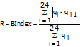

East index adimensional reflects the oscillations of flow with respect to the daily total flow, constituting a good estimate of the trends of growth and decline of the flow circulating.

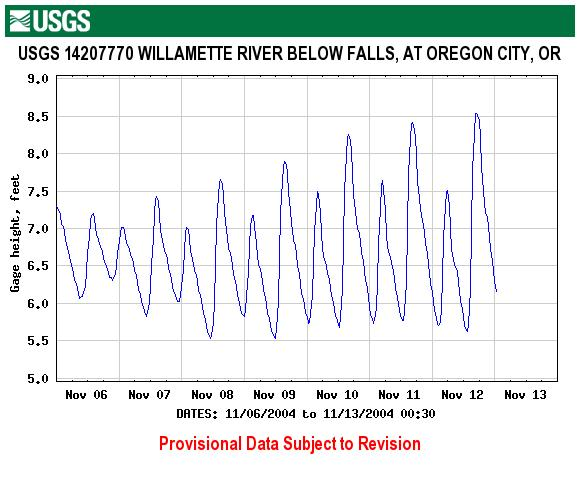

**Figure No 13**- Hydrogram downstream of a hydroelectric power plant between 6 and 12 November. Below, details for 6 November (Source: USGS, 2004)

If in a practical case we apply <em>the R-B Index</em> to the data collected in the <strong>Fig. no13</strong> and <strong>14</strong> representative of the downstream hydrogram of a hydroelectric power plant and specialised for a particular day (e.g. Nov 06), can be seen as the numerator of the hydropower plant (e.g. index represents the total sum of oscillations of flow for 24 hours:

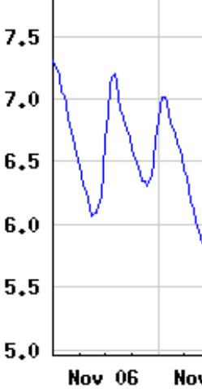

**B**

**C**

**D**

**A**

**Figure No 14** Details of the downstream hydrogram of a hydroelectric power plant by 6 November 2004 (Source: USGS, 2004)

**= A + B + C + D = Fa**

confirming for the example given that the sum (A+B+C+D) is representative of these oscillations. **Fa** as parameter to characterize absolute fluctuation.

**B.4.2. CHARACTERIZATION OF MAXIMUM EXTREME VALUES (floods)**

In the characterization of natural flow regime as a structurer of the geomorphological and biological landscape of the river ecosystem, special attention should be paid to the "bottleneck" which ecologically represent the extreme, maximum and minimum values, as it constitutes the most critical situations, but also the most strategically important opportunities for biota (Lytle and Poff, 2004).

The analysis of the maximum extreme values will be based on two main variables, the first being the maximum. flow annual daily average (Qc), obtained from the available series. Secondly, we will work with the so-called <em>flood usual</em>a concept which will be dealt with extensively under this heading and which is given by the value of flow corresponding to the 5% surplus percentile in the flows classified under natural regime (Q 5%).

In the **Figure No 15** the variables to be considered in the most ecologically significant aspects of the floods:

**magnitude and frequency**

**VARIABILITY**

**seasonality**magnitude

**duration**

flow Milk Generator (QGL)

<strong>flow of the flood usual (Q</strong> <strong>5%)</strong>

**floods**

**maximum**

Maximum flow medium

annual daily

(Qc)

**Maximum flow annual daily average (Qc)**

**GROWTH TASKS AND**

**DEFLUENCY**

**Figure No 15**- Variables in the characterization of maximum extreme values.

**magnitude And frequency**

(a) <u>Environmental significance</u>: The role played by floods in the dynamics of the river ecosystem is basic to guarantee the integrity of the river ecosystem. magnitude of these flows the maximum is endorsed at the scientific level, manifesting in the following aspects:

- GEOMORPHOLOGICAL DYNAMIC: Maintenance of morphology, channel geometry and substrate granulometry in dynamic equilibrium (Brizga *et al.,* 2001); Maintenance of rapid and remand sequence (Bunn and Arthington, 2002); Substratum removal (Poff) *et al.*, 1997); Rejuvenation and formation of lateral arms and wells (Poff *et al*. 1997); Bar formation (Brizga *et al*., 2001); Transport and contribution to the channel of large plant remains that promote hydraulic diversity and make up microhabitats of great ecological value (Poff *et al.,* 1997)
- TRANSVERSAL CONTINUITY: Restoring channel-plain connectivity, facilitating access to this area and maintaining appropriate humidity conditions (Brizga *et al*., 2001); General rejuvenation of riparian habitat (Richter and Richter, 2000); Stimulation of ecological succession of riparian forest (Richter and Richter, 2000); Creation of suitable environmental conditions for the development of numerous plant and animal species especially in their early stages (Poff *et al*., 1997)
- VERTICAL CONTINUITY: Connection to the water table (Pinay *et al.,* 2002; Reloading of alluvial aquifer (Naiman *et al.*, 2000); Maintenance of adequate environmental conditions in the hyporrheal environment (Poff *et al*., 1997)
- LONGITUDINAL CONTINUITY: Maintenance of the function of the river as a corridor (Bunn and Arthington, 2002); Contribution of sediments and nutrients along the channel with special significance in the sections of mouth, deltas and estuaries (Brizga *et al*., 2001)
- ACTIONS RELATING TO BIOLOGIC CYCLE: Stimulation for migratory movements of many species (Naiman *et al.,* 2000); Accessibility to breeding and alevinage areas (Strange) *et al.,* 1999); Adaptation of reproductive strategies of many species to these flows (Poff and Allan, 1995); Stimulation for the germination of numerous plant species (Strange) *et al*. 1999); Population regulation, favouring indigenous species adapted to exotic species (Strange *et al*. 1999); Affections to the bentos of various magnitude and nature (Hickey and Salas, 1995); magnitude of the floods may cause physiological and mechanical damage to vegetation (Nilsson and Svedmark, 2002); magnitude usually favors the invasion of the channel by macrophytes (Bunn and Arthington, 2002).

(b) <u>parameters Proposed</u>: The magnitude and frequency of the floods in circulation is characterized by four parameters:

**P5: MAXIMUM MEDIUM flows ANNUAL DAYS**

**P6: flow GENERATOR OF THE LECHO**

**P7: flow CONNECTIVITY**

**P8: flood ROOM**

**Figure 16**- Excerpt from a report by IAHRIS with the evaluation of the parameters characterising the magnitude and frequency of the floods

- **P5: MAXIMUM SERIES MEDIA flows ANNUAL DAYS**  as a representative value of the magnitude average of maximum floods

In the estimate of magnitude of the floods, the average value of the maximum series flows annual daily media is referenced in Richter *et al*. (1997) and Growns and Marsh (2000); other authors (Clausen and Biggs, 2000; Growns and Marsh, 2000 ) characterize the magnitude of the floods from thresholds defined by "a" times the median with a= 1, 3, 5, 7; Brizga *et al*. (2001), define floods for different periods of return (1.5; 3 and 5 years) as magnitudeis characteristic of the flow regime The annual maximums corresponding to moving averages with steps of 3, 7, 30 and 90 days are also referenced in Richter *et al.* (1998) in the characterization of maximum values.

The value obtained from this parameter is also indicative of the frequency of these floods, given the relationship between the return period and the return period: let us remember that the average value of the series of flows maximum daily averages per year , corresponds to a return period of 2.33 years, when the law of frequencys Gumbel.

- <strong>P6: flow GENERATOR OF THE LECHO</strong> (<strong>Q</strong> <strong>GL</strong>), representative of the magnitude and frequency of those flows with special geomorphological significance

Hickey and Salas (1995) present a wide list of studies analysing the changes in fauna, vegetation, bentos and geomorphology as a result of changes in the regime of floods.

Of all these environmental implications is, without a doubt, the geomorphological significance of the flows the most tangible, the most easily expressable. Meaning that is also legally endorsed: the Water Law (RDL 1/2001, of 20 July) defines the ordinary maximum increase (calculated as the average value of the maximum flows annual daily averages of a representative series of ten consecutive years) such as the flow which forms the channel and is therefore the defining point of the Hydraulic Public Domain.

In view of the indeterminacy involved in selecting a representative series of years, CEDEX (<em>Practical aspects of defining maximum ordinary growth</em> in MIMAM, 2003) proposes the following expression for the calculation of the Maximum Ordinary Growth (Q MCO), flow that can approach the so-called flow Milk Generator and which is obtained based on the full available Qc series.

Q M C O = \* (0,7+0,6\*CV (Qc) QGL

.

where

<strong>Q</strong> <strong>M C O</strong> = flow corresponding to the Maximum Ordinary Growing

<strong>QGL</strong> = 	flow Milk Generator

= average maximum series flows annual daily averages

**CV (Qc)** =coefficient of variation of the maximum series flows annual daily averages

Representing the flow bed generator (QGL) that flow that in the long term carries out a greater work of mobilization and transport of materials being responsible for the geomorphology of the channel both in section and in plant.

Thus, classical empirical equations of river morphology (Knighton, 1998) establish that broad morphological variables (<strong>w</strong>), medium draught (<strong>h</strong>) and wet perimeter (<strong>Pm)</strong> can be expressed as potential Q functions GL:

<strong>w = K1\* QGL</strong> <strong>b</strong> 		<strong>h = K2\* QGL</strong> <strong>c</strong>     	 <strong>Pm = K3\* QGL</strong> <strong>d</strong>

being K i= proportionality constant

a, b, c = exponents

In specialized literature (<strong>Table 5</strong>) numerous works can be found to estimate these parameters, confirming in all of them that the exponent <strong>b</strong> takes a value equal to or very close to 0.5, which implies the direct relationship between the width of the channel and the square root of Q. GL:

<table><thead><tr><th colspan="5">
<strong>" EMPLOYMENT VALUES OF THE EXPONENT "<em>b</em>" (Fernández Yuste, 2003)</strong>
</th></tr></thead><tbody><tr><td>
<strong>Substrate</strong>
</td><td>
<strong>Source</strong>
</td><td>
<strong>Location</strong>
</td><td>
<strong>Characteristics</strong>
</td><td>
<strong><em>b</em></strong>
</td></tr><tr><td rowspan="7">
<strong>Gravas</strong>
</td><td>
Emmett (1975)
</td><td>
Idaho
</td><td></td><td>
0,56
</td></tr><tr><td rowspan="2">
Andrews (1984)
</td><td>
Colorado
</td><td>
Dense-shore vegetation
</td><td>
0,48
</td></tr><tr><td></td><td>
Low-shore vegetation
</td><td>
0,48
</td></tr><tr><td rowspan="4">
Hey and Thorne (1986)
</td><td rowspan="4">
Great Britain
</td><td>
Herbaceous shore vegetation
</td><td>
0,5
</td></tr><tr><td>
Trees and shrubs 1-5%
</td><td>
0,5
</td></tr><tr><td>
Trees and shrubs 5-50% 
</td><td>
0,5
</td></tr><tr><td>
Trees and shrubs &gt;50%
</td><td>
0,5
</td></tr><tr><td>
<strong>Sands</strong>
</td><td>
Mahmood <em>et al</em>. (1979)
</td><td>
Pakistan
</td><td>
Channels
</td><td>
0,51
</td></tr><tr><td rowspan="5">
<strong>Undifferentiated</strong>
</td><td>
Rundquist (1975)
</td><td></td><td></td><td>
0,52
</td></tr><tr><td rowspan="4">
Castro and Jackson (2001)
</td><td>
Pacific Northwest
</td><td rowspan="4">
Regression in channels grouped in ecoregions
</td><td>
0,49
</td></tr><tr><td>
Pacific Maritime
</td><td>
0,50
</td></tr><tr><td>
West interior
</td><td>
0,60
</td></tr><tr><td>
Western mountain range
</td><td>
0,44
</td></tr></tbody></table>

**Table No5.-** Empirical references to the value of the exponent **b** in the potential functions of hydraulic geometry (taken from Fernández Yuste, 2003).

To these empirical deductions of the value of <strong>b</strong> should be added the theoretical demonstrations based on physical processes of diffusion of the amount of movement such as those collected in Parker (1979) with b=0.5 and Savenije (2003), which confirms Lacey's formula for the width of the channel (w= 4.8QGL 0,5) The work of Savenije (2003) also offers an interesting list of twenty-five experimental studies that reconfirm the constancy of the exponent b = 0.5 in the dependence of the width of the channel on the flow Milk Generator.

The references above support the environmental significance of parameter proposed, the aim of which is to quantify the magnitude of those flows with special geomorphological significance.

The application also calculates the Q return periodGL application of the law of frequencys Gumbel.

- **P7: flow CONNECTIVITY** representative of the flows maximums that guarantee the channel-flow connection specially linked to the dynamics of the riparian band and the ecosystems dependent on periodic floods

The parameter proposed, known as flow Connectivity <strong>Q</strong> <strong>CONEC,</strong> tries to evaluate the magnitude of those flows involved in the maintenance of cross-sectional connectivity channel – floodplain; this connectivity guarantees the accessibility to this area and the maintenance in it of suitable humidity conditions for the different stages of the biota, also stimulating the rejuvenation of riparian habitat, the processes of succession of the riverbank forest, ensuring the maintenance of the sequence in meandriform stretches, the rejuvenation of the lateral channels, etc. (Poff. <em>et al.,</em> 1997; Richter and Richter 2000; Brizga <em>et al</em>., 2001). Cross-cutting connectivity is also critical in maintaining the diversity and functionality of macroinvertebrate communities (Collier and Scarsbrook, 2000).

It is logical to assume that, in order to guarantee this cross-sectional floodplain connectivity, it is necessary to flow overflowing and entering the plain, flooding it; therefore, QCONEC should be higher than flow Milk Generator (QGL) on a natural basis.

Richter and Richter (2000) collect as reference threshold for those flows ensuring the maintenance of riparian forest in meandriform sections: <strong>Q 125% QGL</strong>

Looking for a correlation that allows us to estimate QCONEC based on QGL and given that by definition QCONEC&gt; QGL, it is obvious that the periods of return will also be so.

In a first approximation it is proposed to estimate QCONEC like that flow which is higher than QGLThis assumption would lead us to move in an interval between 3 and 14 years, since the study "<em>Practical aspects of the definition of maximum ordinary growth, CEDEX</em>" in MIMAN (2003) sets for the peninsular territory the following range of return periods for QGL:

<strong>Q (T=1.5 years) &lt; QGL&lt; Q (T=7 years)</strong>

where low values correspond to moderate hydrology regimens and high to extreme hydrology currents. flow of Connectivity, would be obtained

<strong>Q (T=2 T)</strong> <strong>QGL) &lt; QCONEC&lt; Q (T=2T)</strong> <strong>QGL),</strong>

<strong>Q (T=3) &lt; QCONEC&lt; Q (T= 14 years)</strong>

Contrast this proposal with values referenced in specialized literature can be concluded its acceptance. Thus, for rivers of gravel, Schmitd and Potyondy (2004) place the value of flow responsible for the partial flood of the flood plain (similar to our QCONEC) with its implications on the dynamics of riparian vegetation in the interval:

<strong>QGL</strong> <strong>&lt; QCONEC&lt; Q (T=25 years)</strong>

With respect to Hill vegetation *et al*. (1991) estimate that the flows necessary for the maintenance of riparian vegetation (flows that must flood this band) occur with a frequency between 1.5 and 10 years:

<strong>Q (T=1.5 years) &lt; QCONEC&lt; Q (T=10 years)</strong>

Trush *et al.* (2000) concluded that flows high, usually above return periods between 10-20 years are necessary for maintaining the complexity and morphology of the flood plain:

<strong>QCONEC&gt; Q (T= 10 years – 20 years)</strong>

Schmitd and Potyondy (2004) place the 25-year recurrence period as a conservative value in the estimation of flows suitable for periodic flooding of the plain:

<strong>QCONEC&lt; Q (T=25 years)</strong>

As mentioned above, the above references allow us to accept the estimate of flow of Connectivity like that flow for twice the period of return of the flow Milk generator in natural regime.

The process of obtaining flow Connectivity can be schematised in the following phases:

#### 1.1.1.1 Estimate QGL in a natural regime and its corresponding period of return <strong>T</strong> <strong>QGL</strong> (Gumbel Act) 

#### 1.1.1.2 Calculate the magnitude of the flow natural connectivity (QCONEC) as the flow for a one-year period <strong>2 T</strong> <strong>QGL</strong>

- <strong>P8: flood ROOM</strong> o flow corresponding to the mean curve of flows classified to 5% leave percentile (<strong>Q</strong> <strong>5%</strong>), whose environmental significance is realized at different levels highlighting the function of cleaning fine materials of the substrate, conditioning the availability of habitat for macroinvertebrates, guaranteeing the biotope suitable for the freza of many species, promoting the dispersion of propagules and reorganizing the forms of the bed on a small scale.

The term "flood "introduced in this work arises from the uncertainty existing in trying to materialize the concept of flood.

*When can we consider that a given event is a flood?*

If we work in terms of flow, it is true that the wide range covered by these maximum events would force us to talk about different thresholds that must be equalized or exceeded so that the flood perform geomorphological work, or ensure connectivity with the plain, or revitalize the substrate, or act as a call for fish faunaetc.

On a parallel track to the previous one, women could be discriminated against. floods in terms of time based on the curve of flows classified, since these curves inform us of the number of days per year, on average, in which a flow determined is equalized or exceeded*.* In this way, we would talk about floods when the flow circulating is a flow "altitude which occasionally occurs in the channel" and within this set of maximum values could be selected that value which, as a threshold, allowed to assign the condition of flood to all those events that overcome him.

For this purpose, they can be selected in the curve of flows classified different percentages of leave as thresholds for discriminating an increase or flood: 5% and 16% (Battle *et al*. 2004, 10 per cent and 30 per cent (González del Tánago and García de Jalon, 1995), 10 per cent and 20 per cent with a special reference to 5 per cent (Clausen and Biggs, 2000), 10 per cent (Sugiyama *et al*., 2003), 25 per cent (Richter *et al.*, 2004), 17% as the definition of the floods Substrate cleaning (King *et al*1999 and 5 per cent (Baeza) *et al.*, 2003; Baker *et al*, 2004), are some examples that appear cited in specialized literature as thresholds flow above which the dynamics of the riparian vegetation, connectivity to the flood plain, etc.

In this line, cite that other authors (Growns and Marsh, 2000) take as thresholds to characterize different levels of flood, the value defined by "a" times the median (a\*Q 50%) with a = 1, 3, 5, 7 and 9.

However, the choice of a percentile determined as discriminant of what a flood (Q ≥ Q percentile%) and what is not a flood (Q &lt; Q percentile%) must not be carried out in a general way. It is necessary to take into account both the serial number of the channel (definition of the magnitude of events) such as river basin behaviour patterns derived from hydrograms (flow base, peak times, etc.) and the curve itself flows classified (significant change of slope).

Now, since this curve allows you to know the number of days, on average, in which a flow is equalized or exceeded, but not the time sequence of these days throughout the year it is important that when selecting the discriminant percentile this sequence is somehow taken into account.

This condition, thus exposed, is based on the fact that the continuous permanence of extreme values has greater environmental impact than the isolated occurrence of flow maximum. Therefore it is necessary to know for the selected percentile, which is the <em><strong>number of consecutive days</strong></em> (on average) in which the flow is equalized or exceeded and <strong>check</strong> that duration is more than seven days, a threshold of permanence widely referenced in specialized literature as ecologically significant (Bales and Pope, 2001).

In this work the 5% percentile has been selected as a threshold that defines the character of flood. Al flow corresponding to this percentile <strong>Q</strong> <strong>5%</strong> is assigned the name of <strong>flood usual</strong>, indicating with the qualifier of habitual, that flow is normally presented every year – it is equalled or exceeded on average about 18 days a year. According to this criterion they would be considered floods any event with flows higher than Q 5% (<strong>Figure No17</strong>).

**Q5%**

**RANGO DE floods HABITUALS**

**Figure 17**- Determination of the threshold of flood "usual" from the curve of flows classified

This threshold thus defined <strong>Q5%</strong> is constituted in a new hydrological variable that, when representing phenomena of recurrence less than the year, allows a more precise characterization of the magnitude of the floods, avoiding (Maingi and Marsh, 2002) the inherent globality of deductions obtained with maximum series flows annual daily averages.

While the selected variable has been selected for an aspect of magnitude, since it is a value linked to a probability of leave, 5% is implied to have a close relationship with the frequency (percentile of leave = 1- frequency cumulative relative) and therefore the parameter Proposed magnitude also provides information on the frequency.

(c) <u>References</u>: Given the complexity inherent in the characterization of magnitude of the floods, the main references have already been made when presenting and justifying other parameters already proposed.

**VARIABILITY**

(a) <u>Environmental significance</u>: Interannual variability plays a leading role in geomorphological and biological dynamics (Brizga <em>et al.,</em> Thoms and Sheldon (2002) note the following conditions resulting from loss of variability:

- At the geomorphological level: alteration of erosion and sedimentation processes, reduction of meandering, loss of hydraulic variability in the riverbed and floodplain.
- At the biological level: influence on multiple ecosystem processes such as transport of organisms, nutrients, organic carbon and other materials, promoting physical and chemical diversity, both spatially and temporarily.

Poff *et al.* (1997) reflect how the loss of variability also promotes the exclusive competition of fish species at the expense of native fish, which are generally harmed. Richter *et al.* (1998) note the disease of riparian species and the dynamics of their communities, the death by drying, the reduction of growth, exclusive competition, failed germination and the salinization of the soil.

It is therefore of great importance for biota that maximum values fluctuate within ranges compatible with their requirements, and that these fluctuations are also predictable, ensuring harmony with the life cycles of species.

(b) <u>parameters Proposed</u>:

- **P9: MISCELLANEOUS COEFFICIENT OF THE MAXIMUM SERIES flows ANNUAL DAYS CV (Qc)**
- <strong>P10: MISCELLANEOUS COEFFICIENT OF THE INSTALMENT OF flows FOR THE UNITED NATIONS flood Habitat CV (Q</strong> <strong>5%)</strong>

**Figure No18**- Excerpt from a report by IAHRIS with the evaluation of the parameters that characterize the variability of the floods

(c) <u>References</u>: Growns and Marsh (2000) collect the coefficient of variation of the number of flows per year that exceed the threshold defined by "a" times the median, with a=1,3,5,7 and 9 and the coefficient of variation of the series of values corresponding to the flow point of those events that exceed the threshold defined by "a" times the median, as well as the standard deviation and the coefficient of variation of the maximum series flows annual daily.

**duration**

(a) <u>Environmental significance</u>: Environmental changes resulting from distortions in the duration of the floods are strongly linked to other aspects such as their magnitude and frequency, and many of the comments on the environmental significance of indices of magnitude and variability can also be performed now. The following effects are also outlined:

- GEOMOPHOLOGY: Loss of the fast*s* as quality habitats if the flows High (Poff *et al*. 1997); Geomorphological changes such as meandering and lateral migrations (Richter and Richter, 2000)
- VEGETATION: increase in the mortality rate of the most sensitive plant species if the flood period increases (anoxy stress, Kozlowski, 1984), or if the "no flood" period is prolonged (Brizga *et al*, 2001); Affection of plant succession processes, altering the distribution and composition of different groups (Poff *et al*., 1997)
- FAUNA: Loss in river habitat conditions if the duration of the flows Maximum (Martínez de Azagra and Sanz, 2003); Affection to macroinvertebrates habitat, trawling and mortality (Gonçalves, 2002)

(b) <u>parameter Proposed</u> <strong>Q11: MAXIMUM NUMBER OF CONSEQUENT DAYS TO THE YEAR WITH flow VERIFICATION TO Q</strong> <strong>5%</strong>

**Figure No19**- Excerpt from a report by IAHRIS with the evaluation of the parameters characterising the duration of the floods

Having defined the floods such as events that exceed the Q threshold5% of the natural series, the next stage is to characterize the duration of these events, which involves the following sequence of issues:

***How long does one last? floodWhen does it start, when does it end?***

***And above all, how to homogenize these criteria taking into account the inherent variability in magnitude and duration Of these phenomena?***

The use of moving means is a procedure usually used in estimating the temporal continuity of a flow (Richter *et al.,* 1997; Growns and Marsh, 2000; Bales and Pope, 2001). Claussen and Biggs (2000) and Growns and Marsh (2000) characterise the duration of the floods estimating the duration average of those flows that exceed the threshold defined by "a" times the median.

In this work it is proposed to estimate for each year of the series which is the maximum number of consecutive days in which the threshold of Q is equal or exceeded 5%. The parameter final is calculated as the average value of the n-year series. parameter so defined it is obvious that it does not represent the duration of the floods as individual events (<em>flood time + defluence time</em>), but it does record the continued permanence in the channel of flows higher than that defined by a flood usual.

(c) <u>References</u>:

<table><thead><tr><th>
<strong>REFERENCE</strong>
</th><th>
<strong>parameter</strong>
</th><th>
<strong>DEFINITION</strong>
</th></tr><tr><th>
<strong>Clausen and Biggs</strong> (2000)

<strong>Growns and Marsh</strong> (2000)
</th><th>
a * Q50

with "a" = 1.3, 5, 7 and 9
</th><th>
duration average flows exceeding the threshold defined by "a" times the median
</th></tr><tr><th>
<strong>Clausen and Biggs</strong> (2000)
</th><th>
a * Q50

with "a" = 1.3, 5, 7 and 9
</th><th>
Not total of days in the year, on average, in which the threshold of "a" times the median is exceeded
</th></tr><tr><th>
<strong>Baeza </strong><em>et al</em><strong><em>.</em> </strong>(2003)
</th><th>
NQ 36
</th><th>
No. of days per year in which the flow exceeds the 10% percentile value
</th></tr><tr><th>
<strong>Growns and Marsh</strong> (2000)
</th><th>
Q30d and Q90d 
</th><th>
Median and average annual maximums for 30- and 90-day moving averages
</th></tr><tr><th>
<strong>Bales and Pope </strong>(2001)
</th><th>
Q7d and Q30d
</th><th>
Average annual maximum for moving averages of 7 and 30 days
</th></tr><tr><th rowspan="2">
<strong>Richter </strong><em>et al</em><strong><em>.</em> </strong>(1997)
</th><th>
Q 25 %
</th><th>
Not medium and duration mean flows that equal or exceed the 25% percentile in the flows classified
</th></tr><tr><th>
Q3d, Q7d, Q30d and Q90d
</th><th>
Average annual maximums for moving averages of 3, 7, 30 and 90 days
</th></tr></thead></table>

**Table No 6.-** References concerning the estimate of duration of maximum extreme values

**seasonality**

(a) <u>Environmental significance</u>: do not respect the natural seasonal patterns of floods can produce strong distortions in the functioning of the river as an ecosystem, basically motivated by loss of synchrony with the life cycles of the affected species, as well as multiple self-accumulating effects with other environmental variables.

The following changes can be summarized:

- Loss of synchrony with the phenology of many animal species, affecting reproductive patterns, migration, frenzy, incubation, larvae survival, growth and development (Naiman *et al.,* 2000)
- Isolation of organisms due to loss of hydraulic connectivity (Bunn and Arthington, 2002)
- alteration in animal and plant biomass production (Poff and Allan, 1995)
- Loss of synchrony with the phenology of many plant species, affecting the processes of dispersion, germination, etc. (Poff *et al*., 1997; Richter *et al*., 1998)
- Progression of foreign plant species with less specific germination requirements, with consequent loss of diversity and disease to riparian forest productivity (Richter and Richter, 2000; Brizga *et al*., 2001)
- Water quality condition due to loss of synchrony with the natural regime of precipitation, thermal regime, hours of light, etc. (Brizga *et al*., 2001)
- Geomorphological changes in confluences due to loss of synchrony with tributaries (Brizga *et al.,* 2001)
- Change in the concentration of suspended solids (Sedimentation Committee, 1992)
- Occupancy of the channel by macrophytes (Bunn and Arthington, 2002)
- alteration in the cycle of organic matter and other nutrients (Dieterle *et al*., 2003)

(b) Pa<u>proposed rameter</u><strong>P12: MIDDLE NUMBER OF DAY TO MONTH WITH flow IGAL OR AMOUNT TO Q</strong> <strong>5%</strong>

**Figure No20**- Excerpt from a report by IAHRIS with the evaluation of the parameters characterising the seasonality of the floods

The parameter the proposed one characterises the seasonality evaluating the presence or absence of floods in a given month. flow that is taken as a reference to characterize this presence or absence is the value corresponding to the threshold that defines the flood usual (Q 5%) on a natural basis.

The count is made for each month and year of the series, obtaining at the end twelve values representative of the average number of days per month that present a flow daily average greater than that defined by flood usual.

**Figure No21**- Extract from an IAHRIS report with the representative graph of the seasonality of the floods

(c) <u>References</u>: Richter <em>et a.l</em> (1997) and Baeza <em>et al</em>. (2003) evaluate the seasonality based on the day of the year in which the flow daily maximum. Growns and Marsh (2000) determine the station that hosts the highest number of flows than three and nine times the median, as well as the number of events of these characteristics corresponding to each station.

**GROWTH AND DEFLUENCY TAXES**

(a) <u>Environmental significance</u>: the rates of growth and defluence of floods are related to the speed with which the variations of magnitudeis to others in the course of a flood

The environmental implications of these rates, whose significance is crucial for biota, have already been exposed by characterizing daily fluctuation (heading B.4.1.2).

(b) <u>parameters Proposed</u>: <strong>MAXIMUM CHECKS RELATING TO GROWTH AND DEFLUENCE</strong>

The characterization of the maximum relative rates of growth and defluence presented under this heading can be considered as limit behavior patterns in the implementation of floods for eco-geomorphological purposes where the circulating regime does not respect natural floods (e.g. in reservoirs where the capacity of the vessel is much higher than the contribution of the basin, or where the operating rules encourage the lamination of floods).

In this characterization process we will work with the series of flows daily means available on a natural basis, and the following stages may be distinguished:

<strong>1.-</strong> Select from the series of flows daily means available those maximum (Qmax) whose value is higher than that of the flood defined as usual (<strong>Qmax&gt;Q</strong> <strong>5%</strong>).

<strong>2.-</strong> For floods selected in 1.-, characterise its hydrogram with the data corresponding to the "a" days before and the "b" days after the day corresponding to the Qmax.

The values of "a" and "b" shall be adopted for each individual case so as to adequately cover the sections of flooding and defluence of the hydrograms observed under natural conditions corresponding to floods with Qmax &gt;Q 5%

**3.-** Sort the hydrograms obtained into two groups:

- <strong>Group I:</strong> constituted by floods defined as "ordinary", as being superior to the usual (Q5%), your Qmax does not exceed the value of flow Milk Generator (QGL).

<strong>Q5%</strong> <strong>&lt; Qmax</strong> <strong>&lt; QGL</strong>

- **Group II:** constituted by floods "extraordinary" with flows always higher than flow Milk Generator

<strong>Qmax</strong> <strong>&gt; QGL</strong>

<strong>4.-</strong>Next, for each of the above groups, we proceed to dimensionize the hydrograms (dividing the values of those ordered by the Qmax This operation allows joint representation (<strong>Figure No22</strong>) of the hydrograms of each group, and the selection <em>de visu</em> of the tranches corresponding to the maximum relative growth and defluence rates for each of the (a+b+1) days represented.

<strong>Figure No22</strong>- <em>Dimensional hydrograms of the floods with</em> <strong>Qmax&gt; QGL</strong><em>, showing the selection of points corresponding to the maximum relative rates of growth and defluence</em> ■

**5.-** Based on the selection made at the previous point, form a pattern hydrogram (**Figure No23**) which is representative of the highest relative rates observed

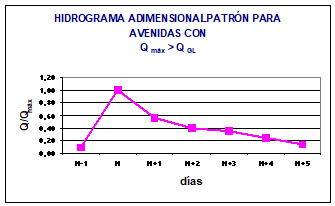

<strong>Figure 23</strong>- <em>Adimensional hydrogram representative of the maximum relative daily rates in flood and defluence for floods with</em> <strong>Qmax</strong> <strong>&gt;Q</strong> <strong>GL</strong>

**6.-** These values can be used as a reference for **maximum relative rates** as a guideline for establishing maximum thresholds in the operating rules of dam drainage bodies in accordance with those observed in the natural system.

(c) <u>References</u>:

Various references are found in the literature consulted. parameters they try to characterize the process of growth and defluence of a flood. Growns and Marsh (2000) and Maingi and Marsh (2001) employ the number of floods and defluences per year (average, median, standard deviation and coefficient of variation) and duration of each flood (mean, median, standard deviation and coefficient of variation) in addition to others parameters concerning daily rates of increase and detriment.

**B.4.3 CHARACTERIZATION OF MINIMUM EXTREME VALUES (droughts)**

Following a procedure similar to that used in the characterization of floods, when analyzing the droughts segregation will be dispensed with in wet, medium and dry years, working with the available series of minima flows annual daily means (Qs). And with a similar reasoning to that set out for the definition of flood usual (Q5%), in the characterization of droughts the concept of <strong>drought usual,</strong> which will be further detailed under subsequent headings, and defined as flow corresponding to 95% surplus percentile in the duration of flows on a natural basis <strong>Q95%</strong>.

The **Figure No24** collects the set of variables used in the characterization of the droughts:

**magnitude and frequency**

**VARIABILITY**

**seasonality**magnitude

**duration**

<strong>droughts "customs" (Q)</strong> <strong>95%)</strong>

**Periods with flow daily Q=0**

**droughts Extremities (Qs)**

<strong>droughts "customs" (Q)95%)</strong>

**droughts extremes**

**droughts "customs"**

**Qs**

<strong>Q95%</strong>

**Figure 24**- Variables used in the characterization of minimum extreme values

**magnitude And frequency**

(a) <u>Environmental significance</u>: The magnitude of the flows has environmental implications at different levels:

- AQUATIC AND RIPARY BIOTA: Influence on the size, tolerance and trophic behavior of the species present (Bunn and Arthington, 2002); alteration in the potentiality of the hyporhoeic medium by decantation of fine if the droughts (Sedimentation Committee, 1992); Youth and Adult Dispersion for Loss of Connectivity (Strange) *et al*., 1999); Mortality of specimens from being trapped in the flood plain (Arthington, 2002); Periods of flows lows represent opportunities for growth and development for many species in areas subject to frequent flooding (Poff *et al*., 1997); Control of ecosystem dynamics, regulating the intrusion of alien species (Strange *et al*. 1999); Affection of determining hydraulic conditions for macroinvertebrates (Gonçalves 2002) and fish (Arthington 2002)
- IN THE LONGITUDIAL, VERTICAL AND TRANSVERSAL CONTINUITY OF THE FLUVIAL CORREDOR: Maintenance of the water sheet in the months of estio and maintenance of the moisture content on the bank, allowing the survival of the riparian band in the months of estio (Richter *et al*., 1998); Segment drying and habitat fragmentation (Strange *et al*., 1999); Maintenance of connectivity with the water table (Richter *et al*. 1998); The draft corresponding to the flows bass is essential to maintain connectivity between wells and vitality in the rapids (Thoms and Sheldon, 2002)
- WATER QUALITY: alteration in dilution capacity (Brizga *et al.,* 2001); alteration in the heat regime of the water in the most extreme months (Brizga *et al.,* 2001)

(b) <u>parameters Proposed</u>: The magnitude and frequency of the droughts is characterised by two parameters:

**P13: MINIMUM MEDIA flows ANNUAL DAYS**

**P14: drought ROOM**

**Figure No25**- Excerpt from a report by IAHRIS with the evaluation of the parameters characterising the magnitude and frequency of the droughts

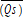

- **P13: MINIMUM SERIES MEDIA flows ANNUAL DAYS**   as a representative value of the magnitude mean droughts Extremes.

In the specialized literature there are several parameters referenced for the characterization of the minimum extreme values: Claussen and Biggs (2000) and Growns and Marsh (2000) use the average of the annual daily minimums, and also refer to the use of the median. *et al.* (2001) and Sugiyama *et al*. (2003), estimate flows minimum representative from the curve of percentiles of leave (80%, 90% and 97%). Growns and Marsh (2000) characterize these events based on the magnitude of events that do not exceed the threshold defined by "a" times the median.

The parameter the proposed proposal is based on the magnitude of the droughts with the average value of the series of flows minimum annual daily averages (Qs series).

- <strong>P14: drought ROOM</strong> o flow corresponding, in the mean curve of flows at 95% leave percentile (<strong>Q</strong> <strong>95%</strong>).

The term of drought In this work, it emerges from the uncertainty that exists in trying to materialize the concept of drought.

With regard to extreme situations with flows We are faced with the challenge of being able to discriminate when we are faced with a situation of drought based on a certain parameter of magnitude.

The average value of the minimum series flows annual daily is a good tool to characterize droughts extremes, but it is necessary to find another parameter which, being representative of flows , does not focus its definition on limiting situations, but is representative of the periods of flows More common bass.

For this reason and just as it was done in characterizing the floods usual, the curve of flows classified is a highly useful instrument, since different thresholds may be discriminated against on the basis of high percentages of leave (80%, 90% or 95%). flow establishing joint criteria for magnitude and presence; that is, flows below these thresholds (Q80%, Q90% or Q95%) shall be presented on average 54, 36 or 18 days per year respectively.

As thresholds in the curve of flows classified for the characterization of droughts, we find various references: Growns and Marsh (2000) work with the threshold defined by "a" times the median (Q 50%), with a = 1⁄2, 1/3, 1/9; various authors (Clausen and Biggs, 2000; Bales and Pope, 2001), select the 90% percentile as the threshold definition for flows bass; Dakova <em>et al</em>. (2000) work with 95% percentile of monthly averages, definitory value of the minimum flow per month in Bulgarian legislation; Maingi and Marsh (2002) set the threshold for 75% leave percentile; King <em>et al</em>. (1999) cite 80 per cent as a threshold that ensures a minimum adult habitat, macroinvertebrate production and maintenance of plant cover.

However, just as it was formulated for floods, it is necessary to alleviate the lack of information inherent in the curve of flows in respect of the temporal distribution of periods with flows This is why it is proposed to determine for the selected percentile which is the **number of consecutive days,** on average, in which the flow take values lower than that corresponding to that percentile and check that this permanence in the channel is more than seven days, value referenced in specialized literature as a minimum period with ecological significance (Bales and Pope, 2001).

By analogy to the 5% chosen for floods, 95% leave percentile has been selected, <strong>Q95%</strong>, as a threshold below which we can conclude that we are facing a <strong>drought usual</strong>, corresponding to this percentile an average presence per year of 18 days (<strong>Figure No26</strong>).

<strong>Figure No26</strong>Discrimination against the defining threshold of droughts <strong>Q95%</strong> from the curve of flows classified

**DETAIL**

**Q 95%**

**RANGO DE droughts HABITUALS**

While the selected variable has only been selected for a parameter of magnitude, being a value linked to a probability of leave (Q95%) implies a close connection with the frequency (percentile of leave = 1- frequency cumulative relative) and therefore the parameter Proposed magnitude also provides information regarding frequency.

(c) References:

**REFERENCE**

**parameter**

**DEFINITION**

**Clausen and Biggs** (2000)

Q90/Q50

Ratio between the value of the flow which is equalled or exceeded 90% of the time and the value corresponding to 50%

/ Q50

Average flows annual minimum daily averages between flow corresponding to 50% percentile

Index of flow base

Volume corresponding to flow base between volume corresponding to total flow

<strong>Brizga</strong> <em>et al.</em> (2001)

% daily leave for 10 and 30 cm.

Percentage of days compared to the total period during which the flow daily means a draught ≥ 10 cm. in critical sections (fast). Analog definition for 30 cm.

Q80 and Q90

flows corresponding to 80 per cent and 90 per cent leave percentages, respectively.

**Growns and Marsh** (2000)

aQ50

No. of events that do not exceed the threshold defined by "a" times the median

10% Q average annual daily**\***

No. of events that do not exceed the threshold defined by 10% of the daily average Q

Average and median series of minima flows annual daily averages

<strong>Richter</strong> <em>et al.,</em> (1995)

and Q3d, Q7d, Q30d and Q90d

Average flows daily minimum annual and corresponding steps of 3, 7, 30 and 90 days.

**Bales and Pope** (2001)

7Q10

Minimum value of seven consecutive days that on average occurs once every ten years.

<strong>Sugiyama</strong> <em>et al</em>., (2003)

Q97 10

flow corresponding to the 97% leave percentage for a 10-year series.

<strong>\*</strong>the Tennant method recognizes 10% of the flow annual daily average as the recommended minimum flow to maintain in the short term the habitat essential for most aquatic biota (King <em>et al</em>., 1999)

with a = 1⁄2, 1/3, 1/9

magnitude of those events that do not exceed the threshold defined by "a" times the median

magnitude of events that do not exceed the threshold defined by 10% of the daily average Q

**Table No 7.-** References concerning the estimate of magnitude of minimum extreme values

**VARIABILITY**

(a) <u>Environmental significance</u>: it is of great importance for biota that the circulating minimum values, like the maximum ones, fluctuate within ranges compatible with their requirements and that these fluctuations are also predictable by the organisms affected, since it is the predictability of certain events, especially of the extreme values, the safeguard that allows the adaptation to them of the life cycles of the species (González del Tánago and García de Jalon, 1995). This variability plays a leading role in the dynamics of the river ecosystem (Brizga). <em>et al.,</em> 2001), so it is found that a loss of it may result in:

- Various attitudes to bentos, favouring some species to the detriment of others (Jowet, 2000)
- Affection of plant dynamics, interference in succession and non-exclusive competition (Poff *et al*., 1997)
- Loss of diversity in the fish fauna (Richter *et al*., 1998)

(b) <u>parameters Proposed</u>:

- **P15: COEFICIENT OF VARIATION OF THE MINIMUM SERIES flows ANNUAL DAYS CV (Qs)**
- <strong>P16: MISCELLANEOUS COEFFICIENT OF THE INSTALMENT OF flows FOR THE UNITED NATIONS drought Habitat, CV (Q</strong> <strong>95%)</strong>

**Figure No27**- Excerpt from a report by IAHRIS with the evaluation of the parameters that characterize the variability of the droughts

# 2 <u>References</u>: Richter <em>et al.</em> (1997) uses the coefficient of variation of the minimum series flows annual daily

**duration**

(a) <u>Environmental significance</u>: environmental disturbances arising from distortions in the duration of the droughts are strongly linked to other aspects such as their magnitude and frequency and many of the comments on the environmental significance of indices of magnitude Lytle and Poff (2004) present an exhaustive list of adaptations in the life cycle, behavior and morphological adaptations of animal and plant species to the extreme events of floods and droughts. This study concludes that the way in which the organisms have adapted to these events is the determining factor of their vulnerability to different alterations in the flow regime, remaining as an open question what is the ease of adaptation in response to these changes.

The following effects are also outlined:

- IN AQUATIC AND RIPARY BIOTA: A condition if the tolerance of macroinvertebrates and fish communities is altered to duration of the drought (Poff *et al*. 1997); Influence on the size, tolerance and trophic behaviour of fish fauna present, observing smaller specimens, and predominance of more generalistic species if periods of low water persist (Bunn and Arthington, 2002); Loss of synchrony with temperature and duration of the day, being able to impact on the reproductive and growth patterns of the species (Poff *et al*. 1997); Loss of river habitat conditions if the duration of dry periods (Martínez de Azagra and Sanz, 2003)
- IN THE NUTRIENT CYCLE: Nitrogen cycle condition, because the duration of the flows low allows the sequence of aerobic-anaerobic conditions necessary to complete this cycle (Pinay *et al*., 2002; A condition to mineralization of many organic compounds, affecting soil fertility (Pinay *et al*., 2002).

These comments concerning the environmental significance of the duration of dry periods can be shaded more intensely when we refer to periods of flow Absence of flow is an aspect of great biological significance within the hydrological regime (Growns and Marsh, 2000), as it determines the most critical living conditions for biocenosis and possible alteration the structure of the ecosystem if its resilience is exceeded.

(b) <u>parameters Proposed</u>:

- <strong>Q 17: MAXIMUM NUMBER OF CONSEQUTIVE DAYS WITH flow MINOR OR IGUAL TO Q95%</strong>
- **P18: MID NUMBER OF DAY TO MONTH WITH flow NUL DIARY**

**Figure No28**- Excerpt from a report by IAHRIS with the evaluation of the parameters characterising the duration of the droughts

**Figure 29**- Excerpt from a report by IAHRIS with the evaluation of the parameters characterising the duration of the periods of cessation of flow

**Figure No30**- Extract from an IAHRIS report with the representative graph of the seasonality of the periods of cessation of flow

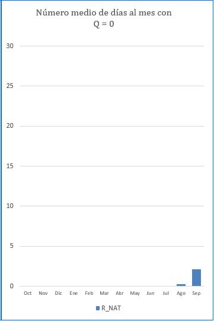

A similar reasoning may be put forward with regard to the characterization of duration of the floods:

***How long does one last? droughtWhen does it start, when does it end?***

***And above all, how to homogenize these criteria taking into account the inherent variability in magnitude and duration Of these phenomena?***

The most common procedure for characterising duration of dry periods is to determine the number of days or periods of consecutive days in which a certain threshold is not exceeded (Richter *et al*., 1997; Growns and Marsh, 2000; Brizga *et al*., 2001; Baeza *et al*., 2003), defining the threshold by means of hydraulic variables as a minimum draught, or from a flow defined by "a" times the median, or from the curve of flows Other authors are based on mobile media processes (Richter *et al.,* 1997; Palau 1998; Growns and Marsh, 2000; Bales and Pope, 2001).

In this work it is proposed to estimate for each year of the series which is the maximum number of consecutive days in which the threshold of Q is not equalized or exceeded 95%. The parameter the end is calculated as the average for the series of n years. In short, it is to characterize the average value of the maximum number of consecutive dry days per year, understanding by dry day the one whose flow is less than Q 95%This one. parameter Thus calculated, it allows to estimate the maximum continuous permanence in the channel of flows less than that of a dry day. It is obvious that in the case of droughts long-term but with an intermediate recovery phase (days with flow daily media&gt; Q 95%), the index proposed would fragment the duration total dry period, the maximum partial period being estimated only duration.

- **P18: MID NUMBER OF DAY TO MONTH WITH flow NUL DIARY**

The study of the periods of flow nil, given its environmental significance, appears well referenced in specialized literature (Richter *et al*., 1997; Growns and Marsh, 2000) estimating the total number of days with flow nil in the series, or the annual average, or the percentage of months with one day of flow No, no, no, no, no, no, no, no, no, no, no, no, no, no, no, no parameter proposed here is obtained as the average value of the number of days per month presenting a flow Daily equals zero.

(c) <u>References</u>:

<table><tr><td>
<strong>REFERENCE</strong>
</td><td>
<strong>parameter</strong>
</td><td>
<strong>DEFINITION</strong>
</td></tr><tr><td rowspan="3">
<strong>Brizga <em>et al.</em></strong> (2001)
</td><td>
No. of dry periods 
</td><td>
No. of periods of consecutive days in which a 10 cm draught was not exceeded and with duration 1, 3, 6 and 9 months or more.
</td></tr><tr><td>
duration &lt; 1ML/day 
</td><td>
Percentage of days compared to the total period during which the flow daily average is less than 1 ML/day
</td></tr><tr><td>
Number of periods &lt; threshold 
</td><td>
No. of consecutive days with flow daily average &lt; threshold and with duration 1, 3, 6 and 9 months or more.
</td></tr><tr><td rowspan="2">
<strong>Baeza <em>et al</em>. </strong>(2003)
</td><td>
NQ10%
</td><td>
Number of days not reached flow at least 10 per cent of the total flow modular
</td></tr><tr><td>
Q7d, Q25d and Q100d
</td><td>
Average value of the minimums of each year of the series of moving averages with steps of 7, 25 and 100 days
</td></tr><tr><td rowspan="3">
<strong>Growns and Marsh </strong>(2000)
</td><td>
a*Q50

with a = 1⁄2, 1/3, 1/9 
</td><td>
duration of events that do not exceed the threshold defined by "a" times the median
</td></tr><tr><td>
10% Q average daily
</td><td>
duration of events that do not exceed the threshold defined by 10% of the annual average Q
</td></tr><tr><td>
Q30d and Q90d 
</td><td>
Median and average annual minimums for 30- and 90-day moving averages
</td></tr><tr><td>
<strong>Bales and Pope </strong>(2001)
</td><td>
Q7d and Q30d
</td><td>
Average annual minimums for moving averages of 7 and 30 days
</td></tr><tr><td>
<strong>Richter <em>et al.</em> </strong>(1997)
</td><td>
Q75 %
</td><td>
Not medium and duration mean flows that do not exceed 75% percentile in the flows classified
</td></tr></table>

**Table No 8.-** References concerning the estimate of duration of minimum extreme values

<table><tr><td>
<strong>REFERENCE</strong>
</td><td>
<strong>parameter</strong>
</td><td>
<strong>DEFINITION</strong>
</td></tr><tr><td rowspan="3">
<strong>Growns and Marsh </strong>(2000)
</td><td rowspan="3">
Days with Q = 0

 
</td><td>
Total number of days with Q = 0 in series records
</td></tr><tr><td>
Average number of days per year with Q = 0
</td></tr><tr><td>
Percentage of months that have one day with Q = 0
</td></tr><tr><td rowspan="2">
<strong>Richter </strong><em>et al</em> (1997)
</td><td>
Days with Q = 0
</td><td>
Total number of days with Q = 0 in series records
</td></tr><tr><td>
flow base
</td><td>
Ratio between the flow at least 7 consecutive days and the flow annual average.
</td></tr></table>

**Table No 9.-** References concerning the estimate of duration of periods of flow null

**seasonality**

(a) <u>Environmental significance</u>: the seasonality of the droughts The reason for this is the loss of synchrony with the life cycles of the affected species, as well as multiple self-accumulative effects on other environmental variables. The following references are given as an example of conditions on aquatic biota and riparia:

- Physiological stress in many species if dry periods are prolonged (Poff *et a*l., 1997)
- An increase in the number of flows circulating in summer can alter the vegetal dynamics, favoring the more generalistic species (Strange *et al.,* 1999)
- Different condition, depending on its sensitivity to changes according to different aspects: period of freza, period of larval development, floating eggs, reduction of habitat, etc. (Strange *et al.,* 1999; Poff et al., 1997)
- Loss of synchrony with temperature and duration of the day, which may affect the reproduction and growth of species (Poff *et al.,* 1997)
- Loss of synchrony in the response of the organisms to the recession of flows according to guidelines that allow the use of nutrients, seed development, support of the bentos and migration of juveniles to more favorable habitats (Arthington 2002)
- Loss of synchrony with the phenology of many animal species, affecting reproductive patterns, migration, frenzy, incubation, larvae survival, growth and development (Naiman *et al.,* 2000)
- The loss of seasonality favours exotic species, resulting in a loss of biodiversity (Bunn and Arthington, 2002).
- alteration in the state of diapause synchronized with dry periods (Lytle and Poff, 2004)

# 3 <u>parameter Proposed</u><strong>P19: MIDDLE NUMBER OF DAY TO MONTH WITH flow INFERROR TO Q</strong> <strong>95%</strong> 

**Figure No31**- Excerpt from a report by IAHRIS with the evaluation of the parameters characterising the seasonality of the droughts

The seasonality o temporality of the droughts is characterized in the sources consulted with various approaches: Richter *et al.* (1997) uses as parameter the day of the year in which the annual minimum is presented and Growns and Marsh (2003) determine the season of the year that hosts the highest number of flows less than one third of the median.

The parameter proposed in this work characterises the seasonality evaluating the presence or absence of <strong>dry days</strong> in a given month, i.e. those days with flow daily average less than that defined by drought usual in natural conditions (Q 95%).

The count is made for each month and year of the series, obtaining at the end twelve values representative of the average number of days per month that present a flow daily average less than Q 95%.

**C                            indices DE hydrological alteration: GENERAL ASPECTS**

<strong>C.1</strong>  <strong><u>indices PARTICULAR_</u></strong>

Having noted in the previous headings the vertebral role played by the natural flow regime in the functioning of the river ecosystem, it is essential to know to what extent the currently circulating regime, other than the natural one (**altered regimen**) differs or is similar to natural, as these analogies and differences will reverse the integrity of the river ecosystem. This altered regime may be the current circulating regime as a real result of a exploitation and/or regulation, or any other proposed regime resulting from a simulation as a response to different management scenarios including ecological or environmental regimes.

In order to evaluate this alteration proposed a set of indices numeric, known as **indices of hydrological alteration (AHIA)** which, by addressing the above aspects, assess the distortion caused by flows in relation to the natural situation:

- If the series available in natural and altered meet the condition of coetaneity with at least 15 common years, the evaluation of the alteration shall be carried out according to the indices collected in the **Table No 11**. Detailed explanation of these indices is collected in the **Heading D.**
- In the case of an analysis of alteration in a non-coetaneity situation at least 15 years of age, indices for usual values the above, proposing those listed in the **Table 12**. The detailed explanation of these can be found in the **Heading E.**
- The application allows the analysis of series less than 15 years, provided that at least seven full years of records are available. In this situation (availability between 7 and 14 years in either of the two regimes), the type of study is referred to with SERIE REDUCIDA and will be detailed in Annex 1 of this document.

<table><tr><td colspan="5">
<strong><em>Table No 11:</em></strong><em> RELATIONSHIP OF indices DE alteration FOR COETAN SCHEMES with at least 15 years of data. indices of floods and droughts can only be calculated if the user has provided data on a daily basis</em>
</td></tr><tr><td colspan="2">
ASPECT
</td><td>
CODIGO
</td><td>
NAME
</td><td>
parameter from which it comes
</td></tr><tr><td rowspan="6">
usual values
</td><td rowspan="2">
<strong>magnitude</strong>
</td><td>
IAH 1
</td><td>
magnitude of annual contributions
</td><td rowspan="2">
<strong>P1</strong>
</td></tr><tr><td>
IAH 2
</td><td>
magnitude of monthly contributions 
</td></tr><tr><td rowspan="2">
<strong>VARIABILITY</strong>
</td><td>
IAH 3
</td><td>
Usual variability
</td><td>
<strong>P4</strong>
</td></tr><tr><td>
IAH 4
</td><td>
 Extreme variability
</td><td>
<strong>P2</strong>
</td></tr><tr><td rowspan="2">
<strong>seasonality</strong>
</td><td>
IAH 5
</td><td>
seasonality of maximum
</td><td rowspan="2">
<strong>P3</strong>
</td></tr><tr><td>
IAH 6
</td><td>
seasonality of minima
</td></tr><tr><td rowspan="7">
floods
</td><td rowspan="4">
<strong>magnitude And frequency</strong>
</td><td>
IAH 7
</td><td>
magnitude of the floods maximum
</td><td>
<strong>P5</strong>
</td></tr><tr><td>
IAH 8
</td><td>
magnitude of the flow Milk Generator
</td><td>
<strong>P6</strong>
</td></tr><tr><td>
IAH 9
</td><td>
magnitude of the flow connectivity
</td><td>
<strong>P7</strong>
</td></tr><tr><td>
IAH 10
</td><td>
magnitude of the floods usual
</td><td>
<strong>P8</strong>
</td></tr><tr><td rowspan="2">
<strong>VARIABILITY</strong>
</td><td>
IAH 11
</td><td>
Variability of floods maximum
</td><td>
<strong>P9</strong>
</td></tr><tr><td>
IAH 12
</td><td>
Variability of floods usual
</td><td>
<strong>P10</strong>
</td></tr><tr><td>
<strong>DURATION</strong>
</td><td>
IAH 13
</td><td>
duration of floods
</td><td>
<strong>P11</strong>
</td></tr><tr><td></td><td>
<strong>seasonality</strong>
</td><td>
IAH 14
</td><td>
seasonality of floods 

(12 values, one for each month)
</td><td>
<strong>P12</strong>
</td></tr><tr><td rowspan="7">
droughts
</td><td rowspan="2">
<strong>magnitude And frequency</strong>
</td><td>
IAH 15
</td><td>
magnitude of the droughts extremes
</td><td>
<strong>P13</strong>
</td></tr><tr><td>
IAH 16
</td><td>
magnitude of the droughts usual
</td><td>
<strong>P14</strong>
</td></tr><tr><td rowspan="2">
<strong>VARIABILITY</strong>
</td><td>
IAH 17
</td><td>
Variability of droughts extremes
</td><td>
<strong>P15</strong>
</td></tr><tr><td>
IAH 18
</td><td>
Variability of droughts usual
</td><td>
<strong>P16</strong>
</td></tr><tr><td rowspan="2">
<strong>DURATION</strong>
</td><td>
IAH 19
</td><td>
duration of droughts
</td><td>
<strong>P17</strong>
</td></tr><tr><td>
IAH 20
</td><td>
Number of days with flow null 

(12 values, one for each month)
</td><td>
<strong>P18</strong>
</td></tr><tr><td>
<strong>seasonality</strong>
</td><td>
IAH 21
</td><td>
seasonality of droughts 

(12 values, one for each month)
</td><td>
<strong>P19</strong>
</td></tr><tr><td></td><td></td><td></td><td></td><td></td></tr><tr><td></td><td>
<strong>21 indices</strong>
</td><td></td><td colspan="2">
index broken down by year type, as a summary the weighted value is given
</td></tr><tr><td></td><td></td><td></td><td colspan="2">
index specified at monthly level, as a summary the annual average is offered
</td></tr></table>

<table><tr><td colspan="5">
<strong><em>Table 12</em></strong><em>: RELATIONSHIP OF indices DE alteration FOR NON-COETAN REGIONS with at least 15 years of data. indices of floods and droughts can only be calculated if the user has provided data on a daily basis</em>
</td></tr><tr><td colspan="2">
ASPECT
</td><td>
CODIGO
</td><td>
NAME
</td><td>
parameter from which it comes
</td></tr><tr><td rowspan="10">
usual values
</td><td rowspan="3">
<strong>magnitude</strong>
</td><td>
<strong>M1</strong>
</td><td>
magnitude of annual contributions
</td><td rowspan="4">
<strong>P1</strong>
</td></tr><tr><td>
<strong>M2</strong>
</td><td>
magnitude of monthly contributions 
</td></tr><tr><td>
<strong>M3</strong>
</td><td>
magnitude of each month's contributions: 12 values
</td></tr><tr><td rowspan="4">
<strong>VARIABILITY</strong>
</td><td>
<strong>V1</strong>
</td><td>
Variability of annual contributions
</td></tr><tr><td>
<strong>V2</strong>
</td><td>
 Variability of monthly contributions 
</td><td rowspan="3">
<strong>P2</strong>
</td></tr><tr><td>
<strong>V3</strong>
</td><td>
Variability of monthly contributions: 12 values
</td></tr><tr><td>
<strong>V4</strong>
</td><td>
Extreme variability
</td></tr><tr><td></td><td>
<strong>IAH 3</strong>
</td><td>
Usual variability
</td><td>
<strong>P4</strong>
</td></tr><tr><td rowspan="2">
<strong>seasonality</strong>
</td><td>
<strong>E1</strong>
</td><td>
seasonality of maximum
</td><td rowspan="2">
<strong>P3</strong>
</td></tr><tr><td>
<strong>E2</strong>
</td><td>
seasonality of minima
</td></tr><tr><td rowspan="7">
floods
</td><td rowspan="4">
<strong>magnitude And frequency</strong>
</td><td>
<strong>IAH 7</strong>
</td><td>
magnitude of the floods maximum
</td><td>
<strong>P5</strong>
</td></tr><tr><td>
<strong>IAH 8</strong>
</td><td>
magnitude of the flow Milk Generator
</td><td>
<strong>P6</strong>
</td></tr><tr><td>
<strong>IAH 9</strong>
</td><td>
magnitude of the flow connectivity
</td><td>
<strong>P7</strong>
</td></tr><tr><td>
<strong>IAH 10</strong>
</td><td>
magnitude of the floods usual
</td><td>
<strong>P8</strong>
</td></tr><tr><td rowspan="2">
<strong>VARIABILITY</strong>
</td><td>
<strong>IAH 11</strong>
</td><td>
Variability of floods maximum
</td><td>
<strong>P9</strong>
</td></tr><tr><td>
<strong>IAH 12</strong>
</td><td>
Variability of floods usual
</td><td>
<strong>P10</strong>
</td></tr><tr><td>
<strong>DURATION</strong>
</td><td>
<strong>IAH 13</strong>
</td><td>
duration of floods
</td><td>
<strong>P11</strong>
</td></tr><tr><td></td><td>
<strong>seasonality</strong>
</td><td>
<strong>IAH 14</strong>
</td><td>
seasonality of floods (12 values, one for each month)
</td><td>
<strong>P12</strong>
</td></tr><tr><td rowspan="6">
droughts
</td><td rowspan="2">
<strong>magnitude And frequency</strong>
</td><td>
<strong>IAH 15</strong>
</td><td>
magnitude of the droughts extremes
</td><td>
<strong>P13</strong>
</td></tr><tr><td>
<strong>IAH 16</strong>
</td><td>
magnitude of the droughts usual
</td><td>
<strong>P14</strong>
</td></tr><tr><td rowspan="2">
<strong>VARIABILITY</strong>
</td><td>
<strong>IAH 17</strong>
</td><td>
Variability of droughts extremes
</td><td>
<strong>P15</strong>
</td></tr><tr><td>
<strong>IAH 18</strong>
</td><td>
Variability of droughts usual
</td><td>
<strong>P16</strong>
</td></tr><tr><td rowspan="2">
<strong>DURATION</strong>
</td><td>
<strong>IAH 19</strong>
</td><td>
duration of droughts
</td><td>
<strong>P17</strong>
</td></tr><tr><td>
<strong>IAH 20</strong>
</td><td>
Number of days with flow zero (12 values, one for each month)
</td><td>
<strong>P18</strong>
</td></tr><tr><td></td><td>
<strong>seasonality</strong>
</td><td>
<strong>IAH 21</strong>
</td><td>
seasonality of droughts (12 values, one for each month)
</td><td>
<strong>P19</strong>
</td></tr><tr><td></td><td></td><td></td><td></td><td></td></tr><tr><td></td><td>
<strong>25 indices</strong>
</td><td></td><td colspan="2">
indices similar to those already defined for coetaneous series 
</td></tr><tr><td></td><td></td><td></td><td colspan="2">
index specified at monthly level, as a summary the annual average is offered
</td></tr></table>

**GENERAL EXPRESSION**

Conceptually the indices of alteration can be defined as a quotient between the value of the parameter characterization in altered regime and its value parameter on a natural basis:

This expression must be reflected in a strictly theoretical and conceptual sense. parameters" is modulated or nuanced according to the characteristics and peculiarities of parameter used.

In the <strong>Table 10</strong>All four of them. indices concerning seasonality <strong>(IAH 5, IAH 6, IAH 14,</strong> e <strong>IAH 21</strong>) escape this general expression and their particularities will be analyzed in more detail later.

When you work with parameters discrimination according to the type of year (e.g. usual values), the indices corresponding (<strong>AH 1 – IAH 6</strong>) are calculated in an initial stage independently for each type of year. index wet year, index average year e index dry year the final value of the index as a weighted average according to the percentage of presence of each type of year in the series:

.

**CALCULATION OF THE FINAL VALUE OF indices WHICH DISCRIMINATE THE "YEAR-YEAR-YEAR-YEAR"**

<strong>index = 0,25 \* index</strong> <strong>wet year</strong> <strong>+ 0,5\* index</strong> <strong>average year</strong> <strong>+ 0,25\* index</strong> <strong>dry year</strong>

Since discrimination in types of years (see heading B.2) presupposes that:

- A wet year occurs on average 25% of the time
- Half a year shows up 50% of the time
- A dry year occurs 25% of the time

**RANGO AND INTERPRETATION**

All indices proposed are bounded below 0, not being defined a priori its upper limit.

**0< CONTENTS < upper limit (usually = 1)**

With the aim of always working with indices between 0 and 1, in those situations where **IAH >1**the value obtained is replaced by its inverse value. alteration of one regime in respect of another, and however the compensations that would occur in the calculation of the alteration global when working with index older and younger than 1. In such cases the application reports with a \* of this circumstance.

The presence of indeterminations in the calculation of the indices, motivated by values equal to zero in the denominator.

**Interpretation:**

- A value of **IAH = 0** is indicative of **alteration maximum**
- A value of **IAH = 1** is indicative of **Absence of alteration**

<strong>C.2.</strong>  <strong><u>indices DE alteration GLOBAL</u></strong>

Once they have been calculated, the indices **AH 1** a **AH 21**, it is necessary to obtain an overall quantification that brings together the results of the indices concerning each component of the flow regime (usual values, floods and droughts)

This is how the index of alteration Global (**IAG**) as index integrator of those indices parties evaluating the alteration on the different aspects of a component of flow regime.

There will therefore be three indices global:

<strong>IAGH:</strong>	index of alteration Global on usual values, obtained from indices of alteration <strong>AH 1</strong> a <strong>IAH 6</strong>

<strong>IAGA:</strong>	index of alteration Global on floods, obtained from indices of alteration <strong>IAH 7</strong> a <strong>IAH 14</strong>

<strong>IAGS:</strong>	index of alteration Global on droughts, obtained from indices of alteration <strong>IAH 15</strong> a <strong>AH 21</strong>

**natural flow regime**

**Environmentally significant aspects**\*

M

**E**

**V**

**indices of alteration**

**index of alteration Global**

**floods**

<strong>IAG</strong> <strong>A</strong>

**droughts**

<strong>IAG</strong> <strong>S</strong>

**usual values**

<strong>IAG</strong> <strong>H</strong>

**usual values**

**floods**

**natural flow regime**

**droughts**

**Critical components in the regulation of environmental processes**

E

D

V

\*

IAH20

IAH21

IAH19

IAH17

IAH18

IAH15

IAH16

IAH14

IAH13

IAH11

IAH12

IAH7

IAH8

IAH9

IAH10

IAH5

IAH6

IAH3

IAH4

IAH1

IAH2

**Overall quantification of the alteration on natural flow regime**

\*Aspects of flow regime with ecological significance:  **M** = magnitude, **V** = variability,

**D** = duration, **E** = seasonality

**Figure No32**- Outline of the assessment process hydrological alteration

It is obvious that the calculation of the <strong>IAG</strong> for a determining component requires the prior calculation of the indices of alteration For example, suppose that the modified estimate of the indices <strong>AHj- AHk- AHl</strong> <strong>- AHm- AHn- AHp</strong> <strong>- AHq</strong> throws the values <strong>aj-- ak- al</strong> <strong>- am- an- ap</strong> <strong>- aq</strong> as shown in the table on the <strong>Fig. no33</strong>. It can be observed in this Figure that the value assigned to any index in the natural system is 1, as this figure is indicative of the absence of alteration.

The graphical representation of these two sets of values in a plane with as many axes as indices, would result in two polygonal enclosures, where the blue line corresponds to the values obtained for natural regime (1 for all of them) and the red line to those obtained in altered regime (<strong>aj</strong> <strong>- ak- al</strong> <strong>- am- an- ap</strong> <strong>- aq</strong> respectively).

**CONTENTS**

**Rég. Nat**

**Reg. Alt**

<strong>j</strong>

**1**

<strong>a</strong> <strong>j</strong>

<strong>k</strong>

<strong>a</strong> <strong>k</strong>

<strong>l</strong>

<strong>a</strong> <strong>l</strong>

<strong>m</strong>

<strong>a</strong> <strong>m</strong>

<strong>n</strong>

<strong>a</strong> <strong>n</strong>

<strong>p</strong>

<strong>a</strong> <strong>p</strong>

<strong>q</strong>

<strong>a</strong> <strong>q</strong>

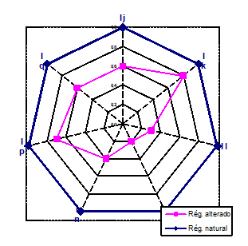

**Figure No 33**- Calculation of the index of alteration Global (IAG) from indices partial (AHI)

Given a certain sequence of the indices of alteration (e.g. the sequence  <strong>AHj-- AHk- AHl</strong> <strong>- AHm- AHn- AHp</strong> <strong>- AHq</strong> ), the <strong>IAG</strong> corresponding is calculated as the quotient between the area defined by the polygon of the altered regime and that corresponding to the polygon of the natural regime, which can easily be obtained by the expression:

**Ec.1**

.

where:

**S Alt**: surface defined by the polygon in altered regime

**S Nat**: area defined by the natural polygon

<strong>a</strong> <strong>i:</strong> value of index <strong>IAH</strong> <strong>i</strong> in altered regime

<strong>a</strong> <strong>i+ 1:</strong> value of index <strong>IAH</strong> <strong>i+1</strong> in altered regime

**n =**	No of indices of alteration that evaluate an aspect of the flow regime

The IAG thus defined depends on the relative management of the indices i.

In order to avoid this dependence, the index of alteration Global (<strong>IAG</strong>) as the average value of indices the different possibilities for the relative management of <strong>n</strong> indices It will be hereinafter referred to as partial. <strong>iag</strong> as at index of alteration for a specific position of the indices of alteration i.

If we assume <strong>n</strong> indices <strong>AHi</strong>, will exist <strong>No, no, no, no, no, no, no, no, no, no, no, no, no, no, no, no</strong> indices <strong>iag</strong> for the United States of America and the United States of America <strong>No, no, no, no, no, no, no, no, no, no, no, no, no, no, no, no</strong> ordination possibilities.

**Ec. 2**

.

where:

**IAG** = average of the n! values of iag

<strong>ai</strong> <strong>j</strong> = value of index occupying the i-th axis in the j-th position of the axes

calling <strong>a</strong> <strong>i</strong> <strong>j</strong> <strong>= b</strong> <strong>p</strong> and <strong>a</strong> <strong>i+1</strong> <strong>j</strong> <strong>= b</strong> <strong>k</strong>

each product <strong>bp</strong> <strong>\* bk</strong>  a total of   <strong>2 n (n-2)!</strong>  times

– there are a total of possible couples <strong>b</strong> <strong>p</strong> <strong>\* b</strong> <strong>k</strong> –

<em><strong><u>Explanatory note</u></strong>: assuming bp</em> <em>on 1st axis and bk</em> <em>On the 2nd axle, the remaining (n-2) axles may be ordered from (n-2) different shapes.k</em> <em>on 1st axis and bp</em> <em>on the 2nd axis, there will appear other (n-2)! possible ordinations of the remaining axes. Finally, the pair b</em> <em>p\* b</em> <em>k</em> <em>rotate from axis 1o to axis n, thus occupying n different positions.</em>

therefore, in the numerator of the <strong>Ec 2,</strong> each possible factor <strong>a</strong> <strong>i</strong> <strong>j</strong> <strong>\* a</strong> <strong>i+1</strong> <strong>j</strong>   A total of 2(n-2)!n times will appear :

**Ec. 3**

obtaining the final expression of **IAG** such as:

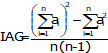

**Ec. 4**

.

where:

<strong>a</strong> <strong>i</strong> <strong>:</strong> value that takes the <strong>index IAH</strong> <strong>i</strong> Under Altered Regime

**n =** No of indices of alteration that evaluate an aspect of the flow regime

Particularizing for the three indices of alteration Proposed global:

index of alteration Global usual values <strong>IAG</strong> <strong>H</strong>, obtained on the basis of indices of alteration <strong>IAH 1 to AH 6</strong>

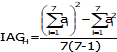

index of alteration Global floods <strong>IAG</strong> <strong>A</strong>, obtained on the basis of indices of alteration <strong>IAH 7 to IAH 14</strong>

index of alteration Global droughts <strong>IAG</strong> <strong>S</strong>, obtained on the basis of indices of alteration <strong>IAH 15 to IAH 21</strong>

**0 IAG 1**

The index of alteration Global, thus defined is limited (as are the indices partial <strong>AHi</strong>) between 0 and 1:

It is verified that expressing IAG as a relationship between surfaces motivates that this index global does not vary linearly with the indices if all of the indices of alteration They would have the same value, K, the IAG would be worth K2. As K≤1, the IAG&lt;K except for extreme cases of K=1 or K=0. <strong>Figure No34</strong> The change in the IAG value from the K range of variation is observed.

**Figure No 34**- Change in index of alteration Global (IAG) with respect to the average K value of indices partial

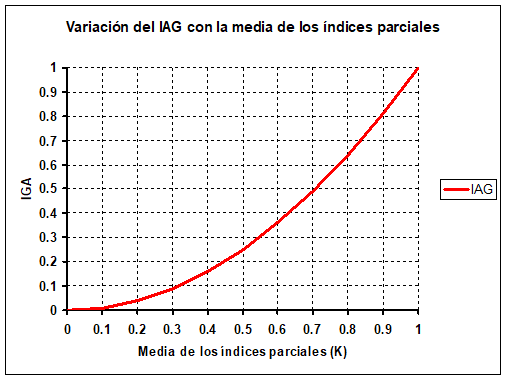

The quadratic relationship between K and IAG, AG=K2 0K1, implies that, although IAG also varies between 0 and 1 it will hardly take high values – for example, for K=0.70 IAG=0.5 – and in relative terms the decrease in the value of IAG compared to K is greater the lower K, as can be seen when expressing the IAG as a percentage of the corresponding value of K (<strong>Table 14</strong>).

<table><tr><td>
<strong>K</strong>
</td><td>
<strong>IAG</strong>
</td><td>
<strong>% IAG compared to K</strong>
</td></tr><tr><td>
<strong>0.1</strong>
</td><td>
<strong>0.01</strong>
</td><td>
<strong>10</strong>
</td></tr><tr><td>
<strong>0.2</strong>
</td><td>
<strong>0.04</strong>
</td><td>
<strong>20</strong>
</td></tr><tr><td>
<strong>0.3</strong>
</td><td>
<strong>0.09</strong>
</td><td>
<strong>30</strong>
</td></tr><tr><td>
<strong>0.4</strong>
</td><td>
<strong>0.16</strong>
</td><td>
<strong>40</strong>
</td></tr><tr><td>
<strong>0.5</strong>
</td><td>
<strong>0.25</strong>
</td><td>
<strong>50</strong>
</td></tr><tr><td>
<strong>0.6</strong>
</td><td>
<strong>0.36</strong>
</td><td>
<strong>60</strong>
</td></tr><tr><td>
<strong>0.7</strong>
</td><td>
<strong>0.49</strong>
</td><td>
<strong>70</strong>
</td></tr><tr><td>
<strong>0.8</strong>
</td><td>
<strong>0.64</strong>
</td><td>
<strong>80</strong>
</td></tr><tr><td>
<strong>0.9</strong>
</td><td>
<strong>0.81</strong>
</td><td>
<strong>90</strong>
</td></tr></table>

**Table 14**- Percentage of index of alteration Global (IAG) with respect to the average K value of indices partial

<strong>C.3.</strong>  <strong><u>DEFINITION OF THE HYDROLOGICAL STATUS</u></strong>

With the aim of offering not only a quantitative but also a qualitative assessment of the degree of alteration, five levels or states of hydrological alteration, known as <strong>hydrological status,</strong> defined in accordance with the recommendations regarding levels and colour allocation (<strong>Figure No35</strong>) collected in CIS-WFD, 2003 (<em>EU Common Implementation Strategy (CIS) for the Water Framework Directive</em>) under heading 2.6 for the classification of the so-called <em>ecological status</em> from the Ecological Quality Ratios (<strong>EQR</strong>).

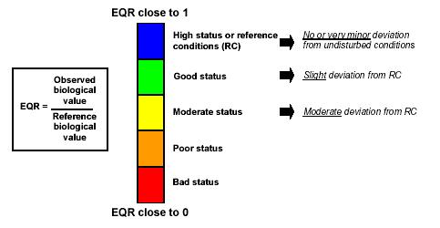

<strong>Figure No 35</strong> - Basic principles for classification of ecological status based on the so-called EQR Ecological Quality Ratios (source: CIS-WDF, 2003)<em>)</em>

It is worth noting two strong analogies between the **EQR** and the indices of alteration proposed in this work:

- in both cases, the assessment of the alteration is performed by comparing the value taken by a given parameter in the altered situation and that corresponding to the natural or reference state.
- The range of variation is between 0 and 1, corresponding to 1 the optimal situation (minimum alteration) and at 0 the most degraded or maximum alteration.

Adopting an equitable distribution of the five classes proposed between 0 and 1, the **Table No 15** summarizes the criteria for representation and allocation of the different **status** o **hydrological levels** deducted from the indices partial:

<em><strong>HYDROLOGICAL STATUS</strong></em><strong>: PARTICULAR INDEX (AH)</strong>

**LEVEL I**

**LEVEL II**

**LEVEL III**

**LEVEL IV**

**LEVEL V**

**0.8< AH 1**

**0.6<AH 0.8**

**0.4<AH 0.6**

**0.2<AH 0.4**

**0≤AH 0.2**

**Table No 15**- Code of colours and corresponding values of the indices of alteration partial (IAH) for the different hydrological status

With regard to the indices of alteration global, recalling the quadratic relationship between <strong>AH</strong> e <strong>IAG</strong> - IAG = f (<strong>2</strong>) (<strong>Figure No34</strong>)– the following criteria for representation and allocation of status would be obtained (<strong>Table 16</strong>):

<em><strong>HYDROLOGICAL STATUS</strong></em><strong>: GLOBAL INDEX (IAG)</strong>

**LEVEL I**

**LEVEL II**

**LEVEL III**

**LEVEL IV**

**LEVEL V**

**0.64< AG1**

**0.36<AG0.64**

**0.16<AG0.36**

**0.04<AG0.16**

**0≤AG0.04**

**Table 16**- Code of colours and corresponding values of the indices of alteration Global (IAG) for different hydrological status

**D                             indices DE hydrological alteration DEFINITIONS**

Each index shall be developed according to the following scheme:

<strong>IAH</strong> <strong>j: NAME OF THE index</strong>

**Objective:**  	describes what is intended to be assessed with the index

**Expression:** 	includes the equation that allows to calculate the index

**Comment:**  	In some cases, a brief text is included which clarifies or expands some aspects of interest.

ACLARATORY NOTE: everything in this heading refers to studies with data availability of at least 15 years in both regimens. For series between 7 and 14 years the reader is referred to Annex 1.

<strong>D.1</strong> <strong><u>indices DE alteration DE usual values IN COETAN SCHEMES</u></strong>

If the series available in natural and altered meet the condition of coetaneity (and at least 15 common years), the evaluation of the hydrological alteration shall be carried out by means of the indices which are presented below.

The indices proposed for the estimate of alteration in the different aspects with environmental significance (magnitude, variability and seasonality) of the usual values (daily, annual and monthly) flow regime are collected in the **Table No17**:

<table><tr><td>
<strong>ASPECT</strong>
</td><td>
<strong>index</strong>
</td><td>
<strong>NAME</strong>
</td></tr><tr><td colspan="3">
<strong>usual values</strong>
</td></tr><tr><td rowspan="2">
<strong>magnitude</strong>
</td><td>
<strong>AH1</strong>
</td><td>
Ind. of magnitude of annual contributions
</td></tr><tr><td>
<strong>IAH 2</strong>
</td><td>
Ind. of magnitude of monthly contributions
</td></tr><tr><td rowspan="2">
<strong>variability</strong>
</td><td>
<strong>♪ ♪ Ah ♪ 3 ♪</strong>
</td><td>
Ind. of Usual Variability 
</td></tr><tr><td>
<strong>♪ ♪ AH ♪ 4 ♪</strong>
</td><td>
Extreme Variability Index
</td></tr><tr><td rowspan="2">
<strong>seasonality</strong>
</td><td>
<strong>IAH 5</strong>
</td><td>
Ind. of seasonality of maximum
</td></tr><tr><td>
<strong>IAH 6</strong>
</td><td>
Ind. of seasonality of minima
</td></tr></table>

**Table No17**- indices for the estimate of alteration of the usual values of the flow regime

**WHERE TO CONSULT THESE RESULTS IN A STUDY WITH IAHRIS?**

Report No 7x

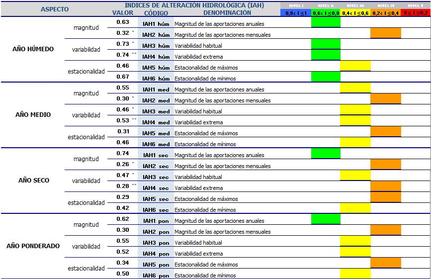

**Figure No36**- Excerpt from a report by IAHRIS with the indices of usual values in contemporary regimens (table indices partials by year type; spider charts and table indices global)

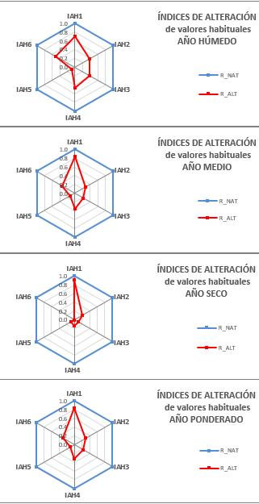

**IAH 1: index DE magnitude ANNUAL CONTRIBUTIONS**

**Objective:** assess the distortion caused by the circulating regime on the magnitude of annual contributions in respect of their value on a natural basis

**Expression:**

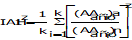

<em>for</em> <em><strong>z</strong>= wet, medium and dry on a natural basis</em>

where:

**k** = No of years belonging to the type z in natural regime. The typology of the year (wet, medium and dry) is determined by the natural regime.

**(AA) a** = Annual contribution in altered regime

**(AA) n** = Annual contribution on a natural basis

Three will therefore be obtained indices of magnitude <strong>IAH 1</strong> <strong>hum</strong>, <strong>IAH 1med</strong> and <strong>IAH</strong> <strong>sec</strong> for wet, medium and dry years respectively

The weighted value of the index **IAH 1** will be obtained by weighting these three indices per cent presence of each type of year in the overall series (25% for wet and dry and 50% for average years.

<strong>IAH 1 weighted = 0.25\* IAH 1hum</strong> <strong>+ 0,5\* IAH 1med</strong> <strong>+ 0,25\* IAH 1sec</strong>

**Comment:** As can be seen the comparison between one scheme and another is evaluated year by year and then the average value of these observed annual changes is calculated, thus avoiding the year-on-year compensation that would occur when calculating the alteration as a quotient of the average annual contributions in both schemes.

**IAH 2: index DE magnitude MESSUAL CONTRIBUTIONS**

**Objective:**  With the aim of avoiding the compensation that can occur between the different months of the year when working with annual values, it is proposed that index that mitigates the above by giving the same weight to the alteration every month.

**Expression:** The evaluation of the alteration will be carried out therefore month by month, obtaining a index per month and type (wet, medium and dry) according to the expression:

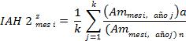

*for z=wet, medium and dry in natural state*

where:

**K =** not of months belonging to the type z in natural regime. The typology of the month (wet, medium and dry) is determined by the natural regime.

**(Am month i, year j) a** = Monthly contribution for month i of year j in altered regime

**(Am month i, year j) n** = Monthly contribution for the month i of the calendar year j

Note: if in any case the quotient (Am mesi, year j) to / (Am mesi, year j) n is >1, the reverse value is stored and indicated in the report with a \*

In this way, you get a index for each month and type: <strong>IAH 2 month</strong> <strong>hum, IAH 2 mesi</strong> <strong>med, IAH 2 mesi</strong> <strong>sec</strong>

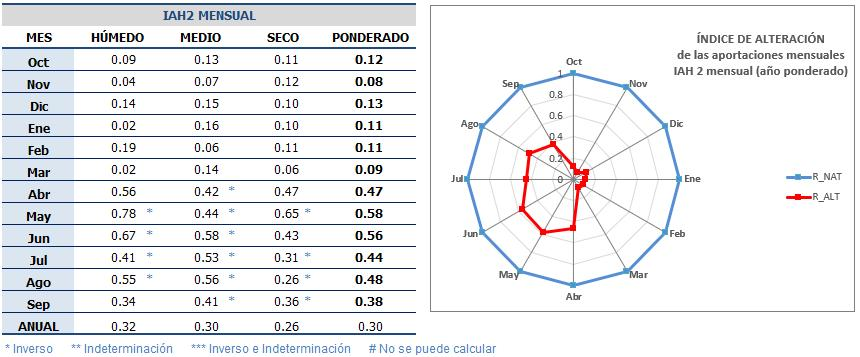

**Figure No37**- Excerpt from a report by IAHRIS with the indices of alteration of the magnitude of monthly contributions under contemporary schemes

Weighted IAH for each month is obtained by weighting according to % presence of each type

<strong>IAH 2 month weighted = 0.25\* IAH 2 month</strong> <strong>hum</strong> <strong>+ 0,5\* IAH 2 month</strong> <strong>med</strong> <strong>+ 0,25\* IAH 2 month</strong> <strong>sec</strong>

An annual value is also offered for each type: <strong>IAH2</strong> <strong>hum</strong>, <strong>IAH2</strong> <strong>med</strong>, <strong>IAH2</strong> <strong>sec,</strong> <strong>IAH2</strong> <strong>pont</strong> as an average of 12 monthly values for each of these rates.

Finally, and on the basis of previous annual values, a final value of index **IAH 2**  according to the % presence of each type of month

<strong>Mean IAH 2 = 0.25\* IAH 2</strong> <strong>hum</strong> <strong>+ 0,5\* IAH 2</strong> <strong>med</strong> <strong>+ 0,25\* IAH 2</strong> <strong>sec</strong>

**IAH 3: index OF HABITUAL VARIABILITY**

**Objective:** evaluate the distortion that in habitual variability presents an altered regime against the natural one, understanding by habitual variability that that does not take into account the extreme values that occur in the year.

**Expression:**

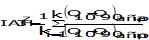

*for z=wet, medium and dry in natural state*

where:

**k**= No years of the available series belonging to the type z in natural regime. The typology of the year (wet, medium and dry) is determined by the natural regime.

<strong>Q</strong> <strong>10</strong> = flow corresponding to the 10% surplus percentile in the mean curve of flows sorting of type z

<strong>Q</strong> <strong>90</strong> = flow for the 90% surplus percentile in the mean flows sorting of type z

Subsindices **a** and **n** refer to the altered and natural regime respectively.

**Comment:** East index It is only applicable since both series have daily data.

**IAH 4: index EXTREME VARIABILITY**

**Objective:** to assess the distortion caused by the circulating regimen on the extreme variability of usual values with respect to the natural regime.

**Expression:**

**B**

**A**

**Figure No 38** – Evaluation of the index of variability or extreme differences in a given year

**A**= Maximum monthly contribution – Minimum monthly contribution in altered regime

**B**= Maximum monthly contribution – Minimum monthly contribution on a natural basis

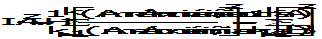

*for z=wet, medium and dry in natural state*

**k** = number of years of the type **z**. The typology of the year (wet, medium and dry) is determined by the natural regime.

**Maximum am, year i, a** = Maximum monthly contribution of year i in altered regime. Similarly for Am minimum year i, a.

**Maximum am, year i, n** = Maximum monthly contribution of year i on a natural basis.

Similarly for minimum Am, year i, n.

The final value of the index **IAH 4** is obtained by weighting the indices for each type of year according to the % of the type presence in the series:

<strong>IAH 4 = 0.25\* IAH 4</strong> <strong>hum</strong> <strong>+ 0,5\* IAH 4med</strong> <strong>+ 0,25\* IAH 4</strong> <strong>sec</strong>

**Comment:** As can be seen the comparison between one regime and another is evaluated year by year and then the average value of these observed annual changes is calculated, thus avoiding possible compensation between years of different behaviors.

**IAH 5: CONTENTS OF THE seasonality OF MAXIMUM**

**IAH 6: CONTENTS OF THE seasonality OF MINIMUM**

**Objective:** assess the distortion caused by the circulating regime on the seasonality of natural monthly contributions.

<strong>Expression:</strong> ed alteration in the seasonality of the minimums for a given year shall be estimated as the existing gap (measured in no of months) between the month with the minimum contribution in altered regime and the month with the minimum contribution in natural regime (<strong>E</strong> <strong>min</strong> in the <strong>Figure No39</strong>). In relation to the maximum, the gap shall be assessed between the month with maximum contribution in altered regime and the corresponding one in natural regime for a given year (<strong>E</strong> <strong>max</strong> in the <strong>Figure No39</strong>).

<strong>E</strong> <strong>max</strong>

<strong>E</strong> <strong>min</strong>

**Figure No39** – Graphic representation of the meaning of index of seasonality or time lag for maximum and minimum values

For each type of year a time lag of maximums will be obtained <strong>IAH 5</strong> <strong>z</strong> and a time lag of minima <strong>IAH 6</strong> <strong>z</strong>in the following terms:

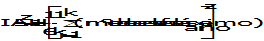

*for z=wet, medium and dry in natural state*

**k** = number of years of the type **z**. The typology of the year (wet, medium and dry) is determined by the natural regime

**no. of months of maximum lag**= No. of months of lag between the month of maximum contribution in altered regime and the month of maximum contribution in natural regime for a given year.

**No of months of minimum lag**= No. of months of lag between the month of minimum contribution in altered regime and the month of minimum contribution in natural regime for a given year.

Two points should be made in the estimation of these parameters:

- In the estimation of the minimum gap, the minimum contribution may be common to several months, in which case the maximum gap month shall be selected.
- Not considered to be gaps longer than 6 months, index so that for this gap it takes the value of 0, indicative of maximum alteration.
- As can be seen, the proposed indicators do not respond to the general expression of ratio between parameters. The reason for this is the advisability that the indicator chosen is always set between 1 and 0.

In short, for each type of year, two gaps will be achieved, representing a total of six indices of seasonality (**Table No18**):

**TYPE OF YEAR**

**BASE OF (based on (a)**

**CONTENTS seasonality**

**Wet year**

**Maximum** (maximum contribution month)

<strong>IAH 5</strong> <strong>hum</strong>

**Minimum** (minimum contribution month)

<strong>IAH 6</strong> <strong>hum</strong>

**Medium year**

<strong>IAH 5med</strong>

<strong>IAH 6med</strong>

<strong>IAH 5sec</strong>

<strong>IAH 6ec</strong>

**Dry year**

**Table No18**- Name of the index of seasonality for maximum and minimum for each type of year

The final value of the indices **IAH 5 and IAH 6**, of seasonality of maximum and minimum respectively is obtained by weighting on the basis of the percentage of presence of each type of year in the series:

<strong>IAH 5 = 0.25\* IAH 5</strong> <strong>hum</strong> <strong>+ 0,5\* IAH 5med</strong> <strong>+ 0,25\* IAH 5sec</strong>

<strong>IAH 6 = 0.25\* IAH 6</strong> <strong>hum</strong> <strong>+ 0,5\* IAH 6</strong> <strong>med</strong> <strong>+ 0,25\* IAH 6</strong> <strong>sec</strong>

**Comment:** In view of its special significance, the result obtained with these products is interpreted indices, establishing the existing correlations between the value of **IAH 5** o **IAH 6** and the number of months of gap between the two regimes (**Table No19**).

**Table No19**- Interpretation of the results of the indices of seasonality **IAH 5** o **IAH 6**

**Interpretation**

**Value of IAH**

**Gap**

0

6 months

0,16

5 months

0,33

4 months

0,5

3 months

0,66

2 months

0,8

1 month

1

No lag

<strong>D.2</strong> <strong><u>indices DE alteration DE usual values IN NON-COETAN REGIONS</u></strong>

In a non-coetaneity situation (< 15 years common between natural and altered series) the evaluation of the alteration in usual values will be carried out according to indices specifically defined for this case (**Table No20**).

<table><tr><td>
<strong>ASPECT</strong>
</td><td>
<strong>index</strong>
</td><td>
<strong>NAME</strong>
</td></tr><tr><td colspan="3">
<strong>usual values</strong>
</td></tr><tr><td rowspan="3">
<strong>magnitude</strong>
</td><td>
<strong>M 1</strong>
</td><td>
Ind. of magnitude of annual contributions
</td></tr><tr><td>
<strong>M 2</strong>
</td><td>
Ind. of magnitude of monthly contributions
</td></tr><tr><td>
<strong>M 3</strong>
</td><td>
Ind. of magnitude of each month's contributions: 12 values
</td></tr><tr><td rowspan="4">
<strong>variability</strong>
</td><td>
<strong>V 1</strong>
</td><td>
Variability of annual contributions
</td></tr><tr><td>
<strong>V 2</strong>
</td><td>
Variability of monthly contributions
</td></tr><tr><td>
<strong>V 3</strong>
</td><td>
Variability of monthly contributions: 12 values
</td></tr><tr><td>
<strong>IAH 3</strong>
</td><td>
Ind. of Usual Variability
</td></tr><tr><td rowspan="2">
<strong>seasonality</strong>
</td><td>
<strong>E 1</strong>
</td><td>
Ind. of seasonality of maximum
</td></tr><tr><td>
<strong>E 2</strong>
</td><td>
Ind. of seasonality of minima
</td></tr></table>

**Table No20**- indices of alteration in usual values for non-coetaneous regimens. index IAH3 is applicable to both coetaneous and non-coetaneous series as long as daily data are available.

The evaluation of the alteration in extreme values, -floods and droughts- by not requiring the condition of coetaneity it shall be carried out by means of indices **IAH 7 - IAH 21** applicable to both coetaneous and non-coetaneous series and to be displayed under the headings **D.3** and **D.4**.

**WHERE TO CONSULT THESE RESULTS IN A STUDY WITH IAHRIS?**

Report No 7x

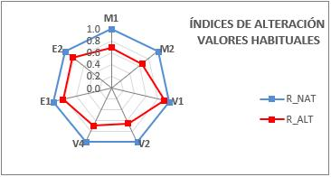

**Figure No 40**- Excerpt from a report by IAHRIS with the indices of usual values for non-coetaneous regimens (table indices partials; spider chart and table indices global)

**M1: index DE magnitude ANNUAL CONTRIBUTIONS**

**Objective:** assess the distortion caused by the circulating regime on the magnitude of annual contributions in respect of their value on a natural basis

**Expression:**

where:

= Annual average contribution in altered regime

= Average annual contribution on a natural basis

**M 2: index DE magnitude MESSUAL CONTRIBUTIONS**

**Objective:** With the aim of avoiding the compensation that can occur between the different months of the year when working with annual values, it is proposed that index that mitigates the above by giving the same weight to the alteration every month.

**Expression:** The evaluation of the alteration will be carried out by month by month, for each month of each year. index will finally be expressed as the average value of all estimated monthly changes.

where:

= Average monthly contribution of the month i in altered regime

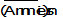

= Average monthly contribution of the month i on a natural basis

<strong>M 3</strong> <strong>month i: index DE magnitude OF EACH MONTH ' S CONTRIBUTIONS</strong>

**Expression:** The evaluation of the alteration will be carried out independently for each month, offering the 12 indices monthly.

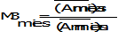

where:

= Average monthly contribution of the month i in altered regime

= Average monthly contribution of the month i on a natural basis

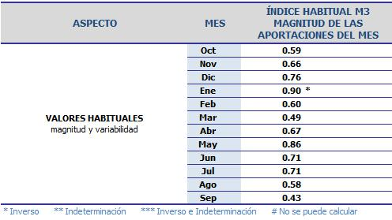

**Figure No41**- Excerpt from a report by IAHRIS with the indices of alteration of the magnitude of monthly contributions for non-temporary schemes

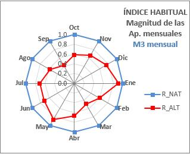

**Figure No42**- Extract from an IAHRIS report with the spider chart of the indices of alteration of the magnitude of monthly contributions for non-temporary schemes

**V1: index VARIABILITY OF ANNUAL CONTRIBUTIONS**

**Objective:** evaluate the alteration in variability at annual contribution level

**Expression:**

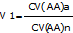

where:

CV (AA) a= coefficient of variation of the series of annual contributions in altered regime.

CV (AA) n= coefficient of variation of the series of annual contributions on a natural basis.

**V2: index VARIABILITY OF MONTHLY CONTRIBUTIONS**

**Objective:** evaluate the alteration variability at monthly contribution level

**Expression:**

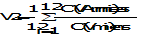

where:

CV (month i) a= coefficient of variation of the monthly series of contributions of the month i in altered regime.

VC (month i) n= coefficient of variation of the series of monthly contributions of the month i on a natural basis.

**Figure No43**- Excerpt from a report by IAHRIS with the indices variability of monthly contributions for non-coetaneous regimens

**Figure No44**- Extract from an IAHRIS report with the spider chart of the indices variability of monthly contributions for non-coetaneous regimens

<strong>V 3</strong> <strong>month i: index VARIABILITY OF THE CONTRIBUTIONS OF</strong>

**EACH MONTH**

**Expression:** The evaluation of the alteration will be carried out independently for each month, offering the 12 indices monthly.

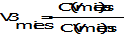

where:

VC (month i) to = Rate of variation of the series of contributions of the month i in altered regime

VC (month i) n = Change coefficient of the series of contributions of the month i on a natural basis

**V 4: index EXTREME VARIABILITY**

**Objective:** to assess the distortion caused by the circulating regimen on the extreme variability of usual values with respect to the natural regime.

**Expression:**

**Maximum am, year i, a** = Maximum monthly contribution of year i in altered regime. Similarly for Am minimum year i, a.

**Maximum am, year i, n** = Maximum monthly contribution of year p on a natural basis.

Similarly for minimum Am, year p, n.

**N**= No years available under altered regime

**M**= No years available on a natural basis

**E1: CONTENTS OF THE seasonality OF MAXIMUM**

**Objective:** assess the distortion caused by the circulating regime on the seasonality of the maximum natural monthly contributions.

**Expression:** built the table of frequencyrelative of the presence of maximums in each month (see heading **B.3.**), the alteration in the seasonality of the maximums shall be estimated as the existing gap (measured in no of months) between the month and the maximum frequency in altered regime and month with maximum frequency In the event that the maximum character is common to several months (i.e. that several months have the maximum value of frequency No later than the first month shall be selected in chronological order (October-September).

- Located in the month of maximum frequency The number of months is determined on a natural basis (**x** months) that precede chronologically until reaching the furthest month where the maximum is located frequency It's altered.
- Located in the month of maximum frequency in a natural way, it is determined how many months are missing (**and** months) to reach the first month maximum frequency It's altered.
- The **number of months of lag** will come given by the greatest of values **x** e **and** previously obtained, never admitting gaps longer than 6 months.

The final value of the index is obtained as:

**Table No21**- Interpretation of the results of the indices of seasonality

**Interpretation**

**E1 value**

**Gap**

0

6 months

0,16

5 months

0,33

4 months

0,5

3 months

0,66

2 months

0,8

1 month

1

No lag

**Comment:** The **Table No21** establishes the existing correlations between value obtained when calculating **E1** and the number of months of gap between the two regimes

**E2: CONTENTS OF THE seasonality OF MINIMUM**

**Objective:** assess the distortion caused by the circulating regime on the seasonality of minimum natural monthly contributions.

**Expression:** built the table of frequencyrelative of the presence of minima in each month (see heading **B.3.**), the alteration in the seasonality of the minimums will be estimated as the existing gap (measured in no of months) between the month with maximum frequency in altered regime and month with maximum frequency In the event that the maximum character is common to several months (i.e. that several months have the maximum value of frequency No later than the first month shall be selected in chronological order (October-September).

- Located in the month of maximum frequency The number of months is determined on a natural basis (**x** months) that precede chronologically until reaching the furthest month where the maximum is located frequency It's altered.
- Located in the month of maximum frequency in a natural way, it is determined how many months are missing (**and** months) to reach the month furthest from maximum frequency It's altered.
- The number of months of lag will be given by the largest of the values **x** e **and** previously obtained, no time lag values greater than 6 months are allowed.

The final value of the index is obtained as:

<strong>D.3</strong> <strong><u>indices DE alteration DE floods_</u></strong>

The indices proposed for the estimate of alteration in magnitude, frequency, variability, seasonality and duration of the floods are collected in the **Table No22**.

Unlike indices of usual values with different formulations according to coetaneity or non-coetaneity of the series, indices of floods are generally applied regardless of this circumstance.

The study of the rates of growth and defluence is not focused on the formulation of a index of alteration, but to the characterisation of the relative maximum rates that are presented in natural regime in order to characterize them and to serve as aid to the resource manager as limit behaviour pattern in the implementation of floods.

<table><tr><td>
<strong>ASPECT</strong>
</td><td>
<strong>CONTENTS</strong>
</td><td>
<strong>NAME</strong>
</td></tr><tr><td colspan="3">
<strong>Maximum extreme values: floods</strong>
</td></tr><tr><td rowspan="4">
<strong>magnitude and frequency</strong>
</td><td>
<strong>♪ ♪ AH ♪ 7 ♪</strong>
</td><td>
Ind. of magnitude of the floods maximum
</td></tr><tr><td>
<strong>AH 8</strong>
</td><td>
Ind. of magnitude of the flow bed generator
</td></tr><tr><td>
<strong>♪ ♪ AH ♪ 9 ♪</strong>
</td><td>
Ind. of frequency of the flow connectivity
</td></tr><tr><td>
<strong>AH 10 </strong>
</td><td>
Ind. of magnitude of the floods usual
</td></tr><tr><td rowspan="2">
<strong>variability</strong>
</td><td>
<strong>AH 11</strong>
</td><td>
Variability index of the floods maximum
</td></tr><tr><td>
<strong>AH 12 </strong>
</td><td>
Variability index of the floods usual
</td></tr><tr><td>
<strong>duration</strong>
</td><td>
<strong>IAH 13</strong>
</td><td>
Ind. of duration of floods
</td></tr><tr><td>
<strong>seasonality  </strong>
</td><td>
<strong>IAH 14</strong>
</td><td>
Ind. of seasonality &amp; duration of floods
</td></tr></table>

**Table No22**- indices for the estimate of alteration of floods of the flow regime

**WHERE TO CONSULT THESE RESULTS IN A STUDY WITH IAHRIS?**

Report No 7x

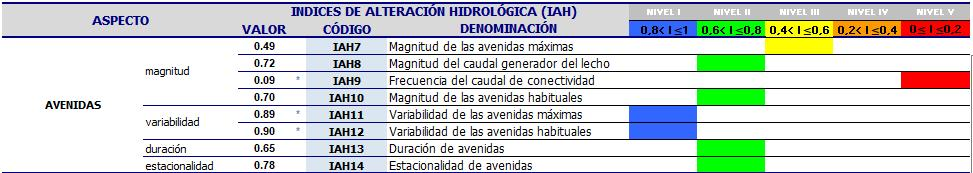

**Figure No44**- Excerpt from a report by IAHRIS with the indices of floods (Table indices partials; spider chart and table indices global)

**IAH 7: CONTENTS magnitude OF THE floods MAXIMUM**

**Objective:**  evaluate the alteration at the average value of the floods circulating

**Expression:** The index the proposed evaluation of the alteration in magnitude of the floods maximums taken as parameter the average value of the maximum series flows annual daily averages in both regimes.

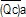

= average maximum flows Annual daily means of the series available under altered regime

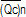

= average maximum flows annual daily means of the series available on a natural basis

**Comment: e**l value obtained from this index is representative of the alteration produced in the average value of the flows maximum circulating (Maximums) flows Annual Journals), which may also be regarded as indicative of the alteration in the frequency of these floods, given the relationship between the return period and the return period. flows maximum daily averages per year , corresponds to a return period of 2.33 years, when the law of frequencys Gumbel.

**IAH 8: CONTENTS magnitude OF THE flow GENERATOR OF THE LECHO**

**Objective:** evaluate the alteration in the value of those flows with special geomorphological significance

<strong>Expression:</strong> The references in previous headings support the environmental significance of flow bed generator (QGL) as that flow that in the long term carries out a greater work of mobilization and transport of materials being responsible for the geomorphology of the channel both in section and in plant. index proposed take as parameter reference flow bed generator and corrects the relationship obtained with exponent 0.5 taking into account the direct relationship between bed width and square root of Q GL .

<strong>QGL</strong> <strong>a</strong> = flow Milk generator corresponding to the altered regime

<strong>QGL</strong> <strong>n</strong> = flow Milk generator corresponding to the natural regime

**IAH 9: CONTENTS magnitude OF THE flow CONNECTIVITY**

**Objective:** evaluate the alteration in the frequency of those flows ensuring a regular connection to the flood plain

<strong>Expression:</strong> in previous headings the <strong>flow connectivity</strong> QCONEC as the flow representative of those maximum values that guarantee the channel-wind connection of flooding and are intimately linked with the dynamics of the riparian band.

The alteration in this functionality of the maximum values is estimated as a ratio between the frequency for the flow connectivity in altered regime and the frequency estimated for flow on a natural basis.

<strong>QCONEC</strong> <strong>=</strong> flow of connectivity in a natural environment (=flow that doubles the period of return of the flow bed generator under that scheme)

<strong>T</strong> <strong>a</strong> <strong>(QCONEC)</strong> = Return period corresponding to flow of Connectivity in an altered regime

<strong>T</strong> <strong>n</strong> <strong>(QCONEC)</strong> = Return period corresponding to flow of Connectivity in a natural regime

The Gumbel distribution being the law of frequencys considered for the characterization of the flows maximum.

The process of obtaining this index can be schematised:

#### 3.1.1.1 Estimate QGL in a natural regime and its corresponding period of return <strong>T</strong> (Gumbel Act) 

#### 3.1.1.2 Calculate the magnitude of the flow Q natural connectivityCONEC defined as that flow for a one-year period <strong>2T</strong> 

#### 3.1.1.3 Calculate the frequency which corresponds in altered regime to the flow natural connectivity (QCONEC)

#### 3.1.1.4 Compare frequencys of QCONEC in an altered and natural regime.

<strong>QCONEC</strong>

<strong>Tn (QCONEC)</strong>

<strong>Ta (QCONEC)</strong>

**Figure 23** – Allocation of the period of return corresponding to flow connectivity for the natural and altered regime

**IAH 10: index DE magnitude OF THE floods HABITUALS**

**Objective:** characterise the alteration in the magnitude of the floods, avoiding working only with extreme values since they mask many floods Minors of great environmental significance.

<strong>Expression:</strong> in previous headings the flood as usual as the flow corresponding to the mean curve of flows classified to 5% leave percentile (<strong>Q5%</strong>), constituting a new hydrological variable that, representing phenomena of recurrence less than the year, synthesizes multiple aspects of biological functionality of the maximum values.

The index the proposed evaluation of the alteration at the value of the flood common between the two regimes:

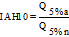

<strong>Q</strong> <strong>5% to</strong> = flood usual in altered regime.

<strong>Q</strong> <strong>5% n</strong> = flood usual in natural regime.

<strong>Comment:</strong> Being defined the flood for the value of the flow (m3/s) corresponding to 5% leave percentile in the mean curve of flows classified, which is analogous in terms of duration to that value of flow that on average is equalled or exceeded 18 days a year.

**IAH 11: index VARIABILITY OF THE UNITED NATIONS floods MAXIMUM**

**Objective:**  to quantify the distortion in the year-on-year variability of flows maximum.

**Expression:** on index proposed uses as estimator the coefficient of variation of the series of maximums flows annual daily media (Qc).

**CV (Qc a)** = coefficient of variation of the maximum series flows annual daily averages corresponding to the altered scheme.

**CV (Qc n)** = coefficient of variation of the maximum series flows annual daily averages corresponding to the natural regime.

**IAH 12: index VARIABILITY OF THE UNITED NATIONS floods HABITUALS**

**Objective:** to quantify the distortion in the year-on-year variability of floods usual.

<strong>Expression:</strong> on index proposed uses as estimator the coefficient of variation of the Q-value series 5% of natural and altered regimes.

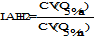

<strong>CV (Q</strong> <strong>5% to)</strong> = coefficient of variation of the series of values corresponding to the flood usual in altered regime (annual series of Q 5%).

<strong>CV (Q</strong> <strong>5% n)</strong> = coefficient of variation of the series of values corresponding to the flood usual on a natural basis (annual series of Q 5%).

**IAH 13: index DE duration DE floods**

**Objective:** to check whether the periods of floods maintain a duration similar to those of the natural regime.

<strong>Expression:</strong> on parameter proposed to characterize the duration of the floods has been defined in previous headings as the maximum number of consecutive days in which the Q threshold is equalled or exceeded 5%. It is chosen as flow to discriminate against the presence or non-existence of a flood in a given month for Q 5% on a natural basis, hereinafter Q5% nat.

Consequently, the alteration in the duration of floods is evaluated as a quotient between the value of this parameter in altered regime and its counterpart in natural.

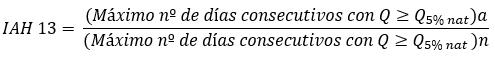

<strong>(Maximum number of consecutive days with Q ≥ Q</strong> <strong>5% nat)</strong> <strong>a</strong>= Maximum number of consecutive days, in average value, in the altered regime, in which the flood natural habit.

<strong>(Maximum number of consecutive days with Q ≥ Q</strong> <strong>5% nat)</strong> <strong>n</strong>= Maximum number of consecutive days, in average value, in the natural regime, where the flood natural habit.

**IAH 14: index DE seasonality DE floods**

**Objective:** This proposal is index with the aim of assessing the alteration in the field of seasonality of the floods.

<strong>Expression:</strong> as in previous occasions it is chosen as flow to discriminate against the presence or non-existence of a flood in a given month for Q5% on a natural basis, hereinafter Q5%nat.

The procedure focuses on evaluating the condition seasonality of the floods for each month of the year and then calculate the index of alteration as the average of these indices monthly.

The index monthly IAH 14month i is obtained by following the following logic:

## If ABS (natural-altered)&gt;5 IAH 14month i = 0

## If ABS (natural-altered)≤5  

where

**ABS:** absolute value

<strong>NATURAL:</strong> not mean days per month with Q≥Q5%nat on a natural basis for the month in question.

<strong>ALTERNATIVE:</strong> not mean days per month with Q≥ Q5%nat in altered regime for the month in question.

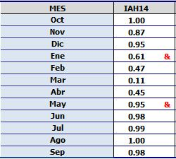

**Figure No 45**- Excerpt from a report by IAHRIS with the index of seasonality of floods breakdown at monthly level

At the end a index final **IAH 14** obtained on average from the 12 monthly values

<strong>D.4</strong>  <strong><u>indices DE alteration DE droughts</u></strong>

The indices proposed for the estimate of alteration in magnitude, frequency, variability, seasonality and duration of the droughts are collected in the **Table 23**

<table><tr><td>
<strong>ASPECT</strong>
</td><td>
<strong>index</strong>
</td><td>
<strong>NAME</strong>
</td></tr><tr><td colspan="3">
<strong>Minimum extreme values: droughts</strong>
</td></tr><tr><td rowspan="2">
<strong>magnitude and frequency</strong>
</td><td>
<strong>AH 15</strong>
</td><td>
Ind. of magnitude of the droughts extremes
</td></tr><tr><td>
<strong>IAH 16</strong>
</td><td>
Ind. of magnitude of the droughts usual
</td></tr><tr><td rowspan="2">
<strong>variability</strong>
</td><td>
<strong>IAH 17</strong>
</td><td>
Variability index of the droughts extremes
</td></tr><tr><td>
<strong>IAH 18</strong>
</td><td>
Variability index of the droughts usual
</td></tr><tr><td rowspan="2">
<strong>duration</strong>
</td><td>
<strong>IAH 19</strong>
</td><td>
Ind. of duration of droughts
</td></tr><tr><td>
<strong>IAH 20</strong>
</td><td>
Ind. of no of days with flow non-null
</td></tr><tr><td>
<strong>seasonality  </strong>
</td><td>
<strong>IAH 21</strong>
</td><td>
Ind. of seasonality of droughts
</td></tr></table>

**Table 23**- indices for the estimate of alteration of droughts of the flow regime

**WHERE TO CONSULT THESE RESULTS IN A STUDY WITH IAHRIS?**

Report No 7x

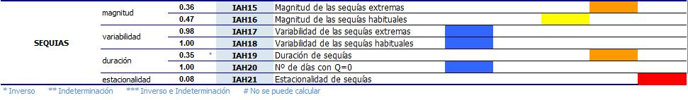

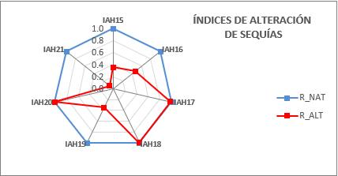

**Figure No46**- Excerpt from a report by IAHRIS with the indices of droughts (Table indices partials; spider chart and table indices global)

**IAH 15: index DE magnitude OF THE droughts EXTREME**

**Objective:** evaluate the alteration in the average value of the flows minimum circulating

**Expression:**  on index proposed estimates the alteration in magnitude of the droughts on the basis of the relationship between the average value of the flows annual minimum daily allowances for the altered regime and the natural regime.

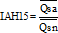

where:

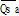

= mean of the flows minimum annual daily allowances of the series available under altered regime

= mean of the flows minimum annual daily calendar of the series available on a natural basis

**IAH 16: index DE magnitude OF THE droughts HABITUALS**

**Objective:** evaluate the alteration in the magnitude of the droughts avoiding working only with extreme minimum values, since they mask other situations that although being less critical are nevertheless of great environmental importance

**Expression:**

<strong>Q</strong> <strong>95% to</strong> = flow (m3/s) corresponding to the drought usual in altered regime.

<strong>Q</strong> <strong>95% n</strong> = flow (m3/s) corresponding to the drought usual in natural regime.

In both cases the drought will be defined by the value of the flow corresponding to 95% percentile in the respective mean curve of flows classified, which is analogous, in terms of duration, to that value of flow, which on average is neither equalized nor exceeded 18 days a year.

**IAH 17: index VARIABILITY OF THE UNITED NATIONS droughts EXTREME**

**Objective:** evaluate the alteration in the variability of flows annual minimums.

**Expression:** is used as parameter estimating the coefficient of variation of the minimum series flows annual daily allowances for each of the schemes.

**CV (Qs a)** = coefficient of variation of the minimum series flows annual daily allowances corresponding to the altered scheme.

**CV (Qs n)** = coefficient of variation of the minimum series flows annual calendar days corresponding to the natural regime.

**IAH 18: index VARIABILITY OF THE UNITED NATIONS droughts HABITUALS**

**Objective:** evaluate the alteration in the variability of droughts more frequent.

<strong>Expression:</strong> on index proposed uses as parameter estimating the coefficient of variation of the Q-value series95% for the two schemes under consideration.

<strong>CV (Q95% to)</strong> = coefficient of variation of the annual series of values corresponding to the drought usual in altered regime (annual series of Q 95%).

<strong>CV (Q95% n)</strong> = coefficient of variation of the annual series of values corresponding to the drought usual on a natural basis (annual series of Q 95%).

**IAH 19: index DE duration DE droughts**

**Objective:** to check whether the periods of droughts maintain a duration similar to those of the natural regime.

<strong>Expression:</strong> on parameter proposed to characterize the duration of the droughts has been defined in previous headings as the maximum number of consecutive days in which the threshold defined by the Q value is not reached 95%. It is chosen as flow to discriminate against the presence or non-existence of a drought in a given month for Q95% on a natural basis, hereinafter Q95%nat.

Consequently, the alteration in the duration of droughts is evaluated as a quotient between the value of this parameter in altered regime and its counterpart in natural.

<strong>(Maximum number of consecutive days with Q Q</strong> <strong>95% nat)</strong> <strong>a</strong>= Maximum number of consecutive days, in average value, in the altered regime, in which the drought natural habit.

<strong>(Maximum number of consecutive days with Q Q</strong> <strong>95% nat)</strong> <strong>n</strong>= Maximum number of consecutive days, in average value, in the natural regime, in which the drought natural habit.

**IAH 20: index NUMBER OF DAYS WITH flow NULUS**

**Objective:** evaluate the alteration in the number of days with flow the nature of the natural regime.

**Procedure:** The procedure focuses on evaluating the condition duration of the periods of flow nil for each month of the year and then calculate the index of alteration as the average of these indices monthly.

The index monthly IAH 20month i is obtained by following the following logic:

## If ABS(natural-altered)&gt;5 IAH 20month i = 0

## If ABS(natural-altered)≤5  

where

**ABS:** absolute value

**NATURAL:** not average days per month with Q=0 on a natural basis for the month under consideration

**ALTERNATIVE:** not average days per month with Q=0 in altered regime for the month considered

**Figure No47**- Excerpt from a report by IAHRIS with the index of seasonality of flows zero broken down at monthly level

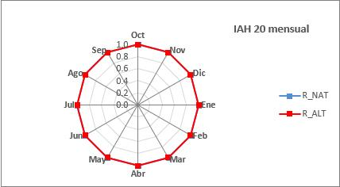

**Figure No 48**- Extract from an IAHRIS report with the spider chart of the indices of seasonality of flows zero by month

At the end a index final **IAH 20** obtained on average from the 12 monthly values

**IAH 21: index DE seasonality DE droughts**

**Objective:** This proposal is index with the aim of assessing the alteration in the field of seasonality of the droughts.

<strong>Expression:</strong> as in previous occasions it is chosen as flow to discriminate against the presence or non-existence of a drought in a given month for Q95% on a natural basis, hereinafter Q95%nat.

The procedure focuses on evaluating the condition seasonality of the droughts for each month of the year and then calculate the index of alteration as the average of these indices monthly.

The index monthly IAH 21month i  (to be obtained by following the following logic:

## If ABS(natural-altered)&gt;5 IAH 21month i = 0

## If ABS(natural-altered)≤5  

where

**ABS:** absolute value

<strong>NATURAL:</strong> not half days per month on a natural basis with QQ 95%nat for the month concerned

<strong>ALTERNATIVE:</strong> no half of days per month in QQ-altered regimen 95%nat for the month concerned

**Figure No49**- Excerpt from a report by IAHRIS with the index of seasonality of droughts breakdown at monthly level

**Figure No50**- Extract from an IAHRIS report with the spider chart of the indices of seasonality of droughts Monthly breakdowns

At the end a index final **IAH 21** obtained on average from the twelve monthly values.

**AND ENVIRONMENTAL RELATIONSHIP OF THE hydrological alteration**

As previously mentioned in various headings of this Manual, the link between the various components, functions and processes of the ecosystem is so rich, complex and varied that it would be totally utopian to try to cover its entirety. That is why the procedure presented below should be understood as a frame of reference, a point of support, starting from which we approach the interpretation of possible cause-effect relations and from there, contrast them and complete them based on the intrinsic peculiarities of each study stretch and indisputably to a field monitoring and monitoring.

The diagnostic process described herein is intended, but to answer, if at least to reflect on some questions:

- *What is the sensitivity of the ecosystem to changes in the flow regime?*
- *Do all components of the river ecosystem respond with equal intensity and dependence to these alterations?*
- *Is it possible to establish relationships between the causative agent and the effect? Are these relationships consistent?*
- *Can they help predict ecosystem changes under different regime regulation scenarios?*

The diagnosis presented below is structured as follows:

- They are selected as basic components of the river ecosystem: three biotic components (fish fauna, bentos and riparian vegetation) and two abiotic components (morphology and river habitat).
- For each component of the ecosystem indicated above, the components of the flow regime more determinants (floods, droughts o usual values), as well as its aspects (magnitude, variability, seasonality o duration) with greater involvement in the operation, configuration and stability of the component to be studied.
- It is then assigned to each of the above aspects, the index of hydrological alteration (IAH) corresponding.
- For each index the **threshold of 0.4** as a determinant of alteration and is diagnosed on the basis of that threshold whether or not there has been alteration significant. Let’s remember that a index of hydrological alteration less than or equal to 0.4 indicates than the value of parameter in the altered regime differs by 60% or more from the value observed in the natural regime.
- Finally, the established ecosystem-IAH component relationships are briefly justified.

The following outline summarizes this diagnostic process:

Finally, the **Tables 24.1 to 24.5** summarizes the most significant relationships between the different components of the ecosystem (morphology, habitat, vegetation, fish fauna and macroinvertebrates) and **IAH** Proposed.

In the column named **SIGNATURE** the criteria justifying the choice of a index of alteration as a more representative tool in the evaluation of a component and aspect of flow regimeas well as its environmental significance.

The comments contained in that column cannot and do not claim to be an exahustive compendium of the environmental significance of each of the components of the hydrological regime It's been analyzed.

The aim is only to point out relevant aspects that, in general, appear in specialized literature.

The user who wants to know in detail the role that the alteration of the various components of the flow regime has in components, processes, dynamics and resilience of the river ecosystem, should consult texts specialized in river ecology and validate with field work the response of the ecosystem to the hydrological alteration. Two books addressing a broad spectrum are suggested:

- Allan, J. D., Castillo, M M., & Capps, K. A. (2020). Stream Ecology: Structure and Function of Running Waters. Springer Cham. 485p. https://doi.org/10.1007/978-3-030-61286-3
- Rowiński, P & Radecki-Pawlik, A (Ed) (2015). **Rivers, Physical, Fluvial and Environmental Processes**Springer Cham. 613p. https://doi.org/10.1007/978-3-319-17719-9

References to this type of cause-effect diagnosis can be found in the brilliant "conceptual models" of Brizga and Arthington (2001), where the relationships between "*key flow indicators*" and "*ecological and geomorphological functions* for interior and mouth sections.

**ECOSYSTEM COMPONENT: MORPHOLOGY Table 24.1**

<table><tr><td colspan="2">
<strong>Components and aspects of flow regime more directly involved</strong>
</td><td colspan="2">
<strong>indices of hydrological alteration</strong>

<strong>which evaluate them (AHI)</strong>
</td><td>
<strong>ENVIRONMENTAL TRANSCENDENCE</strong>
</td></tr><tr><td rowspan="3">
<strong>floods</strong>
</td><td>
magnitude
</td><td>
<strong>AH 8</strong>
</td><td>
Ind. of magnitude of the flow bed generator
</td><td>
The flow bed generator represents that flow that in the long term carries out a greater work of mobilization and transport of materials being responsible for the geomorphology of the channel both in section and in plant.
</td></tr><tr><td>
Variability
</td><td>
<strong>IAH 11</strong>
</td><td>
Variability index of the floods 
</td><td rowspan="2">
Implications for the shaping and stability of the channel
</td></tr><tr><td>
duration
</td><td>
<strong>IAH 13</strong>
</td><td>
Ind. of duration of floods
</td></tr></table>

**ECOSYSTEM COMPONENT: HABITAT Table 24.2**

<table><tr><td colspan="2">
<strong>Components and aspects of flow regime more directly involved</strong>
</td><td colspan="2">
<strong>indices of hydrological alteration</strong>

<strong>which evaluate them (AHI)</strong>
</td><td>
<strong>ENVIRONMENTAL TRANSCENDENCE</strong>
</td></tr><tr><td rowspan="4">
<strong>floods</strong>
</td><td>
magnitude usual
</td><td>
<strong>IAH 10</strong>
</td><td>
Ind. of magnitude of the floods usual
</td><td rowspan="4">
 Fundamental in processes of cleaning and revitalization of the substrate, maintenance of the diversity of hydrohabitats, rapid-remand sequence, maintenance of granulometric diversity and adequate conditions in the hyporrheal environment.
</td></tr><tr><td>
Usual variability
</td><td>
<strong> IAH 12</strong>
</td><td>
Variability index of the floods usual
</td></tr><tr><td>
seasonality
</td><td>
<strong>IAH 14</strong>
</td><td>
Ind. of seasonality of floods
</td></tr><tr><td>
duration
</td><td>
<strong>IAH 13</strong>
</td><td>
Ind. of duration of floods
</td></tr><tr><td rowspan="2">
<strong>droughts</strong>
</td><td>
magnitude usual
</td><td>
<strong>IAH 16</strong>
</td><td>
Ind. of magnitude of the droughts usual
</td><td rowspan="2">
Determinants in the dynamics of the hyporrheal medium; alteration water quality; drying and habitat fragmentation processes; connectivity to the water table.
</td></tr><tr><td>
Usual variability
</td><td>
<strong>IAH 18</strong>
</td><td>
Variability index of the droughts usual
</td></tr><tr><td rowspan="3">
<strong>usual values</strong>
</td><td>
magnitude
</td><td>
<strong>IAH1pond</strong>
</td><td>
Ind. of magnitude of annual contributions
</td><td rowspan="3">
Conditionants of habitat variability and its heterogeneity, size of the material that forms the bed, hydraulic characteristics, characteristics and filling of the hyporrheal medium.
</td></tr><tr><td>
Usual variability
</td><td>
<strong>IAH 3pond</strong>
</td><td>
Ind. of Usual Variability
</td></tr><tr><td>
Extreme variability
</td><td>
<strong>IAH 4pond</strong>
</td><td>
Extreme Variability Index
</td></tr></table>

**ECOSYSTEM COMPONENT: RIPARY VEGETATION Table 24.3**

<table><tr><td colspan="2">
<strong>Components and aspects of flow regime more directly involved</strong>
</td><td colspan="2">
<strong>indices of hydrological alteration</strong>

<strong>which evaluate them (AHI)</strong>
</td><td>
<strong>ENVIRONMENTAL TRANSCENDENCE</strong>
</td></tr><tr><td rowspan="3">
<strong>floods</strong>
</td><td>
frequency connectivity
</td><td>
<strong>IAH 9</strong>
</td><td>
Ind. of frequency of the flow connectivity
</td><td rowspan="3">
The flow connectivity is responsible for the periodic flooding of the flood plain, guaranteeing transversal connectivity, the rejuvenation of the riparian environment, the processes of succession and the appropriate environmental conditions for the development of numerous species, especially in its early stages, and being sometimes a stimulus for germination. 
</td></tr><tr><td>
seasonality 
</td><td>
<strong>IAH 14</strong>
</td><td>
Ind. of seasonality of floods
</td></tr><tr><td>
duration
</td><td>
<strong>IAH 13</strong>
</td><td>
Ind. of duration of floods
</td></tr><tr><td rowspan="4">
<strong>droughts</strong>
</td><td>
magnitude droughts extremes
</td><td>
<strong>IAH 15</strong>
</td><td>
Ind. of magnitude of the droughts extremes
</td><td rowspan="3">
Define the most environmentally critical situations, especially if the tolerance of different species is exceeded, affecting plant dynamics, processes of exclusionary competition and loss of diversity.
</td></tr><tr><td>
Variability droughts extremes
</td><td>
<strong>IAH 17</strong>
</td><td>
Variability index of the droughts extremes
</td></tr><tr><td>
seasonality 
</td><td>
<strong>IAH 21</strong>
</td><td>
Ind. of seasonality of droughts
</td></tr><tr><td>
duration
</td><td>
<strong>IAH 19</strong>
</td><td>
Ind. of duration of droughts
</td><td rowspan="2">
It enhances habitat heterogeneity, regulating the intrusion and expansion of exotic species.
</td></tr><tr><td>
<strong>usual values</strong>
</td><td>
Usual variability
</td><td>
<strong>IAH 3pond</strong>
</td><td>
Ind. of Usual Variability
</td></tr></table>

**ECOSYSTEM COMPONENT: fish fauna                                                                  Table No 24.4**

<table><tr><td colspan="2">
<strong>Components and aspects of flow regime more directly involved</strong>
</td><td colspan="2">
<strong>indices of hydrological alteration</strong>

<strong>which evaluate them (AHI)</strong>
</td><td>
<strong>ENVIRONMENTAL TRANSCENDENCE</strong>
</td></tr><tr><td rowspan="2">
<strong>floods</strong>
</td><td>
magnitude 
</td><td>
<strong>IAH 7</strong>
</td><td>
Ind. of magnitude of the floods maximum
</td><td rowspan="2">
The floods act as a stimulus for the migratory movements of many species and guarantee their accessibility to the areas of breeding and alevinaje; they regulate the populations, favoring the native species adapted to the exotic ones
</td></tr><tr><td>
seasonality 
</td><td>
<strong>IAH 14</strong>
</td><td>
Ind. of seasonality of floods
</td></tr><tr><td rowspan="5">
<strong>droughts</strong>
</td><td>
magnitude droughts extremes
</td><td>
<strong>IAH 15</strong>
</td><td>
Ind. of magnitude of the droughts extremes
</td><td rowspan="5">
The droughts influence the trophic behaviour and tolerance of species: the most extreme situations (duration of flows minimum or flows zero) are critical in relation to the resilience of indigenous species. 

The droughts condition the availability of habitat, the passability and characteristics of the hydrohabitat (scales and speeds) and water quality. 
</td></tr><tr><td>
Variability droughts extremes
</td><td>
<strong>IAH 17</strong>
</td><td>
Variability index of the droughts extremes
</td></tr><tr><td>
duration
</td><td>
<strong>IAH 19</strong>
</td><td>
Ind. of duration of droughts
</td></tr><tr><td>
flows zero
</td><td>
<strong>IAH 20</strong>
</td><td>
Ind. of the number of days with Q=0
</td></tr><tr><td>
seasonality 
</td><td>
<strong>IAH 21</strong>
</td><td>
Ind. of seasonality of droughts
</td></tr><tr><td rowspan="3">
<strong>usual values</strong>
</td><td>
Monthly contributions
</td><td>
<strong>IAH 2pond</strong>
</td><td>
Ind. of magnitude monthly contributions
</td><td rowspan="3">
Determinants of the overall availability of habitat for fish fauna. The seasonality It marks the rhythm of vital processes and must keep synchrony with the phenology of the species present.
</td></tr><tr><td>
seasonality of maximum
</td><td>
<strong>IAH 5pond</strong>
</td><td>
Ind. of seasonality of maximum
</td></tr><tr><td>
seasonality of minima
</td><td>
<strong>IAH 6pond</strong>
</td><td>
Ind. of seasonality of minima
</td></tr></table>

**ECOSYSTEM COMPONENT: MACROINVERTEBRATED Table 24.5**

<table><tr><td colspan="2">
<strong>Components and aspects more directly involved</strong>
</td><td colspan="2">
<strong>indices of hydrological alteration </strong>

<strong>that evaluate them</strong>

<strong>(AHIA)</strong>
</td><td>
<strong>SIGNATURE</strong>
</td></tr><tr><td rowspan="3">
<strong>floods</strong>
</td><td>
magnitude 
</td><td>
<strong>IAH 7</strong>
</td><td>
Ind. of magnitude of the floods maximum
</td><td rowspan="3">
The scheme of floods influence the abundance and composition of the bentos, being the alteration the root causes of the condition to this community. Although it is difficult to predict its effects, in general an increase in magnitude and frequency of the floods induces a decrease in taxonomic wealth.
</td></tr><tr><td>
Variability
</td><td>
<strong>IAH 11</strong>
</td><td>
Variability index of the floods maximum
</td></tr><tr><td>
seasonality 
</td><td>
<strong>IAH 14</strong>
</td><td>
Ind. of seasonality of floods
</td></tr><tr><td rowspan="5">
<strong>droughts</strong>
</td><td>
magnitude droughts extremes
</td><td>
<strong>IAH 15</strong>
</td><td>
Ind. of magnitude of the droughts extremes
</td><td rowspan="5">
The droughts establish the most critical conditions for the bentos, favoring those species with the ability to find refuge in the most unfavourable conditions of the hyporheic environment and being very conditioned by the duration and the magnitude of these events. 
</td></tr><tr><td>
Variability droughts extremes
</td><td>
<strong>IAH 17</strong>
</td><td>
Variability index of the droughts extremes
</td></tr><tr><td>
duration
</td><td>
<strong>IAH 19</strong>
</td><td>
Ind. of duration of droughts
</td></tr><tr><td>
flows zero
</td><td>
<strong>IAH 20</strong>
</td><td>
Ind. of the number of days with Q=0
</td></tr><tr><td>
seasonality 
</td><td>
<strong>IAH 21</strong>
</td><td>
Ind. of seasonality of droughts
</td></tr><tr><td rowspan="3">
<strong>usual values</strong>
</td><td>
Monthly contributions
</td><td>
<strong>IAH 2pon</strong>
</td><td>
Ind. of magnitude monthly contributions
</td><td rowspan="3">
Determinants of a set of environmental variables such as the general availability of water and its intranual variability that ultimately affect the abundance and distribution of bentos.  
</td></tr><tr><td>
Usual variability
</td><td>
<strong>IAH 3pond</strong>
</td><td>
Ind. of Usual Variability
</td></tr><tr><td>
seasonality of maximum
</td><td>
<strong>IAH5pond</strong>
</td><td>
Ind. of seasonality of maximum
</td></tr></table>

**F DATA, STUDY TYPES AND FACILITATED REPORTS**

The data series (natural and/or altered) can be characterized by three aspects: periodicity, nature and coetaneity. Below, it is summarized how these characteristics determine the results offered by the application.

PERIODICITY: They may contain two types of records: flows Daily means (m3/s) or monthly contributions (hm3). Each series can only contain data of the same type.

How does periodicity influence results?

Having only a series of monthly contributions limits the results to three parameters –P1; P2 and P3-, and five indices –IAH1; IAH2; IAH4; IAH 5 and IAH6- linked, parameters e indices, only to the component of usual values. The characterization of floods and/or droughts the need for day-to-day records. index global mass highly hydrologically altered shall be carried out solely on the basis of indices available.

NATURE: Records, whether daily or monthly, may correspond to the natural regime or to an altered regime. For a point of study, the natural regime is unique, although up to two series with data of this nature can be available, one with daily records and another with monthly records. There can be considered as many altered regimes as the user has information. At least 7 years of records are indispensable, not necessarily consecutive, although as mentioned above it is recommended to work with at least 15 years.

How does the nature of the regime influence the results?

The characterization of natural and altered regimes is independent. That is, we can characterize the natural regime without having an associated altered regime and vice versa.

However, for the evaluation of the alteration It is essential to have the records of both contemporary regimes or not and always of at least 7 years.

COETANITY: Common quality of the natural and altered series of a point that refers to the fact that the information contained in those series corresponds to the same years.

How does coetaneity influence results?

The ideal situation, thus qualified because it would allow IAHRIS to offer the most complete information, corresponds to the case in which the user has natural and altered series coetaneas of fifteen years or more. For that case, the application would facilitate for each of the regimes the 19 parametersas well as the 21 indices of alterationPlus the three of them. indices of alteration Global (index of alteration of usual values; index of alteration of floods; index of alteration of droughts).

However, when the natural and altered series are less than fifteen years old, or having more the user decides not to consider that condition (in IAHRIS, and for the two circumstances, the case is identified with NO COETANITY), the application uses parameters e indices specific to that case.

The index of highly altered masses will be obtained from the indices calculated in each case.

The possible case study according to the data provided according to the above aspects results in 8 main types (for series of at least 15 years, which are summarized in the **Table No25**:

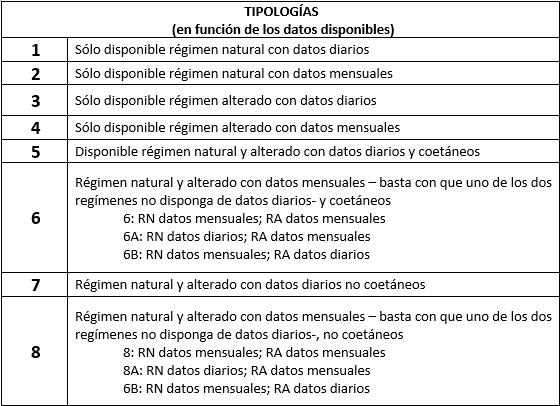

**Table No25**- Typology of case studies according to the characteristics of the data available for series of at least 15 years

The user is reminded that these typologies will be different if you work with REDUCIDAS SERIES (between 7 and 14 years old).The reader is referred to Annex 1 where everything about this case is explained.

In the **Table No26** the list of all the reports that the implementation can generate and in the **Table No27** The user can familiarize himself with the content of the reports using those generated by IAHRIS with the data contained in the two examples provided in the application database.

<table><tr><td colspan="3">
<strong><em>RELATIONSHIP OF REPORTS </em></strong>
</td></tr><tr><td rowspan="9">
<em>Characterisation of the magnitude and variability</em>
</td><td>
<strong>1</strong>
</td><td>
RN: CHARACTERIZATION OF THE magnitude AND INTERANUAL VARIABILITY
</td></tr><tr><td>
<strong>1a</strong>
</td><td>
RA: CHARACTERIZATION OF THE magnitude AND INTERANUAL VARIABILITY
</td></tr><tr><td>
<strong>1b</strong>
</td><td>
RN and RA: CHARACTERIZATION OF magnitude AND INTERANUAL VARIABILITY
</td></tr><tr><td>
<strong>2</strong>
</td><td>
RN: CHARACTERIZATION OF THE magnitude AND INTRANUAL VARIABILITY (statistics) 
</td></tr><tr><td>
<strong>2nd</strong>
</td><td>
RN: CHARACTERIZATION OF THE magnitude AND INTRANUAL VARIABILITY (median)
</td></tr><tr><td>
<strong>3</strong>
</td><td>
RA: CHARACTERIZATION OF THE magnitude AND INTRANUAL VARIABILITY (statistics)
</td></tr><tr><td>
<strong>3rd</strong>
</td><td>
RA: CHARACTERIZATION OF THE magnitude AND INTRANUAL VARIABILITY (median)
</td></tr><tr><td>
<strong>3b</strong>
</td><td>
RN and RA: CHARACTERIZATION OF magnitude AND INTRANUAL VARIABILITY (median)
</td></tr><tr><td>
<strong>3c</strong>
</td><td>
RN and RA: CHARACTERISATION OF INTANUAL VARIABILITY RANGO (percentiles)
</td></tr><tr><td rowspan="5">
<em>parameters for the characterization of the regime </em>
</td><td>
<strong>4</strong>
</td><td>
RN: parameters FOR CHARACTERIZATION WITH DARIOUS DATA
</td></tr><tr><td>
<strong>4th</strong>
</td><td>
RN: parameters FOR THE CHARACTERIZATION OF MESSUAL DATA
</td></tr><tr><td>
<strong>5</strong>
</td><td>
RA: parameters FOR CHARACTERIZATION WITH DARIOUS DATA
</td></tr><tr><td>
<strong>5a</strong>
</td><td>
RA: parameters FOR THE CHARACTERIZATION OF MESSUAL DATA
</td></tr><tr><td>
<strong>5b</strong>
</td><td>
RA: parameters FOR THE CHARACTERIZATION OF DIAL DATA (Natural System not available)
</td></tr><tr><td rowspan="6">
<em>Curves of flows classified</em>
</td><td>
<strong>6</strong>
</td><td>
RN: ANNUAL COURSES MEASURE VALUES flows CLASSIFIED
</td></tr><tr><td>
<strong>6a</strong>
</td><td>
RA: MEANS OF ANNUAL COURSES OF flows CLASSIFIED
</td></tr><tr><td>
<strong>6b</strong>
</td><td>
RN and RA: MEANS OF ANNUAL COURSES OF flows CLASSIFIED
</td></tr><tr><td>
<strong>6c</strong>
</td><td>
RN: MEDICAL VALUES OF MONTHLY COURSES flows CLASSIFIED
</td></tr><tr><td>
<strong>6d</strong>
</td><td>
RA: MEDICAL VALUES OF MONTHLY COURSES OF flows CLASSIFIED
</td></tr><tr><td>
<strong>6e</strong>
</td><td>
RN and RA: MEANS OF MONTHLY COURSES OF flows CLASSIFIED
</td></tr><tr><td rowspan="4">
<em>indices of hydrological alteration</em>
</td><td>
<strong>7a</strong>
</td><td>
RA: indices DE hydrological alteration: usual values (current daily data) 
</td></tr><tr><td>
<strong>7b</strong>
</td><td>
RA: indices DE hydrological alteration: usual values (current monthly data) 
</td></tr><tr><td>
<strong>7c</strong>
</td><td>
RA: indices DE hydrological alteration: usual values (non-temporary data)
</td></tr><tr><td>
<strong>7d</strong>
</td><td>
RA: indices DE hydrological alteration: floods And droughts 
</td></tr><tr><td rowspan="5">
<em>IPH-based global indicator for highly altered masses</em>
</td><td>
<strong>8</strong>
</td><td>
RA: INDICATOR P10-90 FOR MASS MUCH ALTERED (IPH)
</td></tr><tr><td>
<strong>8a</strong>
</td><td>
RA: IAH-MMA INDICATOR FOR MASS MOTHER MUCH ALTERED according to IPH (temporary daily data)
</td></tr><tr><td>
<strong>8b</strong>
</td><td>
RA: IAH-MMA INDICATOR FOR MASS MOST ALTERNATIVE according to IPH (non-contemporary daily data)
</td></tr><tr><td>
<strong>8c</strong>
</td><td>
RA. IAH-MMA INDICATOR FOR MASS MOTHER MOTHER MOTHER MOTHER MOTHER MOTHER MOTHERED according to IPH (concurrent monthly data)
</td></tr><tr><td>
<strong>8d</strong>
</td><td>
RA: IAH-MMA INDICATOR FOR MASS MOTHER MUCH ALTERED according to IPH (non-contemporaneous monthly data)
</td></tr><tr><td rowspan="4">
<em>Environmental significance of the hydrological alteration</em>
</td><td>
<strong>10a</strong>
</td><td>
ENVIRONMENTAL SIGNATURE OF THE indices DE hydrological alteration: usual values, floods And droughts (current daily data) 
</td></tr><tr><td>
<strong>10b</strong>
</td><td>
ENVIRONMENTAL SIGNATURE OF THE indices DE hydrological alteration: usual values (current monthly data) 
</td></tr><tr><td>
<strong>10c</strong>
</td><td>
ENVIRONMENTAL SIGNATURE OF THE indices DE hydrological alteration: usual values, floods And droughts (non-concurrent daily data) 
</td></tr><tr><td>
<strong>10d</strong>
</td><td>
ENVIRONMENTAL SIGNATURE OF indices DE hydrological alteration: usual values (non-concurrent monthly data) 
</td></tr></table>

**Table No26**- List of reports generated by IAHRIS

**Table No27**- List of reports generated by IAHRIS in each of the study typologies

In the User Manual, the reader can find information concerning the specific content of each report.

**ANNEX 1: METHODOLOGY FOR THE CASE OF REDUCED SERIES**

As discussed in the Introduction to this Manual, IAHRIS recommends having at least 15 full years of data to collect the year-on-year variability of hydrological regimeThis ensures a minimum of information with which to obtain reasonably acceptable conclusions related to variability and extreme values.

However, the application allows the analysis of shorter series, provided that at least seven full years of records are available. When the availability is between 7 and 14 years, the type of study is called REDUCID SERIES.

The analysis of REDUCIDAS SERIES has the following characteristics:

• The calculation of the indices of alteration will always be carried out according to the option of "non-coetaneity" since the non-availability of more than 15 years does not recommend doing the division in wet, medium and dry years. Consequently, the reports only show the results corresponding to the complete available series, without providing values of variables for dry years, mean years, or humid years.

• In principle, depending on the availability of data in one and/or the other regime, the same typologies could be presented as for the situation of 15 or more years, except for typologies 5 and 6 (as they are options that require coetaneity). Table 1 describes the typologies that can be presented and the corresponding reports.

**Table 1**- Typologies considered in reduced series (< 15 years) according to the availability of data and indication of reports provided by IAHRIS in each case

Reports identified in the table above as \_SR have slight differences compared to their homonyms of long series. These differences consist basically, as previously mentioned in not considering the division of years into the three types (wet, medium and dry) and, consequently, show the results corresponding to the complete available series, without providing variable values for each type of year. No results are provided by type of month.

When obtaining the report in SERIE REDUCIDA, the cover appears the notice "The user must keep in mind the uncertainty associated with the limited availability of data".

In the User Manual, the reader can find information concerning the specific content of each report.