***1***

**Introduction**

***WHY EVALUATE THE alteration OF THE natural flow regime?***

***WHAT IS IAHRIS?***

***WHAT CRITERIA HAVE BEEN USED TO SELECT THE parameters?***

***HOW TO QUANTIFY THE alteration OF THE natural flow regime?***

***WHAT INFORMATION IS NECESSARY?***

***WHAT RESULTS ARE MADE?***

***WHAT CAN THEY SERVE FOR?***

***TO KNOW MORE***

## ***WHY EVALUATE THE alteration OF THE natural flow regime?***

This question can be answered by considering three points of view: legal, scientific and managerial.

From the point of view **legal**, it is necessary to assess the alteration of the flow regime because this is established by the Water Framework Directive (DMA). This directive sets as a priority objective that the management of water resources must achieve good ecological status In order to achieve this objective, it is necessary to have protocols that allow an objective and efficient knowledge of the ecological status of rivers, and the DMA, in its annex V, contains a series of components of the river ecosystem that must necessarily be considered in order to assess their ecological status. hydrological regime.

From an optical point of view <strong>scientific</strong>, the transcendence of flow regime as an articulator and vertebrator element of the river ecosystem has had a relatively recent recognition, reaching its zenith with the formulation of the paradigm of natural flow regime: <em>"the full range of intra- and inter-annual variation of hydrological regime with its associated characteristics of magnitude, seasonality, duration, frequency and rate of change, are critical to sustain natural biodiversity and the integrity of aquatic ecosystems"</em> (Poff <em>et al</em>., 1997). The corollary of this axiom is immediate: success in the conservation of the biodiversity and functionality of our rivers depends on our ability to know, protect and/or restore the main aspects of natural flow regime.

For the public officials of the <strong>management</strong> of the rivers, it is necessary to know in what situation the aspects of the flow regime only from this knowledge is it possible to formulate appropriate diagnoses on which to base policies of use and management that allow to advance towards the objective of "<em>good ecological status</em>"or the optimal "potential." water bodies which may be qualified as "<em>highly hydrologically altered</em>", it is necessary to characterize so much the situation which currently presents its flow regime as the optimal hydrological potential compatible with the conditions that require that this condition be assigned.

## ***WHAT IS IAHRIS?***

**Í**ndices of **A**lteration **H**idrologic in **Ri**ver**S** It's a **computer application** to obtain:

- **parameters** with which **characterise the hydrological regime**, both natural and altered, at a point in a river. These parameters evaluate hydrological aspects of the regime with marked environmental significance (duration of the droughts, seasonality of the floods… ).

- If the user provides data of the two regimes, natural and altered, the application also calculates **indices** enabling **to assess the degree of alteration of the scheme** hydrological aspects in those aspects of greater environmental significance.

- The application also provides the environmental interpretation of the alteration previously evaluated, summarizing its significance on the main components of the affected ecosystem: morphology, fish fauna, benthic macroinvertebrates, fluvial habitat and riparian vegetation.

- In the above circumstances, i.e. having data on a natural and altered basis, the application assigns the **condition of water body "highly hydrologically altered"** on two complementary criteria (P10-90 and IAH-MMA criteria).

- For a given natural regime, the application allows to obtain a **set of scenarios of flows minimum ecological** specified at the level of monthly contribution.

- IAHRIS also offers a tool to assess the environmental suitability of different flow regime organic in its component of flow minimum, as well as the adequacy of the implementation of those scenarios.

- Finally, the application allows the download of the monthly contributions of the SIMPA model at the OAS capacity stations or at any other point specified by the user.

**RECALLS:**

- **parameter:** Each of the variables that, numerically, allows to characterize the aspects of greater environmental transcendence of the flow regime.
- **index:** Relationship between the values of the same parameter, in natural regime and in altered regime. It allows to quantify the differences between the reference state – natural regime – and any other – altered regime.

## ***WHAT CRITERIA HAVE BEEN USED TO SELECT THE parameters?***

The paradigm of flow regime already indicates the main aspects of the flow regime The link between these aspects of the regime and key factors of the river ecosystem can be summarized as follows:

- <strong>Magnitude</strong>: since it determines the <em><strong>availability</strong></em> general water in the ecosystem.
- <strong>Frequency</strong> with which an event occurs in a given time interval: indicative of variability in the flow regime and conditioning of the geomorphological and ecological dynamics, and therefore of the <em><strong>diversity</strong></em>.
- <strong>Duration</strong> or time interval associated with certain flow conditions: in extreme situations, floods and droughts, the duration is closely linked to the thresholds of <em><strong>resilience</strong></em> of the different species.
- <strong>Seasonality</strong> or regularity with which that event occurs at a certain time of year: it is a closely linked aspect and <em><strong>synchrony</strong></em> with the life cycles of the species (fluvial, estuaries and marine).
- <strong>Exchange rates</strong>: on the speed with which changes take place from one magnitude to another, affecting the <em><strong>response capacity</strong></em> biota.

Therefore, the process of characterizing flow regime should consider these five aspects, and should do so taking into account both average or usual values, as well as determinants of the overall availability of water in the ecosystem, as well as extreme values –floods and droughts- in defining these the most critical conditions that the ecosystem endures, and considering both year-on-year and seasonal variability.

Table 1 summarizes, for each component of the scheme, the aspects considered and the parameter proposed for characterization.

In the *Methodological Reference Manual* details of the definition and formulation used for the quantification of each of the parameters.

With this battery of parameters – four for the usual values, eight for the floods and seven for the droughts- a quantitative characterization of the regime can be obtained, which includes the most significant aspects and environmental impact. Such characterization can be obtained for any regime for which sufficient information is available, whether natural or altered, either as a real result of exploitation and/or regulation or as a result of a simulation in response to different management scenarios.

<strong>Table No 1:</strong> <em>List of parameters (P1-P19) for the characterization of flow regime.</em>

As can be seen, in the parameters IAHRIS offers there is no one linked to exchange rates. It is to be hoped that in future versions some parameter allow this aspect to be collected.

The interested reader can find a proposal to characterize exchange rates, both in the phase of hydrogram growth and in the phase of decline, in the book "*indices DE hydrological alteration IN FLUVIAL ECOSYSTEMS*" (Martínez Santa-María, C. & Fernández Yuste, J.A. 2006. CEDEX. Mo de Fomento; Mo de Medio Ambiente), as well as in the Manual of Methodological References IAHRIS v4.0 downloadable with the application.

## ***HOW TO QUANTIFY THE alteration OF THE natural flow regime?***

The WFD states that the characterization of the ecological status should be considered by comparing the situation that is to be analyzed with the reference one. For each of the elements to consider –hydrological regime; macroinvertebrates; phytobenths; fish fauna...- it is due to:

1) Define the variables to be measured according to their ability to reflect the environmental integrity of the analyzed element.

2) Establish the reference state, i.e. the values that these variables would take for minimum conditions alteration of the river ecosystem.

3) Calculate the Ecological Quality Ratios (EQR) as a ratio between the value of the variable for the current conditions and that corresponding to it in the reference state.

Accepted that the natural flow regime is the factor that determines the integrity of the river ecosystem to a greater extent, and having tools –parameters- to quantify the most important environmental aspects of the regime, indices to assess objectively the extent to which the regime currently in operation, other than the natural regime – altered regime – or any other proposed regime – for example an environmental regime of flows- differs or resembles the natural, since that analogy or difference will determine the current or potential integrity of the river.

<strong>Figure No 1:</strong> <em>CIS-WDF Recommendation for Ecological Quality Ratios</em>.

In response to the recommendations of CIS-WDF (2003) concerning RQRs (Figure 1), most of the **indices DE alteration** have been defined as **ratio between the value of the parameter in altered regime and the value of the same parameter on a natural basis.**

Table 2 shows the correlation between the indices of hydrological alteration which can calculate IAHRIS and the components of the scheme whose alteration evaluates, as well as the parameter which is used to calculate the index. In the *Methodological Reference Manual* details of the definition and formulation used for each index. If the alteration is evaluated with daily coetaneous series of the natural and altered regime, indices used are those listed in Table 2.

<strong>Table No2:</strong> <em>List of indices of hydrological alteration (IAH1 – IAH21) in contemporary regimens. indices of floods and droughts can only be calculated if the user has provided data on a daily basis</em>

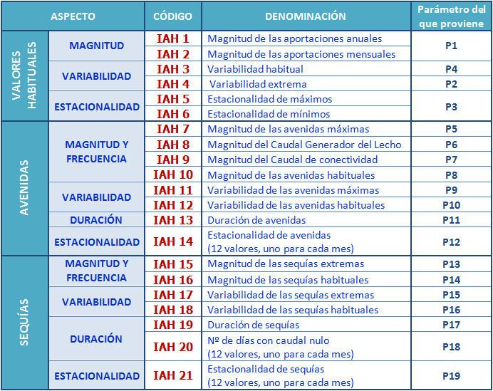

If the natural and altered regimen series do not have a contemporaneous period of 15 years or more, the indices in Table No3.

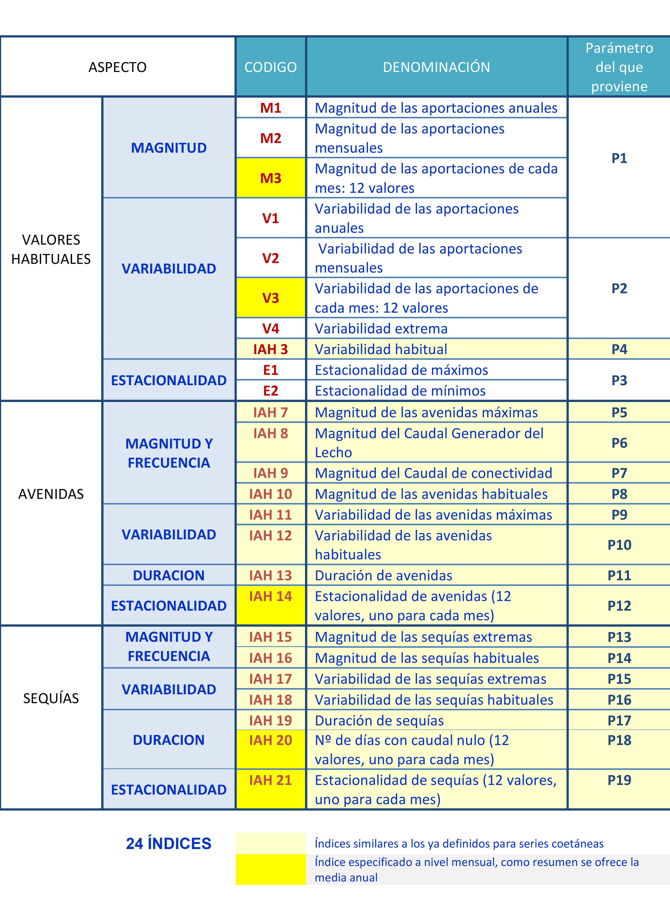

<strong>Table No3:</strong> <em>List of indices of hydrological alteration in non-coetaneous regimens. indices of floods and droughts can only be calculated if the user has provided data on a daily basis</em>

All indices, in order to homogenize and facilitate their interpretation, they present values between zero and one, the zero indicative of alteration maximum and one absence of alteration. Following the recommendations for RQEs, five levels or Hydrological Status have been established linearly distributed in the range in which the indices –zero-, assigning the recommended color code for EQRs (Figure No2).

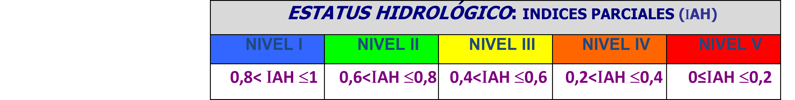

<strong>Figure No2:</strong> <em>Criteria for the allocation of qualitative categories to the indices of alteration</em>. (Value of the index very lowhydrological alteration very highLevel V; Value of the index very highhydrological alteration very lowLevel 1)

To facilitate global interpretation, and for each of the three major components of the scheme – usual values, floods and droughts- Two aids are offered.

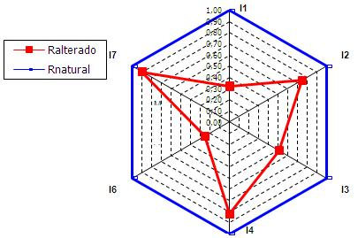

On the one hand, a grid chart that allows you to simultaneously see the values of the indices involved in the aspect evaluated (Figure No3). In this graph each axis represents a index and you can easily see how far or close the current value that reaches each index –in red in the figure – of its natural value, which always, by the convention assumed, is one (1.00).

<strong>Figure No3:</strong> <em>Diagram for the joint representation of indices</em> of usual values.

On the other hand, a index of alteration overall for each component - usual values; floods; droughts- which adds the values of the indices used to assess each of the aspects considered in that component of the regime. index aggregate or global, is evaluated as the ratio between the area defined by the polygon corresponding to the altered regime (delimited by the red line of Figure No3), and that corresponding to the natural regime polygon – which logically corresponds to the area associated with all the indices with value one (blue line of figure no3)-. Also for these indices of alteration a colour code is set (Figure No4).

It is important to keep in mind that indices they compare areas, and therefore consider the squares of the values of the indices of the component concerned – habitual, floods o droughts- and therefore the rank to which a particular status is assigned is different - follows a quadratic law - from that used for the indices Individuals.

<strong>Figure No4:</strong> <em>Criteria for the allocation of qualitative categories to the indices of alteration</em> Global.

## ***WHAT INFORMATION IS NECESSARY?***

As a general rule, IAHRIS **recommends having at least 15 full years** of data to collect year-on-year variability of hydrological regimeThis ensures a minimum of information with which to obtain reasonably acceptable conclusions related to variability and extreme values.

However, the application allows the analysis of shorter series, provided that at least seven full years of records are available. When the availability is between 7 and 14 years, the type of study is called with **REDUCED SERIES** and shall be detailed in Annex 2 to this document.

**IMPORTANT:**

- The recommended period of analysis is at least 15 full years of data in the natural and altered series.
- If one of the series to be analyzed has between 7 and 14 years, the study is also possible**,** but in this case it will be classified as **REDUCED.** The whole case of this situation will be developed in the **ANNEX 2** of this manual.

In either of the two cases cited (≥15 years or between 14 and 7 years), the data to be contained in the series may be flows daily (m3/s) or monthly contributions (hm3). If daily and monthly series of the same scheme are provided and covering the same period of time, the application will only consider the information obtained from the reading of the flows It is therefore necessary to provide only series with flows daily and monthly contributions if the records cover different dates.

The data are grouped into two types:

- Series in regime **NATURAL**: contains records corresponding to the natural flow regime. At each point of analysis it is only possible to contribute to the implementation **maximum** of **two series**, one with monthly contributions and one with flows daily.
- Series in regime **ALTERNATIVE**: contains records corresponding to a regime other than that of nature.

(a) The use and/or regulation of the river.

(b) A simulation, resulting from the implementation of infrastructure management protocols, an environmental regime scenario flows or any other hypothesis derived from the hydrological planning of the system.

The application admits at each point of analysis as many altered regimes as the user wants to analyze, providing for each of these regimes a maximum of two series, one with monthly contributions and the other with flows daily.

The type of information provided to the implementation determines the results obtained. In particular, these results depend on the following aspects:

- periodicity of records: data from flows daily means or monthly contributions
- series coetaneity: whether or not the data of the natural and altered regimes that are compared are from the same period
- extension of the series: number of full years provided (≥15 years or between 14 and 7 years).

The possible combinations of these three aspects give rise to the 8 main typologies listed in table 4:

<strong>Table No 4:</strong> <em>Study typologies in IAHRIS based on the characteristics of the data provided</em>

The following section details the reports that the application generates according to the characteristics –periodicity, coetaneity and extension – of the data provided.

## ***WHAT RESULTS ARE MADE?***

As just indicated, the <strong>results</strong> that the application offers <strong>depend on the information provided</strong>. When at a point of calculation the <u>more complete information</u>-series of flows daily in natural and altered regime, for 15 years or more and being the contemporaneous registers-, the application facilitates:

1. **Characterisation of natural and altered regimes:**

This process is carried out independently for each regimen under study, allowing to characterize and/or obtain:

- <u>Year-on-year variability</u>, classifying the years in wet, medium or dry according to their annual contribution is in the quartile that corresponds to the highest values -wet-, in the quartile of the lowest -dry- or in the two intermediates -medium-. The application also offers a set of descriptive statistics of the series of annual contributions calculated from the data provided.
- <u>Intranu variability</u>a, making a classification in each month (October, November, ...) following a process similar to that previously carried out at annual level. Thus the records of each month are classified in humid, medium or dry according to their monthly contribution is in the quartile that corresponds to the highest values of that month -wet-, in the quartile of the lowest of that month -dry- or in the two intermediates -medium-. The application also offers a set of descriptive statistics of the series of monthly contributions.

# Nineteen <u>parameters</u> (variables that, numerically, allow to characterize the aspects of greater environmental importance of flow regime):

## Four for the characterization of <u>usual values</u> of the regime.

## Eight for the characterization of <u>floods.</u>

## Seven for the characterization of <u>droughts.</u>

# Curve of flows classified for the middle year and for each of the twelve months

2. The evaluation of **ed hydrological alteration, by means of indices of alteration, IAH** (generally calculated as a ratio between the parameter in altered regime and the value of the same parameter on a natural basis) offer for contemporaneous registers (more favourable option):

- Twenty-one <u>indices Individuals</u>–each one evaluates the alteration of a parameter-:

## Six for the characterization of <u>usual values</u> of the regime.

## Eight for the characterization of <u>floods.</u>

## Seven for the characterization of <u>droughts</u>.

# Three <u>indices Global</u> –each one evaluates the alteration of a component; considers together the alteration of the parameters characterization of this component. Summary of the information provided by the 21 indices Individuals:

## index of alteration of usual values

## index of alteration of floods

## index of alteration of droughts

3. The **environmental interpretation of the alteration detected** earlier, indicating its potential significance to the main components of the river ecosystem: morphology, fish fauna, macroinvertebrates, habitat and riparian vegetation.

4. The **cataloging as water body highly hydrologically altered:**

# <u>A report obtained according to criterion P10-90</u>: <em>Heading 3.4.2 of the IPH (water bodies highly hydrologically altered) indicates: ...A water body She's here. highly hydrologically altered when there is a significant deviation in the magnitude of the parameters which characterize the monthly and annual conditions of the hydrological regime... The deviation shall be considered to be significant when the magnitude of the parameter annual or monthly deviates significantly from the percentile values of 10% to 90% of the series in natural regime.</em>

In this report of IAHRIS it is assumed that a water body is hydrologically <strong>very altered when the % of the</strong> <strong><u>not total months_</u>or % of</strong> <strong><u>not total years_</u>that meets is less than 50%</strong>. If this requirement is not met, IAHRIS does not assign classification.

# <u>A report obtained according to the IAH-MMA criterion</u>. <em>IPH 3.4.2 indicates: ... In rivers identified as water bodies your degree of hydrological alteration by the calculation of indices of hydrological alteration... with these indices the conditions of the reference natural regime are compared with the current conditions ... parameters used should be based on the fundamental characteristics of hydrological regimes, such as magnitude, duration, frequency, seasonality and exchange rates....</em>

In this report of IAHRIS it is assumed that a water body She's here. **hydrologically highly altered if more than 50% of the selected indicators show a alteration ≥ 50% (i. e. index takes a value ≤ 0.5).** If this requirement is not met, IAHRIS does not assign classification.

All these results, with numerical tables and graphs, IAHRIS offers them sorted in reports as sheets contained in a **Excel book**. Table 5 presents the list of all reports that IAHRIS can offer in the case of series of at least 15 years. It will be the case of the data provided – monthly or daily; contemporaneous or non-contemporaneous – that will determine the reports submitted for a particular case.

<table><tr><td colspan="3">
<strong>RELATIONSHIP OF REPORTS </strong>
</td></tr><tr><td rowspan="9">
Characterization of magnitude and variability
</td><td>
<strong>1</strong>
</td><td>
RN: CHARACTERIZATION OF INTERANUAL MAGNITUDE AND VARIABILITY
</td></tr><tr><td>
<strong>1a</strong>
</td><td>
RA: CHARACTERIZATION OF MAGNITUDE AND INTERANUAL VARIABILITY
</td></tr><tr><td>
<strong>1b</strong>
</td><td>
RN and RA: CHARACTERIZATION OF INTERANUAL MAGNITUDE AND VARIABILITY
</td></tr><tr><td>
<strong>2</strong>
</td><td>
RN: CHARACTERIZATION OF MAGNITUDE AND INTRANUAL VARIABILITY (statistics) 
</td></tr><tr><td>
<strong>2nd</strong>
</td><td>
RN: CHARACTERIZATION OF MAGNITUDE AND INTRANUAL VARIABILITY (median)
</td></tr><tr><td>
<strong>3</strong>
</td><td>
RA: CHARACTERIZATION OF MAGNITUDE AND INTRANUAL VARIABILITY (statistics)
</td></tr><tr><td>
<strong>3rd</strong>
</td><td>
RA: CHARACTERIZATION OF MAGNITUDE AND INTRANUAL VARIABILITY (median)
</td></tr><tr><td>
<strong>3b</strong>
</td><td>
RN and RA: CHARACTERIZATION OF MAGNITUDE AND INTRANUAL VARIABILITY (median)
</td></tr><tr><td>
<strong>3c</strong>
</td><td>
RN and RA: CHARACTERISATION OF INTANUAL VARIABILITY RANGO (percentiles)
</td></tr><tr><td rowspan="5">
parameters for the characterization of the regime 
</td><td>
<strong>4</strong>
</td><td>
RN: parameters FOR CHARACTERIZATION WITH DARIOUS DATA
</td></tr><tr><td>
<strong>4th</strong>
</td><td>
RN: parameters FOR THE CHARACTERIZATION OF MESSUAL DATA
</td></tr><tr><td>
<strong>5</strong>
</td><td>
RA: parameters FOR CHARACTERIZATION WITH DARIOUS DATA
</td></tr><tr><td>
<strong>5a</strong>
</td><td>
RA: parameters FOR THE CHARACTERIZATION OF MESSUAL DATA
</td></tr><tr><td>
<strong>5b</strong>
</td><td>
RA: parameters FOR THE CHARACTERIZATION OF DIAL DATA (Natural System not available)
</td></tr><tr><td rowspan="6">
Curves of flows classified
</td><td>
<strong>6</strong>
</td><td>
RN: ANNUAL COURSES MEASURE VALUES flows CLASSIFIED
</td></tr><tr><td>
<strong>6a</strong>
</td><td>
RA: MEANS OF ANNUAL COURSES OF flows CLASSIFIED
</td></tr><tr><td>
<strong>6b</strong>
</td><td>
RN and RA: MEANS OF ANNUAL COURSES OF flows CLASSIFIED
</td></tr><tr><td>
<strong>6c</strong>
</td><td>
RN: MEDICAL VALUES OF MONTHLY COURSES flows CLASSIFIED
</td></tr><tr><td>
<strong>6d</strong>
</td><td>
RA: MEDICAL VALUES OF MONTHLY COURSES OF flows CLASSIFIED
</td></tr><tr><td>
<strong>6e</strong>
</td><td>
RN and RA: MEANS OF MONTHLY COURSES OF flows CLASSIFIED
</td></tr><tr><td rowspan="4">
indices of hydrological alteration
</td><td>
<strong>7a</strong>
</td><td>
RA: indices DE hydrological alteration: HABITUAL VALUES (temporary daily data) 
</td></tr><tr><td>
<strong>7b</strong>
</td><td>
RA: indices DE hydrological alteration: HABITUAL VALUES (temporary monthly data) 
</td></tr><tr><td>
<strong>7c</strong>
</td><td>
RA: indices DE hydrological alteration: HABITUAL VALUES (non-temporary data)
</td></tr><tr><td>
<strong>7d</strong>
</td><td>
RA: indices DE hydrological alteration: floods And droughts 
</td></tr><tr><td rowspan="5">
IPH-based global indicator for highly altered masses
</td><td>
<strong>8</strong>
</td><td>
RA: INDICATOR P10-90 FOR MASS MUCH ALTERED (IPH)
</td></tr><tr><td>
<strong>8a</strong>
</td><td>
RA: IAH-MMA INDICATOR FOR MASS MOTHER MUCH ALTERED according to IPH (temporary daily data)
</td></tr><tr><td>
<strong>8b</strong>
</td><td>
RA: IAH-MMA INDICATOR FOR MASS MOST ALTERNATIVE according to IPH (non-contemporary daily data)
</td></tr><tr><td>
<strong>8c</strong>
</td><td>
RA. IAH-MMA INDICATOR FOR MASS MOTHER MOTHER MOTHER MOTHER MOTHER MOTHER MOTHERED according to IPH (concurrent monthly data)
</td></tr><tr><td>
<strong>8d</strong>
</td><td>
RA: IAH-MMA INDICATOR FOR MASS MOTHER MUCH ALTERED according to IPH (non-contemporaneous monthly data)
</td></tr><tr><td rowspan="4">
Environmental significance of the hydrological alteration
</td><td>
<strong>10a</strong>
</td><td>
ENVIRONMENTAL SIGNATURE OF THE indices DE hydrological alteration: HABITUAL VALUES, floods And droughts (current daily data) 
</td></tr><tr><td>
<strong>10b</strong>
</td><td>
ENVIRONMENTAL SIGNATURE OF THE indices DE hydrological alteration: HABITUAL VALUES (temporary monthly data) 
</td></tr><tr><td>
<strong>10c</strong>
</td><td>
ENVIRONMENTAL SIGNATURE OF THE indices DE hydrological alteration: HABITUAL VALUES, floods And droughts (non-concurrent daily data) 
</td></tr><tr><td>
<strong>10d</strong>
</td><td>
ENVIRONMENTAL SIGNATURE OF indices DE hydrological alteration: HABITUAL VALUES (non-contemporary monthly data) 
</td></tr></table>

<strong>Table 5</strong> <em>List of all reports that IAHRIS can offer for series of at least 15 years, with reference to the information contained in each of them</em>. <em>The number of reports it offers in a specific analysis depends on the data provided by the user, i.e. the study type (see Table 4). For more details on the results that the application facilitates according to the characteristics of the information provided by the user, refer to Chapter 5.</em>

## ***What can I serve IAHRIS for?***

Although it will be time, experience and input from users that can best answer the question under this heading, there are some issues that this application, we hope, can contribute to addressing rigorously and objectively.

**Why IAHRIS?** For:

- To make available to the scientific community and water managers an instrument to enable them to comply with the requirements of the WFD for **characterization of the hydrological status of water bodies**.
- Objectively quantifying the **alteration Inducing the use of** of water resources on the natural flow regime.
- Interpreting **consequences of the alteration** of the flow regime in the integrity of the river ecosystem.
- Work as **test bench**:

- Valuing the alteration on the natural flow regime would produce **different use and management scenarios** of water resources.

- Identifying the aspects of the current regime that most affect the **rehabilitation or recovery** of the water body in study.
- Setting objective criteria for **setting priorities** in the restoration of river ecosystems.
- Calculate and evaluate scenarios of environmental regimes in the minimum component using the natural regime as a reference.
- Assigning the condition of water body highly hydrologically altered with objective criteria

## ***TO KNOW MORE***

**RECALLS:**

- In order to make a good interpretation, application and evaluation of the results obtained with the <strong>Í</strong>Indices of <strong>A</strong>iteration <strong>H</strong>edrologic in <strong>RY</strong>o<strong>S</strong>, it is necessary to devote sufficient time to become familiar with the conceptual and methodological details presented in the <em><strong>Methodological Reference Manual.</strong></em>

With the indications to be presented under the following headings, it is easy, we hope, to prepare some data and execute the application, obtaining the corresponding reports.

However, it is highly advisable to invest the time needed to know in detail the basic principles and concepts on which this work is based, the hows and whys of the parameters selected to characterize the different components and aspects of the flow regimeas well as its formulation and that of the indices This is the only way to ensure that the results obtained can be interpreted, assessed and applied.

IAHRIS is born as free software, in the hope of offering the scientific, technical and management community a tool with which to contribute to the knowledge of the state of hydrological regime Improving the fundamentals on which IAHRIS is based, and also improving the software to facilitate the work of all stakeholders, should be a permanent goal in which all users can integrate. The source code of the application is available in....

***2***

**INSTALLATION**

***WHAT REQUIREMENTS MUST THE SYSTEM HAVE?***

***DOWNLOADING AND IMPLEMENTING THE INSTALLABLE***

***WHAT INSTALL AND WHERE FISHERS?***

## ***WHAT REQUIREMENTS MUST THE SYSTEM HAVE?***

**IMPRESCINDIBLE:**

- .NET Framework 4.0

*All reports generated by IAHRIS are presented in \-formatted files*.xlsx, but it is not necessary to have Microsoft Excel installed for IAHRIS to work.*

*All input data used by the application are stored in a \ formatted file*.mdb. IAHRIS runs without having Microsoft Access installed, allowing export and import databases.*

## ***DOWNLOADING AND IMPLEMENTING THE INSTALLABLE***

*The installation of the application is done through the installable file*

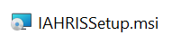

*available in* [*https://environmental.cedex.es/hydromorphology-iahris.php*](https://environmental.cedex.es/hydromorphology-iahris.php)

## ***WHAT INSTALL AND WHERE FISHERS?***

The installer is responsible for placing in the directory chosen by the user all the files required by the application.

When you press, a presentation window with an access button (Ir/Go) appears to the application:

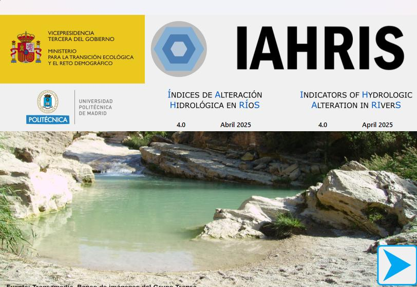

<strong>Figure 5</strong> <em>IAHRIS Application Initial Window</em>.

Files placed in the application directory should not be manipulated to ensure proper operation.

***3***

**DATA**

***WHAT DATA TYPES CAN BE COMPLETED?***

***IMPLEMENTATION AND THE ASSOCIATED DATA BASE***

***WHAT STRUCTURE MUST DATA FISHERS HAVE?***

## ***WHAT DATA TYPES CAN BE COMPLETED?***

The application uses time series of data corresponding to <strong>flows daily</strong>, expressed in m3/s, and/or a <strong>monthly contributions</strong>, expressed in hm3. In both cases, each record –flow or contribution - must carry <strong>date associated with the corresponding date</strong>, day, month and year in the case of flow daily, and month and year for monthly contribution.

For each point of the river only up to two series can be available on a natural basis, one with flows and one with monthly contributions.

For example, in the case of a dam which has been in operation for years, it may be considered as a single series corresponding to the altered scheme, or several, if over that period the management criteria have changed, so that each of the series flows For each of these periods it would be treated as an independent series, all with the character of altered regime and associated to the same point of the river. Another case for which several series in altered regime would be available for the same point of the river would be that in which different strategies of management of a hydraulic infrastructure were analyzed: for each hypothesis, and with the same or different time window, the corresponding simulated series would be generated, and each of these series would constitute a different altered regime linked to the same point of the river.

This possibility for the user to have at one point a river of more than one associated series in altered regime means that the application provides for a specific treatment for these series.

## ***IMPLEMENTATION AND THE ASSOCIATED DATA BASE***

In order to properly understand the structure, data management and operation of the application, it is necessary to bear in mind that its core is the database.

There are three key concepts around which the application organizes and manages information, calculations and results:

- **DRAFT:** entity or unit of work comprising a set of points, as well as their associated alterations and series**.**
- **POINT:** Point means the section or section of river for which data are available; flows daily and/or monthly contributions, either in natural or altered regime or in both regimes. All points to be stored in the database require an Identifier CODE and a DESCRIPTION, as many points as you want can be entered, provided that your Identifier CODE is different from any other code used for another point in the same project.
- **SERIE:** Series of flows daily means or monthly contributions associated with a particular POINT. All SERIES used by the application require to be assigned:

- **Type of periodicity:**  MONTHLY OR DAILY
- **Type of regimen:** NATURAL OR ALTERNATIVE
- **PUNTO code associated with the natural regime**
- **Code of alteration associated** (only for series corresponding to an altered regime)

The maximum number of series associated with a certain point is 2\*(1+No associated alterations), since each point can have two different series associated (of monthly contributions and of flows daily means) for each type of regime.

- <strong>alteration:</strong> As has already been pointed out in the first heading of this chapter, at one point several series may be considered corresponding to different altered regimes. In order to facilitate the management of this information, the application requires that any series of altered regime is always associated with a POINT and is declared in the database with an Identifier CODE of the alteration and a DESCRIPTION, can be introduced, for a certain POINT, as many altered regimes as you want, provided that the <u>ID code is different from any other used for a alteration within the same project</u>, regardless of the point to which the latter is associated.

## ***WHAT STRUCTURE MUST DATA FISHERS HAVE?***

Implementation **only reads csv files** (**c**omma **s**eparated **v**This is a type of simple text file, in which columns are separated using a certain character (which, in the present case, is the semicolon), and rows by line breaks.

These files can be made with different publishers, but they are based on a structure that is easily managed by **Microsoft Excel**, so this turns out to be a good editor for its handling, since it allows to organize all the information structured in columns, and save it as csv type file delimited by commas.

Valid import files must incorporate a first line containing the information necessary to establish what type of data they correspond to, what their periodicity is, and at what point of calculation; and alteration –the latter, only if it corresponds to a series of altered data- correspond. The rest of the lines – none of them blank – each contain the period (month and year) or date (day, month and year) to which they correspond, as well as the corresponding value of the series in question for that period or date.

The most common procedure for generating these csv files is to create them first in Excel and then save them in the required format.

The appropriate Excel structure of the files corresponding to the different data cases is described below:

1. **Natural data archive on a daily basis**

The first row of the file must always be collected in MAYUSCULAS:

• Column A: periodicity of the data. For this case it would be DIARIO

• Column B: type of regimen, NATURAL

• Column C: study point code (to be chosen by the user). Maximum 12 characters. In the example shown in figure 6 it has been chosen as the code of point EA3051

The following rows must be collected:

• Column A: date in dd/mm/yyyy

• Column B: flow daily average in m3/s

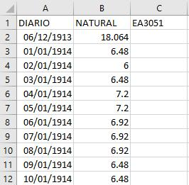

<strong>Figure No6:</strong> <em>Example of the format of the data file in natural regime with data from flows daily media</em>.

2. **Natural data archive on a monthly basis**

The first line must always be collected in MAYUSCULAS:

• Column A: periodicity of the data. For this case it would be MONTHUAL

• Column B: type of regimen, NATURAL

• Column C: study point code (to be chosen by the user). Maximum 12 characters. For the example shown in figure 7 it has been chosen as the code of point EA3051

The following rows must be collected:

• Column A: year, in aaaa format

• Column B: month, with the corresponding month number (1 January, .... 12 December)

• Column C: Monthly contribution in hm3

<strong>Figure No 7:</strong> <em>Example of natural data file format with monthly input data</em>

3. **Data file in altered regime on a daily basis**

The first row of the file must always be collected in MAYUSCULAS:

• Column A: periodicity of the data. For this case it would be DIARIO

• Column B: type of regimen, ALTERATED

• Column C: study point code (to be chosen by the user). Maximum 12 characters. If the altered series is to be compared with a natural series, the same point code used in the natural data file should be placed here. In the example shown in figure 8 it has been chosen as code of point EA3051

• Column D: code of the alteration (to be chosen by the user). Maximum 12 characters. In the example shown in figure no8 has been chosen as code of the alteration: EA3051\_A

The following rows must be collected:

• Column A: date in dd/mm/yyyy

• Column B: flow daily average in m3/s

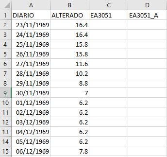

<strong>Figure No8:</strong> <em>Example of the format of the altered data file with data from flows daily media</em>.

4. **Data file in altered regime on a monthly basis**

The first line must always be collected in MAYUSCULAS:

• Column A: periodicity of the data. For this case it would be MONTHUAL

• Column B: type of regimen, ALTERATED

• Column C: study point code (to be chosen by the user). Maximum 12 characters. If the altered series is to be compared with a natural series, the same point code used in the natural data file should be placed here. For the example shown in figure 9 it has been chosen as the code of point EA3051

- Column D: code of the alteration (to be chosen by the user). Maximum 12 characters. In the example shown in figure no9 has been chosen as code of the alteration: EA3051\_A

The following rows must be collected:

• Column A: year, in aaaa format

• Column B: month, with the corresponding month number (1 January, .... 12 December)

• Column C: Monthly contribution in hm3

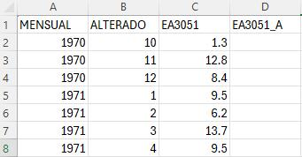

<strong>Figure No 9:</strong> <em>Example of the format of the altered data file with monthly input data</em>

**IMPORTANT COMMENTS**:

- The temporary information contained in an import file does not have to be ordered according to the date, since it is then ordered in the database. However, no dates are allowed, nor are there repeated dates (two or more lines with date or period). Bisiest years must incorporate February 29.

- Files cannot contain blank lines, and each line must contain all the required information.

- The correct operation of the application requires verification in the Control Panel; Region:

- Format: Spanish (Spain)
- Date: dd/MM/yyyy
- The decimal separator must be the "." and the list separator ";"

- Codes for both the point and the alteration must be in capital letters, without labels or strange characters (do not use the letter "ñ")

- The application is ready for **reject** any **file** that **not adjusted** strictly to **the formatting requirements** exposed.

- If errors or errors are detected when uploading files to the application, the application provides a list of them.

- Once the Excel file has been completed, the user must save the formatted file <strong>csv</strong>. To do this you just have to open the tab <em>Save as type</em> that Excel presents when selected <em>Save As</em> and mark <em><strong>CSV</strong></em> (delimited by commas).

- Figure 10 includes examples of different files valid for import, displayed through the Notepad.

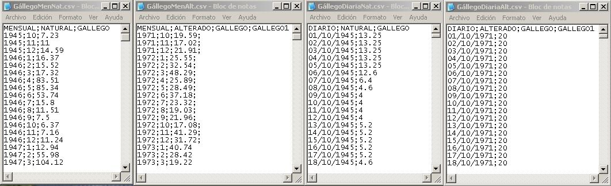

<strong>Figure 10:</strong> <em>Examples of csv files valid for import to the application</em>. In the example shown it has been used as code of the GALLEGO point and as code of the alteration GALLEGO1.

As a final check it is recommended to open, with the Notepad or other text editor of similar characteristics, the file **\*.csv** generated from Excel to VERIFY that meets the requirements required for it to be read by IAHRIS.

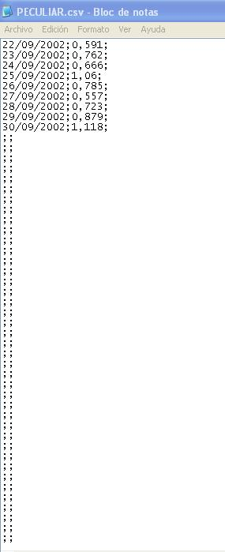

<strong>Figure 11</strong> <em>Appearance of wrong note block file when presenting blank rows</em>.

Sometimes, when Excel is used as a bridge to generate files **csv**, they present blank lines after the last one containing data. This circumstance is easily seen when the file **\*.csv** is opened with the Notepad and the scrollbar is accessed at the end of the data list (Figure 11). If a situation like that of the image appears, that file will NOT be read by IAHRIS, as it interprets that it contains blank lines, which are easily identified because they contain only semicolon. To solve this possible problem, the user can remove blank rows directly on the file. **\*.csv** with the Notepad, or in Excel delete the rows that follow the last one with data and even exhaust the path of the vertical scrollbar; apparently rows that do not contain any information are deleted, but that when converted to csv format incorporate the blank lines that give problems. **\*.csv** generated after that action should be valid.

***4***

**IMPLEMENTATION**

***FIRST CONTACT***

***DATA DECLARATION AREA***

***POINT SELECTION AREA, alteration AND SERIES***

***INFORMATION AREA ON SERIES***

***MODULE SELECTION AREA TO BE FULIZED***

***RESULTS AREA***

***DATABASE MANAGEMENT AREA***

***OTHER UTILITIES***

***FIRST CONTACT***

The main screen of the application has the following aspect when entering:

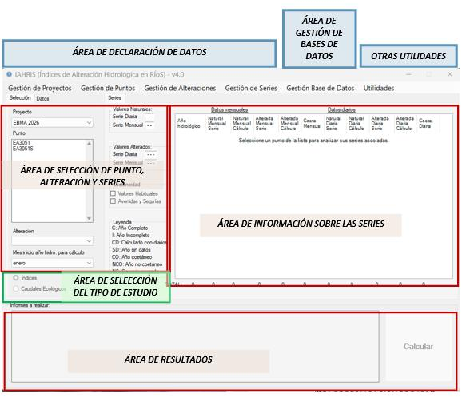

<strong>Figure 12</strong> <em>IAHRIS main screen with indication of the different areas</em>

SIETE areas containing menus enabled to cover different actions must be distinguished:

1. Data declaration area
2. Point selection area, alteration and series
3. Series information area
4. Selection area of the type of study to be carried out
5. Result area
6. Database management area
7. Other utilities

1. **DATA DECLARATION AREA**

Located at the header of the main window, it contains four tabs – Project Management, Points Management; Alteration Management and Series Management – that enable the necessary actions to declare to the database the points to be studied, the alterations considered and the available data series.

#### **A.1 PROJECT MANAGEMENT**

The Project is the working folder where the study points, their alterations (if any) and associated series are kept.

The Project Management tab allows you to: add a new project, edit an existing project, and delete a previously created project.

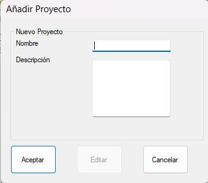

- **Add project:** allows you to enter a new project, including its name and a brief description of it.

<strong>Figure 12</strong> <em>Interface to add a new project</em>

Up to 12 characters are allowed for the introduction of the Name, and 20 for the introduction of the Description

- **Remove Project**: allows you to delete in the database any previously declared project. By selecting this option, the program informs us of the number of points associated with this project that will also be deleted.

<strong>Figure No 13:</strong> <em>Interface to remove an existing project</em>

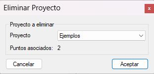

- **Edit Project:** allows you to view and modify the name and description of an already created project.

#### **A.2 POINT MANAGEMENT**

It allows you to manage the set of calculation points that you want to treat. Selecting the corresponding menu presents the following options:

- **Add point:** Allows you to enter a new calculation point. When the option is selected, the following pop-up screen is displayed:

<strong>Figure 14:</strong> <em>Interface to add a new point</em>

Data from the Point should be entered as follows:

- <strong>The code of the point:</strong> this code must <u>match exactly the declared in the csv file of the natural series</u><strong><u>.</u></strong>It is recalled that it is mandatory to write it in capital letters<strong>,</strong> without labels or strange characters and with a maximum of 12 characters.
- **The description of the point:** additional description provided by the user with a maximum of 20 characters. In case the user does not wish to enter a description, it must leave at least one blank space.
- **Associated project:** selecting the project -within existing ones- where you want to save the declared point.
- As a complementary option you can activate "<strong>Personalize the name of the regime."</strong> By activating this option the user can replace the default name and abbreviation given by the application to the reference regime (<em>Natural</em> and <em>nat</em> This name and abbreviation will be those that appear in the tables and graphical outputs of the reports generated.

Entered all information available buttons for **Accept** the new point or **Cancel** the operation.

In case of introduction of a **Code** of **Point** already registered in the same project, a message appears indicating such circumstance and aborting its introduction. Otherwise, the new point is registered to introduce later as many alterations and associated series are available.

The application allows to repeat dot codes whenever they belong to different projects.

- **Remove point:** It allows you to remove from the database any previously entered point of calculation. When the option is selected, the pop-up screen is displayed below.

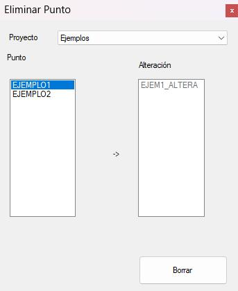

<strong>Figure No 15:</strong> <em>Interface to remove an existing point</em>

Contains to your left a drop-down list to select any of the **Points** When one of them is acted on, it will be highlighted on a blue background, presenting in the list on the right as many alterations associated, if any. Also, the button of **Delete**, located at the bottom right of the screen, will be enabled to remove the selected point. As indicated on the screen itself, the deletion of a point involves that of all alterations and series associated with the point in question. Finally, at the top right of the screen you will find a button to leave the screen and return to the main application, which will remain inactive while the deletion one is present.

#### **A.3 ALTERNATIVE MANAGEMENT**

With similar handling to the previous one, it allows to manage the regime changes associated with the set of previously declared calculation points. When selecting the corresponding menu, the following options are presented:

- **Add alteration**: Allows you to enter a new alteration, which must be linked to a certain point of calculation. When the option is selected, the following pop-up screen is presented:

<strong>Figure 16:</strong> <em>Interface to add a alteration</em>

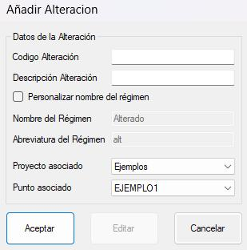

- <strong>The code of the alteration:</strong> this code must <u>match exactly the declared in the csv file of the altered series</u><strong><u>.</u></strong>It is recalled that it is mandatory to write it in capital letters<strong>,</strong> without labels or strange characters and with a maximum of 12 characters.
- **The description of the alteration:** additional description provided by the user with a maximum of 20 characters. In case the user does not wish to enter a description, it must leave at least one blank space.
- **Associated project:** selecting the project -within existing ones- where you want to save the alteration declared.
- **Associated point:** selecting the point -within the existing ones- to which you wish to link the alteration declared.
- As a complementary option you can activate "<strong>Personalize the name of the regime."</strong> By activating this option the user can replace the default name and abbreviation given by the application to the altered regime (<em>Disturbed</em> and <em>alt</em> This name and abbreviation will be those that appear in the tables and graphical outputs of the reports generated.

In the event that the **Code** of the alteration has already been registered previously (either for the point itself, or for another point in the same project), a pop-up message will appear rejecting the introduction of the alteration. Otherwise, it will be added to the database, returning to the main screen of the application. The application allows repeat the code of the alteration as long as they belong to different projects.

- **Remove alteration**: Allows you to remove from the database any alteration previously introduced.

<strong>Figure 17:</strong> <em>Interface to remove a alteration existing</em>

- **Edit alteration**: Allows viewing or modifying the information of the alteration selected.

#### **A.4 Serial management**

Similar to the above, it is designed to add or remove a certain time series from the database. It presents the following options:

- <strong>Add Series</strong>: Allows to add a time series to the database, provided that it corresponds to any of the possible series types and is associated with any of the following: <u>previously declared points and alterations</u>. To do this, all the information corresponding to a certain time series must be previously found in a particular file, located on the work team. The files to be used must carry the extension \*.csv, and in addition they must be adapted to the formats already described (see Chapter 3). When the option is selected, the pop-up screen will appear:

<strong>Figure No 18:</strong> <em>Interface for adding data series</em>

Pressing the button for **Browse** directories, allows you to search and select the csv-type file containing the time series intended to be imported into the database.

When loading a series, the pop-up windows shown in the application are different depending on a series with records of the altered regime or natural regime.

1. <u>Natural regime data load window</u>:

The user must select in the corresponding drop-downs, the associated project and point, which will have been previously declared.

The application will have been responsible for reading the first line of the file (where sensitive information has been included, as already mentioned), showing in the lower block of INFORMATION, the type of regime, its periodicity and the point code (which must match the one selected by the user in the top combo).

<strong>Figure 19:</strong> <em>Example of natural series load</em>

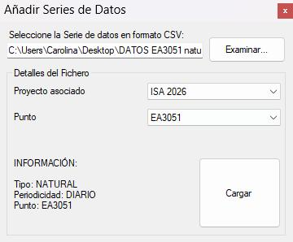

2. <u>Altered speed data load window</u>

The user must select in the corresponding dropdowns, the project and the alteration partners, which will have been declared in advance.

The application will have been responsible for reading the first line of the file (where sensitive information has been included, as already mentioned), showing in the lower block of INFORMATION, the type of regime, its periodicity, the point code and the code of the alteration (which must match the one selected by the user in the top combo).

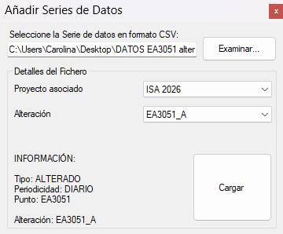

<strong>Figure 20:</strong> <em>Example of load of the series in altered regime</em>

Then you must press the button of **Load**.

If the csv file does not comply with certain conditions (including in the first line type of periodicity and type of regime, as well as codes registered in the base relating to the point and alteration in question, or that the dates corresponding to the observed values are not appropriate), when the series is loaded, an emergent message will appear aborting the import.

Once you press the button for **Load** The series included in the csv file will first be checked if the series in question is already in the database (characterized by the information included in the first line of the file). If it is already found, a pop-up message will appear, indicating the above circumstance and presenting the user with two possible options: either delete all the previously loaded information and then enter all the information included in the selected file, or cancel the loading operation. In the rest of the cases, the information contained in the file will be entered.

The load of information from a csv file is done by working line by line, checking date and value formats, as indicated below. In case of any error detected during the loading process, a pop-up message will appear indicating that the import could not be carried out, leaving the database in the same state as it was before proceeding to the corresponding load. The application provides a detailed file of the errors detected in the series to be loaded. Thus the user can access the csv file and correct the detected errors.

- **Remove Series**: Allows the complete deletion of a series of temporary data previously loaded into the associated database. Selected, the pop-up screen will appear below:

<strong>Figure 21:</strong> <em>Interface for the removal of pre-loaded series</em>

Acting on the list on the left, prepared for the user **Select** a **Point** to remove one or all of its associated series, it will stand out on a blue background, filling the combo prepared for **Select** one **alteration** with the set of alterations associated with the point, if any, so that you can choose the one you want from all of them. At the same time, all the buttons that allow **Delete** one **Natural Series Daily, Natural Monthly, alteration Daily or alteration Monthly.**

When pressing any of them, the application will proceed to delete all the information corresponding to that series that has been previously entered in the associated database. Finally, the screen has a button, located in its top right corner, to abandon the present utility and return to the main screen of the application.

2. **POINT SELECTION AREA, alteration AND SERIES**

It occupies the left area of the central body of the screen. It allows the user to select the point you want to analyze, informs of the series available for that analysis and allows to choose, from the series of altered values, the one desired to make the calculations.

First, the project should be selected, and within it the study point. Then, in the alteration drop-down, the alteration desired from among those declared for that point.

Finally, the lower window allows you to choose the starting month of the hydrological year. By default, the month of October appears.

<strong>Figure 22:</strong> <em>Interface for point selection and alteration</em>

In the intermediate body, the application automatically identifies the series in natural regime associated with the point, indicating whether the data provided are daily, monthly or both, and also the altered regime(s). It is necessary that those series, natural and altered(s), are previously declared in the database using the Series Management tabs and, where appropriate, Alteration Management. In the event that the point has linked more than one series in altered regime, the user can select the one he wishes to use in the analysis he intends to perform. The application presents the description associated with the selected series and the type of temporality of the data.

<strong>Figure 23:</strong> <em>Information from the natural and altered series selected by the user</em>

**RECALLS:**

- The first step is **select the draft work**, either creating a new one or choosing it from the existing ones. Then you have to **declare** on **POINT** calculation **(Add point)**.
- If altered regime data are available (whether or not data are available on a natural basis), the second step is **declare** ed **alteration (Add alteration)**. Next, you have to **load** the **Series** (natural or/and altered regime) in the application database **(Add Series)**.

3. **INFORMATION AREA ON SERIES**

Whenever a certain point of calculation has been selected and, optionally, a alteration information relating to the data available through the grid designed for this purpose, located on the right side of the screen, as reflected in Figure 24.

- For each **POINT** declared in the database, and, if applicable, selected the alteration associated, this area INFORMS:

- **D**e **data** contained in the series selected by the user for analysis.
- From the data that will finally be **use** for the **calculations**.

The finished columns in SERIE refer to the information collected in the file provided by the user. The finished columns in CALCUL report the data that the application will use to calculate parameters e indices.

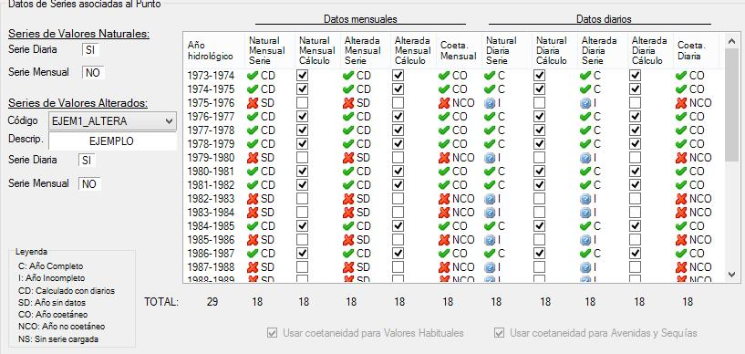

<strong>Figure 24:</strong> <em>Information panel of the existing information of the natural and altered series selected by the user</em>

For the entire period of available hydrological years and series, this grid indicates the information available in the bank.

For each hydrological year of the total period, as well as the type of series involved – monthly or daily series corresponding to the natural or altered regime – it is indicated whether or not all the data of the year are available.

As regards the monthly series – both natural and altered – the years indicated in the grid may not coincide with those recorded in the database (which contain only the monthly contribution values provided by the user). flows daily means available under the scheme, for those months in which daily data are available on all days of the month. In the remainder of the months in which the necessary daily data are not found and, on the other hand, if there is monthly data on the accumulated contribution, it will be taken from the monthly series previously registered in the bank. For this reason, and as regards the monthly data, it is indicated whether all the monthly data for a hydrological year have been obtained and whether these data have been calculated from the flows daily, according to the legend –CD- that is also included in the screen of the application.

In addition to the available data, the grid also indicates those to be used in the corresponding calculations (with a tic in the daily natural columns) *calculation*, monthly natural *calculation*, ...). As already mentioned, it is recommended at least 15 full years, whether consecutive or not, although the application is designed to work with series of at least 7 years.

The coetaneity of the series in natural and altered regime is a very important characteristic that the user must always know before making an interpretation of the results. Ideally, the series submitted to the analysis would be contemporaneous; thus the alterations shown by the indices They would have no variability-related components that could present the non-common time periods. An alternative is to require coetaneity to calculate the indices, but this option could leave out the analysis of cases of interest, even if running the risk of "polluting" the indices With the "noise" of comparing behaviors in different periods of time. In IAHRIS it has been chosen to offer the user the possibility to obtain results even when the series are not contemporaneous. Therefore, the grid includes the indication of the existing contemporaneous years, for both monthly and daily series.

With regard to the coetaneity of the series, it is appropriate to note some important details to be discussed below, using figure 25 which facilitates interpretation.

Period with data in Natural Regime

*Period with contemporaneous data*

Period with data in Altered Regime

<strong>Figure No25:</strong> <em>Illustrative example of coetaneity management in IAHRIS</em>

If the period of **contemporaneous data is 15 years or more**, as in the example (21 years from 59/60 to 79/80), and **There are more non-contemporaneous records**, checks under the grid shall be enabled: **Use Coetaneity for Habitual Values** and **Use Coetaneity to floods and droughts**.

<strong>Figure No26:</strong> <em>Checks for coetaneity selection at usual values and/or floods and droughts</em>

**RECALLS:**

- It is assumed that the records are **COETANIES** when the natural and altered series have **15 common full years**years that don't have to be consecutive.

There are three calculation options:

1. <strong>Activate both checks</strong>. This supposes that for the calculation of parameters e indices (customs, floods and droughtsThe same period shall be used for the characterization of the inter-annual and intra-annual variability of both natural and altered species. <em>It is the most recommended option when the number of contemporaneous years is only slightly lower than the number of years available.</em>

2. <strong>Activate only Use Coetaneity for usual values</strong>. The application will be used for the calculation of parameters e indices The same period will be used for the characterization of the interannual and intranual variability of both the natural and the altered. parameters e indices of floods and droughts use all available data (e.g. 41/42 – 79/80 for natural regime and 59/60 – 05/06 for altered regime). <em>It is the most recommended option when the number of years available is significantly higher than the number of contemporary years.</em>

3. **Activate only Use Coetaneity to floods and droughts.** The application will use only the contemporaneous years for the calculations of parameters e indices related to floods and droughts. For normal values and for the characterization of inter- and intra-nual variability of the natural and altered regime, use every year available in each regime: in the example, for the natural regime use the period 41/42 – 79/80, and 59/60-05/06 for altered regime.

- When checking is activated, the user will always be able to know the effect that this action has, by being able to see in the grid both the years of the different series used in the calculation, and the set of reports that the application offers for the selected option.

4. **MODULE SELECTION AREA TO BE FULIZED**

On the IAHRIS main screen you can select two modules or study types to be performed with the data loaded:

- **indices:** on the characterization of flow regime and estimate of indices of hydrological alteration. The case studies and reports obtained for this option are detailed in Chapter 5 of this Manual. The methodological foundations are reflected in the IAHRIS Methodological Reference Manual.

- **flows ecological:** Estimated scenarios for flows This module requires natural regime data of at least 15 years. The case study and reports obtained for this option are detailed in Chapter 6 of this Manual. The methodological foundations are reflected in the Manual of Methodological References for the estimation and evaluation of environmental scenarios. flows minimum ecological standards.

These two modules are not exclusive, so the user can perform one of them and then the other.

5. **RESULTS AREA**

This area occupies the lower third of the screen where the list of reports that the application can obtain is presented, a relationship that varies according to the selected module (indices o flows ) and the information available for the analysed point.

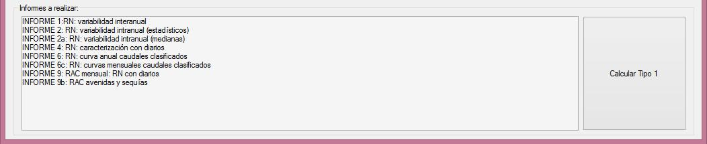

<strong>Figure No27:</strong> <em>Example of list of reports obtained with indices, for a typology analysis 1</em>

To the right, and once the application checks the availability of the necessary data and links to be able to make the necessary calculations, the calculation button that the user must press to make them is activated. Depending on the chosen option (indices o flows and the data provided indicate the typology of the study.

The application makes the corresponding reports, which will be stored in an Excel book, the name of which, by default, is automatically generated according to the codes of the point of calculation and the alteration as well as whether or not coetaneity has been required for monthly and daily data.

The location of the file, as well as the final name with which it is to be stored, can be chosen by the user via the pop-up screen.

The results files can be viewed and printed through Microsoft Excel. They include a set of reports, each on a sheet, and in all of them the identifying data of the selected calculation point and modified regime appear. In the first, a list is also included with the set of reports that have been calculated, as well as a relationship with the available data and those used in the calculations. The rest include values corresponding to the different ones. parameters e indices All sheets of this book are protected WITHOUT CONTRASE, to prevent the user from accidentally causing changes in the internal calculation processes. The user can unprotect each sheet by accessing the REVISION menu in Excel; Unprotect sheet.

- For each calculation performed, the application presents the results in an Excel book. Each sheet of the book is the report of a particular aspect of the regime, the parameters that characterise it or the indices of alteration. Also the results of flows ecological are presented in an Excel book.

- All sheets of this book are protected WITHOUT CONTRASE, to prevent the user from accidentally causing changes in the internal calculation processes. The user can unprotect each sheet by accessing the REVISION menu in Excel; Unprotect sheet.

- The number and content of the reports depends on the characteristics of the data provided in the series –periodicity (daily or monthly); coetaneity; not years.

6. **BASE MANAGEMENT AREA**

This menu allows the exchange of databases between different IAHRIS users, allowing the export and import of database files.

If selected **Import Database**, opens a window that allows:

- First of all, <strong>select the database to import</strong>: that database is in the executable, being an Access file with an extension <em><strong>.mdb</strong></em>

<strong>Figure No28:</strong> <em>Interface for selecting the database to import</em>

Once the import database is selected, two options are enabled:

1. <strong>Import a complete project:</strong> To do this in the drop-down select the project that we want to import and actuating the corresponding button is done the import to the target database. In the window below <em>Information</em>, you can follow the import process, which sometimes and depending on the size of the database can last several minutes. The process should not be terminated until the program does not send the completed export notice.

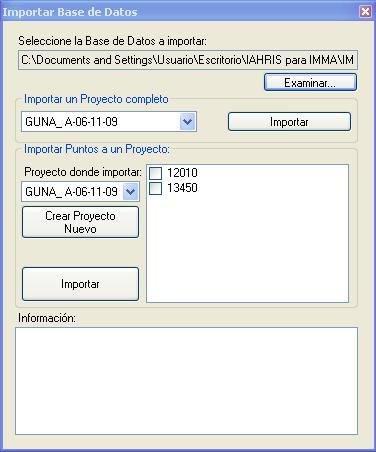

<strong>Figure 29:</strong> <em>Database Import Options</em>

2. **Import Points to a Project:** This option should be selected when the user does not want to import an entire project but only some or some of its points. There are two possibilities:

- **The project where you want to import the points is an existing project**, that is to say we can access it in the uncompromising list "Project where to import". The user must select the project in question, maculate the points to import and press "Import"
- **You want to create a new project where you import points**. To do this the user must press the "Create new project" button and enter the name and description of the new project and press accept

Automatically, the new project created appears in the uncompromising list of "Project to import". The following steps are similar to those described above, i.e. select the point(s) to import and press "Import". As already mentioned, the import process should not be terminated until the program sends the corresponding notice.

If selected "**Export database**", the global export of the existing database will be carried out at that time in the application. The process is immediate, as we can automatically select the destination location of the database to be exported, as well as its denomination.

7. **OTHER UTILITIES**

Two options are enabled in this tab:

- **Massive load:** allows for the processing of large amounts of data files unheeded and quickly.

- Allows you to select multiple files from one or more folders
- Lists data files detected with identified points and alterations
- It allows you to generate and execute a .bat file that will process all the data in a neglected way: it adds points and alterations to IAHRIS with the associated series, calculates the corresponding reports and exports the excel book generated for each case.
- The resulting Excel analysis files will be found in the folder indicated by the user
- Once the data process is complete, the application generates a list containing a synthesis of the information provided, if possible processing it (Figure 30).
- If errors appear in the process, you can generate a text file showing them

<strong>Figure No30:</strong> <em>Example of the loaded file list when using the Mass Load option</em>

Annex 3 to this Manual sets out the steps to be taken in a mass loading process.

- **Import SIMPA data:** This utility allows to obtain the results of the SIMPA model (monthly contributions in natural regime since the hydrological year 1940/41) for the period of interest, at any point in the drainage network.

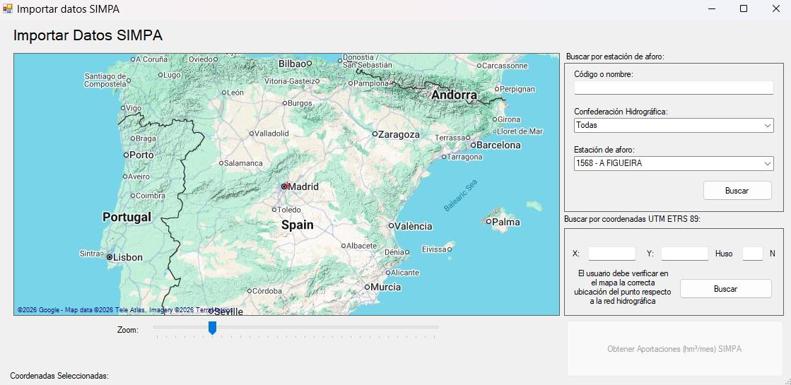

<strong>Figure No31:</strong> <em>Interface for SIMPA data import</em>

The user indicates in the application the chosen capacity station or the coordinates of the study point and selects *"Get SIMPA data*". On the pop-up screen should indicate the study period, the Point code and the Project where to save that information.

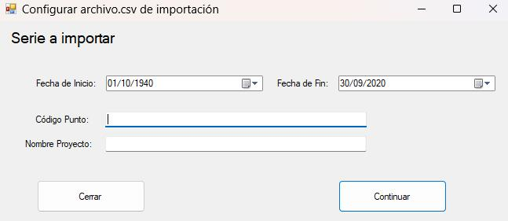

<strong>Figure 32:</strong> <em>Data to be entered for SIMPA data import</em>

The application provides the csv file of SIMPA data on a natural basis while automatically uploading that file to the specified project.

#### <strong><u>Important remarks:</u></strong>

#### 1.1.1.1 **Download SIMPA data from the CEDEX server**

- To generate the csv file of the requested point, IAHRIS needs to have SIMPA data on the user's computer for the required period.
- When this utility is first used, IAHRIS connects to the SIMPA data server to download and store the file with the information corresponding to the requested period. That information is not limited to the point; it is for the entire river network.
- As this information is stored for decades, the necessary information will be downloaded to cover the requested period.

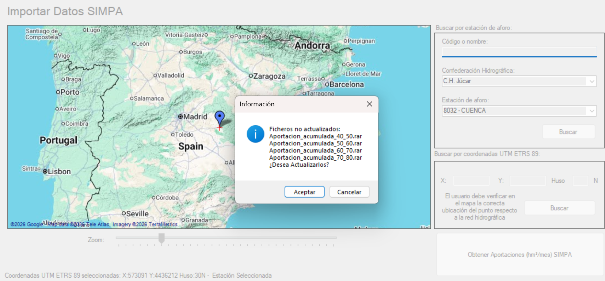

- There may be insufficient space available on the user's disk. In that case the download is interrupted and the user must ensure that the disk has sufficient space.

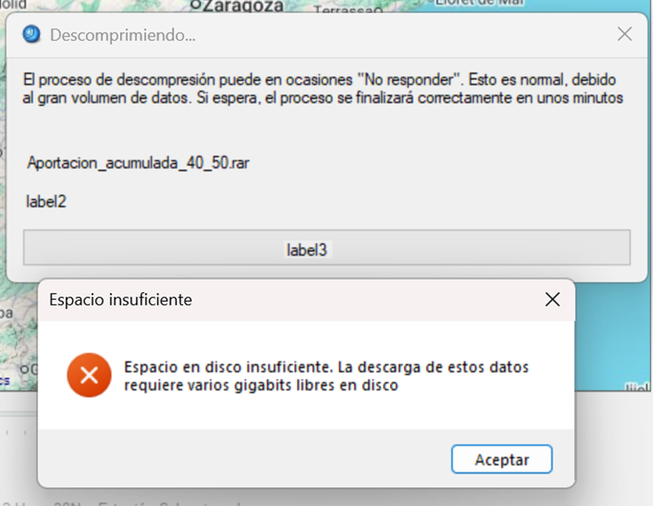

- Once the SIMPA data has been downloaded, it is decompressed to extract the necessary data. This process can be extended and sometimes a "no response" message can appear, but if expected, the process will end properly.

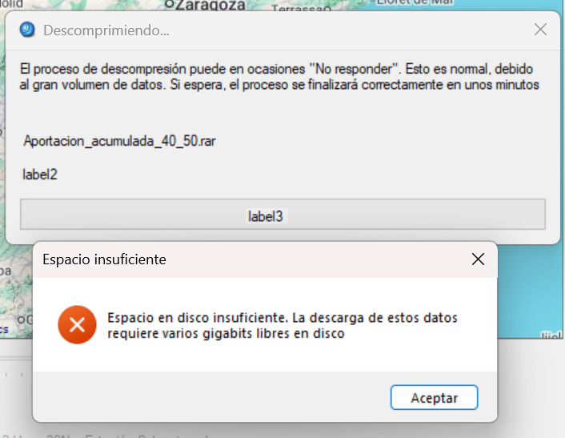

- Once the information is extracted, the SIMPA data is kept on the user's computer compressed.
- If the user requests the download of data for another point and for the same period, IAHRIS uses the compressed data that has already been downloaded.
- If the requested period has years that are not available on the user's computer, IAHRIS accesses the SIMPA server to download the decade or decades you need.

**B) Coordinate search**

- The user must ensure that the coordinates he or she introduces correspond exactly to his or her point of interest.
- It is advisable to use the UTM ETRS 89 coordinates obtained with Iberpix.
- It is important to bear in mind that the map is only a visual support. It does NOT provide information to ensure that the point whose coordinates have been entered corresponds to the point desired by the user.
- To ensure that the information obtained is adequate, it is highly recommended to view the obtained csv file:
- The coordinates provided may not be in the appropriate pixel and the values shown may correspond to a pixel in the field where there is no flow concentration and therefore the monthly contributions obtained are zero or negligible.
- This verification is always important, but especially in the event that the point is near a confluence, since it may be offering values downstream of the confluence, when what is of interest is upstream, or vice versa.

**IMPORTANT**

**In Annex 1 you have a BRIEF USER GUIDE**

**In Annex 3disposes of a Guide to the MASIVA Charging tool**

***5***

**MODULE indices**

***A GENERAL VISION***

***HOW DO DATA CHARACTERISTICS IN THE RESULTS OF IAHRIS?***

***HOW ARE THE RESULTS GRANTED?***

***How are the reports linked to the CHARACTERISTICS OF DATA?***

##  ***A GENERAL VISION***

In your module indices , enabled by default,

IAHRIS allows you to obtain **parameters** with which **characterise the hydrological regime**, both natural and altered, and **indices** enabling **to assess the degree of alteration of the scheme** hydrological aspects in those aspects of greater environmental significance. parameters e indices the key results of IAHRIS. The application also allows to obtain a global indicator of water bodies highly hydrologically altered and the monthly simulation of scenarios of environmental regimes flows minimum together with the assessment of their environmental suitability.

### ***parameters E indices***

Table 1 presented the full list of parameters that the application can use for the characterization of both the natural and altered regime. For the convenience of the reader, they are presented again below. *Methodological Reference Manual* the definitions and calculation specifications of each of these categories can be found parametersRegardless of the consultation of these calculation specifications, it should be noted that:

• The parameters **P1**, **P2** and **P4** characterise the so-called weighted year.

This requires the independent characterisation of these parameters for each of the types of year considered.

For example, to estimate P1 wet P1, medium P1, dry P1, which characterize the wet, medium and dry years respectively.

These three values end in a single one, P1; obtained when weighted according to the percentage of presence of each type of year in the series (25 % for wet and dry years and 50% for average years).

P1 = 0.25\*(Wet P1 + Dry P1) + 0.50\* Medium P1

• The parameters **P12**, **P18** and **P19** are specified at monthly level: P12 October, P12 November...

<strong>Table No 1:</strong> <em>List of parameters (P1-P19) for the characterization of flow regime (natural and altered)</em>

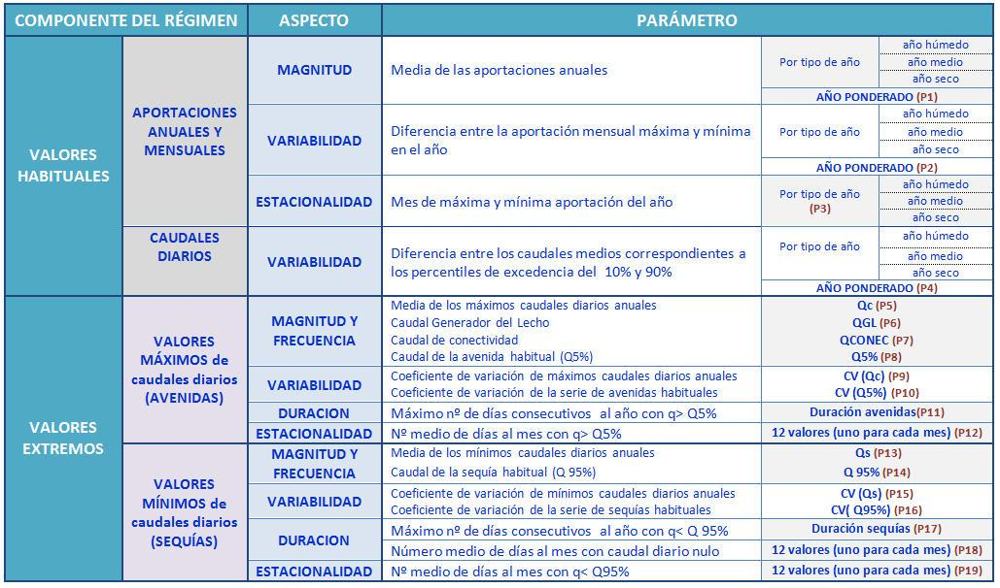

Tables Nos 2 and 3 are also presented again, showing the indices of alteration the application offers the user, distinguishing between the situations of contemporaneous or non-contemporaneous regimes. indices of floods and droughts can only be calculated if the user has provided data on a daily basis.

1. <u>FOR COETAN SCHEMES:</u>

<strong>Table No2:</strong> <em>List of indices of hydrological alteration (IAH1 – IAH21) for contemporary regimens. indices of floods and droughts can only be calculated if the user has provided data on a daily basis</em>

In the *Methodological Reference Manual* can be found calculation specifications for each of these indicesthe following two indications should be taken into account:

• All indices of Custom Values are calculated by type of year. As a summary of the alteration, the weighted value is offered.

• The indices IAH14, IAH20 and IAH21 are specified at monthly level, and the annual average of these monthly values is offered as a conclusion.

1. <u>FOR NON-COETABLE SCHEMES</u>, they stay the same indices for floods and droughts that in the option of coetaneity and only change the indices of usual values:

<strong>Table No3:</strong> <em>List of indices of hydrological alteration in non-coetaneous regimens. indices of floods and droughts can only be calculated if the user has provided data on a daily basis</em>

As has been shown, the results that the application offers in each requested analysis depend on the information provided to the application. The case study derived from the data provided is relatively complex, and the two generic cases presented in the preceding paragraphs do not exhaust the possibilities, although they can serve as a starting point for further details. Therefore, and so that the user can know what IAHRIS, this manual, will offer him under the following headings:

1. Describes the different characteristics that the data provided may have.
2. It presents all the reports that the application can offer.
3. Indicates the reports provided according to the typology of the data provided
4. Summarize the contents of each report

## ***HOW DO DATA CHARACTERISTICS IN THE RESULTS OF IAHRIS?***

The series can be characterized by three aspects: periodicity, nature and coetaneity. Below, it is presented, in a summary way, how these characteristics determine the results offered by the application.

<strong>PERIODICITY:</strong> They may contain two types of records: flows daily media (m3/s) or monthly contributions (hm3). Each series can only contain data of the same type.

How does periodicity influence results?

Having only a series of monthly contributions limits the results to three parameters –P1; P2 and P3-, and five indices –IAH1; IAH2; IAH4; IAH 5 and IAH6- linked, parameters e indices, only to the component of Habitual Values. The characterization of floods and/or droughts the need for day-to-day records. index global mass highly hydrologically altered shall be carried out solely on the basis of indices available.

**NATURE:** The records, whether daily or monthly, may correspond to the natural regime or to an altered regime. For a point of study, the natural regime is unique, although up to two series with data of this nature can be available, one with daily records and another with monthly records. As many altered regimes as the user has information can be considered. At least 7 years of records are indispensable, not necessarily consecutive, although as mentioned above it is recommended to work with at least 15 years.

How does the nature of the regime influence the results?

The characterization of natural and altered regimes is independent. That is, we can characterize the natural regime without having an associated altered regime and vice versa.

However, for the evaluation of the alteration It is essential to have the records of both contemporary regimes or not and always of at least 7 years.

**COETANITY:** Common quality of the natural and altered series of a point referring to the fact that the information contained in those series corresponds to the same years.

How does coetaneity influence results?

The ideal situation, thus qualified because it would allow IAHRIS to offer the most complete information, corresponds to the case in which the user has natural and altered series coetaneas of fifteen years or more. For that case, the application would facilitate for each of the regimes the 19 parameters (Table No 1), as well as 21 indices of alteration (Table No2) plus all three indices of alteration Global (index of alteration of standard values; index of alteration of floods; index of alteration of droughts).

However, when the natural and altered series are less than fifteen years old, or having more the user decides not to consider that condition (in IAHRIS, and for the two circumstances, the case is identified with <strong>NON-COETANITY</strong>), the application uses <strong>parameters</strong> e <strong>indices</strong> specific to that case (see <em>Methodological Reference Manual</em>).

The index of highly altered masses will be obtained from the indices calculated in each case.

The possible case study according to the data provided on the basis of the above aspects gives rise to the **8 Main types (for series of at least 15 years old)**, which is summarized in Table 4 below:

<strong>Table No 4:</strong> <em>Typology of case studies according to the characteristics of the data available for series of at least 15 years</em>

The user is reminded that these typologies will be different if you work with **REDUCIDE SERIES** (between 7 and 14 years) The reader is referred to Annex 2 which explains everything about this case.

## ***HOW ARE THE RESULTS GRANTED?***

To facilitate the organization and systematization of the results provided by the application, these are structured into REPORTS, such as LEVELS of an EXCEL BOOK. Below is part of a sheet (report) of one of these books (see the tabs at the bottom that give access to each of the reports in the results book of the analysis performed).

<strong>Figure No 33:</strong> <em>Example of the different sheets of an Excel book containing the IAHRIS report listing of uploaded files when using the Mass Load option</em>

By default, IAHRIS calls the Excel file as shown below, where the dot code used was "ExAMPLE2" and the code alteration "EJEM2\_ALTERA" and simulation has been performed with monthly data (COEMSI) and daily non-contemporaneous data (COEDNO):

***EXAMPLE2\_EJEM2\_ALTERA\_COEMSI\_COEDNO.xlsx***

## ***How are the reports linked to the CHARACTERISTICS OF DATA?***

Table 5 presented the list of all reports that the application can generate, a table that is re-included to facilitate user tracking of this chapter. The user can familiarize himself with the content of the reports using those generated by IAHRIS with the data contained in the two examples provided in the application database.

Table 6 presents the reports generated for each study typology according to the data provided:

<strong>Table 5</strong> <em>List of all reports IAHRIS can offer.</em>

<table><tr><td colspan="3">
<strong>RELATIONSHIP OF REPORTS </strong>
</td></tr><tr><td rowspan="9">
Characterization of magnitude and variability
</td><td>
<strong>1</strong>
</td><td>
RN: CHARACTERIZATION OF INTERANUAL MAGNITUDE AND VARIABILITY
</td></tr><tr><td>
<strong>1a</strong>
</td><td>
RA: CHARACTERIZATION OF MAGNITUDE AND INTERANUAL VARIABILITY
</td></tr><tr><td>
<strong>1b</strong>
</td><td>
RN and RA: CHARACTERIZATION OF INTERANUAL MAGNITUDE AND VARIABILITY
</td></tr><tr><td>
<strong>2</strong>
</td><td>
RN: CHARACTERIZATION OF MAGNITUDE AND INTRANUAL VARIABILITY (statistics) 
</td></tr><tr><td>
<strong>2nd</strong>
</td><td>
RN: CHARACTERIZATION OF MAGNITUDE AND INTRANUAL VARIABILITY (median)
</td></tr><tr><td>
<strong>3</strong>
</td><td>
RA: CHARACTERIZATION OF MAGNITUDE AND INTRANUAL VARIABILITY (statistics)
</td></tr><tr><td>
<strong>3rd</strong>
</td><td>
RA: CHARACTERIZATION OF MAGNITUDE AND INTRANUAL VARIABILITY (median)
</td></tr><tr><td>
<strong>3b</strong>
</td><td>
RN and RA: CHARACTERIZATION OF MAGNITUDE AND INTRANUAL VARIABILITY (median)
</td></tr><tr><td>
<strong>3c</strong>
</td><td>
RN and RA: CHARACTERISATION OF INTANUAL VARIABILITY RANGO (percentiles)
</td></tr><tr><td rowspan="5">
parameters for the characterization of the regime 
</td><td>
<strong>4</strong>
</td><td>
RN: parameters FOR CHARACTERIZATION WITH DARIOUS DATA
</td></tr><tr><td>
<strong>4th</strong>
</td><td>
RN: parameters FOR THE CHARACTERIZATION OF MESSUAL DATA
</td></tr><tr><td>
<strong>5</strong>
</td><td>
RA: parameters FOR CHARACTERIZATION WITH DARIOUS DATA
</td></tr><tr><td>
<strong>5a</strong>
</td><td>
RA: parameters FOR THE CHARACTERIZATION OF MESSUAL DATA
</td></tr><tr><td>
<strong>5b</strong>
</td><td>
RA: parameters FOR THE CHARACTERIZATION OF DIAL DATA (Natural System not available)
</td></tr><tr><td rowspan="6">
Curves of flows classified
</td><td>
<strong>6</strong>
</td><td>
RN: ANNUAL COURSES MEASURE VALUES flows CLASSIFIED
</td></tr><tr><td>
<strong>6a</strong>
</td><td>
RA: MEANS OF ANNUAL COURSES OF flows CLASSIFIED
</td></tr><tr><td>
<strong>6b</strong>
</td><td>
RN and RA: MEANS OF ANNUAL COURSES OF flows CLASSIFIED
</td></tr><tr><td>
<strong>6c</strong>
</td><td>
RN: MEDICAL VALUES OF MONTHLY COURSES flows CLASSIFIED
</td></tr><tr><td>
<strong>6d</strong>
</td><td>
RA: MEDICAL VALUES OF MONTHLY COURSES OF flows CLASSIFIED
</td></tr><tr><td>
<strong>6e</strong>
</td><td>
RN and RA: MEANS OF MONTHLY COURSES OF flows CLASSIFIED
</td></tr><tr><td rowspan="4">
indices of hydrological alteration
</td><td>
<strong>7a</strong>
</td><td>
RA: indices DE hydrological alteration: HABITUAL VALUES (temporary daily data) 
</td></tr><tr><td>
<strong>7b</strong>
</td><td>
RA: indices DE hydrological alteration: HABITUAL VALUES (temporary monthly data) 
</td></tr><tr><td>
<strong>7c</strong>
</td><td>
RA: indices DE hydrological alteration: HABITUAL VALUES (non-temporary data)
</td></tr><tr><td>
<strong>7d</strong>
</td><td>
RA: indices DE hydrological alteration: floods And droughts 
</td></tr><tr><td rowspan="5">
IPH-based global indicator for highly altered masses
</td><td>
<strong>8</strong>
</td><td>
RA: INDICATOR P10-90 FOR MASS MUCH ALTERED (IPH)
</td></tr><tr><td>
<strong>8a</strong>
</td><td>
RA: IAH-MMA INDICATOR FOR MASS MOTHER MUCH ALTERED according to IPH (temporary daily data)
</td></tr><tr><td>
<strong>8b</strong>
</td><td>
RA: IAH-MMA INDICATOR FOR MASS MOST ALTERNATIVE according to IPH (non-contemporary daily data)
</td></tr><tr><td>
<strong>8c</strong>
</td><td>
RA. IAH-MMA INDICATOR FOR MASS MOTHER MOTHER MOTHER MOTHER MOTHER MOTHER MOTHERED according to IPH (concurrent monthly data)
</td></tr><tr><td>
<strong>8d</strong>
</td><td>
RA: IAH-MMA INDICATOR FOR MASS MOTHER MUCH ALTERED according to IPH (non-contemporaneous monthly data)
</td></tr><tr><td rowspan="4">
Environmental significance of the hydrological alteration
</td><td>
<strong>10a</strong>
</td><td>
ENVIRONMENTAL SIGNATURE OF THE indices DE hydrological alteration: HABITUAL VALUES, floods And droughts (current daily data) 
</td></tr><tr><td>
<strong>10b</strong>
</td><td>
ENVIRONMENTAL SIGNATURE OF THE indices DE hydrological alteration: HABITUAL VALUES (temporary monthly data) 
</td></tr><tr><td>
<strong>10c</strong>
</td><td>
ENVIRONMENTAL SIGNATURE OF THE indices DE hydrological alteration: HABITUAL VALUES, floods And droughts (non-concurrent daily data) 
</td></tr><tr><td>
<strong>10d</strong>

<strong>Table 5 </strong>List of all reports IAHRIS can offer.
</td><td>
ENVIRONMENTAL SIGNATURE OF indices DE hydrological alteration: HABITUAL VALUES (non-contemporary monthly data) 
</td></tr></table>

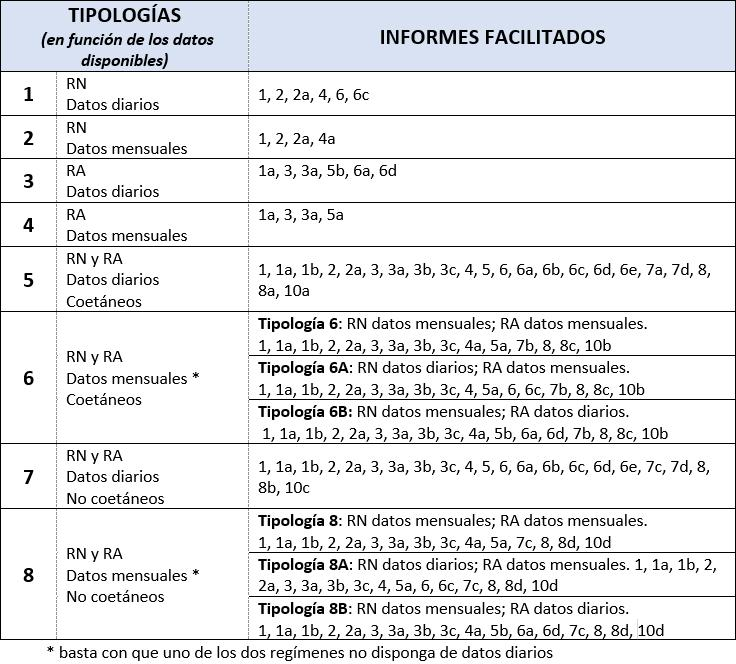

<strong>Table No6:</strong> <em>Reports provided according to the typology of the case study</em>

All studies, regardless of their typology, also have an initial page or cover.

## ***WHAT IS THE CONTENT OF REPORTS?***

A brief summary of the content of each of these reports is provided in the following pages.

<table><tr><td colspan="3">
<strong>CHARACTURE</strong>
</td></tr><tr><td></td><td></td><td>
<strong>SUMMARY OF CONTENTS</strong>
</td></tr><tr><td colspan="2">
<strong><em>General data of the study</em></strong>
</td><td><ul><li>Codes used</li><li>Date of submission of the report</li><li>List of reports obtained</li><li>Month of beginning of the hydrological year</li><li>Available data and data used for the preparation of reports indicating:<ul><li>hydrological year</li><li>monthly or annual periodicity</li><li>coetaneity between regimes </li><li>full or incomplete years</li><li>not total years used</li></ul></li></ul></td></tr></table>

<table><tr><td colspan="3">
<strong>CHARACTERIZATION OF THE MAGNITITY OF ANNUAL CONTRIBUTIONS AND INTERANUAL VARIABILITY</strong>
</td></tr><tr><td>
<strong><em>REPORT</em></strong>
</td><td>
<strong>SCHEDULE </strong>
</td><td>
<strong>SUMMARY OF CONTENTS</strong>
</td></tr><tr><td>
<strong><em>1</em></strong>
</td><td>
RN
</td><td rowspan="2"><ul><li>Annual contributions for each year of the series</li><li>Characterization of year-on-year variability: <ul><li>contribution thresholds for each type of year (wet, medium and dry)</li><li>Years of each type </li></ul></li><li>Descriptive statistics of annual contributions: minimum, mean, maximum, quartiles (Q1, Q2, Q3), interquartile range, coefficient of variation and asymmetry coefficient</li><li>Diagram of boxes and mustaches</li><li>Chart of annual contributions</li></ul></td></tr><tr><td>
<strong><em>1a</em></strong>
</td><td>
RA
</td></tr><tr><td>
<strong><em>1b</em></strong>
</td><td>
RN and RA
</td><td><ul><li>Annual contributions for each year of the series in both schemes</li><li>Characterisation of year-on-year variability: contribution thresholds for each type of year (wet, medium and dry) in both regimens</li><li>Joint Chart for Both Annual Contribution Schemes</li><li>Diagram set of boxes and mustaches</li></ul></td></tr></table>

<table><tr><td colspan="3">
<strong>CHARACTERIZATION OF THE MAGNITITUDE OF MONTHLY CONTRIBUTIONS AND OF INTENUAL VARIABILITY</strong>
</td></tr><tr><td>
<strong><em>REPORT</em></strong>
</td><td>
<strong>SCHEDULE </strong>
</td><td>
<strong>SUMMARY OF CONTENTS</strong>
</td></tr><tr><td>
<strong><em>2</em></strong>
</td><td>
RN
</td><td rowspan="2"><ul><li>Monthly contributions for each month and year of the series</li><li>Characterization of extreme variability in each year (AP maximum month - AP minimum month)</li><li>Descriptive statistics of monthly contributions for each month: minimum, mean, maximum, quartiles (Q1, Q2, Q3), interquartile range, coefficient of variation and asymmetry coefficient</li><li>Relative frequencies of maximum and minimum monthly contributions (not times maximum / minimum in a given month compared to total data)</li><li>Chart of monthly contributions statisticians</li><li>Diagram of boxes and mustaches of extreme variability</li></ul></td></tr><tr><td>
<strong><em>3</em></strong>
</td><td>
RA
</td></tr><tr><td>
<strong><em>2nd</em></strong>
</td><td>
RN 
</td><td rowspan="2"><ul><li>Monthly medium contributions for each month and type (wet, medium and dry)</li><li>flows monthly average daily for each month and type (wet, medium and dry)</li><li>Indication – if any – of atypical distribution of the monthly typology in that month. </li><li>Joint chart of monthly medium contributions for all three types (wet, medium and dry)</li></ul></td></tr><tr><td>
<strong><em>3rd</em></strong>
</td><td>
RA
</td></tr><tr><td>
<strong><em>3b</em></strong>
</td><td>
RN and RA
</td><td><ul><li>Monthly median contributions for each month and type (wet, medium and dry) in both regimes</li><li>flows monthly average daily for each month and type (wet, medium and dry) in both regimens</li><li>For each type of month (wet, medium and dry), joint graph of monthly medium contributions in both schemes</li><li>Table and graph of % RALT/RNAT of medium contributions for each month and type</li><li>Diagram of boxes and mustaches set RN AND RA of extreme variability</li></ul></td></tr><tr><td>
<strong><em>3c</em></strong>
</td><td>
RN and RA
</td><td><ul><li>Intranual variability range (P10-P90) of monthly contributions</li><li>alteration relative (%) of the range of intranual variability (P10-P90) of monthly contributions</li><li>Corresponding Charts</li></ul></td></tr></table>

<table><tr><td colspan="3">
<strong>parameters FOR THE CHARACTERIZATION OF THE SYSTEM</strong>
</td></tr><tr><td>
<strong><em>REPORT</em></strong>
</td><td>
<strong>SCHEDULE </strong>
</td><td>
<strong>SUMMARY OF CONTENTS</strong>
</td></tr><tr><td>
<strong><em>4</em></strong>
</td><td>
RN
</td><td rowspan="2"><ul><li>parameters for the characterization of usual values</li><li>parameters for the characterization of floods</li><li>parameters for the characterization of droughts</li><li>Table of the no half of days per month with floods, droughts and flows null</li><li>Figures of the no half of days per month with floods, droughts and flows null </li></ul></td></tr><tr><td>
<strong><em>5</em></strong>
</td><td>
RA
</td></tr><tr><td>
<strong><em>4th</em></strong>
</td><td>
RN 
</td><td rowspan="2"><ul><li>parameters for the characterization of usual values</li></ul></td></tr><tr><td>
<strong><em>5a</em></strong>
</td><td>
RA
</td></tr><tr><td>
<strong><em>5b</em></strong>
</td><td>
RA
</td><td><ul><li>parameters for the characterization of usual values</li><li>parameters for the characterization of floods</li><li>parameters for the characterization of droughts</li><li>Table of the no half of days per month with floods, droughts and flows null</li><li>Figures of the no half of days per month with floods, droughts and flows null</li></ul></td></tr></table>

<table><tr><td colspan="3">
<strong>COURSES OF flows CLASSIFIED</strong>
</td></tr><tr><td>
<strong><em>REPORT</em></strong>
</td><td>
<strong>SCHEDULE </strong>
</td><td>
<strong>SUMMARY OF CONTENTS</strong>
</td></tr><tr><td>
<strong><em>6</em></strong>
</td><td>
RN
</td><td rowspan="3"><ul><li>Average annual curve values (average) of flows classified <ul><li>Standard percentiles</li><li>Chart </li></ul></li></ul></td></tr><tr><td>
<strong><em>6a</em></strong>
</td><td>
RA
</td></tr><tr><td>
<strong><em>6b</em></strong>
</td><td>
RN and RA
</td></tr><tr><td>
<strong><em>6c</em></strong>
</td><td>
RN 
</td><td rowspan="2"><ul><li>Average values of monthly curves of flows classifieds: <ul><li>Standard percentiles for each month</li><li>Charts </li></ul></li></ul></td></tr><tr><td>
<strong><em>6d</em></strong>
</td><td>
RA
</td></tr><tr><td>
<strong><em>6e</em></strong>
</td><td>
RN and RA
</td><td><ul><li>Average values of monthly curves of flows classified</li><li>For each month: <ul><li>Comparative tables of both regimes </li><li>Joint Chart of the two regimes </li></ul></li></ul></td></tr></table>

<table><tr><td colspan="3">
<strong>indices DE hydrological alteration</strong>
</td></tr><tr><td>
<strong><em>REPORT</em></strong>
</td><td>
<strong>SCHEDULE </strong>
</td><td>
<strong>SUMMARY OF CONTENTS</strong>
</td></tr><tr><td>
<strong><em>7a</em></strong>
</td><td>
RA
</td><td rowspan="2"><ul><li>indices of hydrological alteration for normal values in contemporary regimens<ul><li>indices per year type (wet, medium, dry and weighted)</li><li>indices for each type</li><li>Quantitative (1-1) and qualitative (five levels) assessment</li><li>Spiderweb diagrams</li></ul></li></ul></td></tr><tr><td>
<strong><em>7b</em></strong>
</td><td>
RA
</td></tr><tr><td>
<strong><em>7c</em></strong>
</td><td>
RA 
</td><td><ul><li>indices of hydrological alteration for normal values in non-coetane regimens<ul><li>indices partial </li><li>index global </li><li>Quantitative (1-1) and qualitative (five levels) assessment</li><li>Spider web diagram</li><li>Specification of indices at the monthly level</li></ul></li></ul></td></tr><tr><td>
<strong><em>7d</em></strong>
</td><td>
RA
</td><td><ul><li>indices of hydrological alteration for floods and droughts<ul><li>indices partial </li><li>indices Global </li><li>Quantitative (1-1) and qualitative (five levels) assessment</li><li>Spider web diagram</li><li>Specification of indices at the monthly level</li></ul></li></ul></td></tr></table>

<table><tr><td colspan="3">
<strong>GLOBAL INDICATOR according to IPH FOR MASSED MASS</strong>
</td></tr><tr><td>
<strong><em>REPORT</em></strong>
</td><td>
<strong>SCHEDULE </strong>
</td><td>
<strong>SUMMARY OF CONTENTS</strong>
</td></tr><tr><td>
<strong><em>8</em></strong>
</td><td>
RA
</td><td><ul><li>Indicator P10-90 for highly altered masses</li><li>Natural regime: <ul><li>Monthly: P10%, 50% and 90% </li><li>Annual: P10%, 50% and 90%</li></ul></li><li>Altered speed: <ul><li>Monthly: P50% and degree of compliance</li><li>Annual: P50% and degree of compliance</li></ul></li></ul></td></tr><tr><td>
<strong><em>8a</em></strong>
</td><td rowspan="4">
RA
</td><td rowspan="4"><ul><li> IAH-MMA indicator for highly altered masses</li><li>Value of indicators and degree of compliance</li></ul></td></tr><tr><td>
<strong><em>8b</em></strong>
</td></tr><tr><td>
<strong><em>8c</em></strong>
</td></tr><tr><td>
<strong><em>8d</em></strong>
</td></tr></table>

<table><tr><td colspan="3">
<strong>ENVIRONMENTAL SIGNATURE OF THE hydrological alteration</strong>
</td></tr><tr><td>
<strong><em>REPORT</em></strong>
</td><td>
<strong>SCHEDULE</strong>
</td><td>
<strong>SUMMARY OF CONTENTS</strong>
</td></tr><tr><td>
<strong><em>10a</em></strong>
</td><td rowspan="2">
RA
</td><td rowspan="2"><ul><li>Environmental significance of indices of hydrological alteration for standard values, floods and droughts: <ul><li>Component of the affected ecosystem</li><li>Components and aspects of flow regime more directly involved</li><li>indices of hydrological alteration that evaluate them</li><li>Evaluation of hydrological alteration significant</li><li>Environmental Transcendence </li></ul></li></ul></td></tr><tr><td>
<strong><em>10c</em></strong>
</td></tr><tr><td>
<strong><em>10b</em></strong>
</td><td rowspan="2">
RA 
</td><td rowspan="2"><ul><li>Environmental significance of indices of hydrological alteration for standard values  <ul><li>Component of the affected ecosystem</li><li>Components and aspects of flow regime more directly involved</li><li>indices of hydrological alteration that evaluate them</li><li>Evaluation of hydrological alteration significant</li><li>Environmental Transcendence</li></ul></li></ul></td></tr><tr><td>
<strong><em>10d</em></strong>
</td></tr></table>

***6***

**MODULE flows ECOLOGICAL**

***A GENERAL VISION***

***WHAT DATA ARE NECESSARY?***

***HOW TO OBTAIN REPORTS?***

***How are the reports linked to the CHARACTERISTICS OF DATA?***

##  ***A GENERAL VISION***

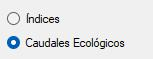

In the module of flows Ecological,

IAHRIS is presented as a support system for the decision in the selection of the ecological regime of flows Minimum (RCEmin)

The application allows:

- The generation of hydrologicalally based RCEmin scenarios
- Assessment of the hydro-environmental quality of the RCEmin scenarios generated by IAHRIS and those manually introduced by the user
- Assessment of the hydrological effect of the implementation of user-selected CER scenarios

It is recommended that the reader revise the Methodological Reference Manual for estimating and evaluating flows minimum ecological standards.

## ***WHAT DATA ARE NECESSARY?***

- **For the generation of RCEmin scenarios and the assessment of their hydro-environmental quality**

The module of flows ecological necessarily requires data on the natural regime of <u>at least 15 full years</u> (daily or monthly).

The justification for this requirement is that the RCEmin scenarios calculated by the application are as discussed, hydrologically based, and use the natural regime as a reference for their estimation. If the availability of data is less than the quoted value, the module does not apply and the user receives a notice when attempting to execute it.

As an additional restriction, the module cannot be applied when the natural regime has a temporary, intermittent or ephemeral character, since the methodologies used are not suitable for regimes with this type of nature. To verify this circumstance the application performs a previous check of the data provided in natural regime consisting of the following:

*The natural regime data calculates the 80% and 90% leave percentage (P80 and P90 respectively) for each month and checks:*

*A) Does the natural regime have two or more months with P90 = 0?*

*B) Does the natural regime present one or more months with P80=0?*

If the answer to either option is YES, the methodology is NOT applied and the user receives a notice when trying to run the module.

Therefore, when a natural series of at least 15 full years of data is available and not affected by temporality, the application calculates -at monthly level - 11 scenarios of flows Minimum ecological hydrological base.

These scenarios are:

- Tennant (1976)
- Tessman (1980)
- VMF, Variability monthly flow (2016)
- NMTM, New Modified Tennant Method (2014), with 4 scenarios: minimum or P90, Fair, Good and Excellent
- ADMM, 2024 Modified Version of Annual Distribution Method (2013)
- IAHRIS\_CER (2024) with three scenarios IAHRIS\_P90, IAHRIS\_P85 and IAHRIS\_P80

It then conducts the assessment of its environmental quality through three parameters: score, environmental demand and efficiency:

- Score: it is a quantitative assessment -set between 100 and -100) of the RCEmin scenario. It turns out to be compared with high percentages of excess of the natural regime, considering magnitude, seasonality and variability
- Environmental demand: is the ratio between the annual contribution required by the CERmin scenario and the average annual contribution of the natural regime.
- Efficiency: is the ratio between the Score and the annual contribution required by the RCmin scenario. Its value indicates the number of points achieved with each hm3 CERmin.

For more detailed information, please refer to the Methodological Reference Manual for estimating and evaluating flows minimum ecological

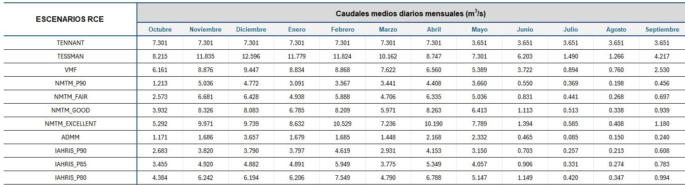

<strong>Figure No34:</strong> <em>flows monthly averages (m3/s) for the 11 scenarios of CERmin calculated by IAHRIS</em>

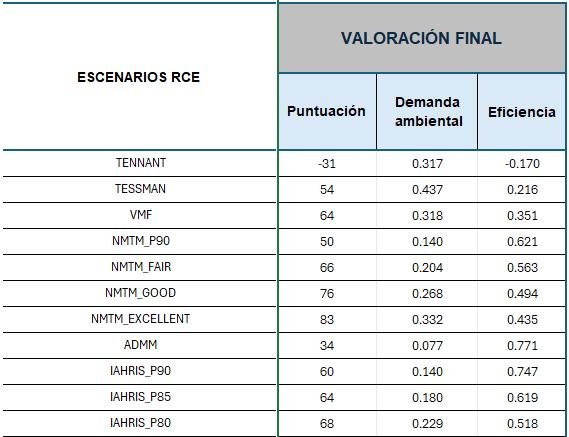

<strong>Figure No35:</strong> <em>Final valuation for the 11 scenarios of CERmin calculated by IAHRIS, with indication of their score, environmental demand and efficiency</em>

By activating the "values" tab, the joint representation of the "*Score versus Environmental Demand"* that allows the user to have a joint view of the environmental suitability of the scenarios. This same graph along with all the information that appears on the IAHRIS screen will also be obtained in the report generated in Excel.

<strong>Figure No36:</strong> <em>Graphical representation Score vs. environmental demand for generated RCEmin scenarios. Horizontal lines represent different environmental demand thresholds corresponding to different percentages of the natural regime</em>

The buttons that appear on the left edge of the graph allow the scrolling on the screen or /and the approach/removal of the screen.

*Note: If the user only wants to use this module, without making previous use of the module indices, must load the RN data in the manner described in heading 4. If, on the contrary, the user has already used the module indices and has conducted the study at this point, the natural series will already be available in the IAHRIS database and you will only have to select the corresponding point on the main screen.*

- **For the evaluation of other scenarios of CERs other than those calculated by IAHRIS**

The module also offers the possibility to evaluate scenarios of CER min introduced by the user and different from those calculated by the application. It would be the case for example of the regulatory regime or any other scenario that the user decides to test. IAHRIS allows the introduction of the regulatory regime and 4 other scenarios.

In these cases the user must enter the values of flow monthly average in m3/s of each of the scenarios to be evaluated. To do this, once enabled the module of flows ecological, the "Scenarios" tab is enabled and within it "Add".

<strong>Figure No37:</strong> <em>Tabs enabled for the management of the module flows ecological</em>

The user can choose between adding the regulatory regime or any other scenario. In both cases a window is enabled to enter the flows Minimum monthly ecologicals in m3/s.

<strong>Figure No38:</strong> <em>Interface for the introduction by the user of the values of flow monthly average (m3/s) corresponding to a scenario of CERmin.</em>

The user-introduced scenarios can be edited and/or deleted.

<strong>Figure 39:</strong> <em>Interface for editing the values of flow monthly average (m3/s) corresponding to a scenario of CERmin, in this case the Normative Regime</em>

All the scenarios introduced by the user are incorporated into the list of methods collected by the main screen of IAHRIS with indication of its monthly values, score, environmental demand and efficiency.

- **For the assessment of the hydrological effect of implementing CER scenarios**

If the user wishes to obtain this evaluation he will require in addition to the natural regime (at least 15 years), data of the altered regime -or currently circulating regime - of <u>at least 7 years_</u>full, on a daily or monthly scale.

*Note: If the user only wants to use this module, without making previous use of the module indices, must load the data in RA in the mode described in heading 4. If, on the contrary, the user has already used the module indices and has carried out the study for this point and alteration, the natural and altered series will already be available in the IAHRIS database and the user will only have to select them on the main screen*.

<strong>Figure No 40:</strong> <em>Point selection and alteration for the study of flows ecological</em>

The application evaluates the hydrological effect of implementation to the following scenarios:

- always for the regulatory regime (if the user has previously entered it). This option is always enabled by default.
- for two scenarios more selected by the user. This selection is made by activating the box to the right of the scenario name.

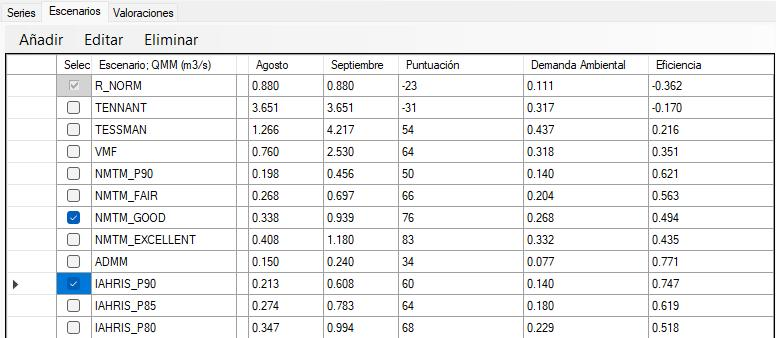

<strong>Figure No 40:</strong> flows monthly averages (m3/s), <em>Score, environmental demand and efficiency for the set of scenarios. The scenarios selected by the user for implementation appear with a tick.</em>

## ***HOW TO OBTAIN REPORTS?***

Once the data mentioned in the previous heading have been entered, the reports can be generated.

How to summarize the data to be entered we will quote:

<table><tr><td>
<strong>DATA TYPOLOGY</strong>
</td><td>
<strong>STUDY MADE</strong>
</td></tr><tr><td>
Series on a natural basis, at least 15 full years on a daily or monthly scale, not of a temporary nature
</td><td>
Hydrological base CER scenarios (11 scenarios)

Assessment of their environmental suitability
</td></tr><tr><td>
Normative regime
</td><td>
Assessment of their environmental suitability
</td></tr><tr><td>
Other user-introduced scenarios (maximum 4)
</td><td>
Assessment of their environmental suitability
</td></tr><tr><td>
Altered regime, at least 7 full years on a daily or monthly scale
</td><td>
Assessment of the hydrological effect of scenario implementation (Rule REC + 2 user-selected scenarios)
</td></tr></table>

<strong>Table No 7:</strong> <em>Summary of the content of the study based on the data provided</em>

Selecting the calculation button at the bottom right is the calculation of the corresponding report.

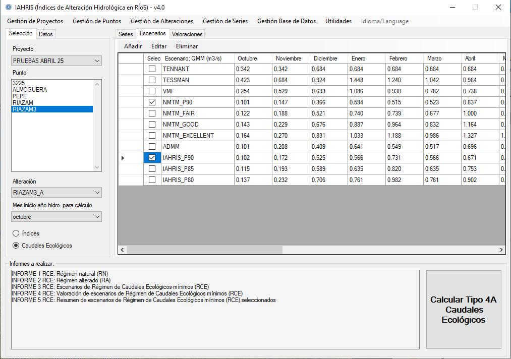

<strong>Figure No 42:</strong> <em>IAHRIS main screen with the module flows Activated ecological. At the bottom right the button to calculate the corresponding report</em>

To facilitate the organization and systematization of the results provided by the application, these are structured into REPORTS, in the PLACE mode of an EXCEL BOOK.

IAHRIS calls the Excel file as follows, where in the example made on date 02/03/2026 the code point "ExAMPLE 2" has been used, belongs to Typology 2b and has been performed:

*EXAMPLE2-Natural-Type2B-02-03-2026.xlsx*

*Point code- Natural- Study typology- Date of realization*

Each report – the book’s sheet – brings together significantly homogeneous aspects of results. Below is part of a sheet (report) of one of these books (see the tabs at the bottom that give access to each of the reports in the results book of the analysis performed).

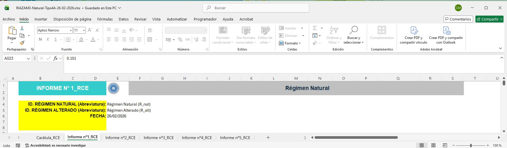

<strong>Figure No43:</strong> <em>Excel book corresponding to a flows ecological</em>

## ***How are the reports linked with the data?***

Table 8 presents the relationship of the typologies considered according to the available data. The reports generated in each case are also indicated.

<strong>Table No8:</strong> <em>Relationship of possible typologies in the study of flows The reports obtained on a case-by-case basis are also given on the basis of the available data.</em>

Table 9 presents the reports generated for each study typology - according to the data provided - together with a brief description of the contents of each report:

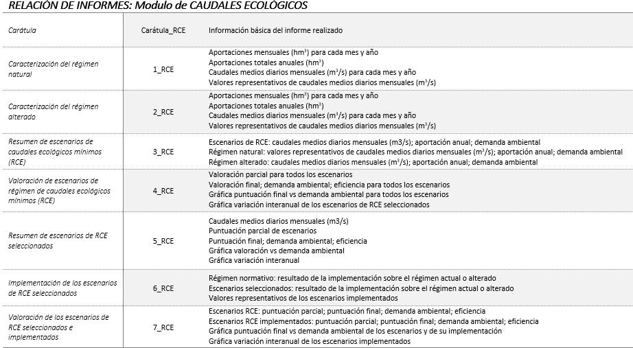

<strong>Table No 9:</strong> <em>Summary of the content of the reports obtained from a flows organic with IAHRIS</em>

**ANNEX 1**

**A BRIEF GUIDE FOR USE OF IAHRIS**

**ANNEX 2: REPORTS PROVIDED BY IAHRIS FOR THE CASE OF REDUCED SERIES**

As discussed in the Introduction to this Manual, IAHRIS **recommends having at least 15 full years** of data to collect year-on-year variability of hydrological regimeThis ensures a minimum of information with which to obtain reasonably acceptable conclusions related to variability and extreme values.

However, the application allows the analysis of shorter series, provided that at least seven full years of records are available. **I'M REDUCED.**

Once the data in the series or series of analyses are loaded, the application verifies the complete years available and notifies the user in case of a reduced series, marking in red if the total of years does not reach the recommended minimum of 15 (see Figure 1).

<strong>Figure No 1:</strong> <em>IAHRIS main screen for the case of reduced series (&lt;15 years) in natural regime</em>

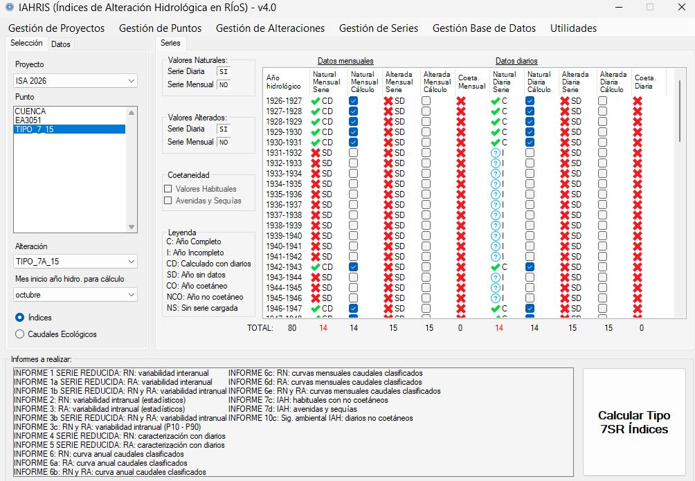

In the case of analyzing two series (natural and altered) it is sufficient for one of them to be less than 15 years old, for the study to be considered SERIE REDUCIDA and to be identified with the acronym SR on the Calculate button (see Figure 1). However, if either of the two regimens has more than 15 years, the user can also analyze this regimen individually.

The analysis of REDUCIDAS SERIES has the following characteristics:

- The calculation of the indices of alteration will always be carried out according to the option of "non-coetaneity" since the non-availability of more than 15 years does not recommend doing the division in wet, medium and dry years. Consequently, the reports should only show the results corresponding to the complete available series, without providing values of variables for dry years, mean years, or humid years.
- The Mass Report will not be presented highly hydrologically altered (Inf 8).
- In principle, depending on the availability of data in one and/or the other regime, the same typologies could be presented as for the situation of 15 or more years, with the exception of typologies 5 and 6 (as they are options that require coetaneity).Table 1 describes the typologies that can be presented and the corresponding reports.

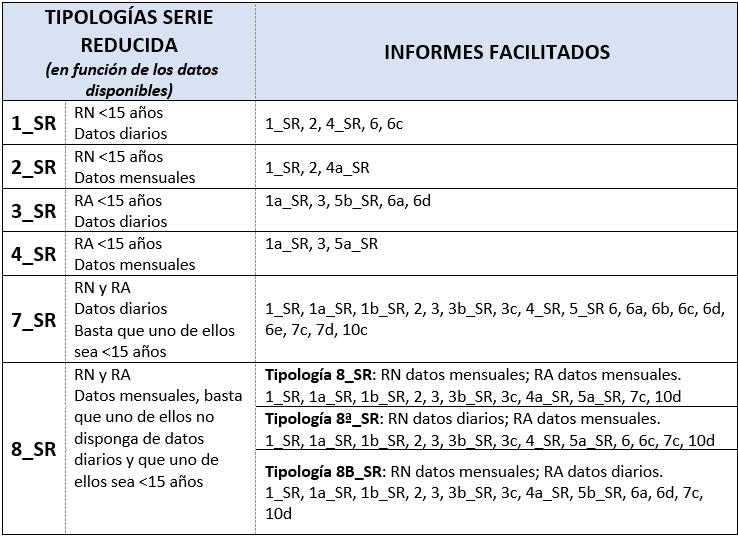

<strong>Table No 1:</strong> <em>Typologies considered in reduced series (&lt;15 years) according to the availability of data and indication of reports provided by IAHRIS in each case</em>

The reports identified in the table above as **\_SR** They have slight differences compared to their homonyms of long series. These differences consist basically, as discussed above, of not considering the division of years into the three types (wet, medium and dry) and, consequently, of showing the results corresponding to the complete available series, without providing variable values for each type of year. No results are provided by type of month.

Upon obtaining the report in SERIES REDUCIDA, the notice appears in the cover "*The user must bear in mind the uncertainty associated with the limited availability of data."*

**ANNEX 3: MASTIVA LOAD**

- [MASIVA LOAD](#_TOC_250017)
    - INTERFACE OF USER MASIVA LOAD
        - CSV Selection Area
        - CSV Information Area
        - Processing Summary Area
        - Processing Execution Area
    - INTERFACE OF USER GENERAR FICHERO BAT
        - Export Area
        - Reporting Settings Area
        - Coetaneity Selectors
        - Save Area

## ***Massive charge: USER INTERFACE*** 

The Mass Load application is a small utility associated with IAHRIS that allows you to easily generate and execute a batch file (.bat extension) to add points and alterations to IAHRIS massively and if the user wishes to also export the report of each. The name that the points and alterations in IAHRIS will have are taken directly from the CSV file. These points and alterations and their associated data are stored in IAHRIS directly and can be consulted and edited from the IAHRIS itself.

The user can access "Massive Charge" by displaying the Utility menu on the main screen of IAHRIS. The system warns that it is necessary to close IAHRIS to use the Mass Load tool.

IMPORTANT: It is recommended not to open again IAHRIS while the Mass Load is running.

The user interface looks like the following:

<strong>Figure No 1:</strong> <em>Mass Load User Interface</em>

**CSV Selection Area**

This area is where the user selects the path to the directory where the CSV files you want to add to IAHRIS are located either by typing the path manually in the text field or by selecting the "Example..." button which will open a directory searcher on the computer.

The selector of "*Include subdirectories*" allows the application to search for CSV files inside the subfolders of the specified directory, not just the files in the root directory.

The button "*Process Directory*" runs the application processing and shows us a list of the points and alterations that will be added to IAHRIS in the CSV information area.

**CSV Information Area**

This area shows us the name of each CSV file read, the point name and the alteration if you have read from each CSV and if the CSV has been processed or not, and if it has not been processed shows us the error by which it has not been. This application does not allow to edit or modify any of the CSV read so if an error appears we must modify it directly in the CSV and reload the directory.

**Processing Summary Area**

Here we will see the number of CSV files processed, the number of points and alterations that contain those CSV and the number of wrong CSV files there. The button "*Save Report"* allows us to save the CSV information table in Excel format.

**Processing Execution Area**

We have two buttons: "*Delete All*" allows us to reset the interface and reload a directory and "*Generate File*" A search engine will open us first to indicate where and by what name we want to save the .bat file.

You can save the .bat file in any path but it is recommended to save it in the folder where the CSVs are located or in the output of the reports to have the file located in case you need to run it again or edit it at some time.

Selecting the save path will show us a new interface to select the generation options:

*INTERFACE OF USER GENERAR FICHERO BAT*

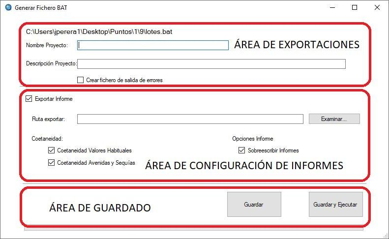

<strong>Figure No2:</strong> <em>Interface for selecting options in a mass loading process</em>

**Export Area**

Here is the name of the Project that will be created in IAHRIS and where all points and alterations will be saved.The user can add a brief description of the project or leave it blank.

If the name of the project already exists in IAHRIS, the points and alterations will be created and the CSV will be loaded into that existing project. If it does not exist, one will be created and it will appear that it has been generated automatically by the application.

The selector "*Create Error Output File*" allows the generation of a .txt file with the file.bat execution report reporting the result of the execution of each command per line.

**Reporting Settings Area**

The selector "*Export Report*" allows you to select whether or not to export Excel reports from processed points and alterations. If we mark it, it is enabled to select the path where we want the reports to be saved.

*COETANITY SELECTORS*

- These selectors are equivalent to those found in IAHRIS and allow to select the option of coetaneity for the calculation of indices of usual values o/y floods and droughts.
- Activating these options means that IAHRIS will only work with those data corresponding to contemporaneous records in both regimes. It is recommended to always be enabled because this option removes the "noise" involved in working with non-contemporaneous data.
- When working in batches you cannot select individually for each point, thus being a common option to all points of the project.
- These selectors will only be applied if the data allows. For example, if at one of the processed points the data are not contemporaneous, IAHRIS will ignore the coetaneity requirement for that point by generating the corresponding reports. Of this "decision" IAHRIS will account in the error output.

The coetaneity of the data can also be consulted in the caratula of the reports generated by the utility.

**Save Area**

Two buttons available, "s*olo save bat*"; "*save and run bat*".

The save button only creates the bat file in the selected path allowing the user to execute it when they want to or edit it manually before running it. The save and run button saves the file in the desired path and executes it instantly.

**ANNEX 4: AUTOMATIZATION BY LINE OF IAHRIS.EXE COMANDANS**

    - CD – Data Load
        - Data Load of a Point
        - Data Load of a alteration
    - GIS – Generate Output Report
        - Generate Point Exit Report
        - Generate Output Report from a alteration

<strong><u>IAHRIS.EXE COMANDING LINE</u></strong>

IAHRIS allows the execution of different commands by command line in addition to its graphical interface.

As a rule, the parameters of the command line must be passed between double quotation marks ("parameter") to prevent special characters such as spaces from causing unwanted interpretations of such commands.

The parameters can be passed in any order after indicating the operation to be performed.

The character ":" (two points) is a character not allowed in the names and descriptions. It can only be used in the paths to indicate the unit. Example: "C:\Users"

Generic syntax is IAHRIS.exe [Operations] [parameters]

**CD – Data Load**

This operation allows you to create a point or a alteration If the project does not exist it will create one with the name indicated. The point can be created empty (without loading data from a csv) or indicate a path of a csv file to load that data.

**Data Load of a Point**

parameters

/t:P Here we indicate that we are going to perform the operation, in this case a point.

/np:"" The name we want to give to the point. Limited to 12 characters.

/d:"" Description for the point. Limited to 20 characters.

/p:"" Name of the project where we want to add the point. Limited to 20 characters.

/dp:"" Description for the project.

/rn:"" Name of the natural regime that we want to assign to the point.

/ra:""Abbreviation of the natural regime that we want to assign to the point.

/fe:"" Route of the csv we want to load at the point. If we do not want to load data we must indicate it with empty quotes.

Example of syntax:

CD /t:P /np:"TIPO\_2" /d:"Point Type 2" /p:"PointsPro" /dp:"Points Project" /rn:"Natural" /ra:"nat"

/fe:"C:\Users\jperera1\Desktop\Points\NATURALREGIME\_ SIMPA\_3014.csv"

**Data Load of a alteration**

parameters

/t:A Here we indicate that we are going to perform the operation, in this case a alteration.

/np:""The name of the point associated with the alteration. MUST EXIST, if you will not give us an error indicating that we must create the point

first. Limited to 12 characters.

/na:""The name we want to give to the alteration. Limited to 12 characters.

/d:"" Description for the alteration. Limited to 20 characters.

/p:"" Name of the project where we want to add the alteration. Limited to 20 characters.

/dp:"" Description for the project.

/rn:"" Name of the natural regime that we want to assign to the point.

/ra:""Abbreviation of the natural regime that we want to assign to the point.

/fe:"" Route of the csv we want to load on the alteration. If we do not want to load data we must indicate it with empty quotation marks.

Example of syntax:

IAHRIS.exe CD /t:A /np:"TIPO\_6A" /na:"6A\_ALT" /d: "Alter 6"

/p:"PuntosPro" /dp:"Puntos Proyecto" /rn:"Alterado" /ra:"alt"

/fe:"C:\Users\jperera1\Desktop\Points\Cabriel\_altered\_MONTHUAL.csv"

GIS – Generate Output Report

This operation allows to export the IAHRIS report from a point or a alteration of the project we tell you about.

**Generate Point Exit Report**

parameters

/t:P Here we indicate that we are going to perform the operation, in this case a point.

/np:""The name of the point from which we want to export the report.

/p:"" Name of the project to which the point from which we will export the report belongs

/fs:"" Path where we want to export the report.

-n	parameter optional indicating if you add that you do not overwrite in case you find a report with the same name to which you are going to

export.

Example of syntax:

IAHRIS.exe GIS /t:P /np:"TIPO\_2" /p:"PointsPro"

/fs:"C:\Users\jperera1\Desktop\Export" -n

**Generate Output Report from a alteration**

parameters

/t:P Here we indicate that we are going to perform the operation, in this case a point.

/np:""" The name of the point to which the alteration from which we will export the report.

/na:""The name of the alteration from which we want to export the report.

/p:"" Name of the project to which the point and the alteration from which we will export the report

/fs:"" Path where we want to export the report.

-n	parameter optional indicating if you add that you do not overwrite in case you find a report with the same name to which you are going to

export.

- cvh	parameter optional indicating that we will use Custom Value Coetaneity wherever possible. The console will inform us

of what value has been used.

-cas.	parameter optional indicating that Coetaneity will be used

floods The console will inform us what value has been used.

Example of syntax:

IAHRIS.exe GIS /t:A /np:"TIPO\_6A" /na:"6A\_ALT" /p:"PointsPro"

/fs:"C:\Users\jperera1\Desktop\Export" -n -cvh –cas

**Example of use**

It shows a capture of the use of commands to create a point and export a report, showing how to use operations and their parameters and showing the information the console returns.

